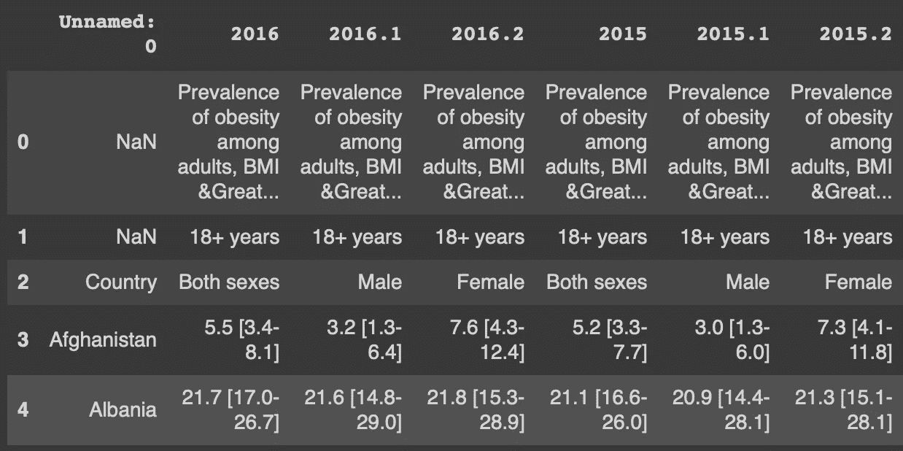
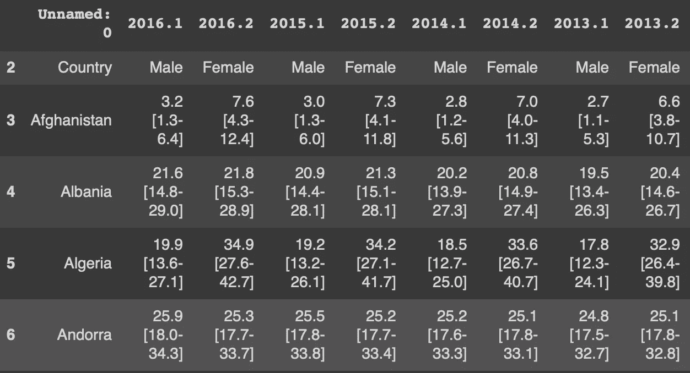
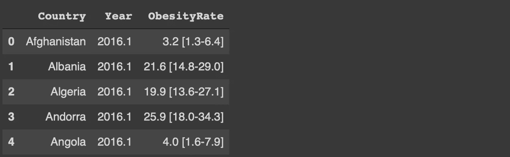
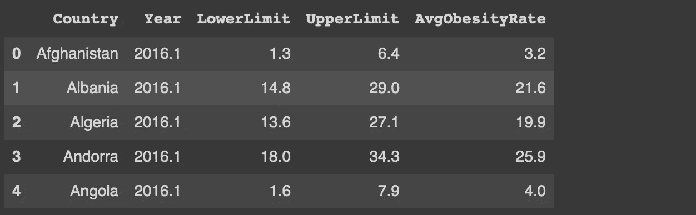
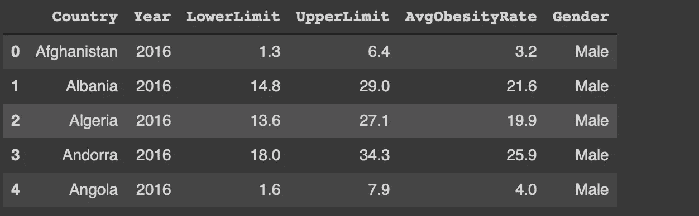

# 从凌乱到整洁与蟒蛇熊猫

> 原文：<https://towardsdatascience.com/from-messy-to-neat-with-python-pandas-91bc98b95d7f?source=collection_archive---------19----------------------->

## 实用教程


照片由 [Erol Ahmed](https://unsplash.com/@erol?utm_source=unsplash&utm_medium=referral&utm_content=creditCopyText) 在 Unsplash 上拍摄

现实生活中的数据通常是混乱的。它不是最吸引人的分析格式。项目的大量时间花费在数据争论上。

只有在数据采用适当的格式后，我们才能开始数据分析并推断出有意义的见解。幸运的是，Pandas 提供了许多功能和技术来加速数据清理过程。

在本文中，我们将采用一个关于肥胖率的[数据集](https://www.kaggle.com/amanarora/obesity-among-adults-by-country-19752016)，它看起来杂乱无章，但我们将把它转换成一个漂亮而干净的格式。每一步都涉及不同的熊猫功能，所以它也像一个实用教程。

让我们从导入库和读取数据集开始。

```
import numpy as np
import pandas as pddf = pd.read_csv("/content/data.csv")df.shape
(198, 127)
```

数据集包含 198 行和 127 列。下面是前 5 行和前 5 列的屏幕截图。



(图片由作者提供)

除了前 3 行，各列包含 1975 年至 2016 年的肥胖率。

```
df.columns[-5:]  # last 5 columnsIndex(['1976.1', '1976.2', '1975', '1975.1', '1975.2'], dtype='object')
```

前 3 行似乎与后面的行不一致。让我们检查这些行中的值。unique 函数返回行或列中的唯一值。

```
# First row
df.iloc[0,:].unique()array([nan,        'Prevalence of obesity among adults, BMI &GreaterEqual; 30 (age-standardized estimate) (%)'],       dtype=object) # Second row
df.iloc[1,:].unique()array([nan, '18+  years'], dtype=object)
```

前两行似乎定义了整个数据集，而不是单独的列。前 2 行中只有一个唯一值和一个 NaN 值，因此我们可以删除它们。

drop 函数可用于根据轴参数值删除行或列。

```
df.drop([0,1], axis=0, inplace=True)
```

我们通过传递相关联的标签来指定要删除的行。inplace 参数用于保存数据帧中的更改。

每年有 3 栏，包含男性、女性的肥胖率以及两者的平均值。由于我们可以很容易地从男性和女性值中获得平均值，因此最好删除指示平均值的列。

一种方法是将一个列列表传递给 dropped。这是一种单调乏味的方式，因为要删除 42 列。Pandas 提供了一个更实用的方法，允许我们从列表中选择每三个项目。

df.columns 方法返回列的索引。我们可以从索引 1 开始选择每隔三个项目，如下所示:

```
df.columns[1::3]
Index(['2016', '2015', '2014', '2013', '2012', '2011', '2010', '2009', '2008', '2007', '2006', '2005', '2004', '2003', '2002', '2001', '2000', '1999', '1998', '1997', '1996', '1995', '1994', '1993', '1992', '1991', '1990', '1989', '1988', '1987', '1986', '1985', '1984', '1983', '1982', '1981','1980', '1979', '1978', '1977', '1976', '1975'],       
dtype='object')
```

我们可以将这个列表传递给 drop 函数。

```
df.drop(df.columns[1::3], axis=1, inplace=True)
```

下面是数据帧现在的样子:



(图片由作者提供)

我们已经知道 1 代表男性，2 代表女性。因此，我们可以将第一列重命名为“Country ”,并删除第一行。

```
df.rename(columns={'Unnamed: 0': 'Country'}, inplace=True)df.drop([2], axis=0, inplace=True)
```

数据集是宽格式的。用长格式进行分析会更容易，在长格式中，年份用一列表示，而不是用单独的列表示。

融化功能就是为了这个任务。下面是我们如何将这个数据帧从宽格式转换成长格式。

```
df = df.melt(
   id_vars='Country', var_name='Year', value_name='ObesityRate'
)df.head()
```



(图片由作者提供)

每个年份-国家组合在单独的行中表示。

肥胖率栏包括平均值和值范围。我们需要把它们分开，用数字来表示。例如，我们可以有三列，分别是平均值、下限和上限。

str 访问器下的函数可用于提取下限和上限。

```
df['AvgObesityRate'] = df.ObesityRate.str.split(' ', expand=True)[0]df['LowerLimit'] = df.ObesityRate.str.split(' ', expand=True)[1].str.split('-', expand=True)[0].str[1:]df['UpperLimit'] = df.ObesityRate.str.split(' ', expand=True)[1].str.split('-', expand=True)[1].str[:-1]
```

我们首先在分隔范围和平均值的空间字符处分割肥胖率列。然后，我们在“-”字符处分割范围，并使用索引来提取极限值。

我们现在可以删除肥胖率列，因为我们已经提取了每条信息。

```
df.drop('ObesityRate', axis=1, inplace=True)df.head()
```



(图片由作者提供)

最后一步是添加性别信息。在当前格式中，年份列表示性别(1 表示男性，2 表示女性)。我们可以从年份中分离出 1 和 2，并相应地替换它们。

```
df['Gender'] = df['Year'].str.split('.', expand=True)[1].replace({'1': 'Male', '2': 'Female'})df['Year'] = df['Year'].str.split('.', expand=True)[0]
```

我们已经像上一步一样使用了 split 函数。在 replace 函数中使用字典可以一次替换多个值。

以下是数据集的最终版本:



(图片由作者提供)

## 结论

我们将一个混乱格式的数据集转换成一个整洁干净的格式。数据集中的信息保持不变，但格式对于执行高效的数据分析至关重要。

Pandas 是一个数据操作和数据分析库。在本文中，我们主要关注数据操作部分。熊猫灵活多样的功能加速了数据争论的过程。

感谢您的阅读。如果您有任何反馈，请告诉我。