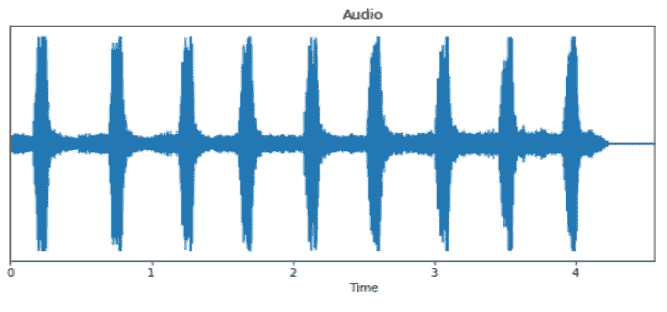
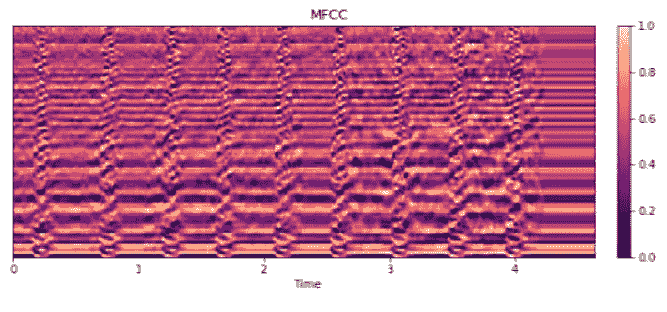
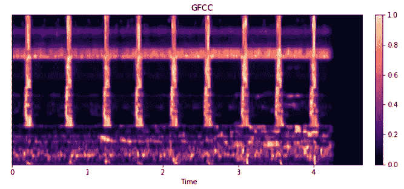
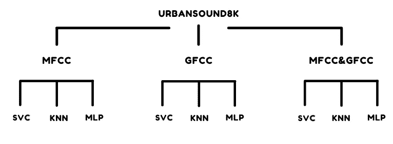
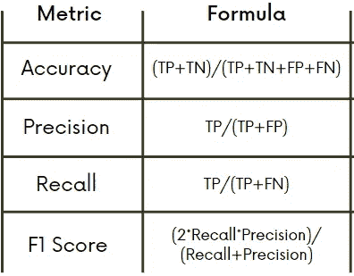
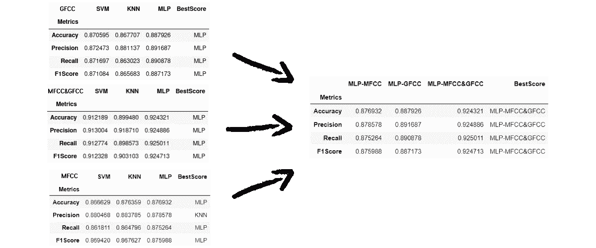

# 从 MFCCs xor GFCCs 到 MFCC 和 gfcc:城市声音分类案例研究

> 原文：<https://towardsdatascience.com/from-mfccs-xor-gfccs-to-mfccs-and-gfccs-urban-sounds-classification-case-study-a087ac007901?source=collection_archive---------28----------------------->

## 合并两种特征提取技术能提高声音分类模型的性能吗？

图片由 [Austin Distel](https://unsplash.com/@austindistel) 拍摄，可在 [Unsplash](https://unsplash.com/photos/97HfVpyNR1M) 获得

人类天生具有识别周围环境声音的天赋，这要归功于声音从耳朵向其最深处——内耳——的传输，内耳负责将振动转化为电脉冲，然后传输到大脑，通过使用仿生方法，研究人员能够构想出一种称为特征提取技术的音频分类管道中的关键节点，它在我们身体的内耳中起着重要作用， 将信号作为输入并输出一组表征声音的数值，因此当我们将电脉冲传输到大脑时，这里我们将把提取的特征馈送到某个模型。

非常令人印象深刻的并行！不是吗？无论如何，在本文中，我们将主要关注两种特征提取技术，Mel 频率倒谱系数(MFCCs)，这是该领域最受欢迎的选择，以及 Gammatone 频率倒谱系数(GFCCs)，这是不太受欢迎的。我们的目标是将它们的性能与一种将两者结合起来的方法进行比较，以便知道是否值得在以后的文章中深入研究。

## 什么是 MFCCs 和 GFCCs？

在进入比较方法之前，让我们基于一些标准定义简单地谈论一下 MFCCs 和 GFCCs 背后的概念，因为我计划为它们中的每一个都写一篇完整的文章来解释背后的数学，因为我发现从数学角度来看这非常有趣。

*   **MFCC:**梅尔频率倒谱系数(图 2)是共同构成 MFC 的系数，梅尔频率倒谱是声音的短期功率谱的表示。它们源自音频片段的一种倒谱表示(一种非线性“频谱”)。倒谱和梅尔频率倒谱之间的区别在于，在 MFC 中，频带在梅尔标度上是等间隔的，这比正常频谱中使用的线性间隔频带更接近人类听觉系统的响应。这种频率弯曲可以更好地表现声音。([维基百科](https://en.wikipedia.org/wiki/Mel-frequency_cepstrum))
*   **gfcc:**Gammatone 频率倒谱系数(图 3)是基于一组 Gammatone 滤波器组生成的系数，为了生成这些系数，我们需要信号的频率-时间表示，称为 Cochlegram **(相对于内耳的组成部分耳蜗)**，它可以从 gamma tone 滤波器组获得，其计算阶段与 MFCC 有相当多的相似之处。

图 1:音频信号—图 2 : *梅尔频率倒谱系数—* 图 3 : *伽马频率倒谱系数*

所以 MFCCs 和 GFCCs，简单来说就是代表某种声音特征的系数。

## 我们将处理的数据集:

我们将使用 UrbanSound8K 数据集，包含 8732 个标记的声音片段，每个片段不到 4 秒，不同于其他著名的音频数据集，每个音频文件的采样率不同(采样率:一个时间实例的音频样本组)，并被标记为 10 个类别之一:街道音乐、汽车喇叭、儿童玩耍、狗叫、钻探、发动机空转、枪击、手提钻、警笛和空调。

## 比较架构:

图 4:比较架构

现在我们已经展示了数据集，为了了解三种特征提取技术中哪一种更可靠，我们将继续进行三种特征提取技术之间的比较方法(图 4 ),给每种技术三次机会，通过音频分类领域中三种不同的常用模型来证明它们的可靠性，这样，如果我们最终选择一种特征提取技术而不是另一种，将会更加公平。

因此每个特征提取技术的输出将被馈送到:

*   **支持向量分类(SVC)** 这是一种基于间隔最大化原则的特殊线性分类器，可用于解决线性和非线性问题。
*   **多层感知器分类器(MLP)** 它是一类前馈人工神经网络
*   **K 近邻** **分类器(KNN 分类器)**这是一种用于解决分类问题的监督机器学习算法

## 评估指标:

为了评估我们的分类模型的有效性，我们将考察四个主要的性能指标:

*   **准确性**:模型正确预测两个类别的能力
*   **精度**:模型从所有预测的阳性类别中正确检测出阳性类别的能力
*   **回忆(灵敏度):**模型从所有实际阳性类别中正确检测出阳性类别的能力
*   **F1 得分**:精确度和召回率的调和平均值

所有这些性能指标都是基于以下变量定义的:

*   **真阳性(TP)** :预测为阳性类别的阳性类别
*   **假阳性(FP)** :阴性类别预测为阳性类别
*   **真否定(TN)** :否定类预测为否定类
*   **假阴性(FN)** :阳性类别预测为阴性类别

图 5:评估指标公式

## 模型的分数和结果解释:

在设置了比较架构并确定了用于评估的指标后，我们比较了每个有限元模型显示的性能，以便我们可以首先为每种技术选择最佳的一种，然后确定谁是 3 个最佳记录分数中的最佳者。筛选结果如下所示(图 6):

图六:模特们的表演

根据使用不同特征提取技术的模型的性能，我们最终认识到多层感知器模型和 MFCC&GFCC 技术的组合在 9 个可能的组合中获得了迄今为止最好的准确度、精确度、召回率和 F1 分数。

## 下一步是什么？

在确定 MLP 和 MFCC&GFCC 的特征提取组合是该数据集最可靠的组合后，我们将在未来的技术文章中进一步调整其参数，以解释我们合并这两种特征提取技术的方式，并了解其性能可以提高到什么程度，因为正如我们刚刚看到的，它显示了一些非常好的结果，请继续关注😊。