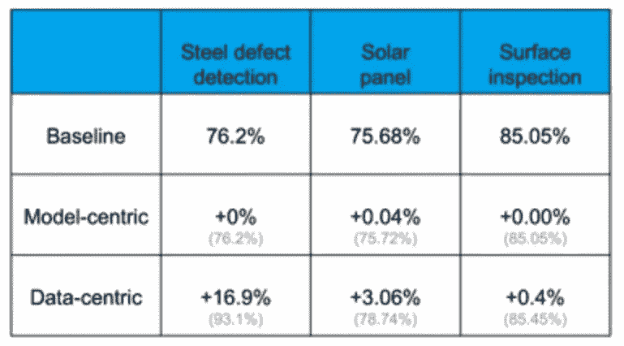
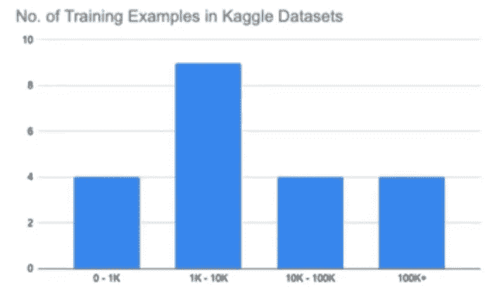
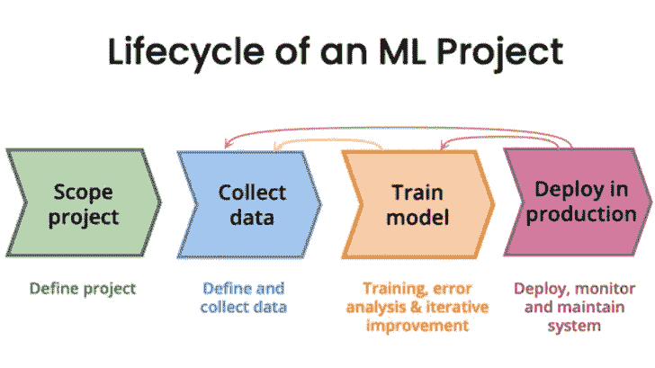

# 从以模型为中心到以数据为中心的人工智能

> 原文：<https://towardsdatascience.com/from-model-centric-to-data-centric-artificial-intelligence-77e423f3f593?source=collection_archive---------6----------------------->

## 对新的和更复杂的模型架构的狂热是合理的吗？

[来源](https://www.youtube.com/watch?v=06-AZXmwHjo&t=69s)

所有人工智能系统的两个基本组成部分是数据和模型，两者在产生预期结果的过程中密切相关。在这篇文章中，我们讨论了人工智能社区如何偏向于在模型中投入更多的努力，并看到它如何不总是最好的方法。

我们都知道机器学习是一个迭代的过程，因为机器学习很大程度上是一门经验科学。你不会通过思考问题而跳到最终的解决方案，因为你不容易清楚地说出解决方案应该是什么样子。因此，你凭经验走向更好的解决方案。当你在这个迭代过程中，有两个主要的方向供你选择。

## 以模型为中心的方法

这包括围绕模型设计经验测试以提高性能。这包括在巨大的可能性空间中找到正确的模型架构和训练过程。

## 以数据为中心的方法

这包括系统地改变/增强数据集，以提高你的人工智能系统的准确性。这通常被忽视，数据收集被视为一次性任务。

大多数机器学习工程师发现这种方法更令人兴奋和有前途，一个原因是它使他们能够将他们的机器学习模型知识付诸实践。相比之下，处理数据有时被认为是一项低技能任务，许多工程师更喜欢处理模型。但是这种对模型的强调有道理吗？为什么会存在？

## 人工智能社区中以模型为中心的趋势

大多数人已经将他们的主要精力投入到以模型为中心的人工智能上。

一个看似合理的原因是，人工智能行业密切关注人工智能领域的学术研究。由于人工智能的开源文化，几乎每个使用 github 的人都可以很容易地获得该领域的大多数前沿进展。此外，科技巨头资助和指导了很大一部分人工智能研究，因此它仍然与解决现实世界的问题相关。

最近，人工智能研究在本质上完全是以模型为中心的！这是因为标准是产生具有挑战性的大数据集，这些数据集成为广泛接受的评估问题性能的基准。然后在学者之间进行竞赛，以达到这些基准的最先进水平！因为，我们已经固定了数据集的状态，大多数研究都是以模型为中心的方法。这在社区中产生了一种普遍的印象，即以模型为中心的方法更有前途。

> 检查最近的出版物样本显示，99%的论文以模型为中心，只有 1%的论文以数据为中心。~ [吴天俊](https://www.youtube.com/watch?v=06-AZXmwHjo)

## 数据的重要性

尽管机器学习社区称赞数据的重要性，并将大量数据视为人工智能成功背后的主要驱动力。它有时会在 ML 项目的生命周期中靠边站。在他最近的[演讲](https://www.youtube.com/watch?v=06-AZXmwHjo)中，Andrew NG 指出他认为以数据为中心的方法更有价值，并呼吁在社区中转向以数据为中心。作为一个例子，他讲述了几个项目以及以数据为中心的方法是如何更加成功的。

[来源](https://www.youtube.com/watch?v=06-AZXmwHjo&t=69s)

**以数据为中心的方法中可供您使用的工具**

更多的数据并不等于更好的数据。数据的三个主要方面是:

## 卷

数据量非常重要，你需要有足够的数据量来解决你的问题。深度网络是低偏差高方差的机器，我们相信更多的数据是方差问题的答案。但是，盲目积累更多数据的方法可能非常数据高效且成本高昂。

> 人类如何能够在几乎没有监督的情况下，在大约 20 小时的练习中学会驾驶汽车，而完全自动驾驶仍然无法通过人类驾驶员数千小时的数据训练我们最好的人工智能系统？~ [Yann Lecun](https://ai.facebook.com/blog/self-supervised-learning-the-dark-matter-of-intelligence/)

在开始寻找新数据之前，我们需要回答我们需要添加哪种数据的问题。这通常通过对当前模型的误差分析来实现。这个我们以后再详细讲。

[来源](https://www.youtube.com/watch?v=06-AZXmwHjo&t=69s)

## 一致性

数据注释的一致性非常重要，因为任何不一致都会使模型脱轨，也会使您的评估不可靠。一项新的[研究](https://arxiv.org/abs/2103.14749)显示，在广泛使用的数据集中，大约有 **3.4%** 的例子被错误标记，他们还发现更大的模型受此影响更大。

如果不能在误差 pf +=3.4%的情况下测量准确性，这就提出了关于超过以前基准一到两个百分点的过多研究论文的主要问题！因此，为了更好的训练和可靠的评估，我们需要一致标记的数据集。

[来源](https://www.youtube.com/watch?v=06-AZXmwHjo&t=69s)

上面的例子强调了人类标签的不一致性是多么容易渗入到你的数据集中。上面的注释都没有错，它们只是彼此不一致，会混淆学习算法。因此，为了一致性，我们需要仔细设计注释指令。机器学习工程师有必要完全熟悉数据集，我发现这有助于:

1.  在制定指令之前，我自己注释了一个小的数据集样本，以便更好地了解注释者可能犯的错误。
2.  检查一批随机的带注释的数据，以确保一切都如预期的那样。这应该成为每个注释工作的标准实践，因为注释团队是不断变化的，即使在项目的后期也很容易出现错误。
3.  对于那些即使在审阅了说明之后仍然发现不一致的任务，让多个人对数据进行注释并使用多数投票作为基本事实可能是可取的。

## 质量

您的数据应该代表您期望在部署中看到的数据，涵盖部署数据将呈现的所有变化。理想情况下，所有非因果特征的数据属性都应该充分随机化。您应该注意的数据集的常见缺陷有:

1.  虚假关联:当非因果属性与标签相关联时，神经网络无法学习预期的解决方案。例如，在对象分类数据集中，如果奶牛通常出现在草原上，模型可以学习将背景与类别相关联。有关这方面的更多信息，请参阅:[神经网络在虚假相关数据上失败](https://medium.com/tamed-artificial-intelligence/neural-networks-fail-on-data-with-spurious-correlation-b5010b107c32)
2.  缺乏变化:当像图像亮度这样的非因果属性在数据集中变化不够大时，神经网络会过度适应该属性的分布，不能很好地概括。在白天数据中训练的模型在黑暗中会表现不佳，反之亦然。在这里了解更多关于这个问题的信息:[神经网络的惊人失败是由于对完全不相关的数据属性的调节](https://medium.com/tamed-artificial-intelligence/striking-failure-of-neural-networks-due-to-conditioning-on-totally-irrelevant-properties-of-data-c6c817fef20b)

除了收集更多变异的新数据，数据扩充是打破虚假相关性和缺乏变异问题的一个极好的策略。

## 以数据为中心的系统方法

机器学习项目普遍接受的工作流程如上图所示。其中对训练和部署结果的分析可以导致数据收集和模型训练的另一阶段。观察和纠正测试数据中的问题是一个不错的策略。但是它只能解决通过错误分析观察到的问题，并不能预防将来的问题。存在于 sin 训练数据中相同的虚假相关也可能出现在测试数据中，这很像是它们被随机分开。

我们需要一种更加主动的方法来实现未知环境中的模型健壮性。为了更好地理解因果不变性和鲁棒深度学习之间的关系，请阅读本文:[不变性、因果性和鲁棒深度学习](https://medium.com/tamed-artificial-intelligence/invariance-causality-and-robust-deeplearning-df8db9091627)

阅读我的下一篇文章，学习一种结构化的方法，从问题定义到网络评估，可以用来训练健壮的领域不变模型。[稳健深度学习的系统方法](https://medium.com/tamed-artificial-intelligence/systematic-approach-to-robust-deep-learning-5d5ca012a636)