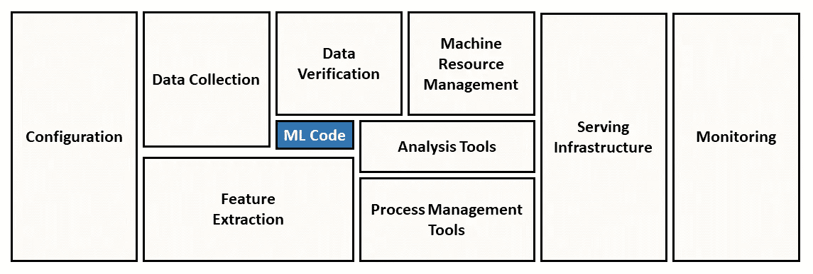
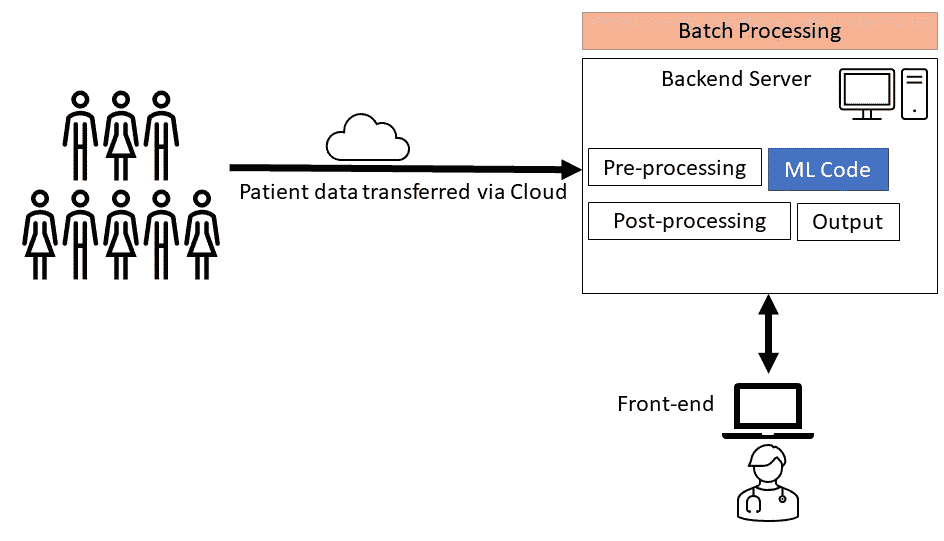
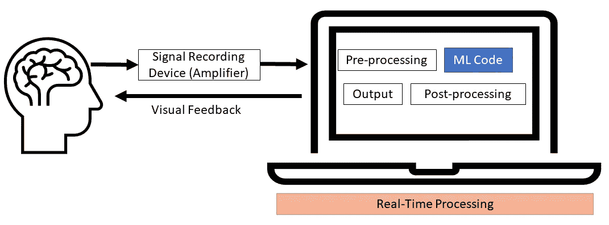
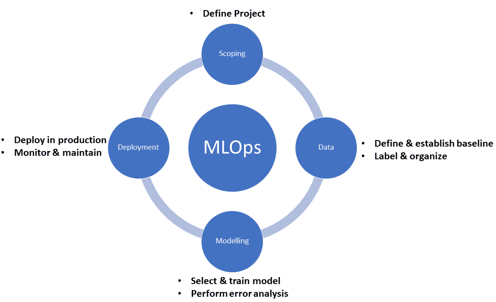

# 从模型到部署:从 Google 和斯坦福专家那里免费学习 MLOps

> 原文：<https://towardsdatascience.com/from-models-to-deployment-learn-mlops-for-free-from-google-and-stanford-experts-b24e7018c13d?source=collection_archive---------28----------------------->

## 教育

## 机器学习操作(MLOps)是一个新兴领域，我强烈建议您学习更多知识，以推动您的数据科学事业。

卡尔·乔根森在 [Unsplash](https://unsplash.com?utm_source=medium&utm_medium=referral) 上的照片

## 不要让你的技能灭绝

数据科学领域正以前所未有的速度发展。虽然这个领域在可预见的未来肯定[不会灭绝](/data-science-is-not-becoming-extinct-in-10-years-your-skills-might-aed618dd0c91)，但是如果你停止学习和提高技能，你的技能组合可能会很好。

随着越来越多的组织希望使用数据来保持竞争力，数据科学继续受到关注。这对我们每个人都是有希望的。然而，不断增长的需求也意味着越来越多的人开始涉足数据科学。

每个人都有无处不在的学习机会，你必须不断学习和成长，才能在这样的环境中保持竞争力。

## 为什么 MLOps 很重要？

这篇文章将向你介绍机器学习中的一个新兴分支学科，MLOps(机器学习操作)。

除非您在一个拥有成熟数据科学团队的大型组织中工作，否则您可能需要很好的 MLOps 工作知识。即使你热衷于成为一名数据科学家(而不是目前定义的数据工程师)，你最好接受学习 MLOps 方面的想法，以便作为“数据科学”团队的一部分有效地工作，并最终能够领导这样的团队。

没有哪个组织真的有兴趣为你投资开发留在 Jupyter 笔记本里的模型。相反，他们对解决现实世界的挑战感兴趣，并希望使用能给他们带来竞争优势的模型。模型生产和部署是不可避免的。

## 目标受众

如果你在部署机器学习模型方面经验很少或者没有经验，那么你绝对应该继续读下去。然而，即使您有设计、开发和部署端到端机器学习项目的实践经验，您可能仍然会发现视角和相关资源的链接很有用。

# MLOps:鸟瞰图

让我们先解决一些事情。一个常见的误解是，人工智能(AI)产品或服务的部署主要是关于机器学习(ML)算法。一旦 ML 算法最终确定，它就可以用标准的软件工程实践来部署。现实要复杂得多。事实上，与需要日常维护挑战的传统软件不同，ML 产品/服务具有额外的 ML 特定问题，这些问题可能存在于“设计”级别而不是代码级别[1]。

图 1(改编自[1])显示了生产中的 ML 系统的需求，突出显示了“ML 代码”，以让您了解一旦您决定部署您的 ML 模型时需要解决的各种挑战。

图 1:与 ML 代码相比，支持 ML 系统的周围基础设施要大得多，也复杂得多(由作者改编自[1])

在现实世界的 ML 系统中，ML 代码是庞大而复杂的基础设施的一小部分。这是一个图形说明，有助于提高认识，并说明 ML 模型部署在实践中可能意味着什么，超出了您在典型的机器学习课程中可能学到的内容。如果你很好奇，你可以阅读原始的、被大量引用的论文，该论文详细阐述了上图[1]中强调的各种问题。

## 当前:临时模型部署

尝试部署模型并不新鲜。多年来，许多数据科学从业者在尝试部署模型时一直在应对各种挑战。

在我读博士的日子里(大约十年前)，我花了大量的时间开发算法，可以从一个小的手指探针上自动获得呼吸频率。在一个后续项目中，我不得不使用从远程收集的慢性阻塞性肺病患者的数据来实现这个算法[3]。当时，这种算法需要在服务器上运行(供研究人员和临床医生访问)。在那个项目中，我处理了几个与数据流(数据如何存储以及存储在哪里)、延迟和吞吐量需求(在这个特定的应用程序中通宵批处理就足够了)、算法块和基础设施的其余部分之间的适当 API 等相关的问题。

服务器上运行的呼吸率算法，通宵批处理(图片由作者提供)

在一个不同的项目中，我必须实现一个自动处理大脑信号并解码的算法[4]。这里的概念是即时解码病人的脑电波，然后在屏幕上给他们提供反馈。与慢性阻塞性肺病的情况不同，该项目需要即时处理，因此，这是在用于采集信号的同一台计算机上本地实施的。

解码大脑信号以估计力量，接近实时解码(图片由作者提供)

在这两个项目中，要求是采用现有的机器学习算法，然后将其部署用于实际使用。然而，环境有很大的不同，因此面临的问题也不同，需要不同类型的软件工程挑战。

我在尝试部署模型时的经历可能是许多有经验的数据科学专业人员的经历。当时，我没有听说过“MLOps”。当时，我们中的大多数人都在同时处理与软件相关的问题，同时试图以特别的方式部署 ML 算法。

## 未来:MLOps

典型的机器学习课程深入研究模型构建和相关的统计概念。直到最近，这也是有意义的，因为许多组织仍然处于探索阶段，已经获得了数据，但不确定需要用它做什么。招募一名“数据科学家”可能是有意义的，他获取数据，分析数据，创建很酷的图表，并得出见解。

然而，向前看，这在许多情况下是不够的。组织需要部署系统。在一天结束时，需要有一个实际的产品或服务。

现在时机已经成熟，可以将所有与模型部署相关的问题以系统的方式集中起来，并传授给新一代的数据科学专业人员。

> 这个领域，现在获得牵引力，被称为机器学习操作或简称 MLOps。它是一门新兴的学科，涉及支持 ML 模型从概念到部署过程的工具和技术。

## MLOps 的概念框架

思考 MLOps 的一个极好的框架是思考完整的机器学习项目生命周期(由吴恩达在他的 MLOps 入门课程中介绍),他说:

> 当我在构建一个机器学习系统时，我发现思考机器学习项目的生命周期是一种有效的方式，可以让我计划出我需要努力的所有步骤。

改编自吴恩达的课程[生产中的机器学习简介](https://www.coursera.org/learn/introduction-to-machine-learning-in-production?specialization=machine-learning-engineering-for-production-mlops)(图片由作者提供)

根据上面的框架，MLOps 可以定义为*，一种数据科学学科，由各种工具和相关原则组成，以支持 ML 项目在其生命周期中的进展。*

# 我可以从哪里学习？

由于这是一个新兴领域，我预计在不久的将来会有更多的资源可用。你可以找到专门的课程来帮助 ML 工程师支持三个主要云基础设施提供商(亚马逊、谷歌和微软)之一。你也可以在 [Udacity](https://www.udacity.com/) 和 [Coursera](https://www.coursera.org/) 上找到相关课程。

然而，我强烈推荐 Coursera 上的资源(链接自 [DeepLearning)。AI](https://www.deeplearning.ai/) )。

这是一个名为“面向生产的机器学习工程(MLOps)”的专业。你可以免费选修这些课程。该专业的课程有:

1: [生产中的机器学习介绍](https://www.coursera.org/learn/introduction-to-machine-learning-in-production?specialization=machine-learning-engineering-for-production-mlops)

2: [生产中的机器学习数据生命周期](https://www.coursera.org/learn/machine-learning-data-lifecycle-in-production?specialization=machine-learning-engineering-for-production-mlops)

3: [生产中的机器学习建模管道](https://www.coursera.org/learn/machine-learning-modeling-pipelines-in-production?specialization=machine-learning-engineering-for-production-mlops)

4: [在生产中部署机器学习模型](https://www.coursera.org/learn/deploying-machine-learning-models-in-production?specialization=machine-learning-engineering-for-production-mlops)(本课程尚未发布)

# 结束语

上面链接的课程都是高级的。如果你是一个完全的初学者，那么我建议先从吴恩达关于[机器学习](https://www.coursera.org/learn/machine-learning)的课程开始，其次是[深度学习专精](https://www.coursera.org/specializations/deep-learning)。

然而，如果你已经掌握了机器学习的工作知识，以及中级 Python 技能，包括任何深度学习框架(TensorFlow、Keras 或 PyTorch)的经验，那么你就可以开始了。

这是一个从世界上一些最优秀的人那里了解更多关于 MLOps 的惊人机会:Robert Crowe(谷歌的 TensorFlow 开发工程师)、Laurence Moroney(谷歌的首席人工智能倡导者)和吴恩达(Coursera 的创始人，现在是斯坦福大学的兼职教授)。

<https://ahmarshah.medium.com/membership>  

# 参考

[1]斯卡利博士、霍尔特博士、戈洛文博士、达维多夫博士、菲利普博士、埃布纳博士、乔德里博士、杨博士、克雷斯波博士和丹尼森博士，2015 年。机器学习系统中隐藏的技术债务。*神经信息处理系统进展*， *28* ，第 2503–2511 页。

[2]沙阿、弗莱明、汤普森和塔拉先科，2015 年。医院儿童分诊时的呼吸频率估计。*医学工程杂志&技术*， *39* (8)，第 514–524 页。

[3]沙阿，S.A .，韦拉多，c .，法默，a .和塔拉先科，l .，2017 年。慢性阻塞性肺疾病的恶化:使用数字健康系统进行识别和预测。*医学互联网研究杂志*， *19* (3)，p.e69。

[4] Shah，S.A .，Tan，h .，Tinkhauser，g .和 Brown，p .，2018 年。从深部脑局部场电位对抓力进行实时、连续解码。 *IEEE 神经系统与康复工程汇刊*， *26* (7)，第 1460–1468 页。