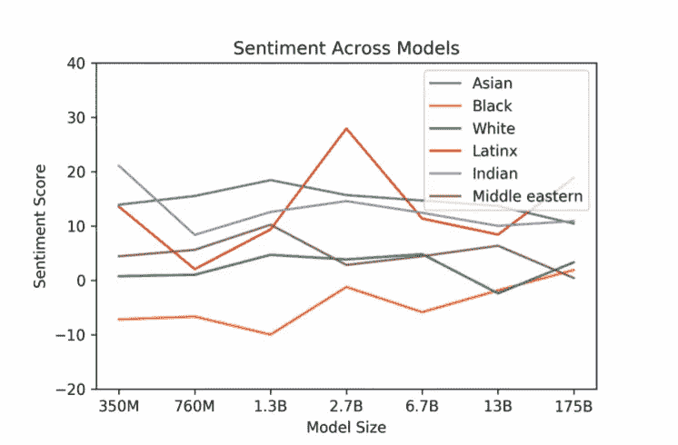

# 从自然语言到人工语言

> 原文：<https://towardsdatascience.com/from-natural-to-artificial-language-b59f5e00ba74?source=collection_archive---------29----------------------->

## [入门](https://towardsdatascience.com/tagged/getting-started)

## 从语言学角度理解试图用人工语言理解自然语言的影响和风险。

由 [Raphael Schaller](https://unsplash.com/@raphaelphotoch?utm_source=medium&utm_medium=referral) 在 [Unsplash](https://unsplash.com?utm_source=medium&utm_medium=referral) 上拍摄的照片

## **为什么学习语言？**

哲学家路德维希·维特斯坦根谈到语言时说:“我的语言的极限意味着我的世界的极限。”人工智能(AI)是由人工(编程)语言创建的，因此，在其核心，机器学习可以简化为二进制代码。相反，自然语言可以被定义为通过人类的有机使用而进化，它具有不可磨灭的人类品质。研究语言可以让我们一窥人工语言在模仿自然语言世界方面的局限性。

最近，我分享了一篇[思想文章](https://medium.com/swlh/what-is-natural-about-nlp-af31eb9cf354)，讨论与人工智能和自然语言处理(NLP)相关的语言学理论。具体来说，我试图阐明我对[语言相对论](https://en.wikipedia.org/wiki/Linguistic_relativity)和[语言普遍性](https://en.wikipedia.org/wiki/Linguistic_universal)及其与人工智能语言模型的持续发展的联系的想法。如果你对语言学理论或人工智能语言模型都不熟悉，我建议你阅读我之前的文章。此外，我重温了最初在第一篇中介绍的几个灵感来源，如尼尔·斯蒂芬森的*、塞缪尔·r·德莱尼的 [*巴别-17*](https://en.wikipedia.org/wiki/Babel-17) 和诺姆·乔姆斯基的[普遍语法](https://en.wikipedia.org/wiki/Universal_grammar)。*

*本文关注的是试图用人工语言(机器语言)来理解自然语言所产生的影响和随之而来的风险。首先，我描述了种族主义和宗教的纠缠，这说明了语言相对性和普遍性的历史影响。接下来，我依靠科幻小说来探索人工语言，及其在技术发展中的作用，以突出语言相对论的影响。我有必要介绍计算语言学的计算机科学领域，并讨论语言学理论对人工智能研究的一般影响。对于风险，我回到语言相对论来分析数据中的偏差，然后回到语言普遍性来分析错误信息。怀着乐观的态度，我以一些关于人工智能模型未来可能性的想法结束了我的讲话，这些想法可能会缩短(如果不是弥合)人工语言和自然语言之间的差距。*

## ***种族主义和宗教***

*谈到人工语言，斯蒂芬森在*雪灾*中的主角声称，*

> *“在最低层次上，所有的计算机都是用一串一串的 0 来编程的。当你用机器语言编程时，你是在控制计算机的脑干，它是计算机存在的根源。这是伊甸园的语言。”*

*早期人类学对语言的研究明显受到宗教的影响；圣经故事表明，在巴别塔倒塌之前，存在一种通用语言，有时被称为“伊甸园之舌”通过斯蒂芬森的*雪灾，*我被介绍给乔治·斯坦纳，一位备受尊敬的文学评论家和语言哲学家，他体现了相对主义的立场。斯坦纳认为语言不是思维的载体，而是思维的决定性媒介；也就是说，是语言影响了人类的思想。从相对主义的立场来看，语言是认知的框架。*

*施泰纳因其关于大屠杀的大量著作而被人们铭记，不幸且具有讽刺意味的是，他也因其反黑人的种族主义而被人们铭记。他用相对主义为他的压迫性意识形态辩护，在他的种族主义观点和语言学理论之间建立了无知的联系。在经常依靠圣经的参考，斯坦纳创造了前面提到的宗教和种族主义的纠缠。引用史坦纳通过斯蒂芬森的话，*

> *“我们的言语介于忧虑和真理之间，就像一块布满灰尘的玻璃或一面扭曲的镜子。伊甸的舌头就像一块没有瑕疵的玻璃；一种完全理解的光芒流过它”。*

*我深受乔姆斯基的普遍主义理论的影响，尤其是因为他在认知科学领域的贡献以及认知语言学的发展。更重要的是，语言相对论(及其种族主义基础)受欢迎程度的下降可以归因于乔姆斯基支持普遍主义假说的令人信服的论点。*

*宗教意识形态的力量可以与有争议的语言障碍研究联系起来，语言障碍是一种神经生理疾病，也被称为“说方言”。glossolalia 的存在经常被认为是世界语言存在的证据。抛开宗教不谈，通用语言这一理念的力量一直存在。普遍性存在于对自然语言的现代理解中，因此，对人工智能和自然语言处理研究的方向产生了强烈的影响。*

## ***科幻与科技发展的融合***

*随着*巴别塔-17* ，德莱尼不是唯一一个受到语言相对论启发的作者；像安·兰德和乔治·奥威尔这样迥然不同的作家在发展他们各自作品中的人工语言时都受到了这一理论的影响。科幻小说的美是与技术创新和社会进化的共生关系。例如，在弗雷德·卡普兰(Fred Kaplan)的网络战著作《T4 黑暗领域》(Dark Territory)中，一个令人信服的论点是，对黑客的流行文化描述帮助塑造了美国政府采取的网络安全政策。具体来说，罗纳德·里根对网络安全的兴趣可以追溯到 1983 年的黑客电影 *Wargames* 。就语言技术而言，在编程语言的开发中也发现了同样的模式。*

*这种关系有几个例子，例如，奥威尔在他最著名的小说 *1984* 中创造的虚构语言“新话”，据说是[的灵感，这是一种同名的编程语言](https://en.wikipedia.org/wiki/Newspeak_(programming_language))。开发者声称，他们的新话与奥威尔的人工创造有着共同的减少词汇的目标。然而，这种融合最有说服力的论据是 Babel-17 对编程语言 Ruby 的创始人松本幸宏的哲学影响。在一张有趣的[存档幻灯片](https://web.archive.org/web/20040404075831/http://www.rubyist.net/~matz/slides/oscon2003/index.html)中，松本阐明了他对语言相对论的信念，并强调了*巴别塔-17* 对 Ruby 发展的直接影响。他甚至解释了他的明确设计选择，旨在影响程序员的思想，利用语言来鼓励特定的编程行为。*

## ***计算语言学***

*语言学和人工智能的交叉点是计算语言学领域，它包含了 NLP 背后的理论研究。回到乔姆斯基，他无疑影响了这一领域的发展，大脑据称包含内在的“深层结构”，这些结构在本质上是普遍的，并负责语言习得。这些深层结构的确切目的与大脑对符号串进行形式操作的能力有关。计算语言学中的一个关键讨论是“[符号基础问题](https://en.wikipedia.org/wiki/Symbol_grounding_problem)”，它涉及计算机如何将单词解释为不基于人类经验的符号(即永无止境的符号表示链)。正如斯蒂芬森在《T2 雪灾》中巧妙地描述的那样，所有的计算都可以简化为二进制；人工智能的深层结构最终植根于 1 和 0。*

*当考虑到人类经验的复杂性和细微差别时，这一现实就成了问题；目前，将语言视为符号串排除了自然语言理解。例如，考虑一下习语的流行文化:“跳鲨鱼”。这个短语主要用于指电视节目，这些节目不明智地试图重新流行，但却引起人们对越来越不相关的注意。从表面上看，习语的三个词，无论是单独使用还是组合使用，都无法传达其隐喻意义。在过去的几年里，关于人工智能语言模型，这个问题已经由越来越庞大的训练语料库解决，理论上应该允许语言模型将单词与人类经验联系起来。目前，由于训练语料库的庞大规模，对于这些模型是否真正理解或者是否只是简单地重复记忆的知识存在很大争议。*

## ***语言学理论与人工智能研究***

*考虑到多语言模型的流行，语言普遍性对 AI 研究的影响是显而易见的。更有趣的是与 NLP 任务相关的零射击语言学习的概念，这一想法可以被称为机器学习的圣杯。在我看来，零投或少投学习是试图教会机器像孩子一样思考的一个例子。一个孩子有可能在一次事件后学习新的概念，相比之下，机器依赖于指数级的大数据集。孩子们也能够通过结合以前学到的概念来发明新的概念。用机器学习的术语来说，这将是零射击迁移学习；模型执行任务的能力，他们并没有接受过专门的训练。*

*这种类型的学习的影响在去年的论文标题中显而易见，该标题介绍了 *GPT-3* 、“*语言模型是很少出手的学习者”*。【2021 年 1 月之前的 GPT-3 ，是现存最大的 AI 语言模型，不幸的是 OpenAI 还没有开源。语言的相对性或普遍性问题与零起点学习有着特殊的关系，因为语言习得的本质与人类对语言的理解密不可分。*

*同样值得一提的是不断发展的认知语言学领域，该领域致力于创造更好的人工智能，试图将认知理论与语言学联系起来。这门学科为分析语言学和人类感官运动体验之间的关系提供了一个框架。人工智能的未来发展应该包括更好地理解认知、语言和神经科学之间的复杂关系。*

## ***数据偏差和语言相关性***

*格言“垃圾输入，垃圾输出”是一个常用短语，用于描述机器学习模型的输出是如何由输入数据的质量决定的。应该预料到，所有的语言模型都会存在偏见；真实世界数据的质量反映了一个延续不平等的社会。因此，这些语言模型放大了编码在数据中的偏见就不足为奇了。在前面提到的 GPT-3 论文中，研究人员很好地涵盖了公平、偏见和代表性的主题，他们明确关注性别、种族和宗教方面的偏见。研究人员承认:**[*GPT-3*]保留了它接受训练的数据的偏差。…这可能导致模型产生刻板印象或偏见的内容”。***

***例如，下面这张来自 *GPT-3* 论文的图表强调了在人工智能语言模型中对黑人的负面种族情绪偏见的存在。***

******

***GPT-3 的种族情绪分析。来源:[*语言模型是很少出手的学习者。*](https://arxiv.org/abs/2005.14165)***

***除了种族之外，某些与性别和宗教相关的术语也被证明带有负面情绪，反映了这些术语在世界上的呈现方式。例如，对伊斯兰教:***

> ***“我们还发现，与其他宗教相比，暴力、恐怖主义和恐怖分子等词在伊斯兰教中出现的频率更高，在 GPT-3 中，这些词排在伊斯兰教最受欢迎的前 40 个词中。”***

***换句话说，语言模型仅仅反映了当今世界的不平等状况和遍布社会的历史不公。***

***语言学理论在理解这种偏见方面的作用也许可以在 Steiner 关于种族主义主题的思想及其从他最受欢迎的语言学著作《巴别塔之后的 [*】中表达的相对主义理论的明确推导的背景下得到最好的阐述。他将不同语言的存在归因于欺骗，*](https://en.wikipedia.org/wiki/After_Babel)***

> ***人类对隐私和领地的强烈渴望导致了数千种语言的产生，每一种语言都是为了保密和文化隔离而设计的***

***单独来看，这不是一个有问题的说法，但是，当用来证明与"他人"分离是正当的时候，它就变成了支持种族歧视的言论。施泰纳争辩说，“种族主义是每个人与生俱来的，宽容只是肤浅的”，这是一种危险的仇外心理，也是对种族不容忍的无力解释。***

***然而，他确实让人们注意到了翻译任务的困难，证明了语言之间的真正翻译是不可能的，因为“翻译的文本受到译者自己的文化信仰、知识和态度的污染。”在深层次上，人工智能语言模型依赖于从自然语言到人工语言的翻译；从相对主义者的角度来看，这个任务是不可完成的，因为最初的意义总是会丢失。***

## *****误传和语言普遍性*****

***与人工智能语言模型的发展相关的是目前对社交和新闻媒体中错误信息的担忧。这些问题在 GPT-3 的论文中有所提及，***

> ***“任何依赖生成文本的对社会有害的活动都可能被强大的语言模型所增强。产生高质量文本生成的语言模型可以降低执行这些活动的现有障碍，并提高它们的效率。”***

***鉴于所讨论的语言模型中的偏见，语言的普遍性也应该是一个问题，因为通用语言有可能在各种语言之间传播有害的错误信息，如刻板印象。***

***在《冰雪奇缘》中，斯蒂芬森认为深层语言结构的普遍性会导致危险，这种危险表现为信息像传染病一样迅速传播。换句话说，假设普遍主义理论成功地弥合了语言之间的鸿沟，那么无论真实性如何，思想的病毒式传播都会增加。遇到错误信息会强化信念或怀疑，或者套用斯蒂芬森的话，***

> ***"通过轴突的分裂和在分裂的神经胶质细胞之间移动——你的生物制品会自我修改."***

***如果有可能在用人工语言创建的模型中模仿这种生物神经可塑性，也许有可能训练机器用一个通用框架进行伦理思考，然后通过[强化学习](https://en.wikipedia.org/wiki/Reinforcement_learning)进行强化。***

## *****人工智能语言模型的未来*****

***有许多文章声称要了解人工智能的未来，我不做这样大胆的断言，而是我对本月早些时候发布的新模型已经可能实现的事情充满热情。人工一般智能(AGI)的概念是有争议的，作为语言普遍性的创始人，乔姆斯基经常对人工神经网络能够模仿人类认知表示怀疑。我同意乔姆斯基对这个话题的怀疑，因为我经常看到人工语言在真正理解自然语言方面的失败。然而，像 [*DALL-E*](https://openai.com/blog/dall-e/) 这样的模型的创造，让我们可以想象未来会发生什么。***

***由 OpenAI 创建的 *DALL-E* (萨尔瓦多·达利和皮克斯的 WALL-E 的组合)是 *GPT-3* 的 120 亿参数版本，能够从文本描述中生成新图像。该转换器语言模型接收文本和图像作为输入，这允许它例如创建，***

> ***动物和物体的拟人化版本，以似是而非的方式组合不相关的概念，渲染文本，并对现有图像进行变换***

***在下图中，DALL-E 被提示“一个穿着芭蕾舞裙的小萝卜，正在遛狗。”***

******

***DALL-E 生成了一个穿着芭蕾舞裙遛狗的小萝卜的图像。[来源。](https://openai.com/blog/dall-e/)***

***值得注意的是， *DALL-E* 拥有类似人类的认知能力，比如推断上下文细节和组合不相关的概念。我认为这种进步是一种将以前难以捉摸的上下文和隐喻理解添加到人工智能语言模型中的方式。就符号基础问题而言，也许这是一种在更像人类的体验中基础单词的方式。***

***当一个人被要求想象皮卡丘穿着皮夹克挥舞蓝色光剑的样子时，他们可能会想象出类似下面的 *DALL-E* 生成的图像。***

******

***DALL-E 生成了一个身穿皮夹克、挥舞蓝色光剑的皮卡丘形象。[来源。](https://openai.com/blog/dall-e/)***

***此外， *DALL-E* 让研究人员惊讶的是，它在没有明确训练的任务上表现得如此之好；它实现了零射击迁移学习。引用最初的博客帖子，***

> ***“我们没有预料到这种能力会出现，也没有修改神经网络或训练程序来鼓励它。”***

***像 *DALL-E* 这样的图文模型的创新在于将自然语言的理解与视觉结合起来，在我看来这是向能够用人工语言理解自然语言迈进了一步。***

***为了将 *DALL-E* 的概念更进一步，也许结合知识图(类似于人工智能语言模型 [*ERNIE*](https://arxiv.org/abs/1905.07129) )将赋予人工智能语言模型建立网络连接的能力，这些网络连接构成了人类知识的基础。在皮卡丘的例子中， *DALL-E* 不知道迪士尼的《星球大战》和皮克斯的《瓦力》之间的关系；机器人在这两部电影中的角色，蓝色光剑的意义，以及为什么当可爱的口袋妖怪挥舞光剑时，这幅图像会让人们发笑。在图像-文本模型中的这些流行文化关系的知识图表可能允许人工语言复制隐藏在自然语言中的一些更深层次的理解。然而，这是否会导致 AGI，将取决于进一步的创新，而创新的速度将由可及性决定。***

## *****最终想法*****

***开源人工智能研究的一个公认优势是创新和技术进步的速度。就我个人而言，我对 AI 和 NLP 研究的未来感到兴奋；我的乐观源于面部识别技术伦理方面的惊人工作。我还受到了 EleutherAI(通过公共不和谐组建)等草根人工智能研究小组的启发，他们正在创建一个开源版本的*GPT-3*([*GPT-尼奥*](https://www.eleuther.ai/gpt-neo) )。我希望他们建立一个开源的 DALL-E，这种创造性的可能性值得思考。***