# 从熊猫到 PySpark

> 原文：<https://towardsdatascience.com/from-pandas-to-pyspark-fd3a908e55a0?source=collection_archive---------7----------------------->


照片由[h·海尔林](https://unsplash.com/@heyerlein?utm_source=medium&utm_medium=referral)在 [Unsplash](https://unsplash.com?utm_source=medium&utm_medium=referral) 拍摄

## 利用您的熊猫数据操作技能来学习 PySpark

对于数据分析师、数据科学家和任何与数据打交道的人来说，能够熟练、高效地操作大数据是一项有用的技能。如果您已经熟悉 Python 和 pandas，并且想要学习讨论大数据，一个好的开始方式是熟悉 PySpark，这是一个用于 Apache Spark 的 Python API，[一个流行的大数据开源数据处理引擎](https://www.ibm.com/cloud/blog/hadoop-vs-spark)。在这篇文章中，我们将并排比较用于基本数据操作任务的 pandas 代码片段和它们在 PySpark 中的对应部分。

*这篇文章假设读者能够熟练地使用 Python 中的 pandas 操作数据。*

# 0.资料组📦

让我们从导入必要的库开始。在 PySpark 中，我们需要创建一个 Spark 会话。一旦创建了 Spark 会话，就可以从: [http://localhost:4040/](http://localhost:4040/) 访问 Spark web 用户界面(Web UI)。下面定义的应用程序名称“教程”将作为应用程序名称显示在 Web UI 的右上角。在这篇文章中，我们不会使用 Web UI，但是，如果你有兴趣了解更多，请查看官方文档。

```
import pandas as pd
from pyspark.sql import SparkSession
spark = SparkSession.builder.appName('tutorial').getOrCreate()
```

在这篇文章中，我们将使用[企鹅数据集](https://github.com/mwaskom/seaborn-data/blob/master/penguins.csv)。使用下面的脚本，我们将在工作目录中保存数据的修改版本`penguins.csv`。

```
from seaborn import load_dataset
(load_dataset('penguins')
    .drop(columns=['culmen_length_mm', 'culmen_depth_mm'])
    .rename(columns={'flipper_length_mm': 'flipper',
                     'body_mass_g': 'mass'})
    .to_csv('penguins.csv', index=False))
```

# 1.比较🔎

现在，让我们看看两个库之间的语法比较。在本节中，只显示 PySpark 输出，以减少帖子的混乱。

## 📍 1.1.基础

两个库的数据对象都被称为 data frame:pandas data frame vs PySpark data frame。让我们导入数据并检查其形状:

```
# 🐼 pandas 
df = pd.read_csv('penguins.csv')
df.shape# 🎇 PySpark
df = spark.read.csv('penguins.csv', header=True, inferSchema=True)
df.count(), len(df.columns)
```

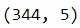

当使用 PySpark 导入数据时，第一行被用作标题，因为我们指定了`header=True`，并且数据类型被推断为更合适的类型，因为我们设置了`inferSchema=True`。如果您感到好奇，可以尝试不使用这些选项进行导入，并检查数据帧及其数据类型(与 pandas 类似，您可以使用 PySpark 数据帧的`df.dtypes`来检查数据类型)。

与熊猫 DataFrame 不同，PySpark DataFrame 没有`.shape`这样的属性。所以为了得到数据形状，我们分别找到行数和列数。

现在，让我们检查有关数据的高级信息:

```
# 🐼 pandas 
df.info()# 🎇 PySpark
df.printSchema()
```

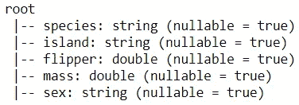

虽然这个方法不会给`df.info()`相同的输出，但它是最接近的内置方法之一。是时候看看数据的开头了:

```
# 🐼 pandas 
df.head()# 🎇 PySpark
df.show(5)
```

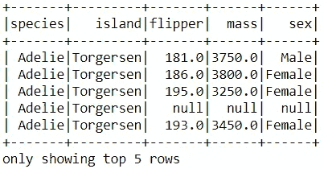

默认情况下，如果超过 20 行，`df.show()`将显示 20 行。PySpark DataFrame 其实有一个叫`.head()`的方法。运行`df.head(5)`提供如下输出:

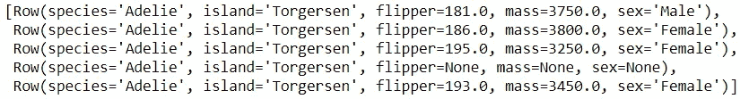

来自`.show()`方法的输出更加简洁，所以我们将在这篇文章的剩余部分使用`.show()`来查看数据集的顶部行。现在让我们看看如何选择列:

```
# 🐼 pandas 
df[['island', 'mass']].head(3)# 🎇 PySpark
df[['island', 'mass']].show(3)
```

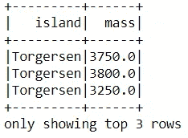

虽然我们在这里可以使用几乎类似熊猫的语法，但以下版本的代码片段可能更常用于在 PySpark 中选择列:

```
df.select('island', 'mass').show(3)
df.select(['island', 'mass']).show(3)
```

## 📍 1.2.过滤

让我们看看如何根据条件过滤数据:

```
# 🐼 pandas 
df[df['species']=='Gentoo'].head()# 🎇 PySpark
df[df['species']=='Gentoo'].show(5)
```

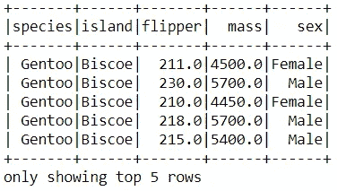

这两个库的语法几乎相同。为了获得相同的输出，我们也可以使用:

```
df.filter(df['species']=='Gentoo').show(5) df.filter("species=='Gentoo'").show(5) 
```

下面显示了一些常见的过滤器比较:

```
# 🐼 pandas 
2a df[df['species'].isin(['Chinstrap', 'Gentoo'])].head()
3a df[df['species'].str.match('G.')].head()
4a df[df['flipper'].between(225,229)].head()
5a df[df['mass'].isnull()].head()1b df.loc[df['species']!='Gentoo'].head()
2b df[~df['species'].isin(['Chinstrap', 'Gentoo'])].head()
3b df[-df['species'].str.match('G.')].head()
4b df[~df['flipper'].between(225,229)].head()
5b df[df['mass'].notnull()].head()6 df[(df['mass']<3400) & (df['sex']=='Male')].head()
7 df[(df['mass']<3400) | (df['sex']=='Male')].head()# 🎇 PySpark
2a df[df['species'].isin(['Chinstrap', 'Gentoo'])].show(5)
3a df[df['species'].rlike('G.')].show(5)
4a df[df['flipper'].between(225,229)].show(5)
5a df[df['mass'].isNull()].show(5)1b df[df['species']!='Gentoo'].show(5)
2b df[~df['species'].isin(['Chinstrap', 'Gentoo'])].show(5)
3b df[~df['species'].rlike('G.')].show(5)
4b df[~df['flipper'].between(225,229)].show(5)
5b df[df['mass'].isNotNull()].show(5)6 df[(df['mass']<3400) & (df['sex']=='Male')].show(5)
7 df[(df['mass']<3400) |(df['sex']=='Male')].show(5)
```

虽然在 pandas 中`~`和`-`都用作否定，但是在 PySpark 中只有`~`用作有效否定。

## 📍 1.3.整理

让我们对数据进行分类，检查质量*最小的 5 行*:

```
# 🐼 pandas 
df.nsmallest(5, 'mass')# 🎇 PySpark
df[df['mass'].isNotNull()].orderBy('mass').show(5)
```

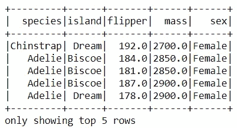

Pandas 的`.nsmallest()`和`.nlargest()`方法明智地排除了缺失值。然而，PySpark 没有等效的方法。为了获得相同的输出，我们首先过滤掉缺少*质量*的行，然后我们对数据进行排序并检查前 5 行。如果没有丢失数据，语法可以缩短为:`df.orderBy(‘mass’).show(5)`。

让我们看看使用`.sort()`代替`.orderBy()`的另一种排序方式:

```
# 🐼 pandas 
df.nlargest(5, 'mass')# 🎇 PySpark
df.sort('mass', ascending=False).show(5)
```

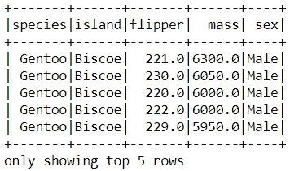

语法的这些变化也是有效的:

```
df.sort(df['mass'].desc()).show(5)
df.orderBy('mass', ascending=False).show(5)
df.orderBy(df['mass'].desc()).show(5)
```

我们可以按多列排序，如下所示:

```
# 🐼 pandas 
df.sort_values(['mass', 'flipper'], ascending=False).head()# 🎇 PySpark
df.orderBy(['mass', 'flipper'], ascending=False).show(5)
```

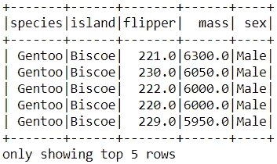

在 PySpark 里，你可以这样不用单子就脱身:`df.orderBy(‘mass’, ‘flipper’, ascending=False).show(5)`。要按不同方向的多列排序:

```
# 🐼 pandas 
df.sort_values(['mass', 'flipper'], ascending=[True, False]).head()# 🎇 PySpark
df[df['mass'].isNotNull()]\
  .sort('mass', 'flipper', ascending=[True, False]).show(5)
```

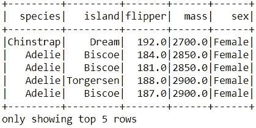

这里有一个替代方案:

```
df[df['mass'].isNotNull()]\
  .orderBy(df['mass'].asc(), df['flipper'].desc()).show(5)
```

## 📍 1.4.聚合

现在，让我们看几个汇总数据的例子。简单的聚合非常类似，如下所示:

```
# 🐼 pandas 
df.agg({‘flipper’: ‘mean’})# 🎇 PySpark
df.agg({'flipper': 'mean'}).show()
```

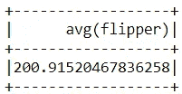

查看多个聚合时，我们需要采用不同的方法:

```
# 🐼 pandas 
df.agg({'flipper': ['min', 'max']})# 🎇 PySpark
from pyspark.sql import functions as F
df.agg(F.min('flipper'), F.max('flipper')).show()
```

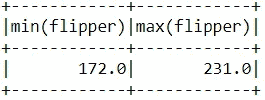

要获取列中的不同值:

```
# 🐼 pandas 
df['species'].unique()# 🎇 PySpark
df.select('species').distinct().show()
```

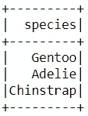

要在一列中获取多个不同的值，请执行以下操作:

```
# 🐼 pandas 
df['species'].nunique()# 🎇 PySpark
df.select('species').distinct().count()
```

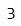

## 📍 1.5.按组汇总

到目前为止，您可能已经注意到 PySpark 在方法和函数中使用了*驼峰*。对于`.groupBy()`也是如此。下面是一个简单的按聚合分组的示例:

```
# 🐼 pandas 
df.groupby('species')['mass'].mean()# 🎇 PySpark
df.groupBy('species').agg({'mass': 'mean'}).show()
```

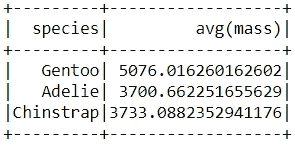

以下是聚合多个选定列的示例:

```
# 🐼 pandas 
df.groupby(‘species’).agg({‘flipper’: ‘sum’, ‘mass’: ‘mean’})# 🎇 PySpark
df.groupBy('species').agg({'flipper': 'sum', 'mass': 'mean'}).show()
```

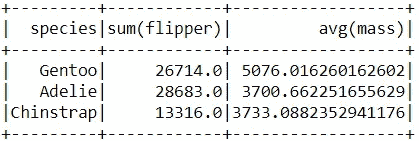

如果我们不指定列，它将显示所有数字列的统计信息:

```
# 🐼 pandas 
df.groupby('species').mean()# 🎇 PySpark
df.groupBy('species').mean().show()
```

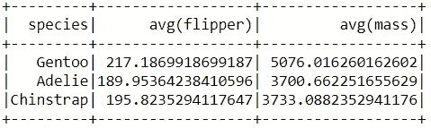

我们也可以用`.avg()`代替`.mean()`。换句话说，我们可以使用`df.groupBy(‘species’).avg().show()`。

这就是这篇文章的全部内容！希望这些比较对您有用，并对 PySpark 语法有所了解。您可能已经注意到，在基本任务方面，这两个库有很多相似之处。这使得对熊猫有工作知识的人更容易开始使用 PySpark。


照片由[沙哈达特·拉赫曼](https://unsplash.com/@hishahadat?utm_source=medium&utm_medium=referral)在 [Unsplash](https://unsplash.com?utm_source=medium&utm_medium=referral) 上拍摄

*您想访问更多这样的内容吗？媒体会员可以无限制地访问媒体上的任何文章。如果您使用* [*我的推荐链接*](https://zluvsand.medium.com/membership) ，*成为会员，您的一部分会费将直接用于支持我。*

感谢您阅读我的文章。如果你感兴趣，这里有我的一些其他帖子的链接:
◼️️ [给 pandas 用户的 5 个提示](/5-tips-for-pandas-users-e73681d16d17)
◼️️ [在 pandas 中聚合数据的 5 个提示](/writing-5-common-sql-queries-in-pandas-90b52f17ad76)
◼️️ [在 pandas 中编写 5 个常见的 SQL 查询](/writing-5-common-sql-queries-in-pandas-90b52f17ad76)
◼️️ [在 pandas 中编写高级 SQL 查询](/writing-advanced-sql-queries-in-pandas-1dc494a17afe)
◼️️ [如何在 pandas DataFrame 中转换变量](/transforming-variables-in-a-pandas-dataframe-bce2c6ef91a1)

再见🏃 💨