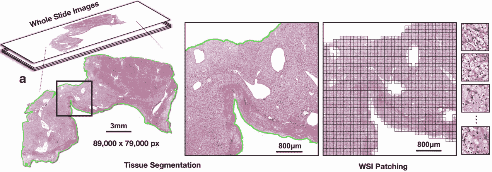
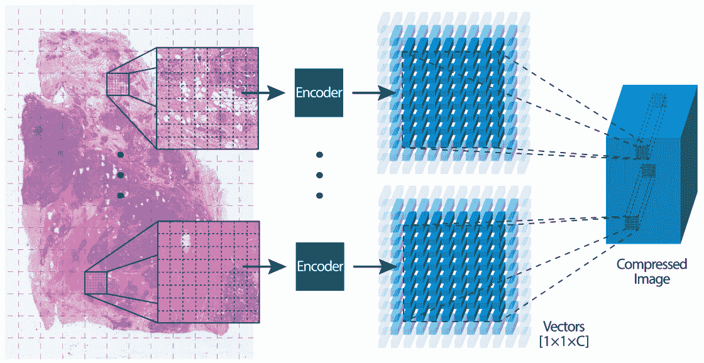
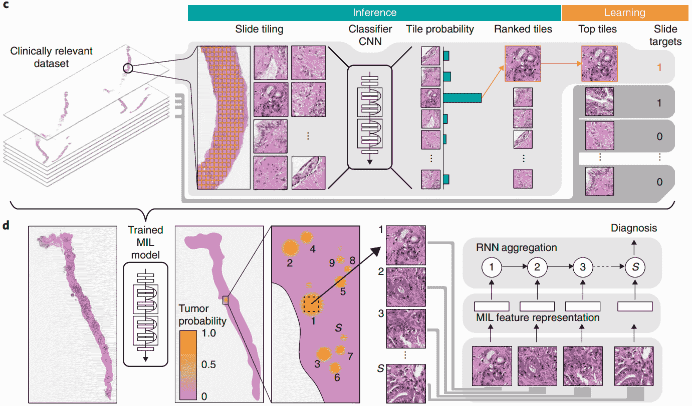
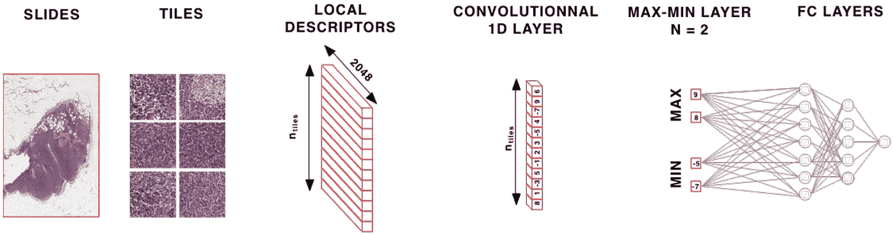
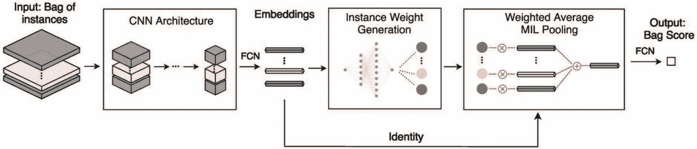
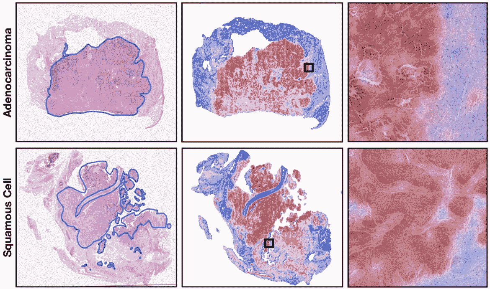
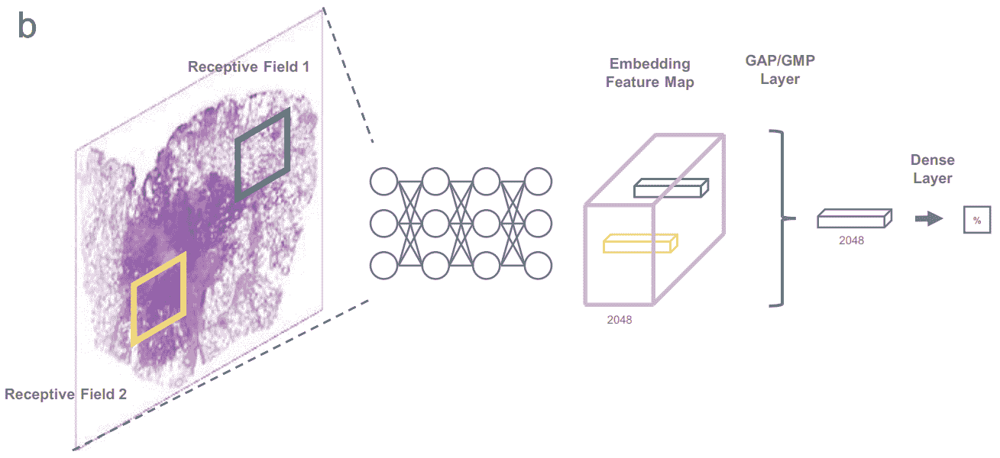
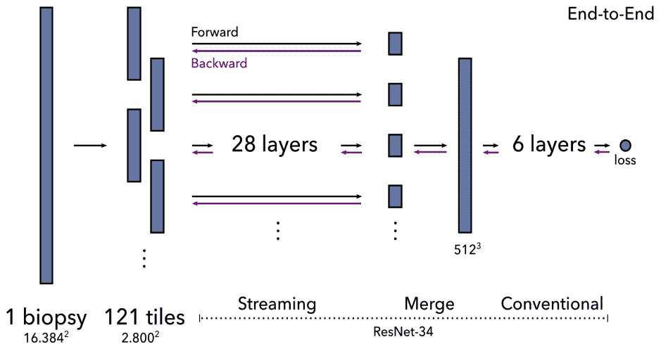
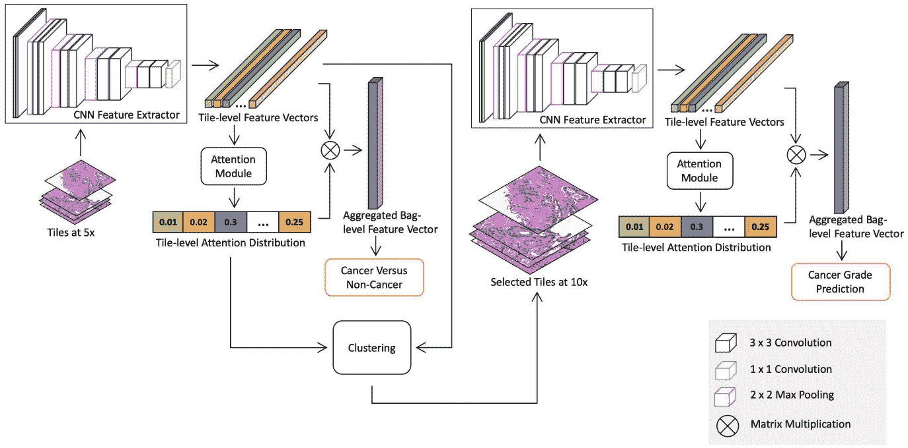
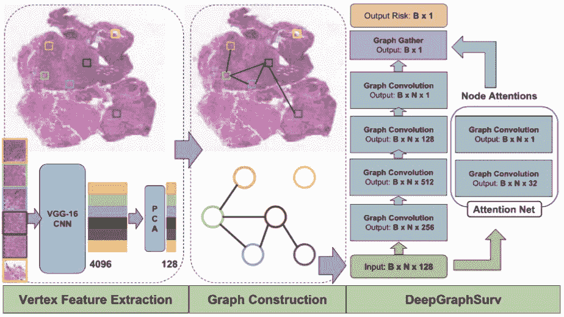

# 从补丁到幻灯片:如何在弱监督下在千兆像素图像上训练深度学习模型

> 原文：<https://towardsdatascience.com/from-patches-to-slides-how-to-train-deep-learning-models-on-gigapixel-images-with-weak-supervision-d2cd2081cfd7?source=collection_archive---------3----------------------->

## [理解大数据](https://towardsdatascience.com/tagged/making-sense-of-big-data)

## 对全切片组织学图像建模技术的回顾和对不同情况的建议。

整片组织病理学图像的跨度可达 100，000 像素。对如此大量的图像进行详细注释既费时又费钱。对于一些任务，病理学家可以注释图像中的单个特征，如组织类型或单个结构，如有丝分裂像。但是对于其他任务，只有更高级别的注释是可能的。

患者水平的标签可以从临床数据中获得，例如侵入前病变是否变为侵入性，患者在诊断后存活多久，或者他们是否对特定的治疗有反应。它也可以是从对肿瘤进行的不同类型的分析中获得的标记，例如识别突变或基因组亚型的分子分析。免疫组织化学染色的替代方法也可以产生整个肿瘤的标记，例如受体状态。

最近的研究表明，深度学习算法有能力从 H&E 整片图像(WSIs)中预测这些类型的患者级属性。因为图像非常大，并且没有先验知识知道图像中的哪些小块与标签相关联，所以这被称为弱监督学习。算法的工作是找出 WSIs 中的哪些补丁与预测任务相关。

千兆像素的图像太大，无法一次全部放在 GPU 上；它们通常被分成更小的块，用于训练深度学习模型。本文将着眼于如何从这些较小的斑块中学习区分特征，以及如何使用它们来预测载玻片或患者级别的属性。最近的创新也找到了在 WSI 训练 CNN 的方法——但是还有一些剩余的限制，将在本文结尾讨论。

整个幻灯片图像(WSI)被分成小块用于模型训练[ [Lu2021](https://arxiv.org/abs/2004.09666)

有两种常见的技巧可以使 WSIs 在 GPU 上得到处理:对图像补丁的子集进行采样或缩小图像表示。

# **补丁采样**

整个 WSI 无法一次放入 GPU 内存，因此一个解决方案是从图像中选择一个补丁子集。已经采用了以下补丁选择方法:

*   **随机选择**:从 WSIs 图像中抽取补丁的最简单方法是随机选择。在训练的每个时期，从每个 WSI [ [Naik2020](https://www.nature.com/articles/s41467-020-19334-3) ]中选择不同的随机补丁子集。如果补丁的数量和大小足够小，那么它将适合 GPU。
*   **识别肿瘤，然后随机选择**:病理学家可以标注肿瘤区域 [Zhu2016](https://ieeexplore.ieee.org/abstract/document/7822579) ，或者可以在标注的肿瘤和非肿瘤斑块上训练癌症检测算法，以在新的 WSIs 中识别肿瘤。那么可以在每个时期随机选择肿瘤块的子集。
*   **聚类图像补片**:为了捕捉组织外观的更多样化视图，可以对图像补片进行聚类。这可以通过将每个图像中的小块单独聚类成例如 10 个聚类来完成。然后从每个聚类中抽取一个小块，这 10 个小块一起代表 WSI [ [Yao2020](https://arxiv.org/abs/2009.11169) ]。对此的另一种变化是在整个训练集中对面片进行聚类，并将每个 WSI 中离聚类质心最近的面片分配给该聚类。谢等人迭代地应用这种聚类方法，在训练的每个时期之后重新计算聚类质心。

# **补丁压缩**

对图像补片进行二次采样的替代方法是使用整个 WSI，但采用压缩表示。再一次，多种策略被应用于将图像块编码成更小的表示。

CNN 可以在另一个数据集上训练，并用于编码图像补片。通常，在 ImageNet 上预先训练的 CNN 被转换成组织学图像[[Lu 2021](https://arxiv.org/abs/2004.09666)]；然而，当对来自另一个组织学数据集的图像进行预训练时，同样的技术可能更有效。

神经图像压缩[ [Tellez2020](http://proceedings.mlr.press/v121/tellez20a.html)

无监督、自我监督和生成对抗网络(GAN)的预训练方法也取得了成功[ [Tellez2019](https://arxiv.org/abs/1811.02840) ， [Dehaene2020](https://arxiv.org/abs/2012.03583) ]。

# **聚集补丁**

然后，必须汇总 WSI 中多个面片的特征编码来预测类别。这些聚集方法可以用于训练具有图像补片子集的端到端 CNN，或者作为第二阶段模型来操作已经被压缩成较小表示的补片。

最常见的是，这是通过多实例(MI)学习范例完成的。每个 WSI 都是一个包含多个实例(图像补丁)的包。我们知道包的标签，但不知道实例的标签。

可以对补丁特征或补丁预测执行聚集。对于聚集补丁预测，传统的 MI 学习将正袋定义为具有一个或多个正实例，将负袋定义为具有所有负实例的袋。这个定义非常适用于癌症检测等任务，在这些任务中，即使少量的恶性组织也被视为癌症。如果训练数据集足够大，模型可以从这个简单的 MI 定义中学习。坎帕内拉等人使用 44k 活检 WSIs 来训练他们的模型[ [Campanella2019](https://www.ncbi.nlm.nih.gov/pmc/articles/PMC7418463/) ]。

对来自 WSIs 的补丁进行多实例学习以检测癌症[ [Campanella2019](https://www.ncbi.nlm.nih.gov/pmc/articles/PMC7418463/)

对于其他任务，聚合修补程序预测的不同方法可能更合适，例如，类预测的多数投票或跨修补程序平均预测分数。我之前的一些工作计算了补丁预测分数的分位数函数，以更全面地表征它们的分布，然后从分位数函数[[couture 2018 a](https://www.nature.com/articles/s41523-018-0079-1)]训练线性分类器，或者将分位数聚合构建到 CNN[[couture 2018 b](https://www.researchgate.net/profile/Heather-Couture/publication/325754651_Multiple_Instance_Learning_for_Heterogeneous_Images_Training_a_CNN_for_Histopathology/links/5bc602e7458515f7d9bf6ef6/Multiple-Instance-Learning-for-Heterogeneous-Images-Training-a-CNN-for-Histopathology.pdf)]中。

# **聚集补丁特征**

聚合修补程序特征是一种替代方法。一旦聚集，完全连接的层可以在最终预测之前应用于顶部。特性聚合有多种选项:最大值或平均值池(取每个特性的补丁编码的最大值或平均值)[ [Wulczyn2020](https://journals.plos.org/plosone/article?id=10.1371/journal.pone.0233678) ]，识别最具信息量的补丁，或加权和。

深度学习可用于识别 WSI 中最具信息量的斑块。Courtiol 等人创建了一个最大-最小层来识别顶部补丁和负面证据[ [Courtiol2018](https://arxiv.org/abs/1802.02212) ]。他们发现，虽然平均池对扩散性疾病很有效，但当癌症没有扩散时，最大-最小层提供了坚实的推动力。

用于识别顶部补丁和负面证据的最大-最小图层[[court io 2018](https://arxiv.org/abs/1802.02212)

更一般的公式是自注意机制，其可以学习用于计算补丁嵌入的加权和的补丁权重[ [Yao2020](https://arxiv.org/abs/2009.11169) ， [Lu2021](https://arxiv.org/abs/2004.09666) ， [Mobadersany2021](https://www.nature.com/articles/s41374-021-00579-5) ]。这是目前最流行的聚集补丁特性的方法。

自我关注使用补丁编码来计算每个补丁的权重。然后，将补丁特征聚合为加权和。这种公式使模型能够了解哪些面片对于特定任务最有信息，并对这些面片的特征赋予更高的权重。

计算补丁嵌入加权和的自关注机制[Li2019]

将自我注意模型更进一步，李等人使用计算的斑块权重来识别硬负斑块[ [Li2019](https://arxiv.org/abs/1906.09681) ]。在此基础上，他们构建了用于增强训练的硬阴性袋。

自我关注的另一个变体是确定性池，其中确定性被计算为实例蒙特卡罗退出预测的反向标准偏差。这种模型确定性的测量被证明比自我注意等替代方法更具解释力和鲁棒性，当只有少量的补丁包含期望任务的证据时。

自我关注和确定性池加权方案都提供了一些可解释性。权重可以叠加在 WSI 上作为热图，显示对预测任务最有用的影像部分。

注意力得分热图(右)与病理学家注释的肿瘤区域(左)一致[ [Lu2021](https://arxiv.org/abs/2004.09666) ]

# **实现端到端培训的技巧**

虽然单个 GPU 无法容纳一个 WSI，但一些技巧使 WSI 能够像全部保存在 GPU 内存中一样进行处理。

称为统一内存的 CUDA 功能可让 GPU 直接访问主机内存。与虚拟内存类似，页面会在请求时在 GPU 上交换。通过这项技术，陈等人能够处理 20k x 20k 像素的图像。任何更大的都会变得极其缓慢。为了适应更大的 WSI，他们在每个维度上缩小了 4 倍。这种技术最适合在低放大倍数图像上操作的简单任务。

使用统一内存通过具有全局平均池(GAP)或全局最大池(GMP)的 WSI 进行多实例学习[ [Chen2021](https://www.nature.com/articles/s41467-021-21467-y/)

一种替代方法是利用大多数 CNN 操作的局部性的称为流的方法。它结合了精确的平铺和梯度检查点来减少内存需求。要传输 CNN 的前向通道，首先要计算网络中间所选图层的特征图。由于缩减像素采样，此图层比原始图像小，因此适合 GPU。该中间特征图的重构然后被馈送到网络的其余部分。反向传递以类似的方式计算。

Pinckaers 等人首先用一个小而简单的 CNN 在 8k×8k 的图像上演示了这种技术[[pinkaers 2020 a](https://arxiv.org/abs/1911.04432)]。他们随后在 16k x 16k 的图像上展示了它。流的局限性在于它无法处理地图范围内的要素操作，例如网络流(较低)部分中的批量归一化。作为一种解决方法，他们冻结了批次归一化图层的均值和方差。

串流[[pinkaers 2020 b](https://arxiv.org/abs/2006.03394)

还有一种可能性是一种称为光环交换的空间划分方法。侯等人对 512x512x512 CT 图像的分割证明了这一点，并推测这也很适合组织病理学。这种技术将卷积层的输入和输出分布在 GPU 上，设备在卷积运算之前交换数据。

从统一内存到流，再到 halo exchange，这些方法中的每一种都可以对更大的图像进行端到端的训练，但目前仍有大约 20k x 20k 像素或更少的限制。我们还不能在不缩小图像和丢失对预测可能重要的细节的情况下处理更大的 WSIs。

# **监管不力的替代技术**

一些方法结合使用了上述技术。李等人将 WSIs 缩小到 5 倍放大，使用聚类来捕捉斑块外观的变化，并使用注意力模型来识别重要的聚类(以及其中的斑块)[ [Li2021](https://arxiv.org/abs/2011.02679) ]。在使用这种方法检测癌症后，他们在 10 倍的放大倍数下应用了相同的方法，只有被识别为癌症的斑块才能预测分级。

癌症检测(放大 5 倍)和分类(放大 10 倍)[ [Li2021](https://arxiv.org/abs/2011.02679)

上述对 WSIs 的应用都使用 CNN 来对图像建模。图形神经网络提供了另一种表示方法。CNN 应用于图像块，然后将它们连接到图形神经网络，该网络学习 WSI 的表示，以便进行预测[ [Li2018](https://link.springer.com/chapter/10.1007/978-3-030-00934-2_20) ， [Levy2021](https://www.worldscientific.com/doi/abs/10.1142/9789811232701_0027) ]。该图捕捉了补丁的邻域和其他潜在的重要架构特征之间的关系。

一个图形神经网络[ [Li2018](https://link.springer.com/chapter/10.1007/978-3-030-00934-2_20)

# **总结和建议**

那么应该选择哪种弱监管方式呢？这可能取决于您的数据集。例如，如果你有成千上万的图像，你也许可以用 CNN 的传统 MI 方法来检测癌症[ [Campanella2019](https://www.ncbi.nlm.nih.gov/pmc/articles/PMC7418463/) ]。但是大多数 WSI 数据集并没有那么大。

可以排除图像的部分吗，比如非肿瘤区域？这减少了要处理的图像数据量，但可能会排除潜在的信息区域，如生存模型。

另一个角度是识别组织结构或小尺度图像特征是否更可能为您的任务提供最丰富的信息。如果是前者，精简后的 WSI 上的统一内存或流方法将是很好的起点。或者图形神经网络。但是，如果您需要更高的放大倍数来学习适当的功能，请尝试将面片采样或面片压缩方法与聚合方法(如自我关注)相结合。这些方法甚至可以在少于 1000 幅图像的情况下很好地进行训练。

如果您认为一个好的 CNN 表示可以从另一个数据集转移或以自我监督的方式学习，那么尝试一种补丁压缩方法。对于最具挑战性的任务，如预测存活率或其他结果，您可能需要直接监督图像补丁。在这种情况下，补丁采样结合注意力可能是你最好的选择。

然而这些仅仅是推测。尝试几种似乎最适合您的数据集和任务的方法。学习和重复。这毕竟是科学。

**希望从您的图像和算法中获得最大的洞察力？**

[Heather D. Couture](https://www.linkedin.com/in/hdcouture/) 是 [Pixel Scientia Labs](http://pixelscientia.com) 的创始人，该实验室提取最新的人工智能研究，以帮助研发团队抗击癌症。

联系她，了解如何实施更好的模式并产生影响。

# **参考文献**

[Campanella2019] G .坎帕内拉、M.G .汉纳、L. Geneslaw、A. Miraflor、V.W.K. Silva、K.J. Busam、E. Brogi、V.E. Reuter、D.S. Kilmstra、T.J. Fuchs、[在整个幻灯片图像上使用弱监督深度学习的临床级计算病理学](https://www.ncbi.nlm.nih.gov/pmc/articles/PMC7418463/) (2019)，《自然医学》

陈春林，陈春春，余文宏，陈淑慧，张永春，萧万长，余春华。yeh c .-y . Chen，[一种利用深度学习进行肺癌病理分类的无注释整张幻灯片训练方法](https://www.nature.com/articles/s41467-021-21467-y/) (2021)，自然通讯

[Courtiol2018] P. Courtiol，E.W. Tramel，M. Sanselme，G. Wainrib，[仅使用全局标签的组织病理学分类和疾病定位:弱监督方法](https://arxiv.org/abs/1802.02212) (2018)，arXiv 预印本 arXiv:1802.02212

[Couture2018a] H.D. Couture，L.A. Williams，J. Geradts，S.J. Nyante，E.N. Butler，J.S. Marron，C.M. Perou，M.A. Troester，M. Niethammer，[利用深度学习进行图像分析以预测乳腺癌等级、er 状态、组织学亚型和内在亚型](https://www.nature.com/articles/s41523-018-0079-1) (2018)，npj 乳腺癌

[Couture2018b] H.D. Couture，J.S. Marron，C.M. Perou，M.A. Troester，M.Niethammer，[异构图像的多示例学习:为组织病理学训练 CNN](https://www.researchgate.net/profile/Heather-Couture/publication/325754651_Multiple_Instance_Learning_for_Heterogeneous_Images_Training_a_CNN_for_Histopathology/links/5bc602e7458515f7d9bf6ef6/Multiple-Instance-Learning-for-Heterogeneous-Images-Training-a-CNN-for-Histopathology.pdf)(2018)，医学图像计算和计算机辅助干预

[Dehaene2020] O. Dehaene，A. Camara，O. Moindrot，A. de Lavergne，P. Courtiol，[自我监督缩小了组织学中弱监督和强监督之间的差距](https://arxiv.org/abs/2012.03583) (2020)，arXiv 预印本 arXiv:2012.03583

[Gildenblat2020] J. Gildenblat，I. Ben-Shaul，Z. Lapp，E. Klaiman，[多示例学习的确定性池](https://arxiv.org/abs/2008.10548) (2020)，arXiv 预印本 arXiv:2008.10548

[Hou2019] L. Hou，Y. Cheng，N. Shazeer，N. Parmar，Y. Li，P. Korfiatis，X. Song，[采用空间分割的高分辨率医学图像分析](https://arxiv.org/abs/1909.03108) (2019)，arXiv 预印本 arXiv:1909.03108

[Levy2021] J. Levy，C. Haudenschild，C. Bar，B. Christensen，L. Vaickus，[利用图形神经网络进行整个切片图像的拓扑特征提取和可视化](https://www.worldscientific.com/doi/abs/10.1142/9789811232701_0027) (2021)，生物计算

[Li2018]李，姚。、朱晓东、李玉英、黄军，[全切片病理图像生存分析的图形 CNN](https://link.springer.com/chapter/10.1007/978-3-030-00934-2_20)(2018)，医学图像计算与计算机辅助介入

[Li2019] M. Li，L. Wu，A. Wiliem，K. Zhao，T. Zhang，B. Lovell，[组织病理学图像的深度实例级硬负挖掘模型](https://arxiv.org/abs/1906.09681) (2019)医学图像计算与计算机辅助介入

[Li2021] J. Li，W. Li，A. Sisk，H. Ye，W.D. Wallace，W. Speier，C.W. Arnold，[多示例学习的组织病理学图像分类和定位的多分辨率模型](https://arxiv.org/abs/2011.02679) (2021)，生物和医学中的计算机

[Lu2021] M.Y. Lu，D.F. Williamson，T.Y. Chen，R.J. Chen，m .，F. Mahmood，[全切片图像的数据有效和弱监督计算病理学](https://arxiv.org/abs/2004.09666) (2021)，自然生物医学工程

[Mobadersany2021] P. Mobadersany，L.A.D.Cooper，J.A. Goldstein，[格式塔网:从胎盘全切片图像中聚集和注意改善孕周深度学习](https://www.nature.com/articles/s41374-021-00579-5) (2021)，实验室调查

[Naik2020] N .纳伊克，a .马达尼，a .埃斯特瓦，N.S .凯斯卡尔，M.F .普雷斯，d .鲁德曼，r .索彻(2020)。[深度学习支持的乳腺癌激素受体状态确定，来自基础水平 H & E 染色](https://www.nature.com/articles/s41467-020-19334-3) (2020)，《自然通讯》

[pinkaers 2020 a]j . h . f . m . pinkaers，B. van Ginneken，G. Litjens，[利用多百万像素图像进行端到端学习的流式卷积神经网络](https://arxiv.org/abs/1911.04432) (2020)，IEEE 模式分析和机器智能汇刊

[pinkaers 2020 b]h . pinkaers，W. Bulten，J. van der Laak，G. Litjens，[通过带有图像级标签的端到端训练检测全切片图像中的前列腺癌](https://arxiv.org/abs/2006.03394) (2020)，arXiv 预印本 arXiv:2006.03394

[Tellez2019] D .特列斯，g .利特延斯，j .范德拉克，f .乔皮，[用于千兆像素组织病理学图像分析的神经图像压缩](https://arxiv.org/abs/1811.02840) (2019)，IEEE 模式分析和机器智能汇刊

[Tellez2020] D .特列斯，d .霍普纳，c .费尔霍夫，d .格伦哈根，p .尼罗普，m .德罗兹扎尔，f .乔皮，[利用有监督的多任务学习扩展无监督的神经图像压缩](http://proceedings.mlr.press/v121/tellez20a.html) (2020)，利用深度学习的医学成像

[Wulczyn2020] E. Wulczyn，D.F. Steiner，Z. Xu，A. Sadhwani，H. Wang，I. Flament-Auvigne，C.H. Mermel，P.-H.C. Chen，Y. Liu，M.C. Stumpe，[利用组织病理学图像对多种癌症类型进行基于深度学习的生存预测](https://journals.plos.org/plosone/article?id=10.1371/journal.pone.0233678) (2020)，PLoS ONE

[Xie2020] C. Xie，H. Muhammad，C.M. Vanderbilt，R. Caso，d . v . k . yallagadda，g .，T.J. Fuchs，[超越分类:通过端到端部分学习进行全切片组织病理学分析](https://2020.midl.io/papers/xie20.html) (2020)，深度学习医学成像

[Yao2020] J. Yao，X. Zhu，J. Jonnagaddala，N. Hawkins，J. Huang，[利用注意力引导的深度多示例学习网络进行基于整片图像的癌症生存预测](https://arxiv.org/abs/2009.11169) (2020)，医学图像分析

[Zhu2016] X. Zhu，J. Yao，J. Huang，[用于病理图像生存分析的深度卷积神经网络](https://ieeexplore.ieee.org/abstract/document/7822579) (2016)，生物信息学与生物医学国际会议