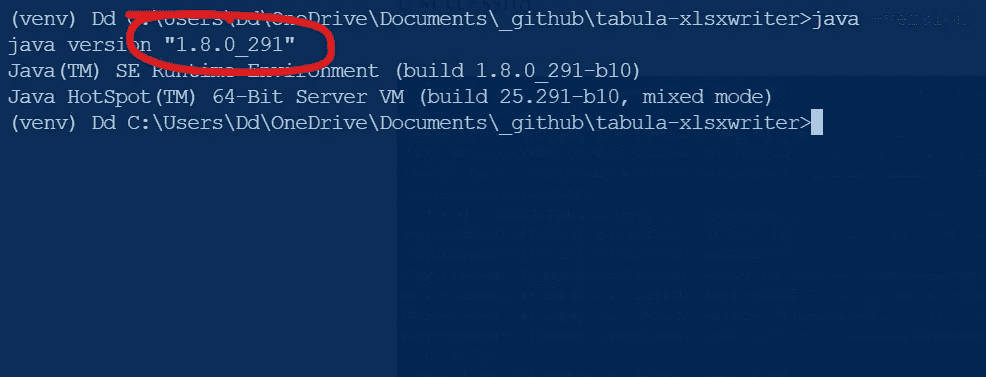
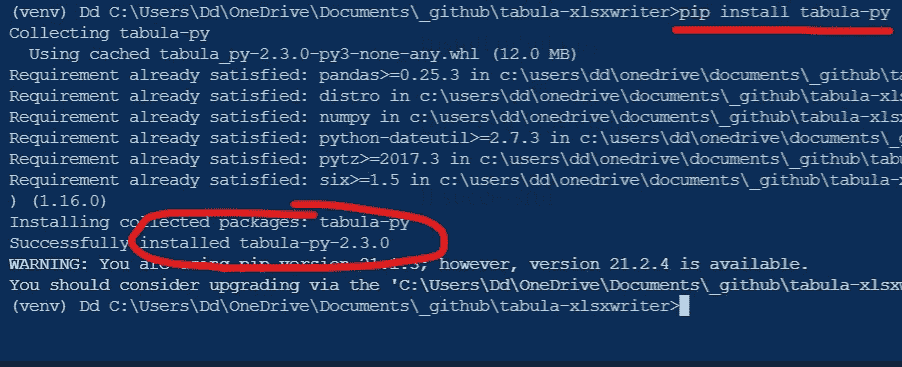
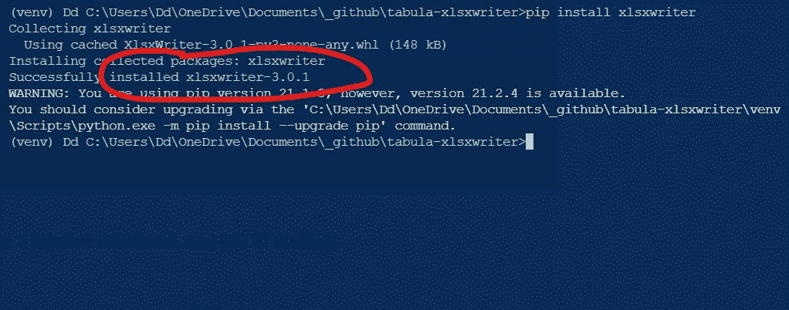
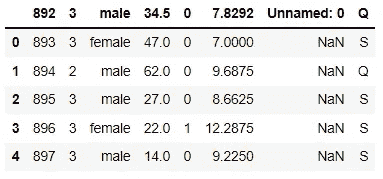
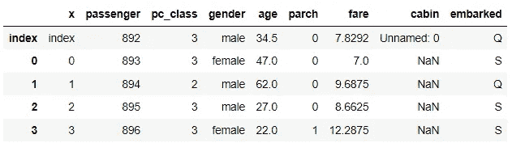
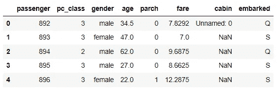
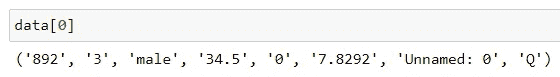
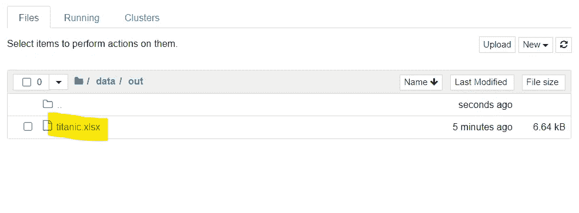

# 从 PDF 到 Excel

> 原文：<https://towardsdatascience.com/from-pdf-to-excel-536fe7844828?source=collection_archive---------7----------------------->

## 数据科学/ Python

## 使用 tabula 和 xlsxwriter


照片由[艾丽莎·巴耶纳鲁](https://unsplash.com/@alysa?utm_source=unsplash&utm_medium=referral&utm_content=creditCopyText)在 [Unsplash](https://unsplash.com/s/photos/converse?utm_source=unsplash&utm_medium=referral&utm_content=creditCopyText) 上拍摄

在现实世界中，我们经常会遇到各种格式的数据。今天，我们将处理从 PDF 中提取表格数据并将其导出到 Excel 的任务。

唯一的警告是，pdf 文件必须是机器生成的。扫描页面的 pdf 不工作。这是 tabula 的一个局限性。

说完了，我们走吧！

# 环境

首先，让我们确定我们有一个好的 java 环境。

```
java -version
```

您应该会看到类似这样的内容:



[作者](https://medium.com/@ednalyn.dedios/membership)截图

接下来，让我们用下面的代码安装 tabula-py:

```
pip install tabula-py
```

如果成功，



[作者](https://medium.com/@ednalyn.dedios/membership)截图

最后，让我们安装 xlsxwriter:

```
pip install xlsxwriter
```

我们应该会看到这样的情况:



[作者](https://medium.com/@ednalyn.dedios/membership)截图

现在，让我们打开 jupyter 笔记本，开始编码吧！

# 从 PDF 到 Dataframe

让我们从导入以下内容开始:

```
import pandas as pd
import tabula
import xlsxwriter
```

那我们来拿数据:

```
data = tabula.read_pdf('../data/in/titanic.pdf', pages='all', stream=True)
```

上面的代码产生了一个数据帧列表。因为列表中只有一个数据帧，所以让我们继续提取数据帧本身。我们可以做`df[0]`。



接下来，我们需要通过重置索引和转置数据帧两次来将列标题转换为第一行。

```
df = data[0].reset_index().T.reset_index().T
```

并将这些列重命名为:

```
df.columns=['x', 'passenger', 'pc_class', 'gender', 'age', 'parch', 'fare', 'cabin', 'embarked']
```



让我们删除前两列:

```
clean_df = df.drop(columns=['x']).reset_index(drop=True)
```

现在我们为黄金时间做好了准备:



# Excel 的数据框架

让我们首先创建一个新的 Excel 文件:

```
workbook = xlsxwriter.Workbook('../data/out/titanic.xlsx', {'nan_inf_to_errors': True})
```

并添加一个名为“测试”的工作表(选项卡):

```
worksheet = workbook.add_worksheet('test')
```

在将数据写入 Excel 之前，我们需要先将数据帧转换成列表。

```
data = list(clean_df.to_records(index=False))
```

让我们用以下内容初始化 Excel 文件的第一个单元格(A1 ):

```
# Rows and columns are zero indexed
row = 0
col = 0
```

让我们检查第一行:



我们需要通过手动插入列标题来解决这个问题。让我们将列名插入到列表的索引 0 中。

```
data.insert(0, ['passenger', 'pc_class', 'gender', 'age', 'parch', 'fare', 'cabin', 'embarked'])
```

现在我们可以一行一行地写了。

```
# Iterate over the data
for passenger, pc_class, gender, age, parch, fare, cabin, embarked in data:
    worksheet.write(row, col, passenger)
    worksheet.write(row, col + 1, pc_class)
    worksheet.write(row, col + 2, gender)
    worksheet.write(row, col + 3, age)
    worksheet.write(row, col + 4, parch)
    worksheet.write(row, col + 5, fare)
    worksheet.write(row, col + 6, cabin)
    worksheet.write(row, col + 7, embarked)
    row += 1
```

最后，让我们关闭工作簿。

```
workbook.close()
```

瞧啊。



[作者](https://medium.com/@ednalyn.dedios/membership)截图

就是这样！我们给自己弄了个 Excel 文件。

# 结论

在这篇文章中，我们学习了如何使用 tabula 和 xlsxwriter。我们取了一个 pdf 文件，将其提取为数据帧，然后将内容写入 Excel 文件。与循环的*结合起来*，我们可以很容易地接收许多 pdf 文件，并且有一个平面文件可以输入到像 Redshift 这样的数据库中。经过一点小小的努力，我们已经为自动化找到了一个成功的组合。

你可以在我的 [Github](https://github.com/ecdedios/pdf-to-excel) 上查看回购，以便进一步检查。下面是完整的代码:

谢谢你过来看我的帖子。

敬请期待！

*如果你想了解更多关于我从懒鬼到数据科学家的旅程，请查看下面的文章:*

</from-slacker-to-data-scientist-b4f34aa10ea1>  

*如果你正考虑转型进入数据科学领域，现在就开始考虑重塑品牌:*

</the-slackers-guide-to-rebranding-yourself-as-a-data-scientist-b34424d45540>  

你可以通过 [Twitter](https://twitter.com/ecdedios) 或 [LinkedIn](https://www.linkedin.com/in/ednalyn-de-dios/) 联系我。

# 参考

<https://github.com/chezou/tabula-py/blob/master/examples/tabula_example.ipynb>  <https://xlsxwriter.readthedocs.io/tutorial01.html> 