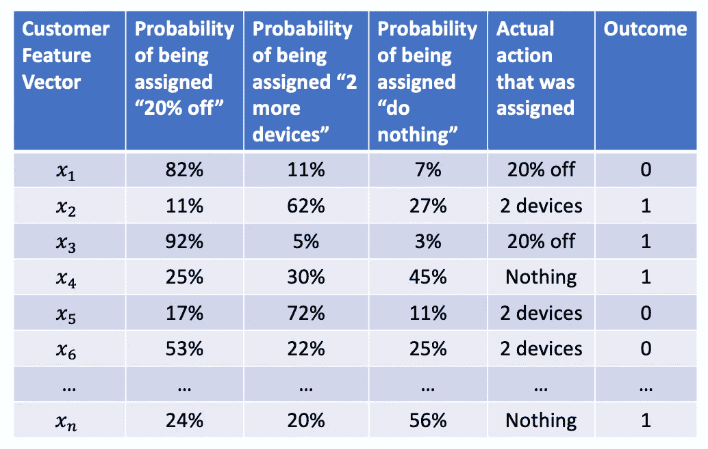

# 从预测到行动——如何从数据中学习最佳策略(3/4)

> 原文：<https://towardsdatascience.com/from-prediction-to-action-how-to-learn-optimal-policies-from-data-3-4-aa56c974a505?source=collection_archive---------24----------------------->

照片由[上的](https://unsplash.com/@burst?utm_source=medium&utm_medium=referral)爆裂[未爆裂](https://unsplash.com?utm_source=medium&utm_medium=referral)

在[第一部分](/from-prediction-to-action-how-to-learn-optimal-policies-from-data-part-1-1edbfdcb725d)中，我们讨论了从数据中学习*最优*策略的必要性。政策优化涵盖了广泛的实际情况，我们简要地看了医疗保健、防止流失、目标营销和市政府的例子。

在[第 2 部分](/from-making-predictions-to-optimizing-actions-an-introduction-to-policy-learning-2-4-9fc46ba8f3d0)中，我们描述了如何创建一个数据集，使其适合策略优化。

在这篇文章中，我们描述了一个简单的(在我看来也是*神奇的*)方法来使用这样一个数据集来估计 ***任何*** 政策的结果。

在[第 4 部分](/from-prediction-to-action-how-to-learn-optimal-policies-from-data-4-4-14c63cc0c938)中，我们将学习如何使用这样的数据集来寻找一个**最优** 策略。

甚至当你有能力找到*最优*政策时，能够快速估计*任何*政策的结果也是非常有用的。

例如，在商业环境中，人们总是对简单的政策感兴趣，这些政策要求对每个顾客采取相同的行动。这些政策易于理解和执行，因此企业领导人自然更喜欢它们。为了帮助他们决定是否应该采用简单的政策，他们可能想知道使用简单的政策而不是复杂的政策会“放弃”多少结果。如果预期结果下降不多，我们也可以采用简单的政策，对吗？

(BTW，简单的政策比比皆是。例如，在临床试验中，我们对两个简单策略(1)给每个人药物，和(2)给每个人安慰剂)之间平均结果的*差异*感兴趣

让我们回到我们在这个博客系列中处理的网飞客户流失的例子。

假设你的老板带着一个新政策的想法来找你:

> 如果一个顾客在过去的一个月里狂看了一个节目，“什么都不做”。
> 
> 否则，如果客户上个月的观看时间比上个月少了 10–30 %,则提供“2 个以上的设备”。如果客户上个月的观看时长环比下降超过 30%，则提供“八折”。
> 
> 如果这些标准都不适用，“什么都不做”。

当然，您可以做一个实验来估计这个策略的平均结果:随机抽取一些客户，对他们运行这个策略，并测量结果。但这需要时间和努力。

有更快的方法。你可以使用我们在[第二部分](/from-making-predictions-to-optimizing-actions-an-introduction-to-policy-learning-2-4-9fc46ba8f3d0)中准备的数据集来快速估算你老板脑波*的平均结果，而无需进行实验。*

这个问题的关键是一个神奇的东西，叫做[霍维茨-汤姆森估计器](https://en.wikipedia.org/wiki/Horvitz%E2%80%93Thompson_estimator)，下面是它的工作原理。

让我们从[第 2 部分](/from-making-predictions-to-optimizing-actions-an-introduction-to-policy-learning-2-4-9fc46ba8f3d0)中组装的数据集开始。

对于上面数据集中的每个客户，确定由提议的策略指定的操作(实际上，这应该是一个简单的 SQL 查询或类似的查询)。

接下来，向数据集中添加“调整后的结果”列。

现在是巧妙的部分:*对于每一个被分配的实际行动与新政策规定的行动相匹配的客户，将结果除以被分配行动的概率，并将其填入调整后的结果列。*

例如，分配给第三个客户的实际操作*和新策略指定的操作*都是“20%折扣”，因此我们将结果 1.0 除以分配给“20%折扣”操作的概率(92%)，得到调整后的结果 1.0/0.92 = 1.1(类似地，标有红框的其他三行也是如此)。

对于数据集中的所有*其他*行(即动作*与*不匹配的地方)，将 0.0 指定为调整后的结果。

“调整后的结果”栏已完成。现在，简单地取这个列的平均值，瞧！你对你老板的政策的平均结果有一个估计！

几个小注意事项:

*   我们通过除以概率来计算调整后的结果。现在你明白了为什么我在第 2 部分中坚持认为数据收集策略中的每个概率都必须是非零的。
*   同样，建议确保您的数据收集策略中的概率不要太小。用非常小的概率来划分结果会夸大调整后的结果数字，并使估计变得不那么可靠。
*   Horvitz-Thompson 估计量有一个“标准化”版本，称为 Hajek 估计量，具有更好的统计特性。我们不是寻找“调整结果”列的简单平均值，而是将该列的总和除以用于调整结果的概率的倒数之和(即除以 1/0.92 + 1/0.45 + 1/0.22 + … + 1/0.56)。详见[杨等(2020)](http://arxiv.org/abs/2010.15835) 第 5.1 节。
*   我想重申[第二部分](/from-making-predictions-to-optimizing-actions-an-introduction-to-policy-learning-2-4-9fc46ba8f3d0)中的一个警告:如果训练数据集不是通过随机实验而是通过历史观察数据收集的，那么数据集中的客户将不是随机样本，这可能会严重影响估计结果。因此，对这些数字要有所保留。

鉴于这种评估任何政策的能力，您可以通过集思广益寻找新政策，评估它们有多好，并试图改进它们。

或者，你可以*直接*找一个**最优**策略。在第 4 部分中，我们将这样做。

出于对数学的好奇，我在维基百科页面上尝试了一个更清晰的[证明版本，展示了霍维茨-汤普森估计量如何无偏地估计任何政策的结果。](https://en.wikipedia.org/wiki/Horvitz%E2%80%93Thompson_estimator#Proof_of_Horvitz-Thompson_Unbiased_Estimation_of_the_Mean)

