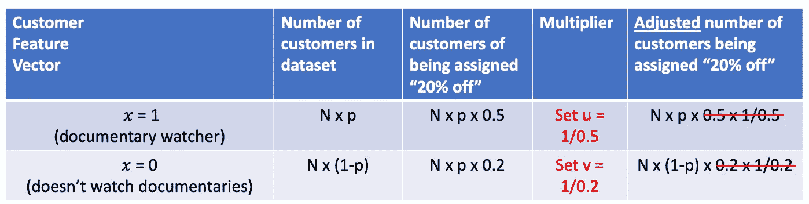

# 从预测到行动——如何从数据中学习最佳策略(4/4)

> 原文：<https://towardsdatascience.com/from-prediction-to-action-how-to-learn-optimal-policies-from-data-4-4-14c63cc0c938?source=collection_archive---------24----------------------->

## 在这个系列的最后一篇文章中，我们将学习如何找到一个最优策略。

照片由 [Unsplash](https://unsplash.com?utm_source=medium&utm_medium=referral) 上的[延斯·勒列](https://unsplash.com/@madebyjens?utm_source=medium&utm_medium=referral)拍摄

概述:

*   在[第一部分](/from-prediction-to-action-how-to-learn-optimal-policies-from-data-part-1-1edbfdcb725d)中，我们讨论了从数据中学习*最优*策略的必要性。政策优化涵盖了广泛的实际情况，我们简要地看了医疗保健、防止流失、目标营销和市政府的例子。
*   在[第 2 部分](/from-making-predictions-to-optimizing-actions-an-introduction-to-policy-learning-2-4-9fc46ba8f3d0)中，我们描述了如何创建一个数据集，使其适合策略优化。
*   在第 3 部分的[中，我们提出了一种简单的方法来使用这样一个数据集来估计 ***任何*** 策略的结果。](/from-prediction-to-action-how-to-learn-optimal-policies-from-data-3-4-aa56c974a505)

首先，值得注意的是，许多领域的研究人员——因果推理、计量经济学和上下文强盗——已经研究这个问题多年，并设计了许多算法来解决它——双重鲁棒方法、直接方法、转换结果方法、双重机器学习、X-Learner、R-Learner 等等。看看最近的[调查](http://arxiv.org/abs/2007.12769)的第 3 部分，了解我的意思。

面对如此丰富的财富，我面临着在这篇文章中关注什么的难题。但幸运的是，对这一领域做出重大贡献的研究团队之一在 2018 年组织了“[一场上下文相关的强盗烘烤大赛](http://arxiv.org/abs/1802.04064)”，其中许多关键算法相互竞争。

一种叫做 ***重要性加权回归****【IWR】*的相对简单的方法在竞争中表现出色，我在下面描述它。IWR 直接利用我们关于如何构建回归模型的知识，易于理解，并且可以使用您选择的任何监督学习回归方法轻松实现(如果您对底层理论感兴趣，请参见[使用回归神谕的实用上下文强盗](http://arxiv.org/abs/1803.01088))。

在[第 2 部分](/from-making-predictions-to-optimizing-actions-an-introduction-to-policy-learning-2-4-9fc46ba8f3d0)中，我们组装了这样一个数据集:

作者图片

或者，更具体地说，让我们以网飞流失为例，采取三个行动:提供 20%的折扣，在另外两个设备上提供免费流媒体，什么也不做。

作者图片

**我们的目标是从这个数据集中学习一个函数，为每个客户分配最佳行动，也就是说，我们希望学习一个最佳策略。**

使用重要性加权回归(IWR)学习最优策略是一个三步过程。

**步骤 1** :根据分配的*实际*动作拆分上面的数据集。

每个动作的数据集(图片由作者提供)

现在，您将拥有与操作数量一样多的数据集。

**步骤 2** :使用*每个*数据集，构建一个回归模型，该模型根据客户特征向量 *x.* 预测结果

***至关重要的是，你需要使用加权平方损失作为损失函数，其中权重是概率列中数字的倒数。***

回归模型通常默认最小化平方损失，所以这很标准。你要做的*额外的*事情是为训练集中的每个数据点发送一个权重。

作者图片

让我们用代数的方法写下来，这样就不会有歧义了。

就是这样。

(顺便说一句，加权回归通常是现成的。在 [scikit-learn](https://scikit-learn.org/stable/index.html) 中，例如[线性回归](https://scikit-learn.org/stable/modules/generated/sklearn.linear_model.LinearRegression.html)、[梯度推进回归](https://scikit-learn.org/stable/modules/generated/sklearn.ensemble.GradientBoostingRegressor.html)和[随机森林回归](https://scikit-learn.org/stable/modules/generated/sklearn.ensemble.RandomForestRegressor.html)都以简单统一的方式支持权重，使用 **fit** 函数的 *sample_weight* 参数。

来自[https://sci kit-learn . org/stable/modules/generated/sk learn . linear _ model。LinearRegression.html](https://scikit-learn.org/stable/modules/generated/sklearn.linear_model.LinearRegression.html)

调用**拟合**函数时，只需将*样本权重*设置为概率栏中数字的倒数)

在这一步结束时，您将已经构建了与操作一样多的回归模型。

**第三步**:对于任何一个客户特征向量 *x* ，运行 *x* 到*每个模型，得到其行动的预测结果。*

作者图片

**现在，选择预测结果最高的行动。**

**你学会了一个最优策略！**

正如你在上面看到的，IWR 唯一的新东西(与传统回归相比)是使用概率的倒数作为权重。

使用概率背后的直觉是什么？

为了简单起见，假设您的客户特征向量 *x* 只有一个元素:它是一个二元变量，如果有问题的客户曾经看过关于网飞的纪录片，则为 1，如果没有，则为 0。

在与业务利益相关者协商后，假设您提出了以下*数据收集政策*(在[第 2 部分](/from-making-predictions-to-optimizing-actions-an-introduction-to-policy-learning-2-4-9fc46ba8f3d0)中定义):

数据收集政策(图片由作者提供)

让我们来关注一下“八折”这一栏。

作者图片

假设我们选择随机抽样的 *N* 位客户进行数据收集，而跟单观察人代表了样本的一小部分 *p* ，那么我们样本中大约 *Np* 位客户将是跟单观察人，而 *N(1-p)* 位客户则不是。

作者图片

有鉴于此,“八折”数据集中的客户数量大约为:

作者图片

(即，在我们样本中观看纪录片的 *Np* 客户中，根据我们的数据收集政策，其中 50%将被分配“八折”，因此我们得到 *N* x *p* x 0.5)

但是我们现在有一个问题。“八折”列中 x =1 和 x=0 客户的组合不同于样本中 x =1 和 x=0 客户的总体组合。如果我们用这个倾斜的数据集建立一个回归模型，它对“20%折扣”行动结果的预测可能会有偏差。

更一般地说，在您计划在整个客户群中使用的模型中，您用来构建模型的数据点应该有 *x* 以与在您的客户群中相同的方式分布。

回到我们的例子，我们如何解决这个问题？

一种方法是“*制作点数的副本*，使得“20%折扣”栏中 x=1 和 x=0 点数的组合与样本中 x =1 和 x=0 客户的总体组合相匹配。

假设我们对 x=0 点使用乘数 *u* ，对 x=1 点使用乘数 *v* 。乘法(即复制)完成后，新的点数显示在下面最右边的列中。

作者图片

我们应该如何选择 *u* 和 *v* 使得“八折”栏中调整后的客户数量与总体样本中的数量相匹配？

作者图片

简单。只需将乘数设置为概率的**倒数！**

设置 *u* = 1/0.5 和 *v* = 1/0.2。

作者图片

**乘数和概率完美抵消，调整后的数字与总体数字相匹配！**

(实际上，我们不会复制数据点。相反，我们简单地将概率的倒数作为权重插入损失函数，并且它具有相同的效果)

总之，在回归中使用概率的倒数作为权重，消除了由我们的数据收集策略引起的数据点的偏斜。

如果这个概率倒数的生意让你想起了第三部分中的霍维茨-汤普森估值器是如何工作的，你的直觉是正确的！事实上，我们可以用类似的论证来证明 IWR 是可行的。如果你很好奇，一个代数证明在帖子的底部。

(顺便说一句，这种使用概率倒数进行调整的想法是一种非常普遍和强大的技术的简单例子，这种技术被称为[重要性抽样](https://en.wikipedia.org/wiki/Importance_sampling)，被广泛用于许多领域)

你已经学习了使用 IWR 的最优策略，并准备将你的最优策略付诸实施。

我建议在发布前做最后一点调整。

世界在不断变化，在您的最佳策略中捕获和体现的客户行为模式也会随着时间而变化。*今天是最优的政策在下个季度可能不是最优的*。

当然，您可以使用数据收集策略定期收集新数据，并利用这些数据学习新的最佳策略。但是有更好的方法。

**给你的最优策略添加一点随机化，然后启动**(参见[第二部分](/from-making-predictions-to-optimizing-actions-an-introduction-to-policy-learning-2-4-9fc46ba8f3d0)中关于*ε-贪婪*的讨论，提醒你如何做)。

通过这样做，您的最佳策略可以兼作数据收集策略。偶尔，你可以从中获取数据，使用 IWR 重新学习一个最优策略，然后切换到那个策略(但是，同样，当你启动它时，你会添加一点随机化)。

在这篇文章中，我们将策略优化描述为一个**批处理**周期:运行一段时间的数据收集策略，对收集的数据使用 IWR 来学习最优策略，部署添加了一点随机化的最优策略，并且**经常重复**。

但这可以在**实时**中完成。在极端的情况下，我们可以在*每次交互之后(即，在观察到每个 x - >动作- >结果之后)*通过递增地更新对应于被分配的动作的 IWR 模型来这样做。更多信息见[此处](https://vowpalwabbit.org/docs/vowpal_wabbit/python/latest/tutorials/python_Contextual_bandits_and_Vowpal_Wabbit.html)。

在我们结束之前，让我们考虑一个非常重要的特例:*当我们只有* ***两个*** *动作可以从*中选择的时候。通常，其中一个是*主动*的事情(例如，给病人 X 药，给顾客打折)，另一个是*被动*的事情(例如，给安慰剂，什么都不做)。

特别是在因果推断/计量经济学中，两个行动(或两个治疗)的场景非常常见，因为你经常想要估计一个*干预*(又名行动或治疗)*与不干预*相比对现有系统的影响。

在这种特殊情况下，你实际上可以通过一个直接预测两个行动之间结果差异的模型来学习最优策略。在某些情况下，这可能比学习两个不同的模型更有效。要了解更多信息，请参见最近的[调查](http://arxiv.org/abs/2007.12769)的第 3 部分，并遵循其中的参考资料。

在这个由 4 部分组成的系列文章中，我试图从大量快速增长的研究中提取政策优化的最实用的元素。有大量非常有趣的材料——如果你想了解更多，这里有一些建议。

*   IWR 在 2018 年才首次被描述([参考文献](http://arxiv.org/abs/1803.01088))，如果我试图在 2018 年之前写这篇文章，我可能会选择[双稳健方法](https://projecteuclid.org/journals/statistical-science/volume-29/issue-4/Doubly-Robust-Policy-Evaluation-and-Optimization/10.1214/14-STS500.full)。更一般地说，除了 IWR 还有很多其他选择，如果你感兴趣，就从最近的这个[调查](http://arxiv.org/abs/2007.12769)开始，去你的好奇心想去的地方吧。
*   如果您对用于策略优化的库/模块感兴趣，这里有一个示例: [Vowpal Wabbit](https://vowpalwabbit.org/index.html) 、 [CausalML](https://causalml.readthedocs.io/en/latest/index.html) 、 [EconML](https://www.microsoft.com/en-us/research/project/econml/) 、 [PyLift](https://www.aboutwayfair.com/data-science/2018/10/pylift-a-fast-python-package-for-uplift-modeling/) 和 [Uplift](https://cran.r-project.org/web/packages/uplift/uplift.pdf) 。特别是，本文中描述的 [IWR 方法是在 Vowpal Wabbit 库](https://vowpalwabbit.org/docs/vowpal_wabbit/python/latest/tutorials/python_Contextual_bandits_and_Vowpal_Wabbit.html)中实现的。
*   如果您对商业可用的政策优化产品/服务感兴趣，这里有一个[示例](https://azure.microsoft.com/en-us/services/cognitive-services/personalizer/)。

快乐学习！

**可选**

出于好奇，这里有一个 IWR 如何工作的代数证明。

作者图片