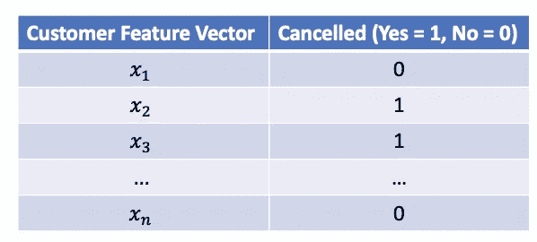
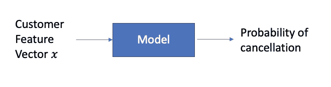
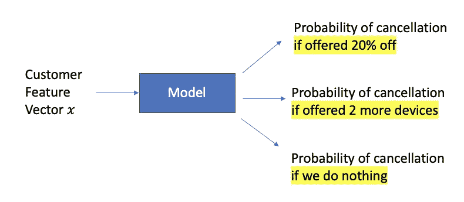
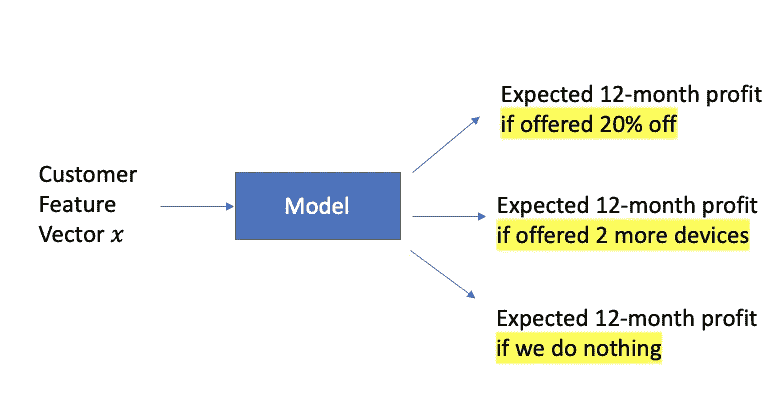
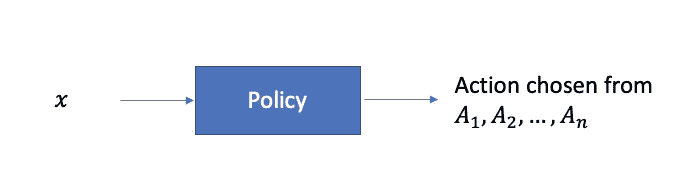
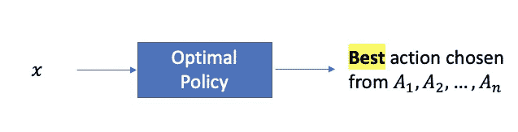
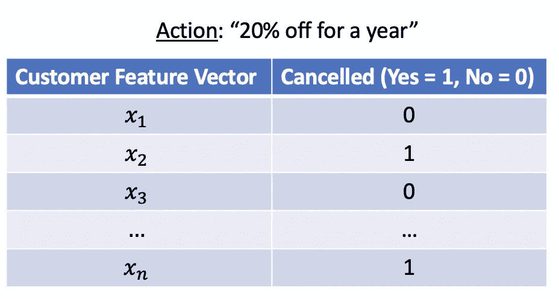
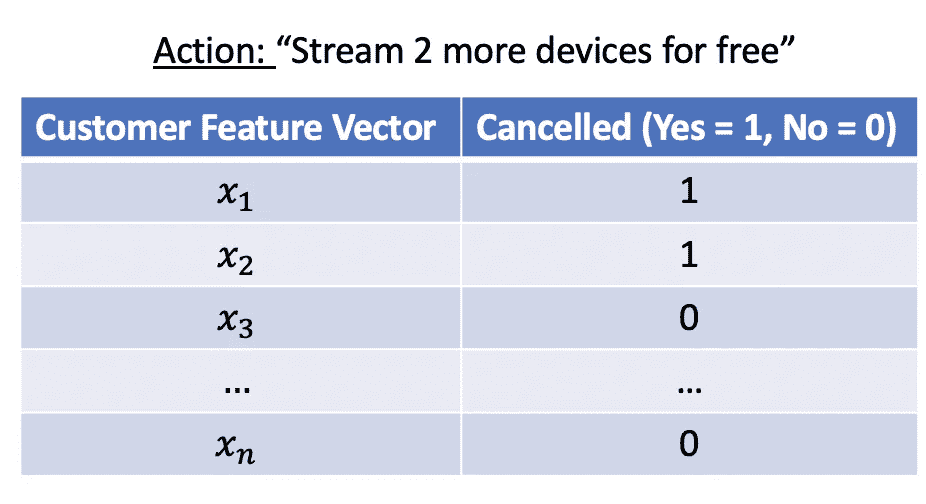
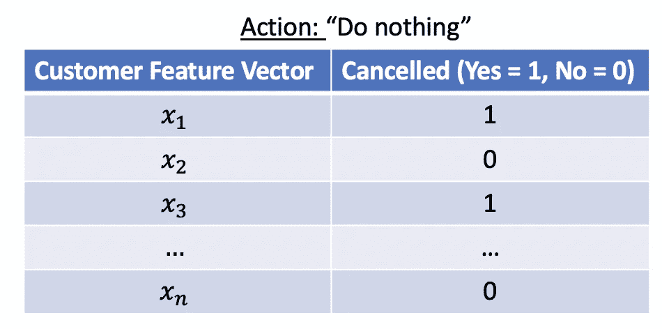
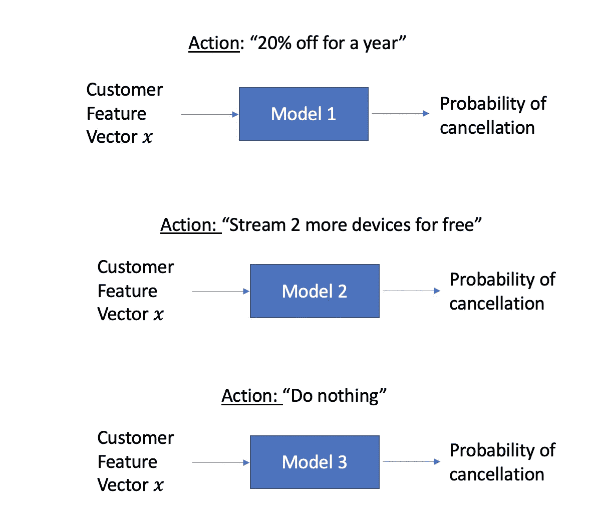

# 从预测到行动——如何从数据中学习最佳策略(1/4)

> 原文：<https://towardsdatascience.com/from-prediction-to-action-how-to-learn-optimal-policies-from-data-part-1-1edbfdcb725d?source=collection_archive---------13----------------------->

弗拉季斯拉夫·巴比延科在 [Unsplash](https://unsplash.com?utm_source=medium&utm_medium=referral) 上的照片

在数据科学工作中，我们建立模型来进行预测。利用这些预测，我们做出决定或采取行动。

有时候，预测和行动之间的关系很简单:

*   当你离家去上班时，你正试图决定是否应该带一把伞。你预测下雨的可能性。如果够高，你带把伞。如果没有，你就把伞留在家里([来源](https://pubs.aeaweb.org/doi/10.1257/aer.p20151023))
*   你在尝试判断一个图像中的人是不是 x，如果预测的概率足够高，你就用这个人的名字给图像加标签。如果没有，您可以不加标签。

其他时候，预测和行动之间的关系更复杂。

假设你是一名数据科学家，为网飞这样的订阅企业工作。您希望通过向客户提供留下来的奖励来防止他们取消每月订阅。

这就是众所周知的[流失](https://blog.hubspot.com/service/what-is-customer-churn)问题，标准的数据科学/机器学习方法如下。

首先收集取消的客户和没有取消的客户的历史数据。使用他们的属性，他们与业务的互动等。以形成每个客户的“特征向量”。添加一个指示客户是否取消的标志，并创建如下数据集:

利用这个数据集，建立一个模型(例如[逻辑回归](https://en.wikipedia.org/wiki/Logistic_regression))，在给定客户特征向量的情况下，预测他们取消的概率。

这可能是一个非常复杂的模型。对于每个客户，它可能有数百或数千个特征(即每个 x 可能是一个非常长的向量)，并且可能是使用最先进的方法(例如，[深度学习](https://en.wikipedia.org/wiki/Deep_learning)、 [XGBoost](https://en.wikipedia.org/wiki/XGBoost) )构建的

但是对于这样一个模型，你应该怎么做呢？

你是否应该联系那些预测有很大可能会大量流失的客户，并在他们续约时给予奖励或折扣？

这是一种合理的方法，并被广泛使用。这对某些客户有效，但不一定对所有客户有效([参考](https://doi.org/10.1509/jmr.16.0163))。

*   有些顾客会无视奖励，无论如何都要取消。
*   其他人可能根本没有想过离开，但会很乐意接受奖励并留下来——你只是在他们身上浪费了奖励。
*   对于其他一些可能没有想过离开的人来说，也许你的奖励提醒了他们，他们并没有经常使用你的产品/服务，他们可能会点击“取消”按钮。

如果你有不止一个可能的行动，事情会变得更加复杂。C **顾客可能会对不同的行为做出不同的反应**。如果提供“如果续订一年，每月账单可享受 20%的折扣”的奖励，客户 Sally 可能会续订，但如果提供“免费赠送 2 台以上设备”的奖励，则不会。对于客户艾伯特来说，可能正好相反。

**想象一下，如果您可以预测当客户成为目标时，您可能采取的每一个*可能的行动，包括“什么都不做”的行动，客户流失的可能性。***

当然，估算每个动作的流失概率只是一个起点。在业务环境中，您可能最终关心的是财务结果，例如，每个客户在未来 12 个月的预期利润。如果您知道每个行动的成本/收入影响，您可以将上面的模型转换为:

有了这个模型，对于任何客户，您都可以预测每个行动的预期结果，并“读出”该客户的最佳行动(即，找出最多 3 个数字！)

我们将在后面学习如何建立一个类似上面的模型。但首先，让我们退后一步，抽象出流失问题的关键要素。

*   一组客户(我广义地使用‘客户’来指代您想要对其应用操作的实体。例如，它可以是一个病人、一个网站访问者、一个潜在客户、一个企业、一个地理区域……你明白了)。关于客户属性、行为和其他上下文信息的所有相关信息被表示为特征向量。
*   一组可能的动作
*   当某项行动针对某个客户时，您的结果*(重要的是，不同的客户对行动的反应可能不同)*
*   *你的目标:为每一位顾客找到最佳结果的行动*

*让我们暂停几个快速定义。*

*将动作分配给每个特征向量的函数被称为**策略**。*

**

*将**最佳**动作分配给每个特征向量的函数是**最佳**策略。*

**

*我们想学习最优政策。*

*政策优化问题极其普遍。*

*   ***个性化医疗**:对于一种医疗状况，有 4 种可能的治疗方法。每种治疗的有效性可能因患者而异，这取决于每个患者的特征和病史。什么是 ***最佳治疗策略*** 即，我们应该对每个患者“应用”哪种治疗，以最大化积极的健康结果？*
*   ***针对**的活动:对于放弃购物车的电子商务访客，我们希望通过电子邮件向他们发送以下三种优惠之一:八折、免费送货、购物赠货。不同的购物者对这些优惠会有不同的反应。什么是 ***最佳目标政策*** 即，哪些优惠“适用于”每个购物者以实现预期利润最大化？(上面描述的客户流失问题也是“活动定位”的一个例子)*
*   ***健康/安全监测**:城市通过派遣检查员检查商业机构是否符合健康和安全规定。不是每个建筑都可以在每个时间段用可用的人员进行检查，所以我们需要一个 ***最佳检查策略:*** 对于每个机构，选择两个动作中的一个——检查这个时间段，不检查这个时间段——以便最大化整体安全性。这不仅仅是预测哪些建筑更有可能存在违规行为的问题。对于检查员发现的违规行为，业主的“反应”是很重要的。*

> *由于旧的布线，建筑物可能具有更高的火灾风险，但是其他考虑因素使得很难更换布线。其他单位可能有较低的预测风险，但它可能很容易和廉价作出实质性的改进。另一个考虑是响应性；如果违规导致罚款，一些公司可能比其他公司对罚款的前景更敏感。*
> 
> *来源:[斯坦福大学的苏珊·艾希](https://www.sciencemag.org/lookup/doi/10.1126/science.aal4321')教授的综述文章，我推荐阅读全文。*

*好，我们如何学习最优策略？*

*让我们先看看最简单的情况。*

*回到客户流失的例子，让我们假设我们有来自**随机实验**的数据:一个客户样本被**随机**选择，然后**随机**分配到三个行动中的一个——20%的折扣、流动两个以上的设备和什么都不做——他们的续订/取消响应被记录下来。*

*在这种幸运的情况下，我们有三个很好的数据集:*

******

*(请注意，这三组的客户是不同的。为了方便起见，我在所有三个表中对客户特征向量列使用了相同的符号*

*我们现在可以建立三个标准分类模型。*

**

*有了这三个模型，找到最佳策略很容易:通过每个模型运行任何客户的 *x* ，获得三个预测的取消概率，将它们转化为预期利润(或任何你关心的财务结果)，并选择具有最高预期利润的行动。*

*很好。但是正如我前面提到的，这是最直接的情况。*

*实际上，我们可能没有这么幸运。*

*如果有*的*数据，但它不是来自一个你可以安全地用于建模的随机实验，该怎么办？也许只有过去的观察数据，其中提供的不是随机抽样的客户，而是那些可能取消的客户(例如)。基于这些数据建立一个模型并将其应用于所有的客户可能会导致糟糕的预测。*

*如果在之前*从未尝试过一个动作，比如说，免费传输两个以上的设备，那么就没有关于它如何影响取消行为的数据了。有创造力的商人总是想出新的行动/策略/战略来尝试，所以这是一个真正的可能性。**

*我们需要小心处理这些和其他问题。*

*但不用担心:-)。这个问题及其变体已经在许多领域得到了广泛的研究——因果推理[、](https://en.wikipedia.org/wiki/Causal_inference)[计量经济学](https://en.wikipedia.org/wiki/Econometrics)、营销中的[提升建模](https://en.wikipedia.org/wiki/Uplift_modelling)、以及(尤其是)[情境强盗/强化学习](https://vowpalwabbit.org/tutorials/contextual_bandits.html)——并且已经设计了许多实用而优雅的方法。这些技术通常通过随机实验将预测模型(分类/回归)与智能训练数据收集相结合。*

*在我看来，使用这些技术进行政策评估和政策优化是一种强大但未被充分认识和利用的数据科学超级力量。*

*在第 2-3-4 部分，我们将深入了解并获得这种超能力:-)*

*   *在[第 2 部分](/from-making-predictions-to-optimizing-actions-an-introduction-to-policy-learning-2-4-9fc46ba8f3d0)中，我们将描述如何创建一个数据集，使其适用于策略学习。*
*   *在[第三部分](/from-prediction-to-action-how-to-learn-optimal-policies-from-data-3-4-aa56c974a505)中，我们将学习一种简单的(在我看来也是*神奇的*)方法来估计**T5【任何** 政策的结果。*
*   *在[第 4 部分](/from-prediction-to-action-how-to-learn-optimal-policies-from-data-4-4-14c63cc0c938)中，我们将学习如何找到一个**最优** 策略。*