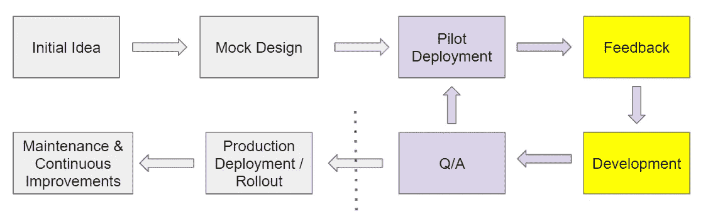

# 数据科学家从原型到生产

> 原文：<https://towardsdatascience.com/from-prototype-to-production-for-data-scientists-4d86df6c3c08?source=collection_archive---------22----------------------->

## 为数据科学家带来创意和模型

# 介绍

你可能会想"*是的，我知道原型是什么，还有什么需要知道的呢*？"你可能是对的，但是你知道一些不同的方法和术语吗？当你试图实现新的东西时，这些可以减少摩擦。你知道'*进化型*和'*一次性*原型之间的区别吗？你知道什么是*首次展示*吗？你知道做一个*飞行员*的陷阱吗？如果是这样，也许你可以跳过这篇文章。如果不是，那么理解这些概念可以帮助你的公司。

# 什么是原型？它和其他东西有什么不同？

*注意* ***原型*** *和* ***先导*** *在整篇文章中作为同义词使用。*

如果您已经知道什么是原型，请随意跳到下一部分。如果你不知道什么是原型，简而言之——知道它是你想要在大规模部署之前证明有用的产品。

例如，假设您有一个新应用程序的好主意。这款新应用将帮助顾客决定哪副太阳镜最适合他们([这是诺德斯特龙](https://vimeo.com/83614797)开发的真实原型)。在投资 100 亿美元在一个新的应用程序之前，你想先测试你的理论。所以，你开发一个原型！

首先，你起草一个应用程序的模拟设计，并展示给客户。你收集反馈并开始开发一个快速应用程序。这个应用程序是在开发环境中构建的(*不是生产*)。你向少数客户展示你的版本(或 V1 版本)，并获得反馈。你知道这是一个好主意，但需要一些修改。你继续这个过程，直到你对产品满意为止。总之，您已经收集了一些很好的反馈，您已经潜在地证明了该应用程序的价值，并且您已经使您的公司能够在降低财务风险的情况下投资于大规模部署。

# 原型方法

## 非生产试点

在某些情况下，你可能有技术和社会学的机会在投入生产之前将你的产品提供给少数用户**。在这种情况下，您可以进行非 prod 试点。有了非产品试验，您就可以为少数用户创建最终产品的版本，然后您就可以收集对产品的反馈。您可以进行更改，然后重新交付给您的用户组，并继续这个过程，直到产品准备好投入生产。**

## 混合试点/推广

在其他情况下，你**不会**有过多的选择和机会让你的产品在投入生产之前被少数用户使用。在这种情况下，接触用户的唯一途径就是通过生产。在这种情况下，您可能需要混合试点/推广。假设您正在创建一个新页面，并且您想了解您的销售团队对新页面的反应。您可以创建新页面，但是只对特定的群体开放(*可能是特定邮政编码的销售代表，或者手动选择的列表*)。在这一阶段，您需要监控用户对新页面的反应。您可以进行更改，然后重新交付给您的用户组，并继续这个过程，直到产品准备好进行大规模部署。

# 原型类型

## 广告传单

在这种情况下，你构建的原型并不是投入生产的产品。原型只是帮助你写出最终将投入生产的真实产品的需求。

## 进化的

在这种情况下，原型被生产采用。您编写和构建的任何代码都将部分或全部迁移到您的生产环境中。您可以进行一些重建，但是在大多数情况下，您创建的系统正在进入生产阶段。

## 混合型——一次性/进化型

你不会在很多原型文学中找到这种类型的原型，但是它是实践中出现的一种类型。在这种情况下，您的一些原型代码将投入生产，一些将被丢弃。例如，可能所有的后端工程都投入生产，但是你的产品的外观被重新编码(使用更适合生产的东西)。

你可以争论这只是进化，但我认为这里强调的是某些部分可能会完全被其他东西抛弃。

## 其他人

还有**增量式**和**极端式**原型，它们更具技术性，超出了本文的范围。

# 原型生命周期

图片作者。这个过程从最初的想法开始。然后，它进入试验阶段，在这个阶段，它处于一个连续的反馈循环中，直到决定进入生产阶段。

## 最初的想法

这是某人(经理、高管甚至员工)有想法的开始，他们想把这个想法介绍给公司。也许会安排一次会议，与一些利益相关者交谈并获得印象。需要召开更多的会议来解决细节问题。产品的目标是什么？它将如何改善业务运营？它将如何产生收入？预计投资回报率是多少？当你回答这些问题时，你可以一点一点地为项目开绿灯。最终，项目被确定为“进行”状态，相关团队应该开始工作。

## 模拟设计

第一步是创建某种模拟设计。这个阶段是将愿景写在纸上，并与利益相关者甚至客户分享，以便获得反馈。这一阶段的问题是——它应该是什么样的？我们最初应该具备什么特征？你不需要所有的需求，但是你需要一些关于你首先要构建什么的想法。

## 飞行员

如果你正在做一个混合试点/推广，你就开始在生产中构建一些对有限用户可用的东西。

如果您正在构建一个非生产试点，最好是在一个与生产环境有些镜像的环境中开发一个产品。但是，最重要的是您的试点环境快速、灵活且可靠。只要您的用户能够快速、灵活、安全、可靠地访问，您就可以在任何地方构建您的系统。也就是说，如果你正在构建一个进化的原型——你的系统能在生产中部署吗？如果你不回答这个问题，无论你是否计划，你的原型最终都可能成为一次性的原型。

为了进入生产阶段，你需要验证你的投资回报率，并确保产品值得进一步投资。所以试点阶段非常重要。重要的是，你的客户能容易地接触到你的产品，并能有效地使用它；否则，你的产品可能会失败，不是因为它是个坏主意，而是因为你的试验环境不好。重要的是，您的试验环境和试验产品都要和产品一样高质量，否则，您可能会因为所有错误的原因而失败。

## 生产

此时，您的原型正在进入生产阶段，干得好！你已经证明了你有一个伟大的想法，将产生收入。您的代码要么已经发布，要么您的生产团队正在生产中重新创建您的试运行。

你将不得不与你的制作团队合作，以确保你的产品保持可见性。也许你需要一个新的数据源来跟踪新系统的进展。这些是你需要讨论的事情。

## 维护和持续改进

你的工作还没有结束！你应该跟进你的产品，观察它的进展，看看哪里可以改进。在转移到生产环境时，是否有任何可能影响用户体验的系统细微差别被忽略了？你的产品需要更新吗？什么时候需要更新？你的产品出来了，但你的工作才刚刚开始。

# 摘要

开发新产品和改变你的公司通常做生意的方式是困难的。理解围绕原型的正式(和非正式)方法和术语可以减少公司的困惑。如果一个项目失败了，你希望它失败的原因是正确的，而不是错误的。在已建立的框架中自学将使你能够绕过障碍并保持动力。软件开发方法为数据科学提供了很多东西。**要成为一名杰出的数据科学家，你需要始终保持开放的态度来拓宽你的知识基础(在你的领域内外)。**

# 其他相关主题和阅读材料

## 混乱

如果你对自己说，“试点周期看起来像一个 [Scrum](https://www.scrum.org/resources/what-is-scrum) 周期”，那么你是对的！试点/原型周期是一个 Scrum 周期！如果你对 Scrum 不熟悉，我建议你去看看 Scrum.org 的[以及在](https://www.scrum.org/resources/what-is-scrum) [Udemy](https://www.udemy.com/courses/search/?src=ukw&q=scrum) 上的一些很棒的(*和实惠的*)课程。 **Scrum 是原型制作的核心**，所以如果你要进行原型制作，你应该真正了解 Scrum。

## 4 个基本的 A/B 测试部分

你可能会问自己，我怎么知道我的原型是否成功？定义成功非常复杂，每个项目都不一样。您可以 A/B 测试您的系统，这意味着您可以访问子群体，然后比较各组之间的指标——有新系统的组与没有新系统的组。您还可以比较实现前和实现后的指标，但是这种方法可能会很混乱，并且您需要控制时间上的差异。无论您采用何种方法，您都需要了解您的客户以及他们对新系统的反应。关于这个主题的更多信息，你可以查看我的另一篇关于 Medium 的文章，标题为 [4 个基本的 A/B 测试部分](/4-essential-a-b-testing-segments-c966f01b0b0e)。这些部分的相关性不限于 A/B 测试。这些细分市场与贵公司可能正在进行的任何试点或概念验证相关。知道你在影响谁，你在分散谁的注意力，以及你有什么选择来优化表现是很好的。

# **感谢阅读，快乐学习！**

# 参考资料:

*   [https://en.wikipedia.org/wiki/Software_prototyping](https://en.wikipedia.org/wiki/Software_prototyping)
*   [https://www . tutorialspoint . com/SDLC/SDLC _ software _ prototyping . htm](https://www.tutorialspoint.com/sdlc/sdlc_software_prototyping.htm)
*   [https://opensenseslabs . com/blog/articles/what-and-how-prototype-software-development](https://opensenselabs.com/blog/articles/what-and-how-prototype-software-development)
*   [https://www . optimize ly . com/optimization-glossary/feature-rollout/](https://www.optimizely.com/optimization-glossary/feature-rollout/)
*   [https://www . optimize ly . com/optimization-glossary/a b-testing/](https://www.optimizely.com/optimization-glossary/ab-testing/)
*   [https://www.scrum.org/resources/what-is-scrum](https://www.scrum.org/resources/what-is-scrum)
*   [https://www . udemy . com/course/agile-scrum-for-初学者-scrum-master-certification-preparation/](https://www.udemy.com/course/agile-scrum-for-beginners-scrum-master-certification-preparation/)
*   *作者个人&职业经历*