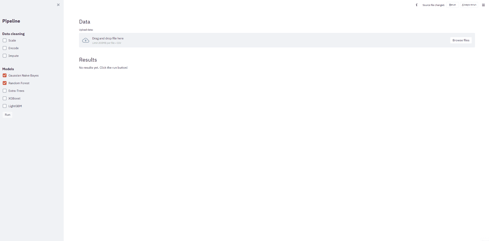

# 借助 ATOM 和 Streamlit 从原始数据到 web 应用部署

> 原文：<https://towardsdatascience.com/from-raw-data-to-web-app-deployment-with-atom-and-streamlit-d8df381aa19f?source=collection_archive---------39----------------------->


由[卡洛斯·穆扎](https://unsplash.com/@kmuza?utm_source=medium&utm_medium=referral)在 [Unsplash](https://unsplash.com?utm_source=medium&utm_medium=referral) 上拍摄的照片

# 介绍

在本文中，我们将向您展示如何创建一个简单的 web 应用程序，该应用程序能够帮助数据科学家在提供的数据集上快速执行预测模型性能的基本分析。用户将能够上传自己的数据集(作为. csv 文件)，并以两种方式调整机器学习管道:选择对原始数据集应用哪些数据清理步骤，以及选择要训练和评估的模型。我们将用 50 行代码完成所有这些工作！怎么会？使用正确的库。

*   我们将使用 [ATOM](https://tvdboom.github.io/ATOM/) 进行数据处理和模型训练。ATOM 是一个为快速探索机器学习管道而设计的库。如果你想对这个包有一个温和的介绍，请阅读这个故事。
*   我们将使用 [Streamlit](https://www.google.com/search?q=streamlit&rlz=1C5CHFA_enUS930NL930&oq=streamlit&aqs=chrome.0.0j69i59l2j0l4j69i61.1980j0j7&sourceid=chrome&ie=UTF-8) 来创建 web 应用程序。Streamlit 是一个流行的库，可以在几分钟内制作出漂亮的数据应用程序。

# 构建 web 应用程序

## 建立

开始进行必要的导入并设置 streamlit 的配置。我们选择一个宽布局，以便有空间显示两个相邻的地块。

```
import pandas as pd
import streamlit as st
from atom import ATOMClassifier# Expand the web app across the whole screen
st.set_page_config(layout="wide")
```

## 管道菜单

这个想法是能够从位于侧边栏的菜单中修改机器学习管道。该菜单将由复选框组成，这些复选框将决定将哪些元素(数据清理步骤或模型)添加到管道中，就像一个菜谱，您可以在其中选择自己的配料。

使用`st.sidebar`可以将对象添加到 streamlit 的侧边栏中。我们将要实施的数据清理步骤是:特征缩放、分类特征编码和缺失值插补。

```
st.sidebar.title("Pipeline")

# Data cleaning options
st.sidebar.subheader("Data cleaning")
scale = st.sidebar.checkbox("Scale", False, "scale")
encode = st.sidebar.checkbox("Encode", False, "encode")
impute = st.sidebar.checkbox("Impute", False, "impute")
```

之后，我们添加可用于拟合数据的模型。这一次，我们将复选框包装在一个字典中，以便以后能够对它们进行循环(注意，我们使用 ATOM 的模型缩写作为键)。

```
# Model options
st.sidebar.subheader("Models")
models = {
    "gnb": st.sidebar.checkbox("Gaussian Naive Bayes", True, "gnb"),
    "rf": st.sidebar.checkbox("Random Forest", True, "rf"),
    "et": st.sidebar.checkbox("Extra-Trees", False, "et"),
    "xgb": st.sidebar.checkbox("XGBoost", False, "xgb"),
    "lgb": st.sidebar.checkbox("LightGBM", False, "lgb"),
}
```

**注意:**确保安装了 [XGBoost](https://pypi.org/project/xgboost/) 和 [LightGBM](https://pypi.org/project/lightgbm/) 软件包，以便能够使用这些型号。

## 数据摄取

侧边栏菜单已经完成，是时候制作应用程序的主体了。第一部分是数据摄取，我们可以上传想要使用的数据集。为此使用 streamlit 的 [file_uploader](https://docs.streamlit.io/en/stable/api.html#streamlit.file_uploader) 函数。

```
st.header("Data")
data = st.file_uploader("Upload data:", type="csv")# If a dataset is uploaded, show a preview
if data is not None:
    data = pd.read_csv(data)
    st.text("Data preview:")
    st.dataframe(data.head())
```

## 模型训练和评估

最后，编写将处理数据、训练模型和评估结果的实际管道。注意，这个例子只适用于二进制分类任务。

```
st.header("Results")

if st.sidebar.button("Run"):
    placeholder = st.empty()  # Empty to overwrite write statements
    placeholder.write("Initializing atom...")

    # Initialize atom
    atom = ATOMClassifier(data, verbose=2, random_state=1)

    if scale:
        placeholder.write("Scaling the data...")
        atom.scale()
    if encode:
        placeholder.write("Encoding the categorical features...")
        atom.encode(strategy="LeaveOneOut", max_onehot=10)
    if impute:
        placeholder.write("Imputing the missing values...")
        atom.impute(strat_num="median", strat_cat="most_frequent")

    placeholder.write("Fitting the models...")
    to_run = [key for key, value in models.items() if value]
    atom.run(models=to_run, metric="f1")

    # Display metric results
    placeholder.write(atom.evaluate())

    # Draw plots
    col1, col2 = st.beta_columns(2)
    col1.write(atom.plot_roc(title="ROC curve", display=None))
    col2.write(atom.plot_prc(title="PR curve", display=None))

else:
    st.write("No results yet. Click the run button!")
```

这是相当大的一段代码，所以让我解释一下这里发生了什么。开始的 *if 语句*在侧边栏中创建了一个按钮，如果点击它，就会执行 *if 语句*中的代码块。只要没有单击该按钮，管道就不会运行。这确保了管道不会在每次单击菜单中的一个复选框后开始运行。 *if 语句*内的代码块执行以下操作:

*   创建一个占位符文本块，以便在管道运行时写入一些进度信息。
*   初始化一个将处理管道的 [ATOMClassifier](https://tvdboom.github.io/ATOM/API/ATOM/atomclassifier/) 实例。使用此命令，数据会自动拆分为 80%-20%比率的训练集和测试集。
*   运行侧栏中每个选中复选框对应的数据清理步骤。
*   使用 atom 的 [run](https://tvdboom.github.io/ATOM/API/ATOM/atomclassifier/#run) 方法在训练集上训练所有选择的模型。
*   使用[评分](https://tvdboom.github.io/ATOM/API/ATOM/atomclassifier/#scoring)方法输出模型在测试集上的表现。
*   显示所有训练模型的[接收机工作特性曲线](https://en.wikipedia.org/wiki/Receiver_operating_characteristic)和[精度-召回曲线](https://en.wikipedia.org/wiki/Precision_and_recall)。display=None 参数对于返回创建的 matplotlib 图形是必需的。

## 尝试一下

就这样，web 应用程序完成了！让我们试一试。要运行该应用程序，请打开终端并转到文件所在的目录。运行命令`streamlit run <name_web_app>.py`。web 应用程序将自动在您的默认浏览器中打开。按照此处[描述的步骤](https://docs.streamlit.io/en/stable/deploy_streamlit_app.html)进行部署。



所示示例中使用的数据是来自 Kaggle 的[澳大利亚天气数据集](https://www.kaggle.com/jsphyg/weather-dataset-rattle-package)的变体。可以从[这里](https://github.com/tvdboom/ATOM/blob/master/examples/datasets/weatherAUS.csv)下载。这个数据集的目标是预测明天是否会下雨，在目标列`RainTomorrow`上训练一个二元分类器。这个例子的完整代码可以在[这里](https://github.com/tvdboom/ATOM/blob/master/examples/webapp/webapp.py)找到。

# 结论

我们已经看到了如何使用 ATOM 和 Streamlit 快速创建一个能够探索基本机器学习管道的 web 应用程序。由于这两个库的灵活性和易用性，添加新模型、允许回归管道、显示一些额外的图表或增加管道的复杂性，都不会花费太多精力来改进 web 应用程序。

相关故事:

*   [https://towards data science . com/atom-a-python-package-for-fast-exploration-of-machine-learning-pipelines-653956 a16 e7b](/atom-a-python-package-for-fast-exploration-of-machine-learning-pipelines-653956a16e7b)
*   [https://towards data science . com/how-to-test-multiple-machine-learning-pipelines-with-just-the-less-lines-of-python-1 a16 CB 4686d](/how-to-test-multiple-machine-learning-pipelines-with-just-a-few-lines-of-python-1a16cb4686d)

有关 ATOM 的更多信息，请查看该项目的 [GitHub](https://github.com/tvdboom/ATOM) 或[文档](https://tvdboom.github.io/ATOM/)页面。对于 bug 或特性请求，请不要犹豫，在 GitHub 上打开问题或给我发电子邮件。