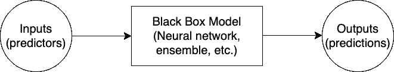
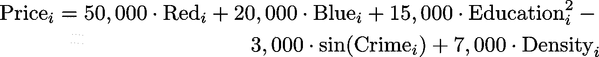
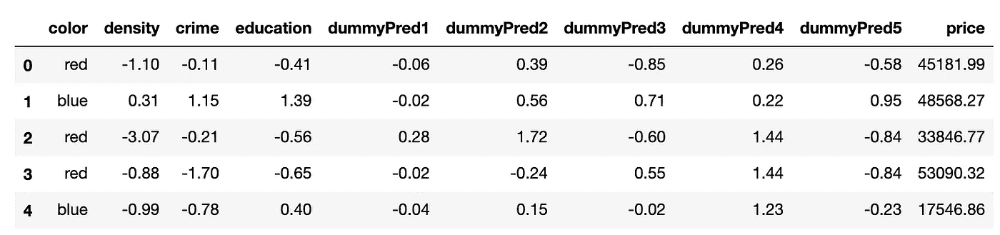
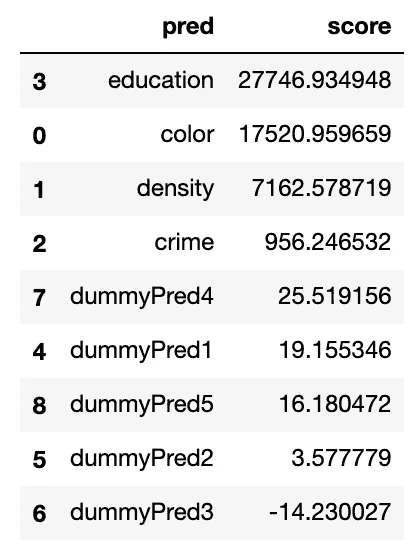
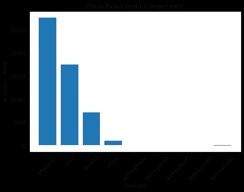

# 从零开始:置换特征对 ML 可解释性的重要性

> 原文：<https://towardsdatascience.com/from-scratch-permutation-feature-importance-for-ml-interpretability-b60f7d5d1fe9?source=collection_archive---------4----------------------->

## [实践教程](https://towardsdatascience.com/tagged/hands-on-tutorials)

## 使用排列要素重要性来发现数据集中哪些要素对预测有用-在 python 中从头实现。


由[阿诺·塞纳](https://unsplash.com/@arnosenoner)在 [Unsplash](https://unsplash.com/photos/ZxA9vV0phGI) 上拍摄的照片

# 介绍

机器学习中的高级主题由黑盒模型主导。顾名思义，黑盒模型是复杂的模型，很难理解模型输入是如何组合起来进行预测的。像[人工神经网络](https://link.springer.com/article/10.1007/s12518-021-00360-9)这样的深度学习模型和像[随机森林](/understanding-random-forest-58381e0602d2)、梯度推进学习器和[模型堆叠](https://machinelearningmastery.com/stacking-ensemble-machine-learning-with-python/)这样的集成模型是黑盒模型的例子，它们在从[城市规划](https://www.ncbi.nlm.nih.gov/pmc/articles/PMC6567884/)到[计算机视觉](https://medium.com/swlh/computer-vision-with-convolutional-neural-networks-22f06360cac9)的各种领域中产生非常准确的预测。



黑盒模型图

然而，使用这些黑盒模型的一个缺点是，通常很难解释预测者是如何影响预测的——尤其是使用传统的统计方法。本文将解释另一种解释黑盒模型的方法，称为排列特征重要性。置换要素重要性是一个强大的工具，无论我们使用什么模型，它都允许我们检测数据集中哪些要素具有预测能力。

我们将从讨论传统统计推断和特征重要性之间的差异开始，以激发对排列特征重要性的需求。然后，我们将解释排列特征的重要性，并从头开始实现它，以发现哪些预测因子对于预测 Blotchville 的房价是重要的。最后，我们将讨论这种方法的一些缺点，并介绍一些将来可以帮助我们了解置换特性重要性的包。

# 统计推断与特征重要性

当使用传统的参数统计模型时，我们可以依靠统计推断来精确地描述我们的输入与输出之间的关系。例如，当我们使用线性回归时，我们知道预测值的一个单位变化对应于输出值的一个线性变化。这种变化的幅度是在模型拟合期间估计的，我们可以使用概率论为这些估计提供不确定性度量。


照片由[贾维尔·阿莱格·巴罗斯](https://unsplash.com/@soymeraki)在[乌普斯普什](https://unsplash.com/photos/0nOP5iHVaZ8)上拍摄

不幸的是，当使用黑盒模型时，我们通常不可能做出这种声明。深度神经网络可能有数百、数千甚至[百万](/understanding-and-coding-a-resnet-in-keras-446d7ff84d33)个可训练权重，将输入预测器连接到输出预测(ResNet-50 有超过 2300 万个可训练参数)以及几个非线性激活函数。当处理一个如此复杂的模型时，通过分析找出预测器和预测之间的关系变得极具挑战性。

开发特性重要性技术是为了帮助缓解这种可解释性危机。特征重要性技术根据每个预测器改进预测的能力为其分配一个分数。这使我们能够根据预测因子的相对预测能力对模型中的预测因子进行排序。

生成这些特征重要性分数的一种方法是利用随机排列的力量。下一节将解释如何使用 python 执行置换要素重要性。

# 置换特征重要性

特性重要性背后的思想很简单。对预测有用的输入包含有价值的信息。如果您通过随机打乱特征值来破坏这些信息，那么您的预测质量将会下降。如果质量下降很小，那么原始预测器中的信息在确定您的预测时并不十分有效-没有它，您的模型仍然很好。此外，如果下降幅度很大，那么原始预测值中的信息会对您的预测产生很大影响。

这个想法通过三个简单的步骤实现。假设您已经训练了一个 ML 模型并记录了一些预测的质量度量(例如 MSE、对数损失等)。对于数据集中的每个预测值:

1.  随机打乱预测值中的数据，同时保持其他预测值不变
2.  基于置换值生成新的预测，并评估新预测的质量
3.  通过计算新预测相对于原始预测的质量下降来计算要素重要性分数

计算完所有要素的要素重要性分数后，可以根据预测有用性对其进行排序。为了帮助更具体地解释排列特征的重要性，考虑下面的综合案例研究。

# 案例研究:预测房价

*注意:代码在最有指导意义的时候被包括在内。请点击此处* *了解本指南的完整代码* [*。*](https://github.com/sethbilliau/FeatureImportance)

假设 [Blotchville](http://www.hcs.harvard.edu/cs50-probability/hw0705.php) 的 10000 套房屋的价格由四个因素决定:房屋颜色、邻里密度得分、邻里犯罪率得分、邻里教育得分。Blotchville 的房子不是红色就是蓝色，所以颜色被编码成二进制指示器。三个量化分数标准化，近似正态分布。根据下面的数据生成公式，可以从这些因素中确定房价:



数据生成方程

该数据集还包含其他五个与房价无关且没有预测能力的预测因素。这里是数据集前五行的快照，`df`。



数据集的快照

假设我们要训练一个模型，从其他九个预测值中预测价格。我们可以使用任何黑盒模型，但是为了这个例子，让我们训练一个随机森林回归器。为此，我们将数据分为训练和测试数据集。然后，我们使用 sklearn 拟合一个简单的随机森林模型。

```
from sklearn.model_selection import train_test_split 
from sklearn.ensemble import RandomForestRegressorX = df.drop(columns = 'price')
# One-hot encode color for sklearn
X['color'] = (X['color'] == 'red')
y = df.price# Train Test Split
X_train, X_test, y_train, y_test = train_test_split(X, y,
                                                    test_size=0.33, 
                                                    random_state=42)# Instantiate a Random Forest Regressor
regr = RandomForestRegressor(max_depth=100, random_state=0)# Fit a random forest regressor
regr.fit(X_train, y_train)
```

此时，请随意花些时间来调整随机森林回归器的超参数。但是，由于这不是关于[超参数调整](/hyperparameter-tuning-the-random-forest-in-python-using-scikit-learn-28d2aa77dd74)的指南，我将继续使用这个简单的随机森林模型——它可以很好地说明置换特征重要性的有用性。

评估回归预测质量的一个常用指标是在测试集上评估的[均方根误差(RMSE)](https://scikit-learn.org/stable/modules/generated/sklearn.metrics.mean_squared_error.html) 。让我们计算模型预测的 RMSE，并将其存储为`rmse_full_mod`。

```
from sklearn.metrics import mean_squared_errorrmse_full_mod = mean_squared_error(regr.predict(X_test), y_test, squared = False)
```

现在，我们可以通过改组每个预测器并记录 RMSE 的增加来实现置换特征重要性。这将允许我们评估哪些预测因子对预测有用。下面是从头开始做这件事的代码。看看你是否能把这段代码的注释和我们之前的算法匹配起来。

```
# Initialize a list of results
results = []# Iterate through each predictor
for predictor in X_test:

    # Create a copy of X_test
    X_test_copy = X_test.copy()

    # Scramble the values of the given predictor
    X_test_copy[predictor] = X_test[predictor].sample(frac=1).values

    # Calculate the new RMSE
    new_rmse = mean_squared_error(regr.predict(X_test_copy), y_test,
                                  squared = False)

    # Append the increase in MSE to the list of results 
    results.append({'pred': predictor,
                    'score': new_rmse - rmse_full_mod })# Convert to a pandas dataframe and rank the predictors by score
resultsdf = pd.DataFrame(results).sort_values(by = 'score',
                                              ascending = False)
```

得到的数据帧包含置换特征重要性分数。大的分数对应于 RMSE 的大幅度增加——当预测因子被打乱时，模型表现更差的证据。在检查该表时，我们看到四个数据生成预测因子(教育、肤色、密度和犯罪)具有相对较大的值，这意味着它们在我们的模型中具有预测能力。另一方面，五个虚拟预测值具有相对较小的值，这意味着它们对于进行预测并不那么有用。



排列数据帧的结果

我们还可以使用 matplotlib 绘制置换特征重要性分数的图表，以便于比较。



置换特征重要性图

从这个分析中，我们获得了关于我们的模型如何做出预测的有价值的见解。我们看到，在我们的模型中，教育分数是预测房价时提供最有价值信息的预测因子。房屋颜色、密度分数和犯罪分数似乎也是重要的预测因素。最后，五个虚拟预测值似乎没有太多的预测能力。事实上，由于去除虚拟预测因子 3 实际上导致了 RMSE 的降低，我们可以考虑进行特征选择，并在未来的分析中去除这些不重要的预测因子。

# 排列特征重要性的缺点


马丁·埃斯特夫在 [Upsplash](https://unsplash.com/photos/4y8A6Ve-3GE) 拍摄的照片

虽然我们已经看到了排列特性重要性的许多好处，但是承认它的缺点也同样重要(没有双关的意思)。以下是使用排列特征重要性的一些缺点:

1.  **计算时间:**这个过程可能计算量很大，因为它需要你迭代每个预测器并做出预测。如果做预测并不便宜，或者如果你有很多很多的预测者，这可能是昂贵的。
2.  **存在多重共线性时性能不佳:**如果数据集具有相关要素，排列要素重要性的性能会很差。如果一个预测器中的信息也存储在相关的预测器中，那么当这些预测器中的一个被打乱时，该模型仍然可以很好地执行。
3.  **分数是相对的，不是绝对的:**排列重要性分数显示了模型中特性的*相对*预测能力。然而，这些分数实际上没有任何脱离上下文的有意义的价值——任何分数都可能根据其他分数而变得很好或很差。
4.  **特征重要性仍然不是统计推断:**特征重要性技术只能告诉你一个预测器有多有用——它们不能提供对关系本质的任何洞察(例如线性、二次等。)或预测器效果的大小。排列特征重要性不是统计推断的替代品，而是在无法执行传统推断时的替代解决方案。

# 结论

置换特征重要性是工具箱中的一个有价值的工具，用于分析黑盒模型和提供 ML 可解释性。有了这些工具，我们可以更好地理解我们的预测者和我们的预测之间的关系，甚至执行更有原则的特征选择。

尽管我们从头开始实现了排列特征重要性，但是有几个包提供了排列特征重要性的复杂实现以及其他模型无关的方法。Python 用户应该查看`eli5`、`alibi`、`scikit-learn`、`LIME`和`rfpimp`包，而 R 用户则转向`iml`、`DALEX`和`vip`。

烫发快乐！如果你有任何问题，欢迎留言，我会尽我所能提供答案。

*致谢:非常感谢出色的克莱尔·霍夫曼校对和编辑了这篇文章，并忍受了我对牛津逗号的忽视。我也很感谢 Leo Saenger 阅读了这篇文章并提供了他的建议。*