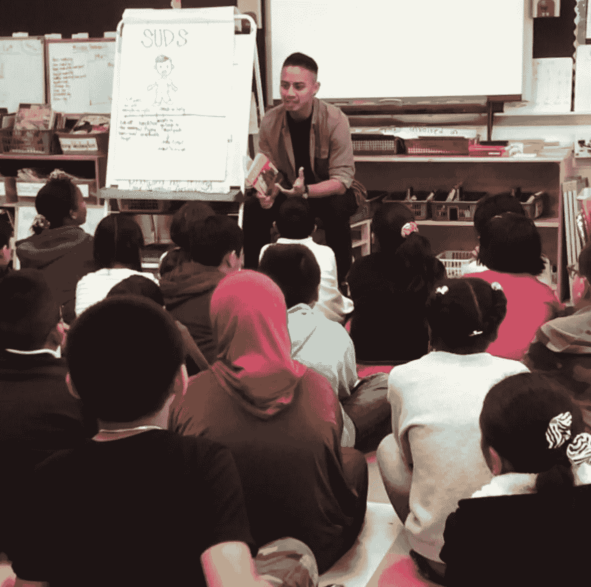
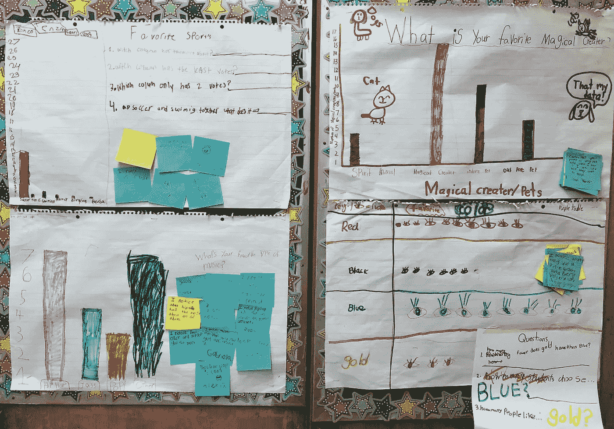

# 从教学到数据科学

> 原文：<https://towardsdatascience.com/from-teaching-to-data-science-5d6d712f6a3f?source=collection_archive---------7----------------------->

## 我是如何以及为什么从教小学转向数据科学的

作者照片

# 成为你想成为的人

当我第一次开始浏览职业选择时，我*几乎*立即放弃了数据科学，因为招聘信息中列出了要求:

*   Python、SQL 和/或 R 的编码经验
*   计算机科学、工程、数学或统计学硕士或博士学位
*   超过 5 年的数据科学家经验

当时，我的编码技能非常有限，我的硕士学位与数据科学无关，我的职业经历是作为一名小学教师为黑人和棕色人种的儿童争取不平等。已经埋在学生贷款债务中，获得另一个硕士学位似乎不是最好的方法。我认为从事数据科学是一个遥不可及的梦想。

但是，一天下午，当我们像凯瑟琳·强森、米丝蒂·科普兰和索尼娅·索托马约尔一样，结束社会研究单元的“障碍打破者”课程时，我为学生们计划的课程目标在我脑海中回响，大胆地唱道:

> “你可以成为任何你想成为的人。”

我热爱教学，热爱教学背后的目的。但我也想探索在课堂之外做出改变的方法。我已经看到了数据对缩小学生阅读和数学技能差距的影响，我渴望使用数据科学作为一种强大的工具来做出改变。

虽然我还没有资格获得数据科学的工作，但我不得不*相信自己并投入工作，就像在我之前的破障者一样。以下是我如何利用自己的教师经验，获得了过渡到数据科学领域所需的额外技能。*

# 可转移的技能

一个伟大的老师在某一天会身兼数职——我们是演员、顾问、记者、职业鞋匠，仅举几例。因为我们什么都做，所以我想我的教学经验可以提高我在数据科学家中的候选资格。下面列出了一些传授给数据科学专业的教学技能。

*   **向非技术观众演示—** 教师和数据科学家都必须以清晰简洁的方式向精通数据科学以外主题的观众传达信息，无论是 Roblox 还是 ROI。我一天的大部分时间都在给 6 岁的孩子分解概念，比如分数。如果我的一年级学生在自助餐厅的空闲时间兴奋地分享他们如何"*将煎饼分成两半、三分之二和四分之三"，我相信我可以与商业利益相关者讨论 z 分数的相关性。*
*   数学知识 —虽然只是初级，但我一天中的大部分时间都围绕着数学，包括数据收集和分析。我最喜欢的数学单元，毫无疑问，是三年级课程的第一个单元，“数据和我的班级群体”在开学的前六周，我的学生学会了如何收集、绘制图表和解释数据。每个小组提出一个问题，他们想了解他们同学的一些情况。他们四处收集数据，根据收集到的数据制作条形图或象形图，然后分析结果。在这一单元结束时，我的学生不仅了解了班上最喜欢的魔法生物是什么，还了解了数学与他们的关系。

三年级“数据和我的班级社区”项目—作者照片

*   **数据驱动分析**—我想进入数据科学领域的主要原因:利用数据做出更好的决策。在每个单元之前，我们评估了学生在阅读、写作和数学方面已经掌握的知识。基于这些评估，我们找出了哪些主题需要更深入的探讨，或者哪些是我们可以快速回顾的。对于远远落后的学生，我们举行小组干预，并针对他们尚未获得的技能。因为我们使用数据，我们能够监控他们的进展并加快他们的成长。我很自豪地说，每一个在阅读和数学方面落后的学生在年底都达到了年级水平，而已经达到年级水平的学生甚至比以前更强。

# 获取新知识

尽管一名教师身兼数职，但编程不是其中之一。为了让我成功地过渡到数据科学领域，我需要发展我的技术技能。我从小处着手，首先测试数据科学职业是否适合我。然后我学的越多，我就越投入。我在下面列出了我的步骤，考虑到每个步骤所花费的时间和金钱，我肯定会建议你也按照这个顺序来做。

*   **Codecademy，**$ 40/月——Codecademy 的数据科学职业道路为我奠定了数据科学的基础，这是我在参加数据科学信息会议后立即去的地方。我没有任何编码经验，但是 Codecademy 指导我如何用 python 和 SQL 编码，然后给我机会自己写出代码。起初它看起来很初级，但我真的很欣赏它课程的简单性。一旦我掌握了足够的编码技能，这个网站就会推出测试我编码技能的项目。我也承认，即使是现在，当我接触新事物时，我仍然会参考 Codecademy。
*   社区大学可能是免费的，但肯定比大学便宜——我个人支付了 800 美元，因为我就住在旧金山的边界线之外。在旧金山城市学院上课填补了很多知识空白，并让我在数据科学的重要主题上有了很好的复习。有一个学期，我上了多元微积分，线性代数，还有统计和概率。这是一个充满挑战和数学负担的学期，但仍然很有趣。如果你计划参加训练营，我特别建议你提前学习数学课程，如果你还没有的话。训练营的课程在一天内涵盖了一个学期的内容。它没有给学习者足够的时间来消化材料。如果你当地的社区大学也提供其他与数据科学相关的课程，我肯定会建议你也参加这些课程。你学得越多，准备越充分。
*   **训练营，15000 美元——如果你正在考虑从事数据科学方面的职业，并且没有技术背景，我肯定会推荐你加入训练营。没错，这是一笔*大的*金融投资，但训练营可以帮助你发展数据科学职业所需的技能，并为你提供所需的支持。我目前参加了熨斗的在线兼职课程。起初，我很担心，因为我亲自学习更好，但在线课程仍然提供社区感觉，这很有帮助。在熨斗，您将有 5 个项目可以添加到您的个人资料中。这些项目非常棒，因为你从中获得了如此多的经验——你正在编码、分析结果、向业务涉众展示分析和建议，以及向技术观众展示你的代码。作为一名数据科学家，你正在获得实践经验，到时候你可以和潜在的雇主谈论这些。**
*   ****实习，**免费——在写这篇文章的时候，我刚刚开始在苹果公司实习，是一名 MVT 数据科学分析师。我要说的是，我上面提到的一切，包括可转移的技能和新知识，都帮助我为面试做好了准备。我很高兴能够利用我在训练营和 Codecademy 中学到的知识来构建和创造可以应用于现实世界问题的模型。实习也是一个很好的社交机会。随着旅程的继续，我会写更多关于这个的内容。**

# **结论**

**从教学过渡到数据科学是一个漫长的旅程，但至少可以说是一个激动人心的旅程。通过 Codecademy、社区大学和我的训练营，我已经获得了很多技能，我知道我的技能只会随着经验的增加而增加。虽然我时常怀念教书的日子，但我很高兴能利用我的数据科学技能来从事一些有所作为的项目。**

**所以对于那些没有技术背景的人，不要担心。有志者事竟成。记住，你可以成为任何你想成为的人。**

***如果你正在向数据科学领域过渡，我很想知道，你是如何利用自己的经验来帮助自己的？***