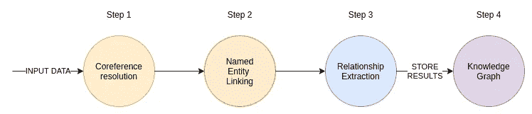
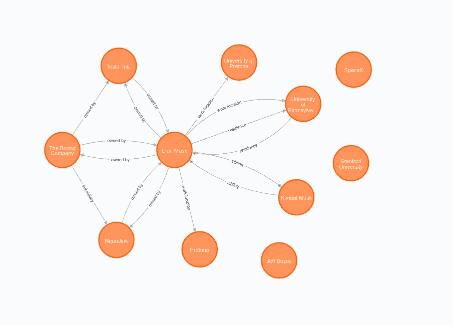
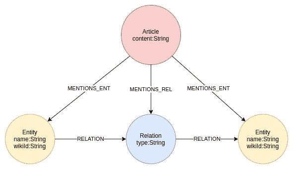
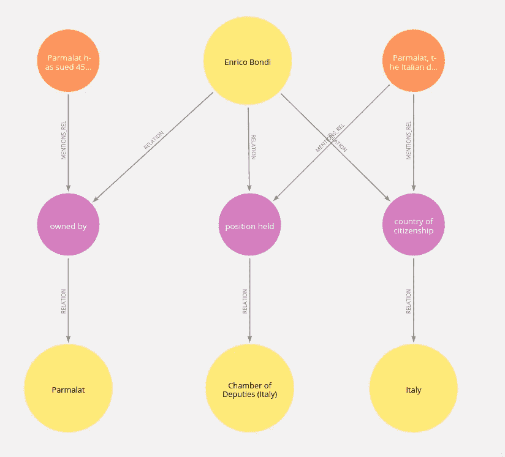

# 从文本到知识:信息提取管道

> 原文：<https://towardsdatascience.com/from-text-to-knowledge-the-information-extraction-pipeline-b65e7e30273e?source=collection_archive---------0----------------------->

## 实现信息提取管道，包括共指解析、实体链接和关系提取技术。

我很高兴向大家展示我最近在做的项目。如果你一直关注我的帖子，你会知道我热衷于将自然语言处理和知识图结合起来。在这篇博文中，我将展示我的信息提取数据管道的实现。稍后，我还将解释为什么我认为 NLP 和图的结合是通向可解释人工智能的途径之一。

# 信息提取管道

到底什么是信息提取管道？简单来说，信息抽取就是从文本等非结构化数据中抽取结构化信息的任务。



我实现 IE 管道的步骤。作者图片

我的信息提取管道的实现包括四个部分。在第一步中，我们通过一个共指消解模型运行输入文本。共指消解的任务是找到引用特定实体的所有表达式。简单来说，它将所有代词与所指实体联系起来。一旦这一步完成，它会将文本分割成句子，并删除标点符号。我注意到，当我们第一次去掉标点符号时，用于命名实体链接的特定 ML 模型工作得更好。在管道的命名实体链接部分，我们试图提取所有提到的实体，并将它们连接到目标知识库。在这种情况下，目标知识库是维基百科。命名实体链接是有益的，因为它还处理实体歧义消除，这可能是一个大问题。

一旦我们提取了提到的实体，IE 管道就试图根据文本的上下文推断出实体之间的关系。IE 管道结果是实体及其关系，因此使用图形数据库来存储输出是有意义的。我将展示如何将 IE 信息保存到 [Neo4j](https://neo4j.com/) 。

我将使用下面摘自维基百科的一段话来带你浏览 IE 管道。

```
Elon Musk is a business magnate, industrial designer, and engineer. He is the founder, CEO, CTO, and chief designer of SpaceX. He is also early investor, CEO, and product architect of Tesla, Inc. He is also the founder of The Boring Company and the co-founder of Neuralink. A centibillionaire, Musk became the richest person in the world in January 2021, with an estimated net worth of $185 billion at the time, surpassing Jeff Bezos. Musk was born to a Canadian mother and South African father and raised in Pretoria, South Africa. He briefly attended the University of Pretoria before moving to Canada aged 17 to attend Queen's University. He transferred to the University of Pennsylvania two years later, where he received dual bachelor's degrees in economics and physics. He moved to California in 1995 to attend Stanford University, but decided instead to pursue a business career. He went on co-founding a web software company Zip2 with his brother Kimbal Musk.
```

*文字复制自*[](https://en.wikipedia.org/wiki/Elon_Musk)**，在*[*CC BY-SA 3.0 license*](https://creativecommons.org/licenses/by-sa/3.0/)*下可用。**

## ***第一步:共指消解***

*如前所述，共指解析试图找到文本中引用特定实体的所有表达式。在我的实现中，我使用了运行在[空间](https://spacy.io/)框架之上的来自 Huggingface 的[neural corf 模型。我使用了 Neuralcoref 模型的默认参数。一路上我注意到的一件事是 Neuralcoref 模型不能很好地处理位置代词。我还从一个](https://github.com/huggingface/neuralcoref) [GitHub 问题](https://github.com/huggingface/neuralcoref/issues/288)中借用了一个小的改进代码。共指解决部分的代码如下:*

*如果我们通过 coref_resolution 函数运行示例文本，我们将得到以下输出:*

```
*Elon Musk is a business magnate, industrial designer, and engineer. 
Elon Musk is the founder, CEO, CTO, and chief designer of SpaceX. 
Elon Musk is also early investor, CEO, and product architect of Tesla, Inc. Elon Musk is also the founder of The Boring Company and the co-founder of Neuralink. A centibillionaire, Musk became the richest person in the world in January 2021, with an estimated net worth of $185 billion at the time, surpassing Jeff Bezos. Musk was born to a Canadian mother and South African father and raised in Pretoria, South Africa. Elon Musk briefly attended the University of Pretoria before moving to Canada aged 17 to attend Queen's University. Elon Musk transferred to the University of Pennsylvania two years later, where Elon Musk received dual bachelor's degrees in economics and physics. Elon Musk moved to California in 1995 to attend Stanford University, but decided instead to pursue a business career. Elon Musk went on co-founding a web software company Zip2 with Elon Musk brother Kimbal Musk.*
```

*在这个例子中，不需要高级的共指消解技术。Neuralcoref 模型将几个代词“他”改成了“埃隆·马斯克”。虽然看起来很简单，但这是提高我们 IE 管道整体效率的重要一步。*

## ***第二步:命名实体链接***

*就在最近，我发表了一篇使用[命名实体链接构建知识图](https://medium.com/neo4j/making-sense-of-news-the-knowledge-graph-way-d33810ce5005)的博文。这里，我想使用不同的命名实体链接模型。我第一次尝试使用脸书 BLINK 型号[，但我很快意识到它在我的笔记本电脑上无法工作。它需要至少 50GB 的空闲空间，这本身不是一个大问题，但它也需要 32GB 的 RAM。我的笔记本电脑只有 16GB 的内存，我们仍然需要管道的其他部分来工作。所以我恢复使用老式的 wiki ifier API](https://github.com/facebookresearch/BLINK)，它已经被证明是有用的。而且完全免费。如果你想找到更多关于 API 的信息，看看我以前的博客文章或者官方文档。*

*在我们通过 Wikifier API 运行我们的输入文本之前，我们将把文本分成句子并去掉标点符号。总的来说，这一步的代码如下:*

*我忘记提到 Wikifier API 返回一个实体所属的所有类。它查看的**实例和**类的**子类，并遍历整个类层次结构。我决定过滤掉属于个人、组织或地点的实体。如果我们通过管道的命名实体链接部分运行我们的示例文本，我们将得到下面的输出。***

*维基化过程的一个好处是，我们还可以为实体及其标题获取相应的维基数据 id。拥有 WikiData ids 可以解决实体歧义消除的问题。你可能想知道如果一个实体在维基百科上不存在会发生什么。不幸的是，在这种情况下，Wikifier 不会识别它。不过，我对此并不太担心，因为如果我没记错的话，维基百科有超过 1 亿个实体。*

*如果你仔细观察结果，你会注意到比勒陀利亚被错误地归类为一个组织。我试图解决这个问题，但维基百科的类层次结构很复杂，通常跨越五六跳。如果有一些维基类专家，我会很乐意听取你的建议。*

## ***第三步:关系提取***

*到目前为止，我已经介绍了所有的概念。我以前从来没有钻研过关系抽取。到目前为止，我们只研究了共现网络。因此，我很高兴向大家介绍工作关系提取流程。我花了很多时间搜索任何可能做得不错的开源模型。我很高兴偶然发现了 [OpenNRE](https://github.com/thunlp/OpenNRE) 项目。它具有五个开源关系提取模型，这些模型在 Wiki80 或 Tacred 数据集上进行训练。因为我是维基百科的忠实粉丝，所以我决定使用 Wiki80 数据集。在 Wiki80 数据集上训练的模型可以推断 80 种关系类型。我没有尝试过在 Tacred 数据集上训练的模型。你可以自己试试。在 IE 管道实现中，我使用了`wiki80_bert_softmax`模型。顾名思义，它在引擎盖下使用了 BERT 编码器。有一点是肯定的。如果你没有一个图形处理器，你不会有一个好时光。*

*如果我们在 OpenNRE 库中查看一个示例关系提取调用，我们会注意到它只推断关系，并不试图提取命名实体。我们必须提供一对带有`h`和`t`参数的实体，然后模型试图推断出一个关系。*

```
*model.infer({'text': 'He was the son of Máel Dúin mac Máele Fithrich, and grandson of the high king Áed Uaridnach (died 612).', 'h': {'pos': (18, 46)}, 't': {'pos': (78, 91)}})
('father', 0.5108704566955566)*
```

*结果输出关系类型以及预测的置信度。我的用于关系提取的并不完美的代码看起来像这样:*

*我们必须使用命名实体链接的结果作为关系提取过程的输入。我们迭代一对实体的每个排列，并试图推断出一种关系。正如您在代码中看到的，我们还有一个 relation_threshold 参数来忽略置信度较低的关系。稍后你会明白为什么我们使用排列而不是实体的组合。*

*因此，如果我们通过关系提取管道运行我们的示例文本，结果如下:*

*关系抽取是一个很难解决的问题，所以不要期望完美的结果。我必须说，这个 IE 管道工程以及，如果不是比一些商业解决方案更好。显然，其他商业解决方案要好得多。*

## ***第四步:知识图谱***

*当我们处理实体及其关系时，将结果存储在图形数据库中才有意义。我在我的例子中使用了 [Neo4j](https://neo4j.com/) 。*

**

*作者图片*

*记住，我说过我们将试图推断所有实体对的排列之间的关系，而不是组合。看看排行榜的结果，就很难找出原因了。在图形可视化中，很容易观察到，虽然大多数关系都是双向推断的，但并不是在所有情况下都是如此。例如，Elon Musk 和宾夕法尼亚大学之间的工作地点关系被假设为仅在一个方向上。这给我们带来了 OpenNRE 模型的另一个缺点。关系的方向并不像我们希望的那样精确。*

# *工业工程流水线的一个实例*

*为了不让您空手而归，我将向您展示如何在您的项目中使用我的 IE 实现。我们将通过 Kaggle 上的 BBC 新闻数据集运行 IE 管道。IE 管道实现最困难的部分是建立所有的依赖关系。我希望你保持头脑清醒，所以我建立了一个你可以使用的 docker 图像。运行以下命令使其启动并运行:*

```
*docker run -p 5000:5000 tomasonjo/trinityie*
```

*第一次运行时，必须下载 OpenNRE 模型，所以绝对不要使用`-rm`选项。如果你想对项目做一些修改并构建自己的版本，我还准备了一个 [GitHub 库](https://github.com/tomasonjo/trinity-ie)。*

*由于我们将把结果存储到 Neo4j 中，您还需要下载并设置它。在上面的例子中，我使用了一个简单的图形模式，其中节点代表实体，关系代表关系。现在我们将稍微重构一下我们的图表模式。我们希望在图中存储实体和关系，同时保存原始文本。拥有审计线索在现实场景中非常有用，因为我们已经知道 IE 管道并不完美。*

**

*作者图片*

*将关系重构到中间节点可能有点违背直觉。我们面临的问题是，我们不能让一个关系指向另一个关系。鉴于这个问题，我决定将一个关系重构为一个中间节点。我本可以发挥我的想象力来产生更好的关系类型和节点标签，但事实就是如此。我只想让关系方向保留它的功能。*

*将 BBC 新闻数据集中的 500 篇文章导入 Neo4j 的代码如下。你必须让 trinityIE docker 运行，IE 管道才能工作。*

*该代码还可以在 GitHub 上以 [Jupyter 笔记本的形式获得。根据你的 GPU 能力，IE 管道可能需要一些时间。现在让我们检查输出。显然，我选择了有意义的结果。运行以下查询:](https://github.com/tomasonjo/blogs/blob/master/ie_pipeline/IE_pipeline.ipynb)*

```
*MATCH p=(e:Entity{name:'Enrico Bondi'})-[:RELATION]->(r)-[:RELATION]->(), 
        (r)<-[:MENTIONS_REL]-(s)
RETURN **
```

*结果*

**

*BBC 新闻数据集上的 IE 抽取结果。作者图片*

*我们可以看到恩里科·邦迪是意大利公民。他在意大利众议院任职。另一种关系是推断他也拥有 Parmalat。经过短暂的谷歌搜索，似乎这个数据或多或少至少在可能的范围内。*

## *通往可解释人工智能的道路*

*你可能会想，这和可解释的人工智能有什么关系。我给你一个真实的例子。这篇研究论文的标题是[通过知识图谱完成](https://arxiv.org/abs/2010.09600)为新冠肺炎进行药物再利用。我不是医生，所以不要期待详细的介绍，但我可以给出一个高层次的概述。网上有很多医学研究论文。还有在线医疗实体数据库，如 [MeSH](https://www.ncbi.nlm.nih.gov/mesh/) 或 [Ensembl](https://www.ensembl.org/index.html) 。假设您在生物医学研究论文上运行命名实体链接模型，并使用一个在线医学数据库作为目标知识库。在这种情况下，您可以提取文章中提到的实体。更具挑战性的部分是关系提取。因为这是一个如此重要的领域，伟大的头脑聚集在一起，提取这些关系。*

*可能有更多的项目，但是我知道在提到的文章中也使用了 [SemMedDB](https://skr3.nlm.nih.gov/SemMedDB/) 项目。现在你有了你的知识图表，你可以试着预测现有药物的新用途。在网络科学中，这被称为链路预测。当你试图预测链接以及它们的关系类型时，科学界称之为知识图完成。想象一下，我们已经预测了现有药物的一些新用例，并向医生或药理学家展示了我们的结果。他的回答可能是，那很好，但是你为什么认为这个新用例会工作呢？机器学习模型是一个黑盒，所以这并没有真正的帮助。但是你能给医生的是现有药物和它能治疗的新疾病之间的所有联系。而且不仅是直接关系，还有两三跳之外的关系。我会举一个例子，所以对生物医学研究者来说可能没有意义。假设现有的药物抑制了与疾病相关的基因。药物和疾病之间可能有许多直接或间接的联系。因此，我们已经向可解释的人工智能迈出了一步。*

## *结论*

*我对这个项目的进展非常满意。在过去的一年左右的时间里，我一直在尝试将 NLP 和知识图结合起来，现在我已经将我所有的知识都集中到了一篇文章中。我希望你喜欢它！*

**附:如果你想对 IE 管道做一些改动，代码可以作为* [*Github 库*](https://github.com/tomasonjo/trinity-ie) *获得。转载这篇博文的代码也可以作为* [*Jupyter 笔记本*](https://github.com/tomasonjo/blogs/blob/master/ie_pipeline/IE_pipeline.ipynb) *。**