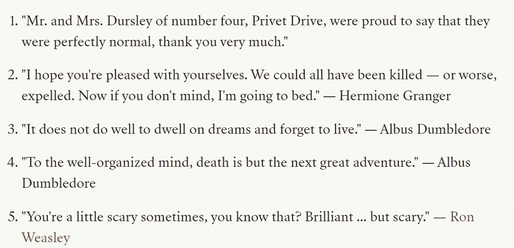
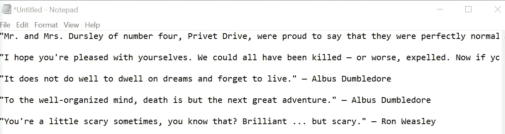
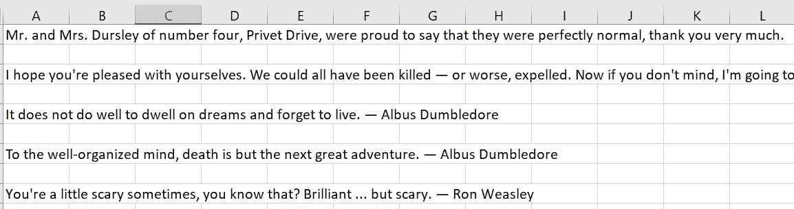
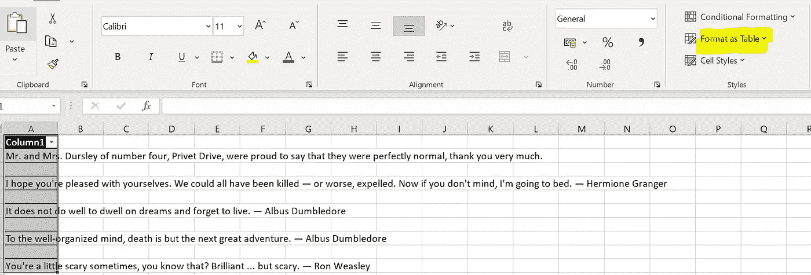
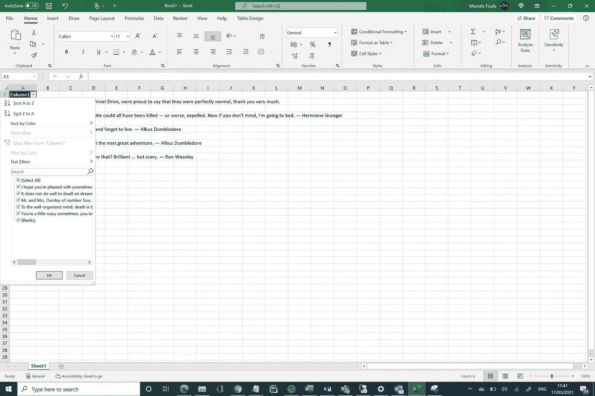
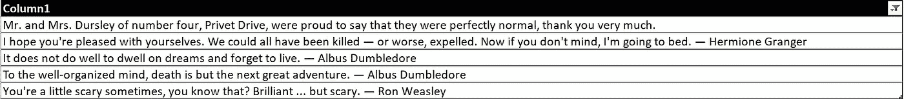
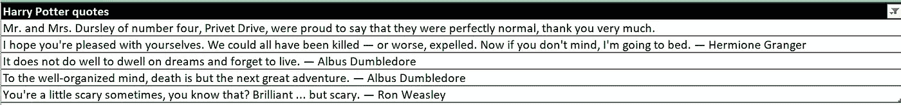

# 从文本到表格，老方法

> 原文：<https://towardsdatascience.com/from-text-to-table-the-old-school-way-d7f8ba41dac?source=collection_archive---------50----------------------->

在 [Unsplash](https://unsplash.com/photos/UcfKYTan-LU) 上对@fredmarriage 的积分。简单的方法还是困难的方法？小工厂还是大工厂？

## 利用 Excel 的强大功能从文本文件中获取表格

## 语境

例如， Y 你有写在 Windows *记事本*的文本文件中的数据。两行之间有一些额外的间隔。你通常可以从一个在线网站上复制/粘贴一些随机的行。

## 目标

您希望获得一个表格，其中每一行对应于文本文件中的一行。

## 怎么会？

1.  在 excel 中复制/粘贴整个文本文件
2.  格式化为表格
3.  过滤掉空白

就是这样！！

## 例子

假设您想将哈利波特的引用存储在一个表中，并希望以某种方式进行处理。

我们都爱的五句哈利波特语录！

我通常会将这些引用写在一个简单的文本文件中，如下所示。

我在一个文本文件里写了五段哈利波特的引言。

现在，在以后的某个时候，我决定把它们放在一张桌子上玩，并做一些数据科学。自然地，我可以将这种方法扩展到一千个报价，以便更加精确。但是让我们拿这五个一来证明我们的观点。

首先，如上图所示，我把我的哈利波特引语复制/粘贴到一个 Excel 表格上。

从 txt 文件复制/粘贴哈利波特语录到 Excel。

然后，我需要使用下面突出显示的“ **Format as Table** ”将我的工作表格式化为表格。

使用突出显示的图标格式化为表格。

最后，我需要过滤掉空白，去掉空行。

取消选择空白！

就这样，我们得到了我们想要的输出。

上述三个步骤的输出。

我可以将我的独特专栏的标题修改如下。

将我独特的专栏重新命名为我最喜欢的标题。

## 供选择的

对于已经向我指出这种“noob”Excel 方法的数据科学家来说，另一种 *Python* 方法可以定义如下:

1.  处理文本文件
2.  然后将其存储在*熊猫数据帧*中
3.  最后，将熊猫表保存为 csv/tsv 文件

但是嘿！尽管这种 *Python* 方法在概念上微不足道，但人们可以注意到它比“老派”Excel 方法要耗时得多。

另外，只要你能完成工作，谁在乎你是不是菜鸟！😉