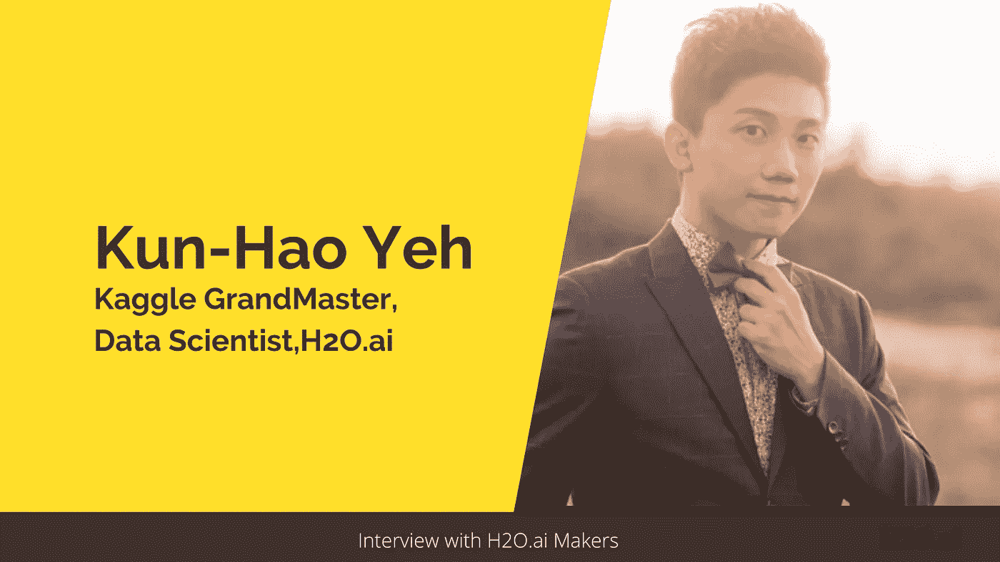
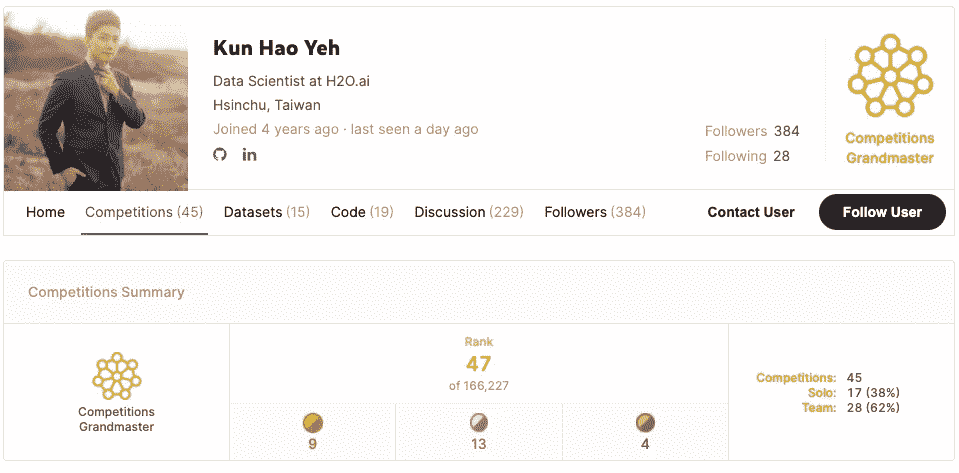
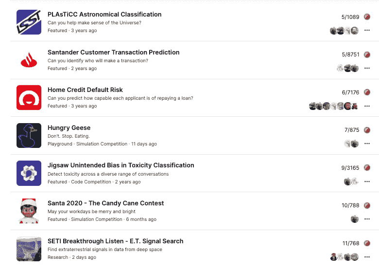
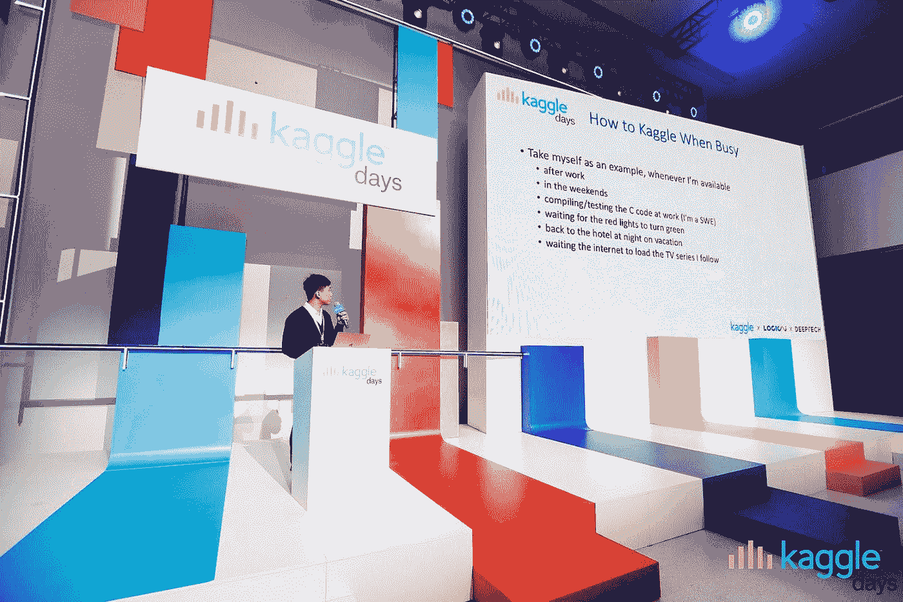
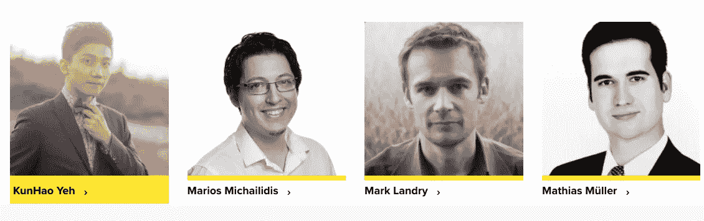
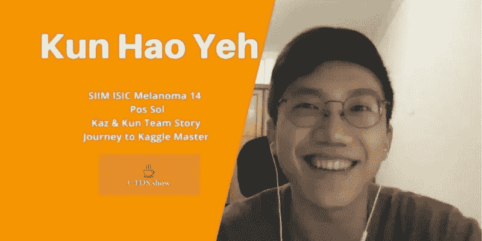
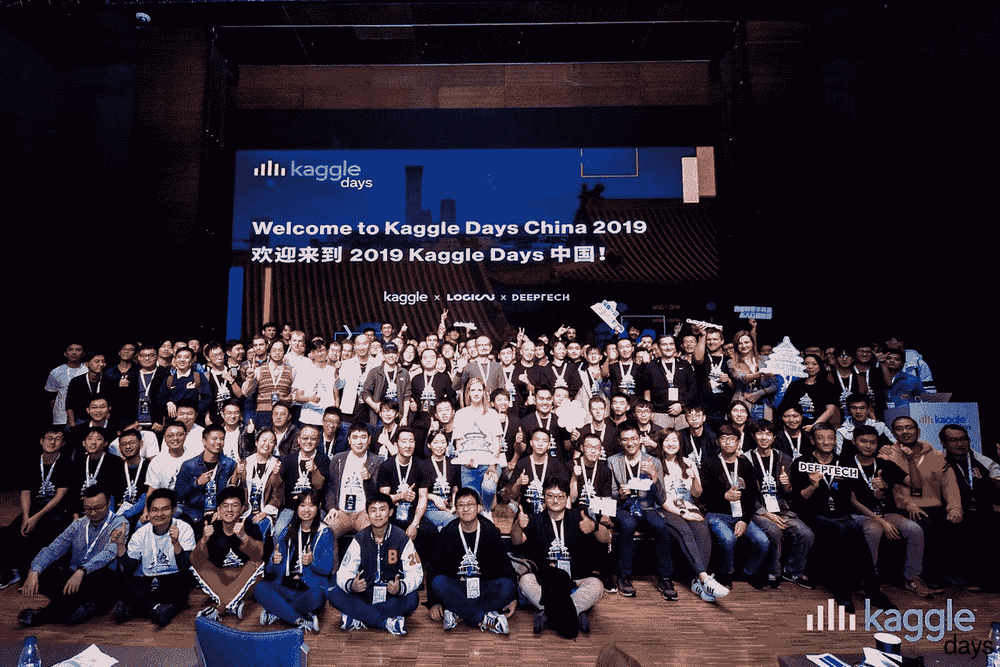

# 从围棋到卡格:台湾卡格大师的故事

> 原文：<https://towardsdatascience.com/from-the-game-of-go-to-kaggle-the-story-of-a-kaggle-grandmaster-from-taiwan-5adcd4fff38d?source=collection_archive---------17----------------------->

## 与郝坤·叶的对话:数据科学家和 Kaggle 大师

作者图片

> 在这一系列采访中，我在 [H2O.ai](https://www.h2o.ai/) 展示了一些知名数据科学家和 Kaggle 大师的故事，他们分享了自己的旅程、灵感和成就。这些采访旨在激励和鼓励那些想了解成为一名 Kaggle 特级大师的人。

最近有机会采访了**叶坤浩—** 一位 **Kaggle 竞赛的特级大师**和一位**数据科学家**at[H2O . ai](https://www.h2o.ai/)。坤浩拥有台湾国立交通大学的计算机科学硕士学位。他的重点是多臂土匪问题和应用于计算机游戏的强化学习，包括但不限于 2048 AI 和计算机围棋。他作为一名软件工程师开始了他的职业生涯，致力于为即将到来的 5G 市场竞争的最新 5G 芯片组产品。

*在这次采访中，我们将更多地了解他的学术背景、他对 Kaggle 的热情以及他作为数据科学家的工作。以下是我与郝坤对话的摘录:*

**您能告诉我们您的背景以及从电子工程到计算机科学，最终到数据科学的转变吗？**

***:****在攻读学士学位期间，我主修电子工程(EE)和计算机科学(EECS)。尽管我在电子工程方面成绩很好，也不擅长编程，但计算机科学(CS)似乎更有趣。从那以后，我在计算机科学上花了更多的时间，甚至攻读了计算机科学硕士学位。*

*在研究生院，我得到了一位教授吴亦琛(I-Chen Wu)的建议，他主要从事 RL(强化学习)算法在计算机游戏中的应用，如`Chess`、`Go`和`game 2048`。由于对`Go`和`AI`的浓厚兴趣，我找到了我的导师。事实上，我甚至梦想成为一名职业围棋手，但我的父母不让我走上他们的职业道路😃。人工智能在当时对我来说似乎很花哨，所以我想做用 AI 下围棋、打败职业选手的研究。我们的实验室叫做 **CGI** ( **电脑游戏智能**)实验室，甚至在电脑奥林匹克中拿了很多奖牌。我还参与了一个 2048 AI 项目，在不同的比赛中获得了几枚奖牌。*

*毕业后，我在联发科的第一份工作是 4G 和 5G 调制解调器芯片的软件工程师。尽管我在半导体行业工作，但我对机器学习的兴趣从未消退。意识到强化学习需要一段时间才能完全应用于行业，我开始强调监督学习。我报名参加了 Coursera 上的课程，包括吴恩达的— ***深度学习专业*** ，甚至还有马里奥斯的(H2O.ai 的 Kaggle GransMaster 研究员)— ***向顶级 ka ggler 学习，*** 以使我的基础正确。渐渐地，我开始参加很多 Kaggle 比赛。我的想法是向他人学习，同时运用我的知识解决现实世界的问题。*

*Kaggle 最初吸引你的是什么，你是什么时候赢得第一次胜利的？*

**

*[郝坤的 Kaggle 简介](https://www.kaggle.com/khyeh0719/competitions) |图片来自 Kaggle*

****坤浩* :** 我加入 Kaggle 并不是因为它有吸引力，而是因为我想通过在知名的数据科学平台上解决问题来证明自己。我的第一枚金牌是在[家庭信用违约风险竞赛](https://www.kaggle.com/c/home-credit-default-risk)中获得的，这是一项预测客户还款能力的竞赛。我的团队是一个庞大的团队，他们在非常不同的方面共同努力来提高我们的分数。*

*你在高尔夫比赛中一直表现出色。是什么让你有动力一次又一次地去竞争。*

**

*郝坤在 Kaggle 上的一些令人印象深刻的成绩*

****坤昊* :** 在 Kaggle 上赢了几次之后，我沉迷于做自己喜欢的事情的感觉。我很感激有这样一个平台，在这里我可以与世界各地的人和聪明的头脑联系，证明自己，并在比赛中学习新的东西，帮助更好地解决实际问题！*

***你在圣诞老人 2020 比赛中获得第十名，成为大师。在 RL 的背景让你在这场比赛中有优势吗？***

****Kun-Hao* :** 正如我之前提到的，在读研期间有一些 RL 的经验绝对让我在这样的竞争中有一些优势。*

***你和 Marios Michailidis 搭档，又名**[**KazAnova**](https://www.kaggle.com/kazanova)，**他那时已经是 KGM 了。你对与更有经验的卡格勒人合作有什么建议？***

*这是一个好主意，首先在一些竞争中证明自己，并尝试所有可能的解决方案。只有这样，与更有经验的卡格勒人合作才是明智的。此外，在你对比赛有了很好的了解后组队是有意义的，因为那时你可以向有经验的卡格勒人询问他们过去在类似比赛中的经验，建议，以及他们将如何处理这些问题。*

***您被邀请作为 2019 年 Kaggle Days China 的演讲嘉宾。你能分享一些你在那里的经历吗？***

**

*郝坤在 [Kaggle Days China](https://logicai.io/blog/kaggle-days-china/) 发表演讲|图片由坤昊提供(来自个人收藏)*

****坤豪*:**2019 年我作为嘉宾演讲嘉宾受邀参加 [Kaggle Days China](https://logicai.io/blog/kaggle-days-china/) 。这件事发生在加入 H2O.ai 之前，当时我是 Kaggle 高手，在联发科做软件工程师。在活动中，我遇到了 Marios Michailidis 和 Mikhail Trofimov，他们碰巧是我上过的 Coursera 课程的导师。坐在观众席上听他们的演讲是多么激动人心的时刻。我还见到了加博尔·法多尔、德米特里·拉尔科和后来成为我在 H2O 同事的雅亨·巴巴金，并与他们共进晚餐。*

***作为 H2O.ai 的数据科学家，你的角色是什么，你在哪些具体领域工作？***

**

*[郝坤在 H2O.ai](https://www.h2o.ai/company/team/) | [H2O.ai 网站](https://www.h2o.ai/company/team/)*

****Kun-Hao* :** 我在 H2O.ai 做一名竞技数据科学家，我还在学习如何扮演好这个角色。具有竞争力意味着:*

1.  *我需要不断提高自己的 ML 知识和解决问题的能力，我通过参加 Kaggle 或其他数据科学竞赛平台并取得好成绩来做到这一点。*
2.  *运用竞赛经验提高 H2O.ai 的产品竞争力。*
3.  *快速学习新事物，并在任何需要的地方提供帮助，这意味着我可以在需要时作为软件工程师或客户数据科学家工作。*

*目前，我的主要工作是 Kaggle 竞赛，开发 [H2O Wave 应用](https://www.h2o.ai/products/h2o-wave/)，并帮助 APAC 和中国地区的售前工作。*

***你通过 Kaggle 学到的最好的东西有哪些是你在 H2O.ai 的专业工作中应用到的？***

*

[郝坤·叶在 CTDS 讨论他的 SIIM ISIC 黑色素瘤 14 位解决方案。秀场](https://www.youtube.com/watch?v=XoHYqL_LlWs) |图片由 CTDS 秀场提供* 

****Kun-Hao* :** 我认为很重要并且主要从 Kaggle 那里学到的一些技能是:*

1.  *最先进的机器学习知识，*
2.  *如何应用它们解决实际问题，以及*
3.  *如何验证模型，以便对看不见的测试用例进行归纳。*

*这些技能帮助我从软件工程师转变为数据科学家，并在我的工作中发挥了重要作用。然而，我从 Kaggle 身上学到的最好的东西是快速理解问题**，寻找现有的解决方案，并自己实施更好的解决方案**，这是我几乎在我参加的每个比赛中都重复的方法。*

*例如，在参加由 Jigsaw 举办的 [*有毒评论分类比赛之前，我对 BERT 一无所知，也不知道如何使用它，也不知道它背后的想法。我试图从公共内核中学习，改进我的模型，并扩展我的知识，以在排行榜上获得一个好的最终位置(第 9 名)。*](https://www.kaggle.com/c/jigsaw-unintended-bias-in-toxicity-classification)*

> *在参加 Jigsaw 举办的[有毒评论分类大赛之前，我对 BERT 一无所知，也不知道如何使用它，更不知道它背后的想法。我试图从公共内核中学习，改进我的模型，并扩展我的知识，以在排行榜上获得一个好的最终位置(第 9 名)。](https://www.kaggle.com/c/jigsaw-unintended-bias-in-toxicity-classification)*

*在工作中，我和我的同事 [Shivam](/the-data-scientist-who-rules-the-data-science-for-good-competitions-on-kaggle-ab436595a29f) 一起开发了一个优化 Wave 应用程序。在做这个 app 之前，我对纯数值优化了解不多。然而，我们的客户要求这个功能。我们致力于优化应用程序，以扩展我们的[云产品](https://www.h2o.ai/hybrid-cloud/)的完整性。我研究了不同的现有框架，它们的局限性，它们解决问题的效果如何，并在 Wave 应用程序中创建了一个优化功能的集成版本。我之前对它没有深入的了解，但是当有这样的需求时，我把从 Kaggle 中学到的东西应用到问题中，包括但不限于机器学习相关的问题。*

*任何喜欢的 ML 资源(MOOCS、博客等)..)您愿意与社区分享吗？*

****Kun-Hao* :** 对于基本面，我建议上 Coursera 的在线课程。在准备好所有的基础知识后，我建议投入到比赛中，搜索相关的论文和博客文章。每一篇论文/博客/想法，只要在实际场景(比如竞赛)中起作用/有帮助，都是很好的资源！*

***对刚刚开始或希望开始数据科学之旅的数据科学有志者有什么建议吗？***

**

*图片由坤昊提供|来自个人收藏*

****Kun-Hao* :** 我想分享一下我在 Kaggle Days China 上分享的建议。*

1.  ***从小处着手**:定义你的小成功*
2.  *胸怀大志:定义你自己的伟大目标*
3.  ***不断奋斗**:努力工作，享受任何微小的成功，不自觉地沉迷于过程。*

> *我从 Kaggle 学到的最好的东西是快速理解问题，寻找现有的解决方案，并自己实施更好的解决方案，这是我几乎在我参加的每个比赛中重复的方法。*

# *外卖食品*

*坤昊的卡格尔之旅是非凡的，这次采访是了解他背后的努力工作的一个很好的方式。他的口号是从每场比赛中学习一些东西，这是鼓舞人心的，他最近的成功清楚地表明了他对自己技术的掌握。*

# *阅读本系列的其他采访:*

*   *[*Rohan Rao:数据科学家从数独到 Kaggle*](/a-data-scientists-journey-from-sudoku-to-kaggle-120876b7fa33) 的旅程*
*   *[*希瓦姆·班萨尔:数据科学家，负责 Kaggle 上的“数据科学为善”竞赛。*](/the-data-scientist-who-rules-the-data-science-for-good-competitions-on-kaggle-ab436595a29f)*
*   *[*认识 Yauhen:第一位也是唯一一位来自白俄罗斯的 Kaggle 特级大师。*](/meet-yauhen-the-first-and-the-only-kaggle-grandmaster-from-belarus-ee6ae3c86c65)*
*   *[*苏达莱·拉杰库马尔:对数字的热情是如何将这位机械工程师变成了卡格尔大师*](/how-a-passion-for-numbers-turned-this-mechanical-engineer-into-a-kaggle-grandmaster-8b1ae218afc) *。**
*   *[*加博·福多尔:卡格尔世界“白鲸”的励志之旅🐋*](/the-inspiring-journey-of-the-beluga-of-kaggle-world-5409e740a21b?sk=a500e2014feb175eae520931ff43b419)*
*   *[*学习他人对 Kaggle 的成功是必不可少的，本说土耳其宗师*](/learning-from-others-is-imperative-to-success-on-kaggle-says-this-turkish-grandmaster-d8b5bf28ac87?sk=940c646515035c18aca050bab1469364) *。**
*   *[*在 Kaggle*](/meet-the-data-scientist-who-just-cannot-stop-winning-on-kaggle-dfc0e6fe88f8?sk=bd58ca871ab26ab13917b338020c4a0c) *上遇见就是不能停止胜利的数据科学家。**
*   *[*如何成为 Kaggle 上的世界第一*](/what-it-takes-to-become-a-world-no-1-on-kaggle-f149df44e98c?sk=63dd3a58d40dbe1df9fb7cd72ea4ede6) *。**
*   *[*赢得一场 Kaggle 比赛需要什么？让我们听听获胜者本人*](/what-does-it-take-to-win-a-kaggle-competition-lets-hear-it-from-the-winner-himself-1d292a9f5b2d?sk=4125c06bbc74230d60c748021345575e) *。**