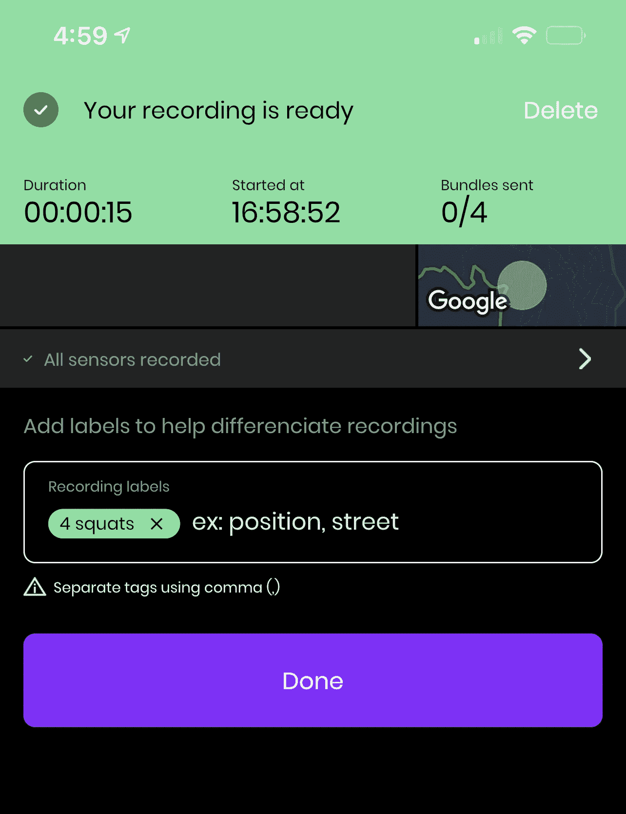
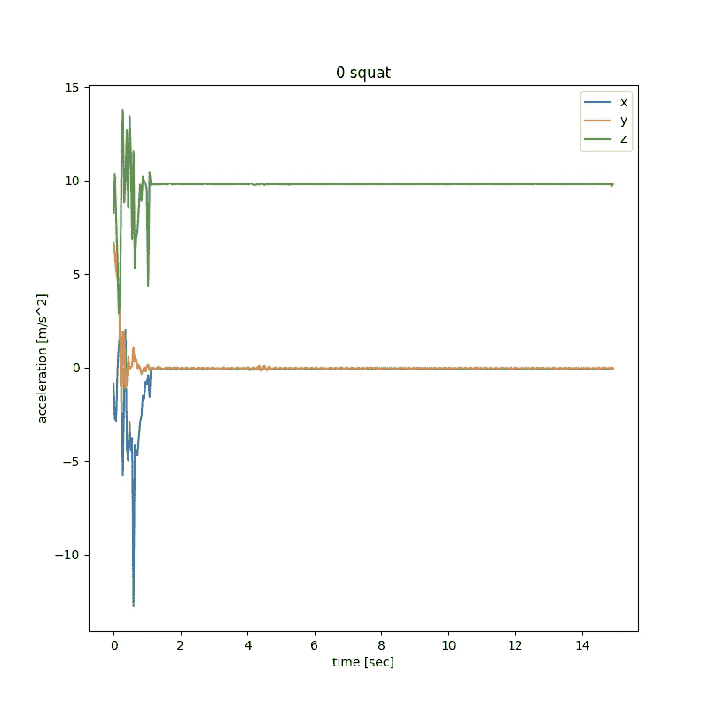
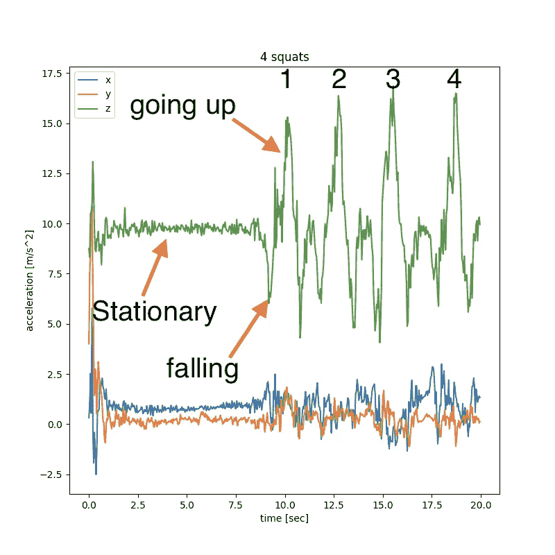
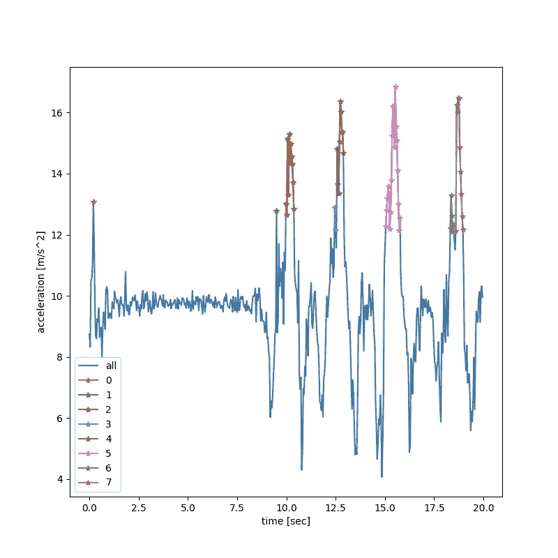
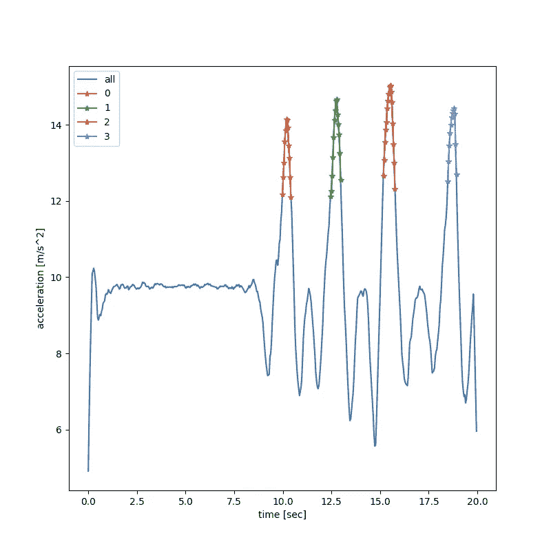

# 从健身房到 Jupyter 笔记本——在一天内构建一个蹲起计数器应用程序

> 原文：<https://towardsdatascience.com/from-the-gym-to-a-jupyter-notebook-building-a-squats-counter-app-in-a-day-955ecfbf8d12?source=collection_archive---------35----------------------->

用数据捕捉现实世界中的物理现象，这是一件特别令人满意的事情。作为一名机器学习顾问，我已经习惯了与医疗数据、图像等打交道。但是，当你在屏幕上看到的数据捕捉到移动、位置等信息时，这一切都变得令人耳目一新。因此，当[月亮感知](https://www.moonsense.io/)的创始人 [Andrei](https://www.linkedin.com/in/sandrei) 向我挑战，要我在一天内开发一个应用程序，它可以获取我手机的加速度计数据，并利用它做一些很酷的事情时，我非常兴奋。

因此，我开始在一个开发日内构建一个蹲下计数应用程序。

# 获取数据

在我们过度思考如何量化深蹲的数量和质量之前，先看看一些实时数据是个好主意。Moonsense 可以轻松地将数据从我的 iphone 上传到他们的云存储解决方案，再下载到我的笔记本电脑。这个过程相当轻松:你只需下载一个[记录器应用](https://www.moonsense.io/recorder)，点击记录按钮，将手机的加速度、陀螺仪和地理信息同步到云端，之后你可以下载到笔记本电脑上。

所以我继续前进，把我的手机拿在手里，开始泵一些铁。这是我把手机放在口袋里做的。


好吧，我跟你说实话。这不是我。图片来源:Adobe Stock Photo 授权。

每次我做一系列深蹲重复动作时，我会点击记录按钮，输入一个自由文本标签，比如“4 次深蹲”。



如果没有必须的低电量电池，这不会是一个好的屏幕截图

就是这样。现在让我们看看如何使用我们的 Moonsense API 键来检索数据。

这个脚本迭代我记录的所有会话，并打印出每个会话的熊猫数据帧和加速度

因此，打印加速度数据帧会得到这样的输出

```
timestamp         x         y          z
0    1620847740629 -0.471039  5.075854   9.129929
1    1620847804060  3.401349  4.373932  10.150064
..             ...       ...       ...        ...
```

有道理。我们看到手机在三个方向上感受到的加速度，x，y 和 z 方向肯定与手机的方向有关。

# 分析我们的第一批录音

让我们把数据画出来，看看它是否更容易理解。

让我们看看它生成的图表。让我们先来看一个会话，在这个会话中，我将设备静止放在我的桌子上:



哼！如果你以前没有处理过加速度计数据，你可能会认为数据几乎为零，但我们看到 z 轴上有一个很大的值。这个数值接近 9.81 米/秒——地球引力。所以我们现在明白了，设备只有在自由落体的时候才会吐出全 0。如果有什么东西顶住了重力，它会报告它是一个向上的力(我们将继续把所有作用在设备上的力称为“加速度”，尽管这肯定是一个误称)。

如果以任意角度拿着手机(例如，系在我的手臂上)，这种重力不会整齐地沿着 z 轴排列，而是分散在不同的 x、y、z 轴上。更糟糕的是，如果手机在运动过程中旋转，这种重力测量将以不同的方式在 x，y，z 方向之间泄漏——使我们的数据视图变得复杂。

好了，现在让我们来看一个真正的深蹲训练，让事情变得简单一些。让我们双手握住手机与地面平行，抽出 4 个深蹲。



当我们深蹲着看录像时，我们看到:

1.  每个深蹲似乎由两座小山组成。一个离 9.81 m/sec 的重力值不远的小的，一个很高的，在那里手机感觉到非常强的向上的推力。
2.  在两座山之间，我们看到 z 轴上的加速度下降，下降到大约 5-6 米/秒的最小值

下面这个故事解释了我们所看到的现象:

1.  在我们开始蹲下之前，什么也没有发生，手机准确地感受到了我们阻止它下落的力——9.81 米/秒。
2.  因为手机并不完全平行于地面，这个力会沿着不止一个轴分解——一部分 9.81 指向 z 轴，一部分指向 y 轴，等等。如果我的手是真正水平的，我们会在 Z 方向看到精确的 9.81，而在其他方向什么也看不到。
3.  当我们蹲下时，该设备几乎是自由落体——因此它感受到的力从 9.81 减小。观测值与 9.81 的差值，大致就是我们的向下加速度。
4.  最后，当我们深蹲到底时，我们施加了很大的向上的力——足以克服重力并突然改变手机的运动方向。太多了！因此，我们确实看到手机报道的测量值直线上升。

好的，那么我们从这个分析中得到什么呢？

1.  尽管手机的整体运动基本上是在一个上下运动的维度上，但它不固定的方向让我们的生活有点困难，因为我们需要弄清楚“下”的整体方向是什么。
2.  虽然我们看到的整体运动相当复杂，但简单地计算大峰的数量似乎就等于我们记录的蹲下次数。

# 计数峰值

在上图中，我手动覆盖了一个大的 1，2，3，4 数字来计算深蹲的重复次数。我们现在的目标是在代码中复制让我做这个计算的逻辑。所以我们来试着分解一下。我们在找什么？

1.  明显高于重力的加速度峰值(因此 12+米/秒可能是一个很好的阈值)。
2.  当然，一旦我们达到峰值加速度，我们将得到许多超过 12 的重复测量，所以我们希望将它们聚集成连续的段。超过 12 的连续测量值显然属于同一个深蹲重复，不应该重复计算。
3.  为了简单起见，我们只看 Z 轴，假设这是整个运动方向。听说过[主成分分析](/introduction-to-principle-component-analysis-d705d27b88b6)的人可能已经知道，如果手机的方向是其他固定的方向，我们有一种方法来计算出运动的实际方向。但不管怎样，这是以后的事了。

所以这是一种天真的方法，但是让我们看看它会带给我们什么，一旦我们看到它是如何失败的，我们就改进它。

让我们来看看它生成的图表:



好吧！我们真的快到了。首先出现的是，我们已经确定了我们希望在这里看到的 4 个真正的峰值。但是我们也有一些错误的峰值——比如在 0.5 秒标记处的瞬时峰值(你可以在那里看到一个单独的橙色标记)。或者类似地，在我们第一个真正的红色峰值之前有一个绿色标记。显然，我们需要以某种方式拒绝非常小的异常值观察。也许我们可以抛弃所有只损失了很短持续时间的片段。但是这就足够了吗？

```
for start_loc,end_loc in zip(segment_starts, segment_ends):
    print(t[end_loc] - t[start_loc])0.03999999999999998
0.03999999999999915
**0.43900000000000006**
0.08000000000000007
**0.359
0.7590000000000003**
**0.19900000000000162 * note: this corresponds to the gray segment**
**0.3990000000000009**
```

很接近，但没有雪茄。如果我们拒绝非常短的峰，我们将消除 3 个假阳性，但从我们的图中可以看到，我们的最后一个峰意外地分裂成 2 个灰色和芥末色的亚段。如果我们仅仅依赖于段时间长度，我们的代码将会非常脆弱。基本上，在我们的高加速度阈值以下的单个瞬间下降总是可以将我们的部分分成 2 部分。

所以让我们做最后一次尝试来改进它。让我们对信号进行预处理，使其对像这样的瞬间失误具有鲁棒性。

# 平滑曲线

我的本科专业是物理和电子工程，所以我认为我不得不承认，这一部分最终只是一个[低通滤波器](https://en.wikipedia.org/wiki/Low-pass_filter#:~:text=A%20low%2Dpass%20filter%20is,depends%20on%20the%20filter%20design.)的应用，旨在抑制我们信号的[高频成分。](https://en.wikipedia.org/wiki/Fourier_analysis)

但你不需要了解数字信号处理的第一件事，就能明白我们在做什么。我们不喜欢我们的信号有这些小的噪声起伏，容易产生低于阈值的假峰值和假谷值。如果我们平滑我们的信号，只让持续的高测量值通过我们的阈值，我们会在一个更好的地方。这可以简单到每 N 次连续测量取平均值。我们可以尝试加入其他低通滤波器，看看结果是否会有所改善，一般认为低通滤波器会尝试不同的加权来平均相邻的测量值。我们要保持这个超级简单:用周围 N 个测量值的平均值代替每个测量值。

## 平均信号

看着我上面展示的照片，看起来一个真实的片段通常持续大约 0.4 秒，这是我个人蹲着的经验。每隔 0.04 秒就有一个样本出现，这意味着查看大约 10 个相邻的样本，就可以大致知道我们想要一起计算多少个测量值的平均值。如果您想知道我是如何知道每 0.04 秒就有一个样本出现的，这很简单:

```
import numpy as np
print(np.diff(t))
[0.04  0.041 0.039 0.04  0.04  0.04  0.04  0.039 0.041 0.039 0.04  0.04....]
# cool: our data is coming in at almost exactly even time spacing, every 0.04 seconds. If it was less consistent, we'd be interpolating to a fixed time window. But we can get away with just pretending the time spacing is even
```

那么我们如何平均每 10 个样本呢？我们可以写一个 for 循环来完成这个任务。但它的计算效率更高，完全等同于用 10 个采样值为 1/10 的滤波器对信号进行卷积。代码如下:

如果你不熟悉卷积的概念，这看起来有点像胡言乱语，没关系。在谷歌上搜索“我如何用 python 计算滚动平均值”会让你看到我写的代码。我还是要说，如果你要处理一维信号，了解卷积如何工作以及什么是滤波器是进一步阅读的好主意。那么输出是什么样的呢？让我们在过滤加速度数据帧后重新运行代码



嘿，很快，成功了！

很棒的东西！我们捕捉到了这个会话的所有 4 个蹲坐，这次没有假阳性。

# 0.1 版完成。下一步是什么？

好吧，我们一起黑了一个超级简单的第一版。本帖不再做更多开发。但在我们结束之前，我想强调下一步该怎么做才能让它成为一款强大的应用:

## 如果你不衡量自己，你就无法提高

到目前为止，我们一直在疯狂地研究，以使结果适用于指导我们的一组特定的小例子。到目前为止，我已经有了一堆关于如何进一步改善结果、使代码对任意的手机方向保持健壮等等的想法。

但是我在开发周期中要做的第一件事不会是修改我们的蹲式计数器的代码。现在我们有了第一个工作版本，要做的事情是计算我们做得有多好，并确保我们所做的后续代码更改使这个数字朝着正确的方向移动。

幸运的是，我们的问题被很好地定义了，所以我们可以衡量自己！对于我做的每一次录音，我都认真地记下了深蹲的次数。当我们从 Moonsense 获取会话数据时，这个标签是可用的。因此，在下一章中，我们将添加一段代码来捕获我们的平均误差，然后开始进行更改，以降低我们的误差指标。

我们也将尝试看看我们是否能解决量化蹲姿质量水平的想法——也许用“一致性”来定义质量。或者可以提取一些描述性的统计数据，比如峰值加速度，然后看看这些数字如何与基于同一时段视频的专家对下蹲质量的评估相匹配。我们甚至可以为每一次会议贴上下蹲质量专家评估的标签，并训练一个机器学习模型，根据我们提取的数字特征预测专家评估。这将使我们的应用成为一个潜在的有趣和有用的产品。

## 关闭循环，使之成为一个活生生的应用程序

Moonsense 有一个简洁的小特性，叫做[“数据消费者”](https://github.com/moonsense/python-sdk/blob/main/consumer_example.py)，在这里你可以定义一个函数来处理新数据，只要它变得可用。这允许近乎实时的行为，比如当用户做了蹲起动作时，就向用户发送推送通知。一旦我们有了一个像样的下蹲质量评估器，我们就可以立即给用户反馈他们的下蹲做得如何。

你可以在[这个回购](https://github.com/moonsense/squats-counter-example)中找到完整的代码示例