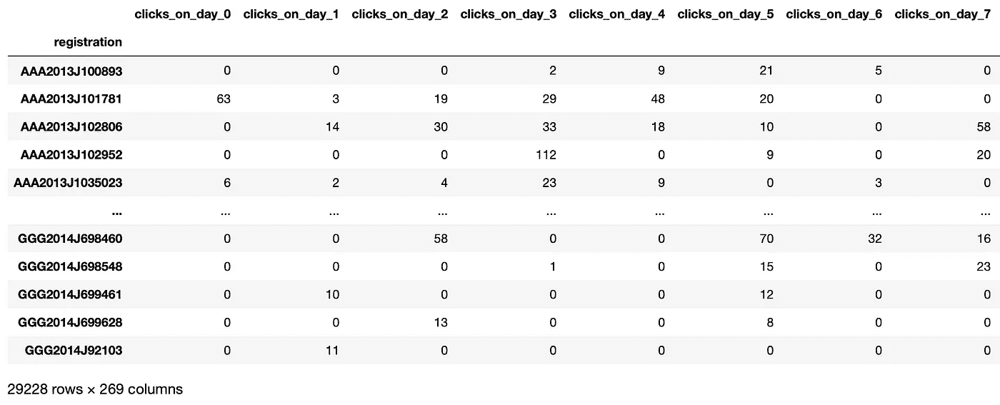
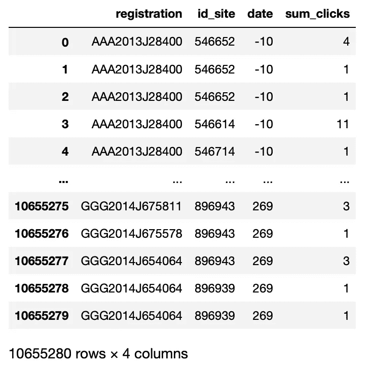
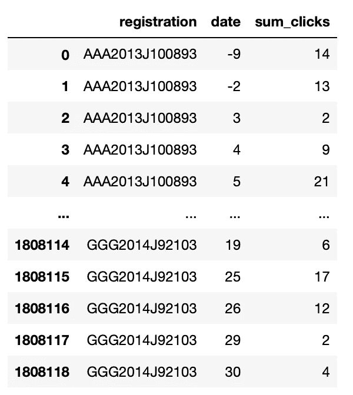
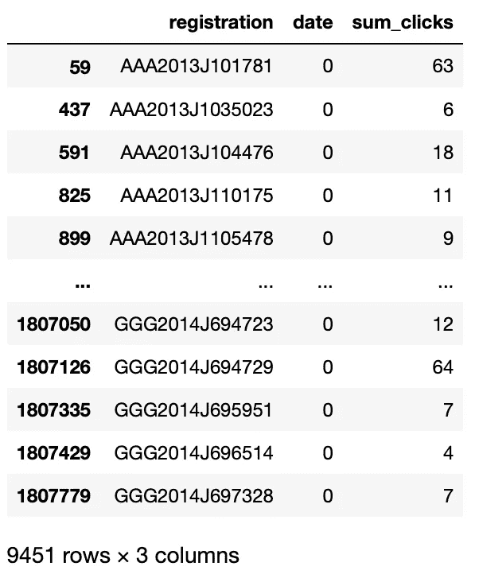
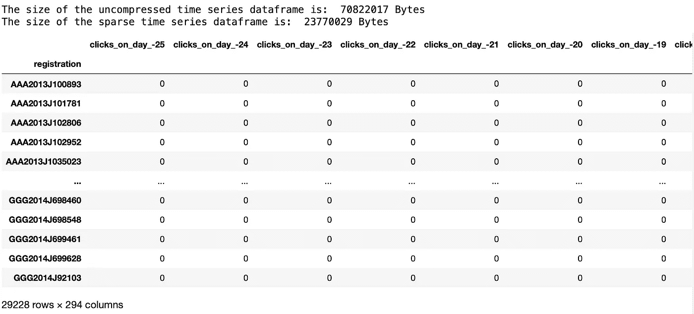

# 用熊猫魔法从跟踪数据到时间序列

> 原文：<https://towardsdatascience.com/from-trace-data-to-time-series-with-panda-magic-8efe0fa4ea82?source=collection_archive---------23----------------------->


伊洛娜·弗罗利希在 [Unsplash](https://unsplash.com?utm_source=medium&utm_medium=referral) 上的照片

本文将指导您使用强大的 Pandas 将数百万行跟踪数据快速转换成宽格式的时间序列表。

# 数据

在这次演示中，我将使用来自开放大学的 [OULAD 数据集](https://analyse.kmi.open.ac.uk/open_dataset)。完整的数据集，以及一个可爱的数据描述，可在上面的链接。这是一个关于在线课程中虚拟学习环境下学生活动的数据集。它涵盖了 7 个模块中每一个模块的 2 年和 4 个队列。

我以前写过这个数据集，因为它是我的最爱之一。你可以在我的文章[中阅读我以前的一些工作，使用这些数据建立预测模型，通过学生如何与他们的学习环境互动来预测学生的成绩](/predicting-student-outcomes-by-how-they-interact-with-their-learning-environment-41b84e46c839)。

今天，我们将探索压缩集合中的 student_vle.csv 文件。该文件包含学生与学习环境中可访问的在线活动交互的跟踪数据。每行代表学生完成的一项活动，包括他们在该活动中的点击次数。

# 目标

在我之前对这个数据集的研究中，我使用这些跟踪数据的集合来预测学生是否能通过这门课。我使用学生点击的总次数。

但是现在我每天都用学生的行为来做我的预测。这意味着使用时间序列数据来描述学生的参与度如何随着时间的推移而变化。对于本文，我将只记录学生每天点击的次数，尽管对于我的实际模型，我使用了更多的变量，并将课程每天的多个列作为输入变量。

因为我想要每个学生的时间序列数据，所以我将从个人活动交互观察中创建一个宽格式的时间序列表。每一行将是给定课程的给定群组中的单个学生。每一列都描述了当天学生在学习环境中点击活动的次数。

这些日期与该群组的开始日期相关。一些学生在课程开始前 25 天就开始工作，课程长达 270 天。因此，我们的最终表将有 295 列。

这是我们想要的样子:



作者图片

# 流程概述

第一次尝试将数据从跟踪日志转换到宽形式的时间序列表时，我尝试使用嵌套的 for 循环来读取跟踪日志中的每个条目，并将其放在新表上的正确位置。**不要这样。**我用一个计数器观察了一下这个过程，并做了一些快速计算。对于略多于 1000 万行的跟踪数据，这将花费我超过 5 天的运行时间来完成。有一种说法是，“如果你对熊猫使用嵌套的 for 循环，可能有更好的方法。”

相反，我使用布尔掩码来创建 Pandas 文档中所谓的“视图”，或者在不破坏原始数据的情况下过滤数据。为此，我分别过滤了每天的数据，并将该视图的结果按照时间顺序合并到一个新的 dataframe 中。

# 流程细节

跟踪数据启动了一个活动交互列表，其中包含描述活动、模块、群组、学生和点击次数的变量。我将模块、群组和学生合并到一个“注册”栏中，以便于索引。



作者图片

如您所见，每个学生每天都有多个条目，甚至每个活动都有多个条目，因为每个条目都是与单个活动的单个交互。学生似乎经常在同一天多次参与同一个活动。我们需要做的第一件事，为了获得每天点击的数据，是对数据进行分组。要了解更多关于如何使用 Pandas Groupby 函数的信息，你可以阅读我的关于主题的文章[。](/pandas-groupby-love-5b3bce19c35e)

我们可以使用以下代码按学生和日期对该表进行分组:

## 按学生和日期分组

```
def group_by_day(student_vle): #group by registration and day
   vle_group = student_vle.groupby(by = [‘registration’, ‘date’]) #sum up the clicks for each day for each student
   sum_clicks = vle_group.sum().reset_index()
   sum_clicks = sum_clicks.drop(columns=['id_site']) #sort by student and day
   sum_clicks = sum_clicks.sort_values(by=[‘registration’,’date’]) return sum_clicks
```

函数`group_by_day()`使用`df.groupby()` Pandas 方法按学生和日期对数据进行分组，并使用`df.sum()`聚合方法生成一个新的数据框架，其中汇总了每个学生每天的点击量。

我还做了一个完全不必要的排序，因为看到按学生和日期排序的数据很好，可以对它有一个简要的了解，但这对于接下来的步骤是完全不需要的。如果您正在处理一个更大的数据集，或者将代码投入生产，一定要跳过这一步。

此代码返回下表:



作者图片

我们现在每个学生每天只有一个条目。他们每项活动的点击数总和被加在一起，以表示他们全天的点击数总和，而不是每项活动交互实例的点击数总和。

由于我需要秩序，条目是按学生和日期组织的。我认为在模块的日子里看到每个学生的工作流程是很好的。

现在，我们可以开始一天一天地分割这张表，然后用下面的代码将这些部分并排放在一起:

## 过滤并合并

```
def create_time_series(sum_clicks): #Create a new dataframe to hold our timeseries data.
   time_series = pd.DataFrame() #Create one row for each student registration
   time_series['registration'] = sum_clicks['registration'].unique() start_date = sum_clicks['date'].min()
   end_date = sum_clicks['date'].max()
   date_range = range(start_date, end_date) counter = len(date_range) #Iterate through the days of the course: for date in date_range: #create a views of the data, one day at a time. single_date_df = sum_clicks[sum_clicks['date'] == date]
      single_date_df = single_date_df.drop(columns=['date']) #rename columns to describe date and data.
      new_cols = ['registration'] +   [f'clicks_on_day_{date}'] single_date_df.columns = new_cols #merge into the time series dataframe. time_series = time_series.merge(single_date_df,
                                      how='left',
                                      on='registration',
                                      validate = '1:m') print('Days remaining to be processed: ', counter)
      clear_output(wait=True)
      counter -= 1 #Missing data represents no clicks that day, so fill with 0. time_series = time_series.fillna(0) time_series = time_series.set_index('registration', drop=True) return time_series
```

## 过滤器

上面的函数遍历模块中的每一天，并使用一个布尔数组(Trues 和 Falses 数组)来过滤当天的数据。它检查每一行的“date”变量，并只返回其日期与该迭代的当前日期相匹配的行。

例如:

`sum_clicks['date'] == 0`将返回一个与 sum_clicks 长度相同的序列，但是为数据变量为‘0’的每一行填充 True，为其余的行填充 False。

`sum_clicks[sum_clicks['date'] == 0]`将只返回布尔数组包含 True 的行的视图。

当我们将上述过滤器应用于 sum_clicks 表时，我们得到:



作者图片

请注意，我们只有每个学生在课程第 0 天或第一天的点击量总和。你可能还会意识到，大多数学生可能不会每天都在虚拟学习环境中学习。因此每个每日视图不会包含每个学生。下一步中的左连接将有助于解决这个问题。

上述函数的下一部分将每天的视图合并到一个我们已经准备好的 dataframe 上，该 data frame 为每个学生注册记录一行，但没有数据。

## 合并

```
time_series = time_series.merge(single_date_df,
                                how=’left’,
                                on=’registration’,
                                validate = ‘1:m’)
```

`df.merge()`是将一个数据帧合并到另一个数据帧的一种方法。这相当于在 SQL 中加入表的另一种数据管理工具。这种方法的神奇之处在于合并。我准备了名为“time_series”的空数据帧，专门用来按时间顺序连接这些视图。该数据帧有一个名为“注册”的列，表示数据中存在的唯一注册。每个学生注册一排，不多不少。这很重要。

当我在 for 循环中合并每个每日视图时，我使用“registration”作为键。这确保了正确的数据进入正确的行，即使这些行在“时间序列”和我们正在合并的每日视图中的顺序不同。当我们像这样转换数据时，我们还需要考虑我们的数据完整性。用键合并是确保行之间的值不会混淆的最好方法。

`how='left'`告诉 Pandas 保留左侧数据帧的记录，在本例中为“时间序列”。不要丢弃任何一个，不要添加任何一个，不要重新排列它们。只需获取正确数据帧中的行，在本例中为“single_date_df”，并附加匹配的行。放弃任何不喜欢的。我们希望确保每天每个注册都有一条记录。

告诉 Pandas 使用该列作为键来匹配每个数据帧的行。否则它不知道 single_date_df 数据帧中的哪些行在合并时去了哪里！最后，`validate='m:1'`的意思是‘多对一’。这告诉 Pandas 检查每天的正确数据帧中是否只有一个值。还有一种方法可以确保我们的数据不会被弄乱。如果右边的数据帧“single_day_df”中没有与左边“time_series”中的注册相匹配的记录，Pandas 将用 np.nan 或“无数据”填充该值。

一旦这个循环结束，dataframe 将有每个学生每天的所有点击计数，按时间顺序从左到右排列。在某一天没有发现学生点击的任何地方都将有一个名词性名词。我们将使用`time_series = time_series.fillna(0)`将这些名词性名词替换为零。毕竟那个 np.nan 真正的意思就是:那个学生那天什么都没点。

我还将“注册”设置为索引，因为 Pandas 让我可以快速完成，这就是那个列的内容，学生注册的索引。我之前没有这样做，因为它稍微简化了合并语法，将它作为自己的列。

这是我们的决赛桌。很稀疏。



作者图片

# 奖励:稀疏化！

就因为我爱你们大家，我想再给你们看一个魔术。我们上面创建的时间序列数据帧大部分都是零。这在商业中被称为“稀疏数据框架”。这一个只是有点稀疏，但是我们可能使用的其他数据帧都充满了零。如果我们像这样保存它们，单独记录每个零会浪费很多空间。再一次，熊猫来救援了！

我们可以压缩数据帧，方法是从本质上删除零，同时跟踪它们的位置:

`sparse_time_series = time_series.astype(pd.SparseDtype('int', 0))`

上述代码通过删除零，将时间序列数据帧压缩了大约 1/3。在代码的`(pd.SparseDtype('int', 0)`部分，我们告诉 Pandas，产生的稀疏数据帧将具有‘int’或 integer 类型的值，并且零是我们想要压缩的。

在其他应用程序中，尤其是自然语言处理，使用这种方法可以将数据压缩到原来的许多倍。

# 摘要

您了解了如何将跟踪数据记录(可能是用户交互、物联网 pings 或任何定期返回值的东西)转换为按选定时间段(在本例中是按天)聚合的广泛形式的时间序列数据帧。您了解了如何使用`df.groupby`聚合数据，将布尔掩码传递给数据帧，比如用`df[df['date'] == 0]]`在一列中创建您想要的数据的视图，以及用`df.merge()`迭代地将每个时间段的数据附加到前一个时间段，以创建宽格式的时间序列数据帧。

另外，您还学习了一种压缩方法，可以更有效地描述稀疏数据帧。当您想要使用非常大、非常稀疏的数据集进行建模时，这变得非常重要。许多标准的机器学习工具可以有效地处理稀疏数据帧。

在上面的例子中，这些策略将处理时间从 5 天减少到 1 到 2 分钟，这取决于你的机器。

# 完整代码:

下面是 Github 的完整代码要点，它将下载、解压缩和转换这个特定的数据集。请随意复制它，并将其用作您自己项目的模板。

# 参考资料:

Kuzilek J .、Hlosta M .、Zdrahal Z. [开放大学学习分析数据集](https://www.nature.com/articles/sdata2017171) Sci。数据 4:170171 doi:10.1038/sdata . 2017.171(2017)。