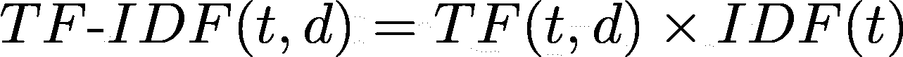
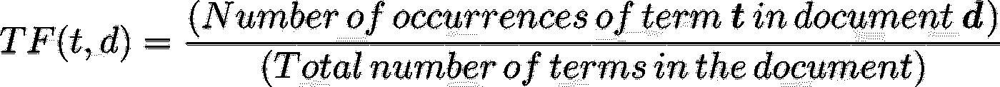
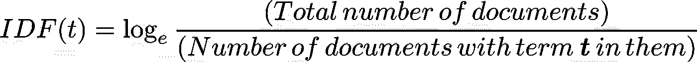
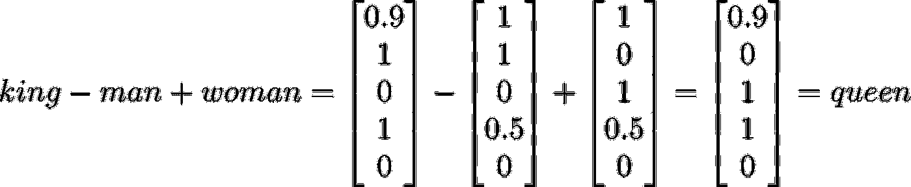

# 从单词到向量

> 原文：<https://towardsdatascience.com/from-words-to-vectors-e24f0977193e?source=collection_archive---------7----------------------->

## 自然语言处理中文本表示的直观介绍


格伦·卡丽在 [Unsplash](https://unsplash.com?utm_source=medium&utm_medium=referral) 拍摄的照片

你可能会使用数据来建立机器学习模型，以解决特定的任务，如预测客户是否会流失或估计股票价格。在所有这些例子中，数据通常包含**数字特征**，如果任何特征以文本格式表示(例如**分类特征**，则应用各种编码技术将其转换为数字，因为机器学习算法被设计为仅与数字一起工作。在这里，我们实际上遇到了将单词转换成数字的基本尝试，但是在这种情况下，我们的目的仅仅是捕获关于**文本** **特征的信息，**而不是**文本**本身。这对于上面提到的任务来说当然是完全没问题的，在这些任务中，目标不是理解单词，而是捕捉这些单词所包含的知识。

另一方面，像确定客户评论的情绪或预测不完整句子中的下一个单词这样的任务需要某种形式的理解给定文本中的单词。毕竟，当我们试图手动解决这些任务时，这就是我们所做的，但是我们如何教会计算机为我们做这些呢？这就是自然语言处理(NLP)，人工智能(AI)的一个分支，在其他涉及分析和理解人类语言的任务中所关注的。然而，在自然语言处理的核心，存在着一个基本的挑战:文本表示。换句话说，我们如何将给定的文本转换成 NLP 算法可以处理并用来解决现实世界任务的数字形式？在本文中，我将概述一些基本的和高级的方法来应对这个基本的挑战。

# 基本方法

**基本编号**

现在，解决这个问题的最基本和最简单的方法是什么？当你思考的时候，让我建议一个。只需给字典中的每个单词分配一个唯一的数字，然后就可以收工了！

```
word    | number
_________________
a       |  1
able    |  2
       ...
book    |  325
       ...
paper   |  1024
       ...
zoology |  5067
       ...
```

这是一个很好且简单的表示，但是它有一个主要的缺点。除了这些数字没有捕捉到单词的任何含义之外，另一方面，它们给单词强加了一种隐含的和不必要的语义排序。事实上，没有任何理由让*论文*的编号大于*图书*的编号，而小于*动物学的编号。* ML 算法对数据分布非常敏感，这种表示可能会误导算法认为*论文*在某种程度上是比*书*更好(或更差)的候选。看来我们的第一次尝试悲惨地失败了。下一步是什么？

**字符编码**

在我们的第一次尝试中，我们给单词分配了任意的数字，也许这就是问题所在。也许我们应该在如何选择这些数字上变得聪明一点，并开始考虑与单词有某种联系的数字。事实上，这里可能想到的一个直接想法是[字符编码](https://en.wikipedia.org/wiki/Character_(computing))。单词是由字符组成的，并且在单词和它在计算机中的字符编码表示之间已经存在一对一的映射。那么，如果我们将每个单词映射到代表其 ASCII 或 Unicode 编码的数字，而不是任意数字，会怎么样呢？啊哈！起初听起来非常简单有趣，但是如果你仔细观察，你会发现这只是告诉你单词*是什么，*不是单词*的意思。*换句话说(没有双关的意思)，97 112 112 108 101 可能是字符序列的编码 *a p p l e (* 的确如此)，然而，它远不是单词 *apple* 的有意义的表示，因为仅仅是字母的组合并不携带它们所组成的单词的任何固有含义。这种表示也有类似于基本编号的语义排序问题。

**一键编码**

因此，看起来我们是在正确的轨道上，但是我们应该考虑其他方法来克服与编号相关的内在语义排序问题，而不是搜索信息性的编号分配。这就是**向量**出现的地方。让我们回到我们的基本编号方法，并扩展它以避免排序问题。因此，我们仍将为每个单词分配一个唯一的整数，但不是将数字保持为十进制形式，而是将数字编码为大小为|V|的二进制向量(0 和 1 的向量),其中 V 是给定文本中单词的词汇。这个向量在任何地方都是 0，除了在对应于我们分配给单词的数字的索引处，我们将在那里放置 1。让我们看一个简单的文本示例来说明这一点:

```
I think therefore I am.
```

给定这篇课文，我们的词汇由 4 个单词组成:V ={ I，think，因此，am }。我们从 1:

```
I   think   therefore   am
1     2        3        4
```

因此，我们的新单词向量将如下所示:

```
 **1  2  3  4** I          [**1**, 0, 0, 0]
think      [0, **1**, 0, 0]
therefore  [0, 0, **1**, 0]
am         [0, 0, 0, **1**]
```

正如你所看到的，在这些向量中没有隐含排序的概念，所以我们实现了一个更有效而简单的单词表示。唷！

然而，由于其自身的以下主要限制，该方案在实践中很少使用:

*   虽然我们的玩具示例很短，但是在现实世界中，您需要处理大量的文本和大量的词汇。因为我们的独热编码单词向量的维数与词汇表的大小成正比，所以我们最终会得到大的稀疏向量，其中大多数条目都是零，这在计算上是低效的。稀疏也容易造成[过拟合](https://en.wikipedia.org/wiki/Overfitting)。
*   每个单词被视为一个独立的单元，并且在这种表示中没有单词之间关系的概念，例如相似性。例如，如果我们取任意两个向量的[欧几里得距离](https://en.wikipedia.org/wiki/Euclidean_distance#:~:text=In%20mathematics%2C%20the%20Euclidean%20distance,being%20called%20the%20Pythagorean%20distance.)或[余弦相似度](https://en.wikipedia.org/wiki/Cosine_similarity)，不管单词之间的潜在关系如何，我们都会得到相同的结果。换句话说，这种表示不能捕捉单词相对于其他单词的语义。
*   如果不重新训练和扩大词汇量，就没有办法表示我们的词汇中以前没有见过的新单词(又称 *out of vocabulary words* )。

**袋字**


安妮·斯普拉特在 [Unsplash](https://unsplash.com?utm_source=medium&utm_medium=referral) 上的照片

让我们试着遵循我们的传统，逐步克服一种方法的缺点，希望产生一种更好的表示方法。一键编码的主要缺点之一是明显缺乏对建立单词间语义关系的支持。让我们看看是否可以通过利用我们关于语义的知识来解决这个限制。两个**单词**什么时候语义相似？这实际上是一个很难的问题，我们将在本文的后面回到这个问题。让我们考虑一个不同的、相对简单的问题。两段**文本**什么时候语义相似？一个直观而直接的答案是，当这些文本共享大量相同的单词时。因此，让我们尝试提出一种表示方法，通过将文本片段(也称为文档)而不是单个单词转换为基于其组成单词的向量来编码这一事实。与我们之前的方法类似，我们为每个单词分配一个唯一的编号，但是我们不是用这些编号来表示单词，而是使用它们和相应的词频来构造给定文档的有用表示。

更具体地说，我们将每个文档转换成一个维为|V|的向量，其中 V 是我们的词汇表，索引 *i* 处的元素只是对应于数字 *i* 的单词在文档中出现的次数。让我们看几个例子来更好地理解这个概念:

```
Document 1: I think therefore I am
Document 2: I love dogs
Document 3: I love cats
```

我们的词汇是 V = {我，想，因此，我，爱，狗，猫}让我们像以前一样分配唯一的数字:

```
I   think   therefore   am   love   dogs   cats
1     2         3       4      5     6       7
```

那么我们的文档向量将是:

```
 I  think  therefore  am  love  dogs  cats
Document 1: [ **2**,   **1**,      **1**,      **1**,    0,   0,    0 ]
Document 2: [ **1**,   0,      0,      0,    **1**,   **1**,    0 ]
Document 3: [ **1**,   0,      0,      0,    **1**,   0,    **1** ]
```

这些向量本质上把相应的文档表示为单词的*包(集合)*,而不考虑上下文和单词的顺序。如果你注意到了，文档 1 和文档 3 的向量在向量空间中彼此非常接近，这反映出它们有许多共同的单词。实际上，这些文档之间的欧几里德距离远小于例如文档 1 和文档 2 之间的距离。因此，这种表示允许我们测量文档的语义相似性，而不是一次性编码，但是如果你更深入地观察，你会意识到这种表示离一次性编码不远，事实上可以通过简单地将文档中单词的一次性编码向量相加来实现。这里真正的区别是，我们是根据文件而不是文字来操作的。

虽然这种方法似乎提供了更丰富、更简单的表示，并且事实上在实践中被普遍使用，特别是对于文本分类，但是它有几个主要缺点:

*   我们的新文档向量的大小仍然由词汇大小决定，这意味着高维度和稀疏性问题仍然存在。
*   新的语义相似性特性非常严格，严重依赖于共享单词之间的字面词典匹配。例如，文档“我游泳”、“我游泳”和“我走路”的向量在向量空间中彼此距离相等，即使前两个句子在意义上非常接近。
*   句子中的顺序可以极大地改变意思，因此将句子视为没有顺序和上下文的单词集合会导致像“狗吃了食物”和“食物吃了狗”这样的文档用相同的向量表示。
*   OOV 问题仍然没有解决。

**一袋 n 元硬币**

像往常一样，让我们再次尝试补救前一种方法的一些问题，看看我们在哪里着陆。*单词袋*方法的一个主要问题似乎是缺乏顺序和上下文。你能想出一个简单的方法来抓住这些概念吗？让我们后退一步，找出问题的根源。*单词袋*方法缺乏上下文的原因是因为它将单词视为独立的原子单位。另一方面，上下文通常不能从一个单词中确定，而是在单词序列出现时出现。因此，与其将文档表示为一个由单个单词组成的包，不如将其视为一个由一些固定大小的连续单词序列(也称为*n-grams)*组成的包，从而捕获一些上下文。然后，我们的词汇表将由 n 元语法组成，像以前一样，我们将为每个词汇表条目分配一个唯一的数字，并用向量来表示文档，这些向量对这些条目在文档中出现的频率进行编码。让我们将这个概念应用到上面提到的文档中。如果我们将每个文档分成由两个相邻单词组成的块(即 2-gram 或 bigram)，我们会得到以下词汇表:

V = {我思故我思，故我在，我爱爱狗爱猫}

然后我们给每个词汇成员分配一个唯一的数字:

```
I think:         1
think therefore: 2
therefore I:     3
I am:            4
I love:          5
love dogs:       6
love cats:       7
```

现在我们可以为每个文档构造二元模型向量:

```
 **1  2  3  4  5  6  7**
Document 1: [ **1**, **1**, **1**, **1**, 0, 0, 0 ]
Document 2: [ 0, 0, 0, 0, **1**, **1**, 0 ]
Document 3: [ 0, 0, 0, 0, **1**, 0, **1** ]
```

如果你注意到，我们之前的*单词包*方法只是 n 元单词包的*的一个特例，其中 n=1。我们还看了这种方法最常用的一种情况，叫做 ***二元模型*** 表示法。另一个流行的案例被称为毫不奇怪的 ***三元模型*** 其中 n=3。正如您所看到的，扩展我们对文档中语义含义的更好代表的概念有助于我们捕捉更多的上下文。事实上， ***n*** 的值越大，包含的上下文就越多，但是会产生更稀疏的向量。一般来说，n=2，3 的 n-grams 的*包*方法由于其上下文优势而优于*单词包*方法，但其他问题，如高向量维数、稀疏性和缺乏对 OOV(词汇外)单词的支持，仍然使其在实际应用中不太有效。*

**TF-IDF**

在进入更高级的方法之前，我们先来看看最后一种基本的矢量化方法。这一次，让我们考虑一个文档中单词的不同方面，以通知我们的向量表示。我们仍然在寻找文档的有意义的表示，问题是文档还有什么特征？好吧，想象一下，给你一篇像这篇文章这样的文章，让你用几个关键词来总结它。你会怎么做？你会简单地报告前 5 个最常用的词吗？可能不会，因为你很可能会以类似于 *am，are，is，like，the，this，that* (又名*停用词*)的词语结束。所以，你会去寻找对文档来说总体上更加**重要**的单词，对吗？例如，*文本表示*和*单词矢量化*将是表示这篇文章的良好候选。这是我们下一个表示方法背后的核心思想。我们希望将文档中的每个单词与某种重要性或相关性分数相关联，并用这些分数的向量来表示文档，而不是分配任意的数字。现在问题变成了如何计算这些分数？在进入公式之前，让我们理解它们背后的直觉。我们的目的是设计一个公式，让文档中重要的单词(也称为*术语*)比不太重要的单词获得更高的分数。我们知道，对于某些文档来说重要的单词可能会在该文档中频繁出现(虽然大多数情况下很少出现)，但是几乎总是比停用词少得多。这意味着**项频率(TF)** 不足以简单地表示重要性，事实上，大多数时候是错误的。然而，这是我们用来计算最终分数的必要信息。因此，让我们根据我们的目的来调整这个值。我们实际上需要将这个 TF 分数乘以另一个分数，这个分数对于停用词要低得多，对于重要术语要高得多。并且这个新的乘数被称为**逆文档频率(IDF)** 分数，其本质上依赖于停用词不仅在**一个**文档中频繁出现而且在**所有**文档中频繁出现的简单实现。因此，如果我们简单地取一个单词出现在文档中的频率的倒数，那么对于重要的单词，这个值应该更高，因为它们最有可能只出现在它们的相关文档中(因此文档更少)。因此，我们得到下面的公式来计算给定文档 *d:* 中每个术语 *t* 的得分



来源:作者

其中每个功能定义如下:



来源:作者



来源:作者

如果你注意到了，这里我们取倒频的*对数*，这样做的原因是为了惩罚非常大的值，这些值是我们从极其罕见的术语(如拼写错误的单词)中得到的。

现在我们已经为我们的表示提出了评分方法，让我们将它应用到我们的一个文档(*文档 2* )中，看看它在实践中的表现。请注意，我们有 3 个文档，*文档 2* 总共有 3 个术语。

```
**word   TF score     IDF score          TF-IDF score**
I      1/3 = 0.33   log(3/3) = 0       0.33 * 0 = 0
love   1/3 = 0.33   log(3/2) = 0.18    0.33 * 0.18 = 0.059     
dogs   1/3 = 0.33   log(3/1) = 0.48    0.33 * 0.48 = 0.158 I   think   therefore   am   love   dogs   cats
Document 2 vector: [0     0        0        0    0.059  0.158    0]
```

正如您所看到的，我们最终得到了单词 *I* 的最低值，它对所考虑的文档并不重要，而更高的值被授予更相关的单词。这意味着 TF-IDF 表示还允许我们测量文档之间的语义相似性，虽然它通常用于 NLP 应用，如文本分类和信息检索，但它仍然存在一些基本缺点，如高维度、稀疏性和无法处理 OOV 词。

# **高级方法**

**单词嵌入**


来源:[developers.google.com](https://developers.google.com/machine-learning/crash-course/embeddings/translating-to-a-lower-dimensional-space)

我们在寻找单词的有意义的表示方面已经走了很长的路，并且我们已经看到了一些有趣的基础方法，但是我们仍然无法逃脱高维度和稀疏性的诅咒。以前的表述似乎也不能概括单词的真正语义。我们能做得更好吗？让我们重温一下我们提出的、但在本文前面被方便地回避的难题:什么时候两个词在语义上相似？让我们稍微分离一下语义相似性的概念。我们如何确定两个单词是否相似？比如*男*和*女*这两个词相似吗？当然是的，因为两者都指人类。啊哈！所以，在人类的语境中，这些词是 ***语义相近的*** *。*以此类推，类似于*国王、王后、男孩、*和*女孩*的其他词语在同一语境中也是同等相关的。但是如果我们转换上下文，比方说，从性的角度来说，那么突然之间，这些术语似乎没有了相同程度的相似性。显然，在这种情况下，*男人*比*女人*更类似于*男孩*，女人本身比*男人更类似于*女孩*。那么，从这个观察中我们能得出什么结论呢？那就是语境在确定语义相似度中起着举足轻重的作用。因此，按照这种推理，如果我们能够以某种方式将这些上下文编码成一个数字向量，那么产生的向量将比我们迄今所看到的更能代表它们相应的单词。让我举个例子来说明一下。我将基于以下上下文为上面提到的每个单词(加上一些额外的单词)构建一些虚拟向量:*

1.  是人吗？
2.  是男的吗？
3.  是女的吗？
4.  是国家统治者吗？
5.  是无生命的吗？

```
**word/context   1\.    2\.    3\.     4\.    5.**
king         [ 0.9   1     0      1     0 ]
queen        [ 0.9   0     1      1     0 ]
man          [ 1     1     0      0.5   0 ]
woman        [ 1     0     1      0.5   0 ]
boy          [ 1     1     0      0.5   0 ]
girl         [ 1     0     1      0.5   0 ]
book         [ 0     0     0      0     1 ]
paper        [ 0     0     0      0     1 ]
```

这里，每个维度中的值代表了我们对单词与所考虑的上下文的相关性的信任程度。正如您所看到的，在某些上下文中语义相似的单词在与相同上下文相关联的维度上的向量空间中也是彼此接近的。现在注意这个向量的根本不同之处。它的维度不再与我们的词汇大小相关，而是与通常小得多的上下文(特征)的数量相关，这意味着我们可以用低维、密集的向量来表示单词，同时提供了检测语义相似性的关键好处。但是利益实际上并没有到此为止。这种表示也允许我们回答其他关于语言模式的有趣问题。例如，我们可以问男人之于国王就像女人之于什么？语言学上的答案是*女王，*实际上，你可以通过对向量进行如下操作来得出这个答案:



这也从直觉上讲是有道理的，如果你从*国王、*身上去掉男子气概，你应该只剩下纯粹的皇室概念，给这个结果加上女人味应该会给你一个*王后。*宾果！

所以，现在我们有了一个巧妙的方法，用紧凑的向量以一种更加语义直观的方式来表示单词(又名*单词嵌入)*，问题变成了我们实际上如何得到这些向量？我们查看了一个带有几个上下文的小样本语料库，但是在庞大词汇的现实世界中，手动生成这些向量几乎是不可能的。同样，对于向量维数，我们应该考虑多少上下文也不清楚。在 2013 年，Mikolov 等人[1]的一项革命性工作表明，基于神经网络的表示模型“word2vec”可以实现上述示例中所示的结果。该模型基于大量文本学习给定维度(超参数)的单词嵌入，然而，所学习的向量不像示例中使用的向量那样可解释，因为从向量来看，每个维度代表什么类型的上下文并不十分清楚。我不会深入模型如何工作的细节(也许在未来的文章中)，但是 paper 提出的模型架构背后的核心思想也依赖于**上下文**的重要性。他们的“连续单词包”方法本质上是试图预测句子中的单词，给定它周围的单词作为上下文，而“SkipGram”方法则相反，并推断给定单词的上下文。

虽然单词嵌入表示解决了基本方法的大多数关键问题，但是一个问题即处理 OOV 单词的能力仍然没有被覆盖。为了解决这个问题，一种称为“fastText”的流行技术[6]通过使用关于单词部分的信息，例如形态属性(例如前缀、后缀等)，对单词嵌入训练进行了有趣的修改。).这种方法背后的关键思想是通过单词的组成字符 n 元文法来表示单词，并一起学习单词和字符 n 元文法的嵌入。为了生成一个我们从未见过的单词的嵌入，比方说，*parocial，*我们将它分解成它的字符 n-grams，如 *par，aro，roc，och，…，ial* ，并组合这些 n-grams 的嵌入来生成单词*parocial 的嵌入。*

单词嵌入方法已被证明是 NLP 的基础构件，并从那时起启发了更复杂的文本表示方案。其中一个称为“doc 2 vec”[2]扩展了“word2vec”方法，直接学习任意长度文本的表示。在过去几年中，已经引入了更多的全局(GloVe [3])和上下文单词表示(ELMo [4]，BERT [5])来解决与简单单词嵌入相关联的单词歧义问题(即，表示在不同上下文中表示不同事物的单词，例如同音异义词)。这些表示非常复杂，需要有自己独立的博客帖子。

# **结论**

在本文中，我试图阐明 NLP 中文本表示的一些基本和高级矢量化方法背后的动机和直觉。我讨论了各种技术的优缺点以及它们之间的联系。神经文本表示仍然是 NLP 的一个不断发展的领域，其艺术状态变化很快，然而，所有这些进步的核心是本文讨论的基本思想。

**参考文献**

[1] [托马斯·米科洛夫](https://arxiv.org/search/cs?searchtype=author&query=Mikolov%2C+T)，[程凯](https://arxiv.org/search/cs?searchtype=author&query=Chen%2C+K)，[格雷戈·科拉多](https://arxiv.org/search/cs?searchtype=author&query=Corrado%2C+G)，[杰弗里·迪恩](https://arxiv.org/search/cs?searchtype=author&query=Dean%2C+J)，[向量空间中单词表征的高效估计](https://arxiv.org/abs/1301.3781) (2013)

[2] [郭诉勒](https://arxiv.org/search/cs?searchtype=author&query=Le%2C+Q+V)、[托马斯·米科洛夫](https://arxiv.org/search/cs?searchtype=author&query=Mikolov%2C+T)、[分发陈述的句子和文件](https://arxiv.org/abs/1405.4053) (2014)

[3]杰弗里·潘宁顿、理查德·索切尔和克里斯托弗·曼宁。2014.[手套:单词表示的全局向量](https://nlp.stanford.edu/pubs/glove.pdf)。

[4] [马修·e·彼得斯](https://arxiv.org/search/cs?searchtype=author&query=Peters%2C+M+E)，[马克·诺伊曼](https://arxiv.org/search/cs?searchtype=author&query=Neumann%2C+M)，[莫希特·伊耶](https://arxiv.org/search/cs?searchtype=author&query=Iyyer%2C+M)，[马特·加德纳](https://arxiv.org/search/cs?searchtype=author&query=Gardner%2C+M)，[克里斯多佛·克拉克](https://arxiv.org/search/cs?searchtype=author&query=Clark%2C+C)，[肯顿·李](https://arxiv.org/search/cs?searchtype=author&query=Lee%2C+K)，[卢克·泽特勒莫耶](https://arxiv.org/search/cs?searchtype=author&query=Zettlemoyer%2C+L)，[深层语境化的话语表征](https://arxiv.org/abs/1802.05365)

[5] [雅各布·德夫林](https://arxiv.org/search/cs?searchtype=author&query=Devlin%2C+J)，[张明蔚](https://arxiv.org/search/cs?searchtype=author&query=Chang%2C+M)，[肯顿·李](https://arxiv.org/search/cs?searchtype=author&query=Lee%2C+K)，[克里斯蒂娜·图塔诺娃](https://arxiv.org/search/cs?searchtype=author&query=Toutanova%2C+K)，[伯特:语言理解深度双向变形金刚前期训练](https://arxiv.org/abs/1810.04805)

[6] [皮奥特·博亚诺夫斯基](https://arxiv.org/search/cs?searchtype=author&query=Bojanowski%2C+P)，[爱德华·格雷夫](https://arxiv.org/search/cs?searchtype=author&query=Grave%2C+E)，[阿曼德·茹林](https://arxiv.org/search/cs?searchtype=author&query=Joulin%2C+A)，[托马斯·米科洛夫](https://arxiv.org/search/cs?searchtype=author&query=Mikolov%2C+T)，[用子词信息丰富词向量](https://arxiv.org/abs/1607.04606)