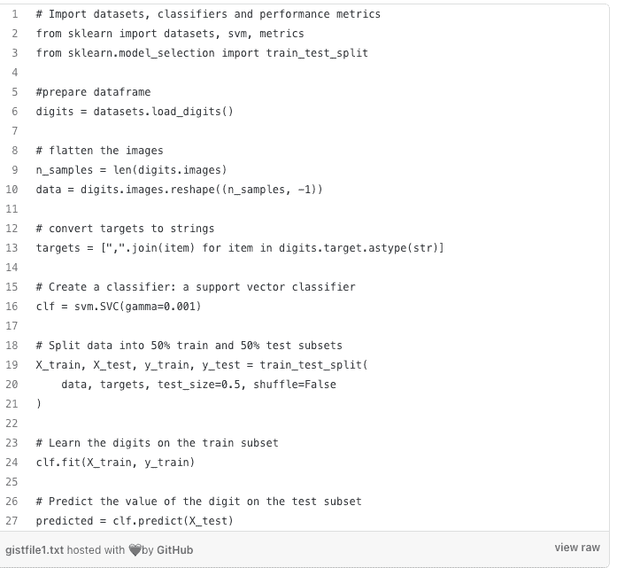
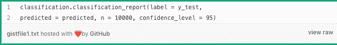
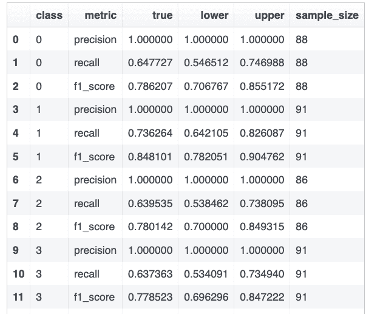

# 使用 FRONNI 计算具有置信区间的机器学习模型性能度量

> 原文：<https://towardsdatascience.com/fronni-a-python-library-for-quickly-calculating-machine-learning-model-performance-metrics-with-3baf28eaa5c0?source=collection_archive---------31----------------------->

## 一个 Python 库，用于快速计算和显示带有置信区间的机器学习模型性能指标

**FRONNI 这个名字来源于统计学家 Bradley Efron 的姓氏，Bradley Efron 是 bootstrap 重采样技术的发明者，John Ioannidis 是广受好评的文章《** [**为什么大多数发表的研究结果都是假的**](https://en.wikipedia.org/wiki/Why_Most_Published_Research_Findings_Are_False) **》的作者。**照片由 [Minh Tran](https://unsplash.com/@minhctran?utm_source=medium&utm_medium=referral) 在 [Unsplash](https://unsplash.com?utm_source=medium&utm_medium=referral) 拍摄

数据科学家花费大量时间评估他们的机器学习模型的性能。这样做的一种常见方法是针对分类问题的分类报告，例如内置在 [scikit-learn 库](https://scikit-learn.org/stable/modules/generated/sklearn.metrics.classification_report.html)中的报告(在 Github 上被引用超过 440，000 次)。类似地，对于回归问题，人们使用 [r2 得分](https://scikit-learn.org/stable/modules/generated/sklearn.metrics.r2_score.html)、 [MSE](https://scikit-learn.org/stable/modules/generated/sklearn.metrics.mean_squared_error.html) 或 [MAE](https://scikit-learn.org/stable/modules/generated/sklearn.metrics.mean_absolute_percentage_error.html) 。

依赖这些的问题是，当我们的测试样本中有不平衡的和/或小的数据集时，构成每个点估计的数据量可能非常小。因此，无论对评估指标有什么样的估计，都不可能真正代表现实世界中发生的事情。相反，向读者呈现一系列置信区间的值会好得多。

例如，我们可以通过使用 [bootstrap](https://en.wikipedia.org/wiki/Bootstrapping_%28statistics%29#:~:text=This%20technique%20allows%20estimation%20of,sampling%20from%20an%20approximating%20distribution) 技术从原始数据集(替换)创建数百个样本，然后丢弃最极端的 5%的值以获得 95%的置信区间，从而轻松创建任何感兴趣的指标的置信区间。

然而，当数据集很大时，如上所述运行引导程序会变成计算量很大的计算。即使是相对较小的 100 万行样本，当重采样 1000 次时，也会变成 10 亿行数据集，并导致计算花费接近一分钟的时间。当离线进行这些计算时，这不是问题，但是工程师经常在 Jupyter 笔记本上交互工作，并且希望快速得到答案。出于这个原因， **Meta** (又名脸书)决定为常见的机器学习指标创建一些这些计算的快速实现，例如使用 [numba 库](http://numba.pydata.org/)的 precision & recall，它提供了比常规 Python 并行处理代码大约 23 倍的加速。

让我们用分类问题的例子来证明这一点。考虑标准的[手写数字数据集](https://scikit-learn.org/stable/modules/generated/sklearn.datasets.load_digits.html#sklearn.datasets.load_digits)，我们正在构建一个 ML 模型来识别数字。

到目前为止，这是标准的东西。现在，我们可以使用 FRONNI 来获得精确度、召回率、f1 分数和相关的置信区间。PyPi 中有这个库，要安装 FRONNI 只需运行 pip install。

*pip 安装 fronni*

现在运行 FRONNI 分类报告，以获得每个类别的精确度、召回率和 f1 分数及其置信区间。您可以使用参数 n 控制自举样本的数量。

瞧啊。，它给出了每个类的精确度、召回率和 f1 分数的上限和下限。

数字分类器的 FRONNI 分类报告输出示例。

类似地，FRONNI 回归模块给出了 RMSE、r2 评分和 MAE 的置信区间。完整的文档请参考 GitHub 库。