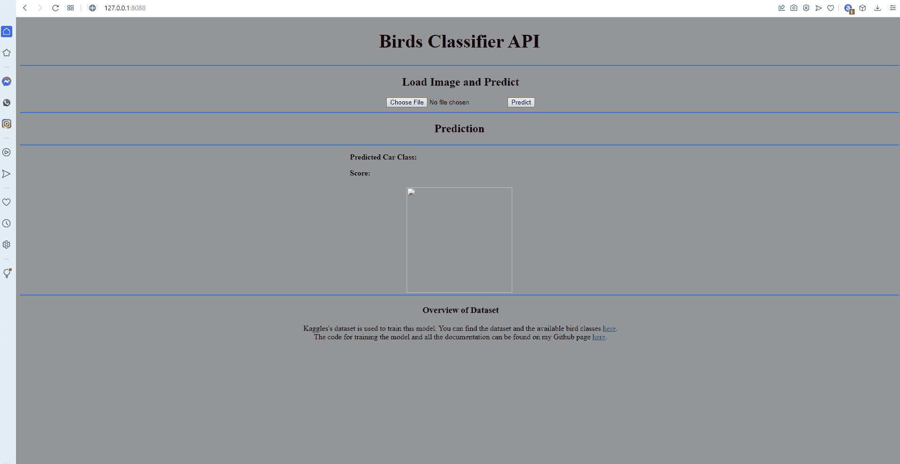

# 完整的深度学习组合项目第 2 部分

> 原文：<https://towardsdatascience.com/full-deep-learning-portfolio-project-part-2-e37d09a451fa?source=collection_archive---------31----------------------->

## 用 Flask 和 HTML 创建可部署的 Web 应用程序

沙哈达特·拉赫曼在 [Unsplash](https://unsplash.com?utm_source=medium&utm_medium=referral) 上拍摄的照片

# 介绍

本文是系列文章的第二部分。在这里，我着重于构建使用在[第一篇文章](/full-deep-learning-portfolio-project-part-1-78df161214aa)中开发的 birds 分类器的 web 应用程序。正如我在第一部分提到的，成为一名机器学习工程师不仅意味着在 Jupyter 笔记本上训练模型，还意味着能够创建一个可以由最终用户直接部署和使用的应用程序。此外，这对你的投资组合也很有帮助，因为你现在有了一份可以展示给招聘人员的申请。这非常有帮助，因为他们通常没有技术背景，因此不想通过 Jupyter 笔记本来了解您在这个项目中开发了什么。

在本文的第一部分，我想引导您使用 html 创建前端部分。在第二部分，我将向您展示如何使用 Python 库 Flask 开发后端。

你可以在[我的 Github 资源库](https://github.com/patrickbrus/Birds_Classifier_API)中找到与这个项目相关的所有代码。图 1 展示了运行中的最终应用程序。

图 1:开发的 web 应用程序使用情况的 GIF

# 创建前端

每个应用程序都需要一个前端。前端部分非常重要，因为这是用户将要与之交互的部分。这个项目的前端是使用 html 开发的。html 代码在[代码笔](https://codepen.io/trending)中创建。Code Pen 是一个网页，用户可以在交互式环境中在线创建和可视化他们的 html 代码。这非常适合快速制作网页原型！

这里重要的部分是从第 37 行到第 62 行。在这里，一个 base64 图像被创建并可视化，以防用户点击“选择文件”按钮。然后，base64 字符串被格式化，以便稍后可以发送到后端应用程序。当用户按下“预测”按钮时，用 POST 命令调用托管网页的预测端点。然后，预测端点对输入图像进行预处理，并将其提供给鸟类分类器模型。这将在下一节中进一步解释。

predict.html 文件存储在一个名为“模板”的文件夹中。这是以后烧瓶应用所需要的。

如果你不熟悉开发 html 代码，我真的可以向你推荐这个关于 html 编码的 Youtube 速成班。

代码 1:创建前端应用程序的 Html 代码。

# 创建后端

后端应用程序负责后台发生的“魔术”。birds 分类器的后端应用程序是使用 Python 库 Flask 开发的，这是一个易于使用的 web 框架。代码 2 展示了后端应用程序的完整 Python 代码。在第 19 行，应用程序本身被创建。

第 21 行是 Python 修饰符，定义了默认路由。该功能在应用程序启动时执行。在“我的表单”功能中，前端 html 文件链接到这个应用程序。

“get_model”函数加载经过训练的 Keras 模型，并将其存储在全局模型变量中。此外，还提供了预处理功能。此功能预处理输入图像，使其具有网络预期的输入格式。“load_classes”函数仅用于在以后将预测的标签链接到相应的类名。

在第 49 行，定义了预测路线。当前端应用程序中的预测按钮被调用时，这个路由被调用。在这里，图像被提取、预处理并馈送到网络。然后网络进行预测。预测的类别标签和输出分数然后被发送回前端应用程序，使得它可以在网站上显示。

main 函数加载模型和类，并在端口 5000 启动应用程序。

启动 Python 应用程序后，您可以在浏览器中打开链接 [http://127.0.0.1](http://127.0.0.1:8088) :5000 下的网站。

代码 2:用于创建后端应用程序的 Python 代码。

# 结论

所以现在已经开发了一个成熟的机器学习应用。在本系列的第一篇文章中，找到了最佳的训练策略，并训练了最终的模型。本文开发了相应的 web 应用程序。这个应用程序现在可以部署到像 AWS 这样的云提供商。当你想阅读我如何创建一个 AWS Elastic Beanstalk 的持续部署管道，这样每个人都可以访问创建的 web 应用程序，那么我可以推荐你阅读[我的媒体文章](/continuous-deployment-pipeline-using-github-actions-docker-and-aws-185bb3bf41b)。

谢谢你把我的文章看完！我希望你喜欢这篇文章和我参与的项目。如果你想在未来阅读更多类似的文章，请关注我，保持更新。