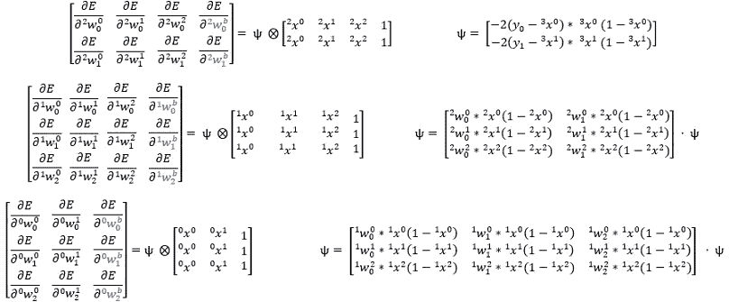

# 梯度下降的完全实现

> 原文：<https://towardsdatascience.com/full-implementation-of-gradient-descent-no-holding-back-86e688f36064?source=collection_archive---------38----------------------->

## 深入研究梯度下降算法的数学。

这篇文章推导了实现梯度下降的算法。它又脏又丑又乏味！自己推导它是一个有趣的练习，但最终，它只是识别模式。不要让这个页面让你脑袋爆炸，让你放弃 AI！仅仅知道如何使用算法是最重要的(即使这样也可以认为你可以只使用 Keras)，但是为什么不自己尝试一下并从中获得一些乐趣呢！我在这里包括推导，只是因为我知道当我学习人工智能时，我会喜欢看它。

我们现在知道，我们必须找到误差函数相对于每个权重的梯度，以最小化我们的误差(如果你不知道我刚才说了什么，请学习/复习如何训练神经网络[这里](https://doingengineering21.medium.com/how-to-train-a-neural-network-from-scratch-952bbcdae729))。这很好，但是我们如何用代码来实现呢？你可以想象，如果我们有一个 5、6 层或更多层的神经网络，每层都有数百或数千个神经元，找到梯度会有多困难。

> 我们知道*要找什么*(梯度)，现在我们只需要弄清楚*如何*找到它。

我们可以用导数的定义。仔细检查每一个重量，并稍微增加一点，然后将误差的变化除以这个微小的量。这将给出这个特定重量的∂E/∂W。如果我们对所有的重量都这样做，我们就会得到梯度。

但是客观地看，我训练用来玩雅达利游戏的神经网络有 1，685，667 个权重，我必须更新它们大约 1000 万次。对于这样的网络来说，使用导数的定义太费时间了。

由于神经网络具有非常高的重复率，看起来我们可以找到一种算法，以一种有效的方式为我们找到梯度。为了尝试创建这种算法，我们将首先手动写出一个相对较小但较深的神经网络的前进和更新阶段。然后，我们将在这个过程中寻找模式，尽可能地简化它。

这是我们将用来推导梯度下降算法的神经网络:

*这一次我们实施的是偏向。请注意，只要我们将偏置“输入”保持为 1，上述实现与仅将偏置添加到每个神经元的加权和上完全相同。偏向是蓝色的，任何与偏向相关的东西在这个页面上都是蓝色的。*****图片作者****

## 正向阶段

首先，非常重要的是要记住，我们绘制神经网络作为这个计算图，是为了帮助我们可视化正在发生的事情。但是，如果我们要找到我们的梯度下降算法，我们将需要写出完成的计算。嗯，我们这里有很多参数！我们真的为丑陋的索引做了大量的参数！

让我写出这个神经网络中所有的参数。然后让你了解我的索引惯例。

****图片作者****

上面的 Xbar 是每一层的*【输入】*列表。注意，Xbar 中每个列表的大小对应于每层中神经元的数量。Xbar[0]是带有偏差的初始输入数据，Xbar[1]是带有级联偏差的 X[0]的激活加权和，Xbar[2]是带有级联偏差的 X[1]的激活加权和，依此类推。

Wbar 是连接每一层的所有权重的列表。每个列表都应该有大小:

(不包括偏差的下一层神经元的数量，包括偏差的当前层神经元的数量)。

例如，第一个权重列表有 3 行，因为在下一层中有 3 个神经元(不包括偏差)。该列表有 3 列，因为有 2 个输入和 1 个偏差。

现在，左上角的索引显示了特定元素所在的层。右上角的指数告诉我们正在谈论的层中的输入神经元，右下角的指数告诉我们将要输入什么。

*X 是层的输入，w 是层的权重，z 是通过激活函数之前的加权和。*****图片作者****

现在我们在记谱法上达成了一致。这是神经网络的前向阶段。从左到右，从上到下，写出计算结果:

*a(z)是我们应用于 z 的激活函数。退一步，看看在高层次上发生了什么。不要让你的脑袋爆炸，试图同时意识到每个细节！*****图片作者****

最上面一行计算将我们从第一层输入带到第二层输入。第二行将我们从第二层输入带到第三层输入，依此类推，直到我们到达一个输出。

## 反向相位

好了，现在让我把我们要找的东西写出来；

****图片作者****

我们将试图找到足够的第三和第二个导数列表来确定一个模式。利用链式法则，以及大量盯着的问题，我们可以证明这些导数等于下列；

我突出显示了我认识的任何模式，这将有助于简化。第二梯度矩阵只是部分完成。我们只需要足够的证据来确定模式。****图片作者****

如果上面的照片有点模糊，建议你下载一份，研究一段时间。我首先计算导数，然后突出矩阵中的相似之处。模式识别是这个游戏的名字。

这可能很难理解你自己。经常回头看看前进阶段的照片。如果你从这个错误开始，然后用链式法则让你自己回到你试图找到的重量，你会发现这很简单，但是很乏味。

现在，我们试图找到一种更简单的方法来表达上述方程。如果你记得你的线性代数，你会发现上面的方程可以简化为:

那个里面有 X 的圆圈表示我们正在对行进行乘法运算。矩阵之间的点表示我们正在应用点积。****图片作者****

看多漂亮！你可以注意到所有红色的东西都和上面一行中高亮显示的一样。这意味着我们可以从最后一层开始，初始化一个术语，称之为ψ，就是绿色的。然后，当我们回到之前的层时，我们可以用该层中的绿色来更新ψ(红色的就是ψ的当前值)。现在，要找到该层的梯度，我们只需将ψ乘以∂Z/∂w 行。当你插入数值时，这是非常漂亮的，下面我假设均方误差函数和 sigmoid 激活函数。

****图片作者****

现在，我们将更新打包成一个非常简单的 for 循环:

****图片作者****

## 摘要

好吧，我知道你在想什么。刚刚发生了什么事！？我所做的只是识别模式！没有比链式法则更复杂的东西被用到，我只是用了很多。如果你只是相信我的结果，而不是自己推导出来的，我不会怪你。在实践中，我们无论如何都将使用 Keras 来实现，但是现在您已经知道如何自己做了，您不必为这样做而感到内疚。

一如既往，我们还没有真正理解这一点！直到我们应用它，我们才会理解它。我在这里用 python [实现了一个简单的实现，在这个链接中我还构建了一个有用的 python 类，我们稍后会用它来识别手写数字。](https://doingengineering21.medium.com/implementing-gradient-descent-example-102b4454ea67)

> 感谢您的阅读！如果这篇文章在某种程度上帮助了你，或者你有什么意见或问题，请在下面留下回复，让我知道！此外，如果你注意到我在某个地方犯了错误，或者我可以解释得更清楚一些，那么如果你能通过回复让我知道，我会很感激。

> 这是一系列文章的继续，这些文章从头开始对神经网络进行了直观的解释。其他文章请参见下面的链接:
> 
> [第 1 部分:什么是人工神经网络](/what-is-an-artificial-neural-network-b508c821ace8)
> 
> [第二部分:如何从零开始训练神经网络](/how-to-train-a-neural-network-from-scratch-952bbcdae729)
> 
> 第 3 部分:梯度下降的完全实现
> 
> [第四部分:梯度下降的实现(一个例子)](https://doingengineering21.medium.com/implementing-gradient-descent-example-102b4454ea67)
> 
> [第 5 部分:如何在 python 中对手写数字进行分类](https://doingengineering21.medium.com/how-to-classify-handwritten-digits-in-python-7706b1ab93a3)