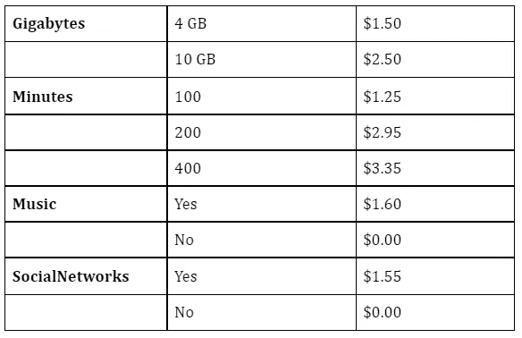
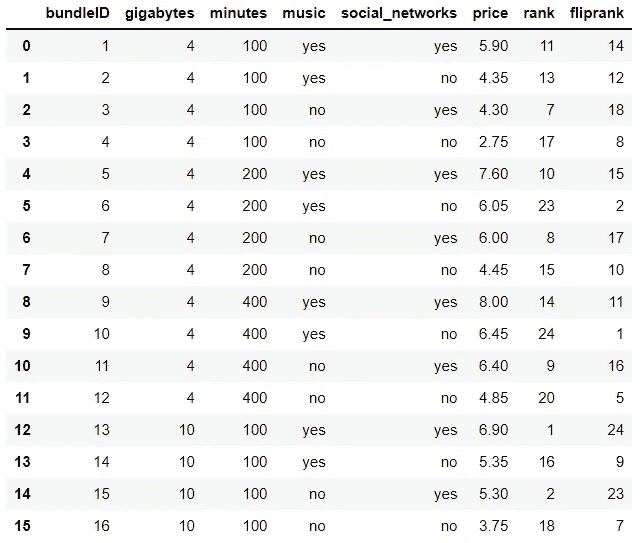
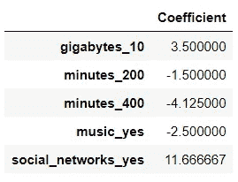
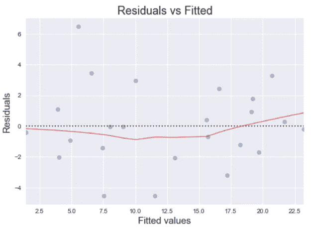

# 满秩联合分析

> 原文：<https://towardsdatascience.com/full-rank-conjoint-analysis-af5ced77070b?source=collection_archive---------20----------------------->

## 用于洞察消费者偏好的技术

**由吉纳·戈麦斯
与格雷戈·佩奇**

我们为这个练习建立了数据集，通过模拟一项调查，要求回答者对一系列 24 个独立的手机月套餐进行排序，1 是最好的，24 是最差的。在向 1000 名受访者展示调查后，每组选项都会根据其在所有受访者中的平均排名获得一个排名。

这些计划包括互联网数据的两个选项、通话时间的三个选项、音乐的两个选项和社交网络接入的两个选项。这些功能基于一家哥伦比亚电信公司提供的真实电话套餐。价格大致基于实际功能价格，从哥伦比亚比索兑换回美元。

数据集有 7 个变量，变量的规格见下表:

**bundleID:** 数据集每一行的 ID。

**千兆字节:**在互联网上导航的千兆字节数。选项是 4 和 10。

**分钟:**人们必须拨打电话的分钟数。选项 100、200 和 400。

**音乐:**计划是否包含免费获取音乐(“是”或“否”值)。

**social_networks:** 计划是否包括无限制访问社交网络(“是”或“否”值)。

**价格:**计划在哥伦比亚的价格，以美元表示。

**排名:**根据近 1000 名受访者的调查答案，对 1 至 24 个首选预付费计划进行排名。

**flip 恶作剧:**每个捆绑包的“翻转”等级，呈现为受青睐的捆绑包采用较高的值，而不是较低的值。这将使线性回归系数更容易解释。

当受访者评估捆绑包时，他们会考虑成本—否则，我们可以预期受访者会简单地选择“最佳”或功能最多的选项。这里显示了增加的功能成本:

通过添加上表中的功能，可以找到任何特定捆绑包的成本。例如，一个 10gb 的套餐，400 分钟的通话时间，没有音乐，可以访问社交网络，价格为 2.50 美元+3.35 美元+0.00 美元+1.55 美元，或 7.40 美元。一个 4.5 的套餐，有 200 分钟的通话时间，可以访问音乐，但不能访问社交网络，价格为 1.50 美元+2.95 美元+1.60 美元+ 0.00 美元，即 6.05 美元。

为了运行线性回归并能够更容易地读取结果，我们修改了 rank 变量，将#1 包的 CorrectedRank 值设为 24，将#2 包的 CorrectedRank 值设为 23，将#3 包的 CorrectedRank 值设为 22，依此类推。

**为什么要使用完整的排名系统？**

在[之前的一篇文章](/metric-based-ratings-based-conjoint-analysis-844655f4e269)中，我们写了一个基于评级的联合分析系统，在这个系统中，调查受访者考虑游乐园乘坐的功能，从 1 到 10 对各种功能组合进行评级。

虽然这种系统非常适合线性建模，但它有一个明显的缺陷——当要求在 1-10 的范围内赋值时，并非所有受访者都使用相同的评级“基线”。例如，一个电影评论者可能会给出 7.2 分(满分 10 分)，而另一个看过同一组电影的评论者给出的平均分接近 5.0 分。

有了完整的排名系统，基线问题就解决了，因为所有回答者都被简单地要求确定每个选项的相对吸引力。然而，这种系统的一个可能的缺点是调查疲劳的风险——如果有太多的捆绑包需要排序，受访者可能会不知所措。随着更多功能和更多级别的添加，对包总数的影响是倍增的。在这里，只有 2 个数据选项、3 个通话时间选项、2 个音乐选项和 2 个社交网络选项，我们已经有了 24 个组合(2 x 3 x 2 x 2)。

**满秩场景的线性建模**

如上所述，为了提高线性回归建模的适用性，我们“翻转”了排名，以便更高的值将与更受青睐的包相关联。这使得线性回归系数的解释变得更容易——正值现在与更好的选项相关联，而负值与更差的选项相关联。

下面您可以看到在环境中读取的干净数据集:

在运行这样一个模型之前，所有的输入特性都应该被虚拟化，包括数据计划和每月通话分钟数等数值。这样，模型结果会将每个特征选项显示为一个离散的选项。这样做意味着我们可以给每一个选项附加一个精确的系数值，而不是用一个单一的数字系数来试图表达整个连续的可能选项范围内的偏好。

pandas 的 get_dummies()函数帮助我们为线性建模准备变量:

然后，使用 scikit-learn 的 LinearRegression 模块，以 fli 恶作剧作为结果变量，以千兆字节、分钟、音乐和社交网络的虚拟化水平作为输入，构建线性模型:

至于使用普通最小二乘线性回归的适用性，有几个问题值得注意。

首先，这个数据集中的结果值是均匀分布的，范围是 1 到 24。如果我们将这个模型用于预测目的，这个范围约束可能会出现问题(我们如何解释小于 1 或大于 24 的值？)，但这并不妨碍我们出于解释的目的使用该模型。我们的目标只是更好地理解功能选项和客户偏好之间的关系，我们可以在这里完成。

其次，考虑到响应变量的非正态分布，异方差的风险可能会增加。我们使用回归诊断图来检查这一点，并在模型结果中没有发现异方差的证据。

**解读结果**

模型系数揭示了一些有价值的模式:

例如，他们向我们表明，调查受访者非常强烈地支持社交网络接入和 10gb 的数据计划。

较大的通话分钟数和音乐选项的负值不一定*意味着客户根本不想要这些选项。相反，它可能表明消费者不希望支付与这些功能相关的增量成本。电信运营商可能希望在未来的调查中修改这些选项——如果相关成本降低，受访者可能会更倾向于这些选项。*

或者，对这些特征缺乏兴趣可能表明消费者口味的其他方面。也许这个群体中的消费者习惯于通过其他格式听音乐，并且根本不打算每月使用超过 100 分钟的通话时间。通过功能和定价选项的不断迭代，以及对实际用户数据的分析，电信公司可以不断努力为其消费者群找到一组理想的选择。

福克斯尔斯，摄影师。(2019 年 11 月 5 日)。拿着手机的人。从 Pexels 检索。