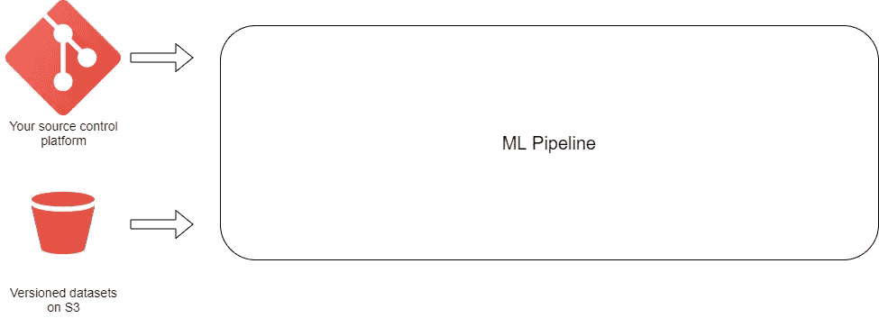
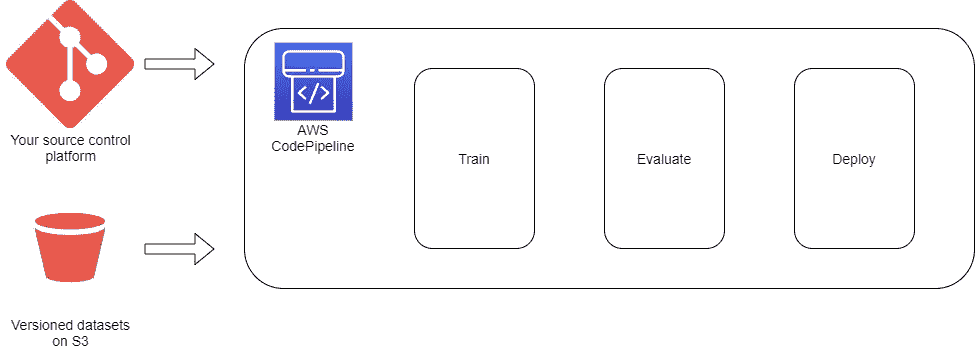
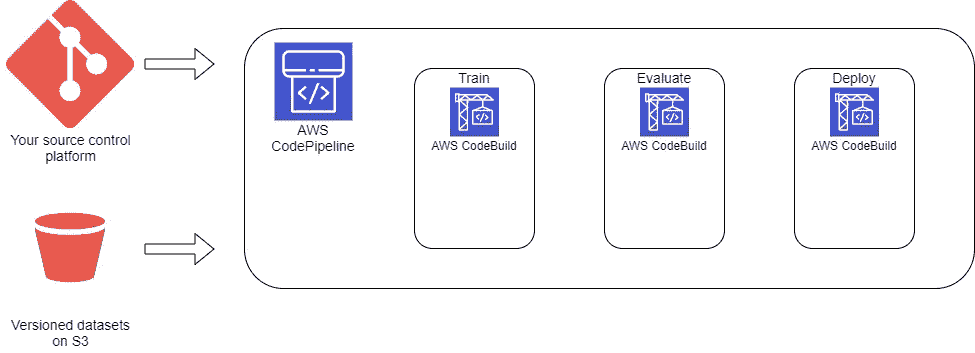
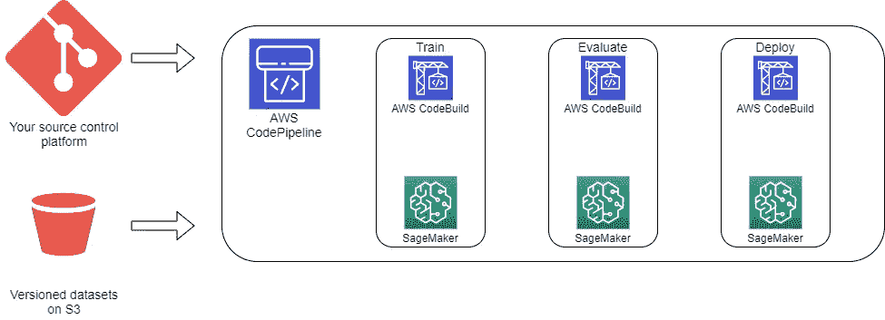
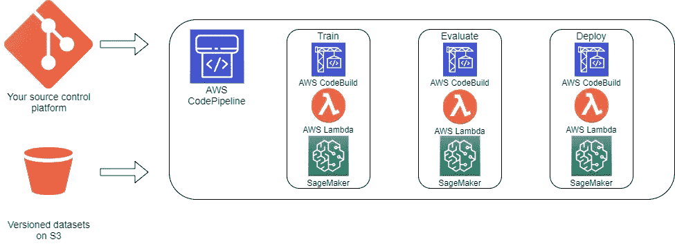

# 使用 AWS CI/CD 工具完全自动化您的 ML 管道

> 原文：<https://towardsdatascience.com/fully-automating-your-ml-pipelines-with-the-aws-ci-cd-tools-bfc337aa77c3?source=collection_archive---------18----------------------->

## 利用可信的 DevOps 工具集构建自动化 MLOps 管道的指南。

在 [Unsplash](https://unsplash.com?utm_source=medium&utm_medium=referral) 上[科学高清](https://unsplash.com/@scienceinhd?utm_source=medium&utm_medium=referral)拍摄的照片

在过去的几年里，由于谷歌和脸书等公司的进步，以及开源社区的贡献，机器学习(ML)的受欢迎程度呈指数级增长。由于它可以应用于非常广泛的用例，几乎世界上的每个公司都开始利用 ML 并将其集成到其流程中。

这种大规模采用 ML 最初缺少一个关键部分:**自动化**。即使 ML 系统基本上是软件系统，它们之间的细微差别，例如 ML 本质上是实验性的，使得一些最初的采用者在构建他们的 ML 系统时放弃了 DevOps 原则——即使 DevOps 已经是其他软件系统的标准。

这为人工智能平台向其客户提供 MLOps 功能创造了空间，允许他们通过应用 CI/CD 原则来自动化其 ML 管道。在本文中，我们的目标是展示如何通过依赖大多数云提供商提供的工具，将我们在 DevOps 管道中日常使用的 CI/CD 原则应用到 ML 管道中。我们将在本文中讨论 AWS 工具，但大多数其他云提供商也提供类似的功能。

# 首先:把代码放在一个地方

是的，ML 本质上是实验性的，所以应用源代码控制可能不像对其他软件系统那样简单。但是，一旦你开始将你的 ML 代码库的不同组件(从预处理、训练或后处理脚本，到你的实验笔记本)集中在一个主要服务中，你将开始收获好处:协作将变得更加无缝，并且你将确保代码质量。

与其他软件系统不同，对 ML 来说，对代码进行版本控制只是工作的一半，因为管道也依赖于数据集。理想情况下，你不希望通过你的源代码控制服务来版本化你的数据集，所以你可以利用[S3](https://docs.aws.amazon.com/AmazonS3/latest/userguide/Versioning.html)提供的版本化功能。这样，无论何时新的数据集到达，您都可以确定您将在管道中使用它，同时还可以跟踪数据的确切版本。至于笔记本，你可以使用像 [Jupytext](https://github.com/mwouts/jupytext) 这样的工具，让它们更容易在你的版本控制服务上工作。

这一步还将允许您定义最适合您的项目的分支策略，以及您决定如何组织它们。无论您决定使用 AWS CodeCommit 还是其他提供者，如 GitHub 或 GitLab，都不会真正影响管道的其余部分，因为我们将要讨论的工具提供了大多数主流源代码控制服务的连接器。

管道的当前版本:版本化代码和数据集

# AWS 代码管道:更大的图景

构建我们的 MLOps 管道的最佳起点实际上是定义管道本身，即使不同的组件仍然没有准备好。AWS CodePipeline 是 AWS 持续交付产品中经常被忽视的核心部分，有了它，您将能够构建一个实际的 MLOps 管道，在不同的 AWS 服务上运行和编排步骤。

除了与大多数 AWS 服务(包括我们将为该管道利用的所有工具)集成之外，CodePipeline 还提供了与大多数源代码控制服务的连接器，这意味着您可以配置一个 webhook，允许它在推送到主分支之后或合并拉请求时(取决于您希望管道运行的频率)检索项目的新版本。

既然我们可以基于适合用例的事件来触发管道，我们就已经可以定义管道的不同步骤了:

1.  当有我们想要触发管道的事件时，从我们的源代码控制服务中检索代码(这已经由 CodePipeline 在一个专用的源代码步骤中处理了)。
2.  对数据运行预处理脚本(这是可选的，可以独立于此管道发生)。
3.  使用最新版本的训练脚本来训练 ML 模型。
4.  评估我们的新模型并测试其性能。
5.  如果模型在性能方面满足一定的标准，则部署该模型。

在这个阶段，我们已经定义了 CodePipeline 中的不同步骤，现在让我们看看如何实现它们。

管道的当前版本:通过 AWS 代码管道定义的步骤，初始源步骤包括检索代码和数据

# AWS 代码构建:您的瑞士军刀

我们模型的训练、评估和部署需要在一个包含所有必要包(无论是开源库还是定制的内部包)的环境中进行，这样我们不同的脚本就可以运行而不会出现任何问题或意外。

使用容器是对这种需求的直接回答，它允许我们为管道中的不同步骤高效地构建可预测的环境。幸运的是，AWS 提供了 CodeBuild，这是一种持续集成服务，我们可以利用它为我们的三个主要步骤中的每一个步骤推送 Docker 容器。

这种设计为我们的不同步骤提供了极大的灵活性，因为我们可以指定每个容器的包列表以及我们希望如何执行我们的脚本。CodeBuild 需要做的唯一额外工作是为每个作业提供[一个](https://docs.aws.amazon.com/codebuild/latest/userguide/build-spec-ref.html) `[buildspec](https://docs.aws.amazon.com/codebuild/latest/userguide/build-spec-ref.html)` [脚本](https://docs.aws.amazon.com/codebuild/latest/userguide/build-spec-ref.html)，其中我们指定了构建 Docker 映像要执行的命令。在`buildspec`脚本中，我们还将图像推送到 [ECR](https://aws.amazon.com/ecr/) ，AWS 容器注册表。

现在，对于我们的三个主要步骤中的每一个，我们都有一个容器映像来表示执行该步骤的合适环境——但是我们可以在哪里运行这些容器呢？

管道的当前版本:CodeBuild 允许我们为管道的每一步构建一个专用的 Docker 映像

# AWS SageMaker:奇迹发生的地方

SageMaker，Amazon 的通用 ML 平台，允许我们在 ML 优化的实例上运行不同的容器。SageMaker 还为我们的不同步骤提供专用组件:

*   SageMaker 培训任务:它们允许我们无缝运行培训任务并生成模型。
*   [SageMaker 加工作业](https://docs.aws.amazon.com/sagemaker/latest/APIReference/API_ProcessingJob.html):非常适合模型评估任务。例如，我们可以使用测试数据集评估模型，然后在我们的跟踪工具上记录一组指标。
*   [SageMaker 端点](https://docs.aws.amazon.com/sagemaker/latest/APIReference/API_CreateEndpoint.html):它们允许我们轻松地部署我们的服务模型。

多亏了这些工具，我们现在可以运行我们专用的容器映像来训练模型、评估它，然后部署它来提供服务。我们的 ML 难题中唯一剩下的部分是增加从 CodePipeline 触发这些不同的 SageMaker 组件的能力。

管道的当前版本:我们运行培训作业、模型评估，然后在 SageMaker 上部署

# AWS Lambda:将点连接起来

Lambda 函数是 AWS 上使用最广泛的服务之一。这主要归功于它们的多功能性、简单性以及作为无服务器计算服务提供的便利性。

对于我们的 MLOps 管道，可以有效地利用 Lambda 函数来触发不同的 SageMaker 作业，在必要时执行附加操作，并在管道内将参数从一个步骤传递到另一个步骤。

例如，在评估步骤中，我们可以使用 Lambda 函数来执行以下操作:

*   检索由训练步骤产生的模型的位置(在 S3 上)。
*   为我们的评估环境检索完整的 Docker 图像名称和标签(图像将由 SageMaker 从 ECR 中提取)。
*   通过传递所有必要的参数，触发 SageMaker 处理作业来运行评估。

为了将变量从一个步骤传递到另一个步骤，我们可以通过 CodePipeline 本身定义想要传递的元数据[，然后我们可以从不同的 Lambda 函数中检索变量。](https://docs.aws.amazon.com/codepipeline/latest/userguide/actions-variables.html)

最终的管道:我们使用 Lambda 函数来触发不同的 SageMaker 组件，依赖于通过 CodePipeline 传递的变量

# 结论

建立一个自动化的 MLOps 管道是工业化 ML 工作流程和确保模型及时到达生产的必要条件。在本文中，我们展示了 AWS 提供的 CI/CD 工具是构建这种管道的合适选择。

与开箱即用的解决方案相比，这种方法所需的额外工作是为极度灵活性(因为管道可以轻松修改或更新)和与其他 AWS 服务的自然集成(例如，我们可以在几分钟内通过 [SNS](https://aws.amazon.com/sns/) 添加通知)所付出的代价。

流水线本身也应该通过 IaC(作为代码的基础设施)自动化，以确保可再现性和效率。文章中提到的所有资源都可以通过 Terraform 或 CloudFormation 创建。

最后，以下资源提供了关于该设计不同组件的更多见解:

*   [MLOps:机器学习中的连续交付和自动化管道](https://cloud.google.com/architecture/mlops-continuous-delivery-and-automation-pipelines-in-machine-learning)
*   [AWS re:Invent 2018:使用 CI/CD 技术工业化机器学习](https://www.youtube.com/watch?v=hkwBymJhIqM&ab_channel=AmazonWebServices)
*   [在 SageMaker 短暂实例上调度 Jupyter 笔记本](https://aws.amazon.com/blogs/machine-learning/scheduling-jupyter-notebooks-on-sagemaker-ephemeral-instances/)
*   [机器学习团队在生产中使用 CI/CD 的 4 种方式](https://neptune.ai/blog/ways-ml-teams-use-ci-cd-in-production)

*要了解更多数据工程内容，您可以订阅我的双周刊时事通讯 Data Espresso，我将在其中讨论与数据工程和技术相关的各种主题:*

<https://dataespresso.substack.com/> 