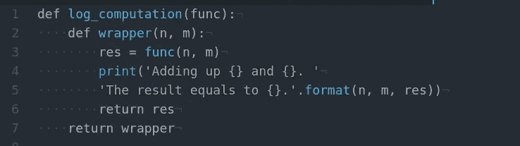

# Python 中的函数装饰器

> 原文：<https://towardsdatascience.com/function-decorators-in-python-a17958b9d618?source=collection_archive---------6----------------------->

## 为什么您可能需要它们以及如何实现一个定制的


约翰·安维克在 Unsplash[上的照片](https://unsplash.com/s/photos/prism?utm_source=unsplash&utm_medium=referral&utm_content=creditCopyText)

装饰者在第一次与它们打交道时可能会显得有点神秘，但毫无疑问，这是增强功能行为的一个很好的工具。

事实上，Python 中有两种类型的装饰器——类装饰器和函数装饰器——但我在这里将重点介绍函数装饰器。

在我们进入基本装饰器如何工作以及如何实现你自己的装饰器的有趣细节之前，让我们先看看为什么我们需要它们。在一些情况下，装饰者会有很大的帮助。

他们可以添加日志记录或工具代码，并以封装的方式从应用程序组件中提取各种[指标](/profiling-in-python-83415daa844c)，例如计时。

Decorators 可能是验证输入的完美机制，这在使用像 Python 这样的动态类型的语言时尤其重要。

内置装饰器在 Python 库中被广泛使用。典型的例子包括 web 框架中用于路由和授权的 decorator，例如， [Flask](https://flask.palletsprojects.com/en/2.0.x/quickstart/) 中的`[@route()](https://flask.palletsprojects.com/en/2.0.x/api/#flask.Flask.route)` decorator。

既然我们看到了学习编写和应用装饰器是一个好主意，那么让我们弄清楚什么是装饰器，以及如果需要的话，如何实现自定义装饰器。

为了使用 decorators，你需要知道的基本知识是，函数也是 Python 中的对象，它们可以作为参数传递给其他函数，就像其他对象一样，比如字符串。所以 Python 中的函数是*一级对象*。

以其他函数为自变量返回一个函数的函数是 [*高阶函数*](https://en.wikipedia.org/wiki/Higher-order_function) 。这就是 Python decorators 的情况。

一个函数可以在另一个函数中定义。在这种情况下，它被称为*嵌套*函数。另一个与嵌套函数直接相关并且你需要理解的概念是 [*闭包*](https://en.wikipedia.org/wiki/Closure_(computer_programming))——一个“记住”数据的函数对象，例如来自其封闭范围的变量及其值。这将是我们稍后将看到的装饰器示例中的`wrapper()`函数。

装饰器通常被定义为*一个修改另一个函数*行为的函数。最常见的情况是，装饰者给参数函数的行为添加了一些东西。重要的是要记住，装饰器只是在一定程度上改变被装饰函数的行为，而不是永久地或完全地改变它。这就是为什么有时人们更喜欢将装饰器定义为一个函数，这个函数扩展了另一个更准确的函数的行为。

接下来，让我们看一个装饰函数的例子。假设我们有一个简单的函数，它返回两个整数的和:

```
def sum_up(n, m):
    return n + m
```

那么我们可以这样运行它:

```
print(sum_up(3, 7))
```

输出:

```
10
```

现在，假设我们想要记录代码库的这一部分发生了什么——为了便于练习，我们将简单地把它打印到控制台上。我们可以为此编写一个装饰器:



现在我们需要将装饰器添加到代码库中的函数中:

```
[@log_computation](http://twitter.com/log_computation)
def sum_up(n, m):
    return n + m
```

因此，当我们在代码中调用此函数时，我们将在控制台中看到以下输出:

```
Adding up 3 and 7\. The result equals to 10.
```

让我们一行一行地分解它，以理解装饰器中发生了什么。

在第 1 行，decorator 方法的签名显示它接受一个函数作为参数。在第 2 行，我们定义了一个嵌套的包装函数，它将调用修饰函数并在第 6 行返回它的输出。在第 3 行，我们获得了修饰函数的输出。在第 4 行和第 5 行，装饰者的修改行为开始生效:在这里，它使输出更加冗长。在第 7 行，装饰者返回包装器。

如果我们不知道修饰函数的参数的很多细节怎么办？如果我们想概括装饰者呢？

我们可以使用 `*[args](https://docs.python.org/3.7/glossary.html?highlight=kwarg#term-parameter)`和/或`**[kwargs](https://docs.python.org/3.7/glossary.html?highlight=kwarg#term-parameter)`来实现:

```
def log_computation(func):
    def wrapper(*args):
        numbers = args
        res = func(*args)
        print('Adding up the following numbers:\n'
        '{}\n'
        'The result equals to {}.'.format(numbers, res))
        return res
    return wrapper
```

因此，如果将`sum_up()`函数推广到累加任意数量的整数，我们的装饰器仍然可以工作:

```
sum_up(3, 7, 11, 50)
```

输出:

```
Adding up the following numbers:
(3, 7, 11, 50)
The result equals to 71.
```

这是一个自定义装饰的基本模板。自定义装饰器可能要复杂得多。嵌套函数可以不接受参数，也可以接受位置参数、关键字参数或两者都接受。他们可以在调用 main 函数之前完成一些步骤，以确保它可以被安全地调用，或者在调用之后完成(就像我们的例子一样)，或者两者都完成(例如，在记录函数的执行或计时时)。我们也可以对一个函数应用多个装饰器——这被称为*链接*装饰器。

Decorators 是使您的代码更健壮(特别是如果您将它们用于验证目的的话)并且更简单、更通用的好帮手。

如果你对使用 decorators 来跟踪你的 Python 代码的性能感兴趣，可以随意查看我关于[代码优化](/optimizing-your-python-code-156d4b8f4a29)和[并发和并行](/concurrency-and-parallelism-in-python-bbd7af8c6625)的帖子。