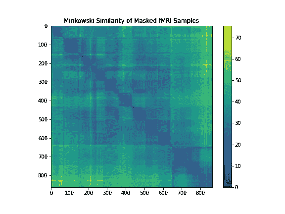

# 人脑的功能连接和相似性分析(下)

> 原文：<https://towardsdatascience.com/functional-connectivity-and-similarity-analysis-of-human-brain-part-iii-c427c88ca5bb?source=collection_archive---------28----------------------->

## 人脑的空间分析

来源:[https://nilearn . github . io/auto _ examples/03 _ connectivity/plot _ multi _ subject _ connectome . html # sphx-glr-auto-examples-03-connectivity-plot-multi-subject-connectome-py](https://nilearn.github.io/auto_examples/03_connectivity/plot_multi_subject_connectome.html#sphx-glr-auto-examples-03-connectivity-plot-multi-subject-connectome-py)

## 材料

这是该系列的第三篇文章，即“腹侧颞叶皮层时空功能磁共振成像的认知计算模型”。如果你想了解整个系列，请点击下面的链接。

<https://github.com/cankocagil/Cognitive-Computational-Modelling-for-Spatio-Temporal-fMRI-in-Ventral-Temporal-Cortex>  

我将介绍功能连接和相似性分析的主题，它们在大脑解码研究中的用例。让我们开始吧。

所有相关资料都放在我的 GitHub 页面上。别忘了去看看。如果你是一个纸质爱好者，你可以阅读这一系列文章的纸质版，也可以在我的回购中找到。

<https://github.com/cankocagil/Cognitive-Computational-Modelling-for-Spatio-Temporal-fMRI-in-Ventral-Temporal-Cortex>  

在深入分析和编码之前，让我们稍微操作一下 Haxby 数据集，并应用腹侧时间掩模从人脑的感兴趣区域提取信号。安装和导入部分在前一篇文章中已经完成。如果你没有看我以前的文章，我想就此打住，快速浏览一下。但是，不用担心。所有部分“几乎”相互独立。开始编码吧。

在这里，我们获取 Haxby 数据集。接下来，我们将理解数据结构，并将其转换为 NumPy 数组，以便进一步处理。

正如我们所看到的，有 8 个类别。(我们将忽略“rest”类别，因为它没有提供额外的信息。)

让我们删除“休息”条件数据，并探索数据的形状如下。

因此，有 864 个样本在时间上相连，即时间序列数据。固定时间的 fMRI 数据具有 40×64×64 的维度，其中 40 是指 3-D 图像的深度，64 是指空间维度。因此，我们是四维时间序列图像数据。回想一下，实验中有 6 名受试者，让我们按如下方式查看所有受试者。

所以，所有受试者都有 864 个时间序列数据。有关数据集的详细描述，请参考第一部分。

然后，让我们执行掩蔽来提取感兴趣的区域，以降低 fMRI 的维度。掩蔽的 fMRI 样本代表神经活动可能发生的区域。

是的，这个脚本使我们能够

1.  获取 fMRI 数据并将其转换为 NumPy 矩阵
2.  创建并应用时空掩膜来提取感兴趣区域
3.  准备监督(目标/标签)

那么，让我们运行这个函数并获取数据。

是啊！最后，我们准备了数据集。现在，我们可以进行任何我们想要的分析。在本文中，我们将对人脑进行功能连接和相似性分析。

# **功能连接和相似性分析**

功能连接性被定义为解剖学上分离的大脑区域的神经元激活模式的时间依赖性，在过去的几年中，越来越多的神经成像研究开始通过测量大脑区域之间静息状态 fMRI 时间序列的共激活水平来探索功能连接性[23]。这些功能联系对于建立大脑区域的统计联系非常重要。可以通过估计来自分解的不同大脑区域的信号的协方差(或相关性)矩阵来获得功能连接，例如在静息状态或自然刺激数据集上。这里，我们基于相关性、精确度和部分相关性进行了功能连接性分析。然后，进行基于余弦、闵可夫斯基和欧几里德距离的相似性分析，以进一步扩展掩蔽的 fMRI 数据中的统计发现。

## **功能连接:关联**

对受试者 1 进行基于皮尔逊相关性的功能连接。我们可以看到，在受试者 1 的腹侧颞叶皮层中，当呈现面孔的刺激时，存在很强的相关性。

相关矩阵(图片由作者提供)

## 功能连接:精度

如文献[20，24]所示，使用逆协方差矩阵，即精度矩阵更有意义。它只给出区域之间的直接联系，因为它包含部分协方差，即两个区域之间的协方差取决于所有其他区域。此外，我们基于精确评分进行了功能性连接组，以提取受试者 1 的 RoI 信号。这里，随着连接性测量的改变，我们看到受试者 1 的腹侧皮层中空间相关性的直接变化。通过精确测量，我们进一步了解了大脑组织和大脑网络。

精度矩阵(图片由作者提供)

## 功能连接:部分相关

在一系列网络建模方法中，偏相关在准确检测真实的大脑网络连接方面显示出巨大的前景[25]。因此，我们基于偏相关进行了功能连接性分析。RoI fMRI 数据中的部分相关性的可视化表明受试者 1 的腹侧颞叶皮层没有太多相关性。

部分相关矩阵(图片由作者提供)

## 相似性分析:余弦距离

为了便于在大脑中统计连接的背景下进行测地线理解，我们对受试者 1 进行了余弦相似性分析，并将获得的矩阵可视化。结果表明，当视觉刺激出现时，在神经活动方面存在高度重叠的区域。

余弦矩阵(图片作者提供)

## 相似性分析:闵可夫斯基距离

为了试验不同的相似性度量，我们利用了闵可夫斯基距离，它是欧几里得距离和曼哈顿距离的推广。因此，它在 fMRI 时间相似性分析中是有用的。

闵可夫斯基矩阵(图片作者提供)

## 相似性分析:欧几里德距离

最后，我们基于经典的欧氏距离进行相似性分析。这是一个非常经典的使用勾股定理[13]根据点的笛卡尔坐标测量距离的方法。从功能连接和相似性分析所揭示的统计和结构模式中，我们可以得出结论，在人脑腹侧颞叶皮层诱发的神经活动是高度重叠和分布的。

欧几里德矩阵(图片由作者提供)

耶！本文到此为止。我深入讨论了 fMRI 数据的功能连接和相似性分析技术。

恭喜你！您已经完成了第三篇文章，并通过认知计算方法对人脑解码迈出了一步。

在下一篇文章中，我们将执行无监督表示学习，以提取人脑中的潜伏期。

## 文章链接

1.  **发表文章**

<https://cankocagil.medium.com/introduction-to-cognitive-computational-modelling-of-human-brain-part-i-90c61e0e24c9>  

2.

<https://cankocagil.medium.com/discovery-neuroimaging-analysis-part-ii-b2cdbdc6e6c3>  

3.

<https://cankocagil.medium.com/functional-connectivity-and-similarity-analysis-of-human-brain-part-iii-c427c88ca5bb>  

4.

<https://cankocagil.medium.com/unsupervised-representation-learning-on-distributed-regions-in-the-human-brain-part-iv-55fecf4e1b6f>  

2.**在路上(即将到来…)**

1.  第五部分的占位符

## 进一步阅读

*   【https://www.hindawi.com/journals/cmmm/2012/961257/ 

我在机器学习和神经科学方面的研究中使用了以下参考文献列表。我强烈建议复制粘贴参考资料，并简要回顾一下。

# 参考

[1]巴、基罗斯和辛顿。图层归一化，2016。

[2] L. Buitinck，G. Louppe，M. Blondel，F. Pedregosa，A. Mueller，O. Grisel，V. Niculae，P. Prettenhofer，A. Gramfort，J. Grobler，R. Layton，J. VanderPlas，a .乔利，B. Holt，10 和 G. Varoquaux。机器学习软件的 API 设计:scikit-learn 项目的经验。在 ECML PKDD 研讨会:数据挖掘和机器学习的语言，第 108–122 页，2013。

[3]褚，田，王，张，任，魏，夏，沈。双胞胎:重新审视《视觉变形金刚》中空间注意力的设计，2021。

[4] K .克拉默、o .德克、j .凯舍特、s .沙莱夫-施瓦兹和 y .辛格。在线被动攻击算法。2006.

[5] K. J .弗里斯顿。统计参数映射。1994.

[6]格罗斯、罗查-米兰达和本德。猕猴下颞皮质神经元的视觉特性。神经生理学杂志，35(1):96–111，1972。

[7] S. J .汉森、t .松坂和 J. V .哈克斯比。用于物体识别的腹侧颞叶组合编码。

[8]哈克斯比、戈比尼、富里、伊沙伊、斯豪滕和彼得里尼。《视觉物体识别》，2018。

[9]赫克曼、哈伊纳尔、贾巴尔、吕克特和哈默斯。结合标记传播和决策融合的自动解剖脑 mri 分割。神经影像，33(1):115–126，2006。

10d .亨德里克斯和 k .金佩尔。高斯误差线性单位(gelus)，2020。

[11]黄少华，邵文伟，王明林，张德庆.人脑活动视觉信息的功能解码:简要综述。国际自动化和计算杂志，第 1-15 页，2021。

[12] R. Koster、M. J. Chadwick、Y. Chen、D. Berron、A. Banino、E. Duzel、D. Hassabis 和 D. Kumaran。海马系统内的大循环复发支持跨发作的信息整合。神经元，99(6):1342–1354，2018。

[13]马奥尔。勾股定理:4000 年的历史。普林斯顿大学出版社，2019。

[14] K. A. Norman、S. M. Polyn、G. J. Detre 和 J. V. Haxby 超越读心术:功能磁共振成像数据的多体素模式分析。认知科学趋势，10(9):424–430，2006。

[15]奥图尔、江、阿卜迪和哈克斯比。腹侧颞叶皮层中物体和面孔的部分分布表征。认知神经科学杂志，17(4):580–590，2005。

[16] F .佩德雷戈萨、g .瓦洛夸、a .格拉姆福特、v .米歇尔、b .蒂里翁、o .格里塞尔、m .布隆德尔、p .普雷登霍弗、r .魏斯、v .杜伯格、j .范德普拉斯、a .帕索斯、d .库尔纳波、m .布鲁彻、m .佩罗特和 e .杜切斯内。sci kit-learn:Python 中的机器学习。机器学习研究杂志，12:2825–2830，2011。

17 r . a .波尔德拉克。功能磁共振成像的感兴趣区域分析。社会认知和情感神经科学，2(1):67–70，2007。

[18] M. Poustchi-Amin、S. A. Mirowitz、J. J. Brown、R. C. McKinstry 和 T. Li。回波平面成像的原理和应用:普通放射科医师回顾。放射学，21(3):767–779，2001。

[19] R. P. Reddy，A. R. Mathulla 和 J. Rajeswaran。心理健康专家的观点采择和情绪传染的初步研究:移情的玻璃脑观点。印度心理医学杂志，0253717620973380，2021 页。

[20]史密斯、米勒、萨利米-科尔希迪、韦伯斯特、贝克曼、尼科尔斯、拉姆齐和伍尔利奇。功能磁共振成像的网络建模方法。神经影像，54(2):875–891，2011。

21 田中先生。下颞叶皮层和物体视觉。神经科学年度评论，19(1):109–139，1996。

[22] M. S .特雷德。Mvpa-light:一个多维数据的分类和回归工具箱。神经科学前沿，14:289，2020。

[23] M. P .范登赫维尔和 H. E .波尔。探索大脑网络:静息态功能磁共振成像功能连接综述。欧洲神经精神药理学，20(8):519–534，2010。

[24] G. Varoquaux，A. Gramfort，J. B. Poline 和 B. Thirion。大脑协方差选择:使用群体先验的更好的个体功能连接模型。arXiv 预印本 arXiv:1008.5071，2010。

[25] Y. Wang，J. Kang，P. B. Kemmer 和 Y. Guo。一种利用偏相关估计大规模脑网络功能连接的有效可靠的统计方法。神经科学前沿，10:123，2016。

26s . Wold、K. Esbensen 和 P. Geladi。主成分分析。化学计量学和智能实验室系统，2(1–3):37–52，1987。

27s . Wold、K. Esbensen 和 P. Geladi。主成分分析。化学计量学和智能实验室系统，2(1–3):37–52，1987。