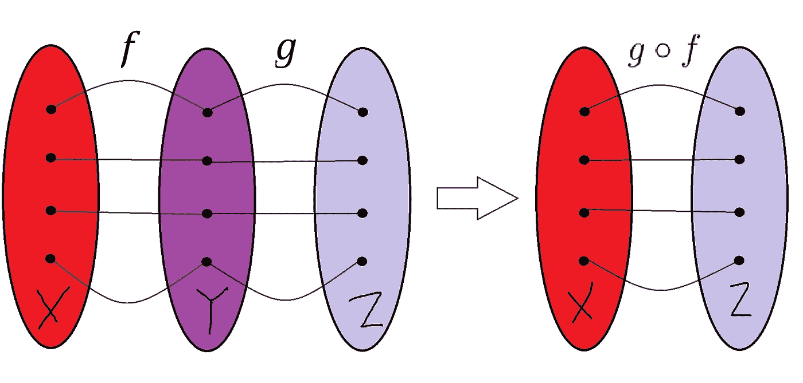

# 功能“控制流”——编写没有循环的程序

> 原文：<https://towardsdatascience.com/functional-control-flow-writing-programs-without-loops-ce07e6137bba?source=collection_archive---------25----------------------->

## [*小窍门*](https://towardsdatascience.com/tagged/tips-and-tricks)

## 控制流的函数式编程特性概述—没有循环和 if-else

# 概述

在我上一篇关于[函数式编程的关键原则](/3-key-principles-of-functional-programming-for-data-engineering-67d2b82c7483)的文章中，我解释了函数式编程范例与命令式编程的不同之处，并讨论了幂等性和避免副作用的概念是如何与函数式编程中支持等式推理的引用透明性联系起来的。

在我们深入了解函数式编程的一些特性之前，让我们从我写 Scala 代码的前三个月的个人轶事开始。

# 函数代码中没有“如果-否则”

我正在为一个定制的 Spark UDF 编写一个纯 Scala 函数，它基于一个用 JSON 字符串表示的定制分级调整来计算收入调整。当我试图用纯功能代码来表达业务逻辑时(因为这是团队的编码风格)，我对我感觉到的生产力下降感到非常沮丧，以至于我在代码中引入了“if-else”逻辑，试图“完成工作”。

这么说吧，我在对那个特定的合并请求进行代码审查的过程中学到了一个非常艰难的教训。

*“函数代码中没有 if-else，这不是命令式编程…* ***没有 if，就没有 else。***

*没有“if-else”，我们如何在函数式编程中写出“控制流”？*

*简答:**功能构成**。*

*最长的答案是:函数组合和函数数据结构的结合。*

*由于对每个功能设计模式的深入探究可能相当冗长，本文的重点是提供一个函数组合的概述，以及它如何实现一个更直观的方法来设计数据管道。*

# *函数合成简介*

**

*功能构成(图片由作者提供)*

*在数学中，**函数合成**是将两个函数 *f* 和 *g* 依次取值，形成一个复合函数 *h* ，使得*h(x)= g(f(x)】*—函数 *g* 应用于将函数 *f* 应用于一个泛型输入 *x* 的结果。在数学上，该操作可以表示为:*

**f : X → Y，g:y→z⟹g♀f:x→z**

*其中*g♀f*是复合函数。*

*直观地说，对于域 *X* 中的所有值，复合函数将域 *Z* 中的*X*X 映射到域 *g(f(x))* 。*

*用一个有用的类比来说明函数组合的概念，就是用一片面包和冷黄油在烤箱里做黄油吐司。有两种可能的操作:*

1.  *在烤箱中烘烤(操作 f)*
2.  *将黄油涂在最宽的表面上(操作 g)*

*如果我们先在烤箱里烤面包，然后把冷黄油涂在从烤箱里出来的面包的最宽表面上，我们会得到一片涂有冷黄油的烤面包。*

*如果我们先将冷黄油涂在面包最宽的表面上，然后在烤箱中烘烤涂有冷黄油的面包，我们会得到一片涂有*热黄油的烤面包*(*f♀g*)。而且我们知道*“冷黄油涂抹”！= "温黄油涂抹"*。*

*从这些例子中，我们可以直观地推断出函数应用的顺序在函数合成中很重要。(*g♀f≠f♀g*)*

*类似地，在设计数据管道时，我们经常通过将函数应用于其他函数的结果来编写数据转换。组合函数的能力鼓励**将重复的代码段重构**成函数，以实现**可维护性**和**可重用性**。*

# *充当一级对象*

*函数式编程中的核心思想是:**函数就是值**。*

*这个特征意味着一个函数可以是[2，3]:*

1.  *赋给变量*
2.  *作为参数传递给其他函数*
3.  *作为其他函数的值返回*

*为此，函数必须是运行时环境中的一级对象(并存储在数据结构中)——就像数字、字符串和数组一样。包括 Scala 在内的所有函数式语言以及 Python 等一些解释型语言都支持一级函数。*

# *高阶函数*

*函数作为一级对象的概念所产生的一个关键含义是，函数组合可以自然地表达为一个高阶函数。*

*高阶函数至少具有下列特性之一:*

1.  *接受函数作为参数*
2.  *将函数作为值返回*

*高阶函数的一个例子是`map`。*

*当我们查看 Python 内置函数`map`的文档时，发现`map`函数接受另一个函数和一个 iterable 作为输入参数，并返回一个产生结果的迭代器[4]。*

*在 Scala 中，包`scala.collections`中的每个集合类及其子集都包含由 ScalaDoc [5]上的以下函数签名定义的`map`方法:*

```
*def map[B](f: (A) => B): Iterable[B]    // for collection classes
def map[B](f: (A) => B): Iterator[B]    // for iterators that access elements of a collection*
```

*函数签名的意思是`map`接受一个函数输入参数`f`，而`f`将一个`A`类型的通用输入转换成一个`B`类型的结果值。*

*为了对整数集合中的每个值求平方，**迭代方法**是遍历集合中的每个元素，对元素求平方，并将结果附加到随着每次迭代而长度扩展的结果集合中。*

*   *在 Python 中:*

```
*def square(x):
    return x * x

def main(args): collection = [1,2,3,4,5]
    # initialize list to hold results
    squared_collection = []
    # loop till the end of the collection
    for num in collection:
        # square the current number 
        squared = square(num)
        # add the result to list
        squared_collection.append(squared) 

    print(squared_collection)*
```

*在迭代方法中，循环中的每次迭代都会发生两种状态变化:*

1.  *保存从`square`函数返回的结果的`squared`变量；和*
2.  *保存 square 函数结果的集合。*

*为了使用**函数方法**执行相同的操作(即不使用可变变量)，可以使用`map`函数将集合中的每个元素“映射”到一个新集合，该新集合具有与输入集合相同数量的元素——通过对每个元素应用平方运算并将结果收集到新集合中。*

*   *在 Python 中:*

```
*def square(x):
    return x * x

def main(args):

    collection = [1,2,3,4,5]
    squared = list(map(square, collection))
    print(squared)*
```

*   *在 Scala 中:*

```
*object MapSquare {

    def square(x: Int): Int = {
        x * x
    }

    def main(args: Array[String]) {

        val collection = List[1,2,3,4,5]
        val squared = collection.map(square)
        println(squared)
    }
}*
```

*在这两个实现中，`map`函数接受应用于值集合中每个元素的输入函数，并返回包含结果的新集合。由于`map`具有接受另一个函数作为参数的属性，所以它是一个高阶函数。*

*关于 Python 和 Scala 实现之间的差异，有一些简短的补充说明:*

*   *Python `map` vs Scala `map`:需要一个像`list`这样的可迭代函数将 Python `map`函数返回的迭代器转换成可迭代函数。在 Scala 中，不需要将来自`map`函数的结果显式转换为 iterable，因为`Iterable` trait 中的所有方法都是根据抽象方法`iterator`定义的，抽象方法`iterator`返回`Iterator` trait 的一个实例，该实例一个接一个地产生集合的元素[6]。*
*   *如何从函数中返回值:虽然在 Python 中使用了`return`关键字来返回函数结果，但是在 Scala 中很少使用`return`关键字。相反，在 Scala 中定义函数时，会计算函数声明中的最后一行，并返回结果值。事实上，在 Scala 中使用`return`关键字对于函数式编程来说并不是一个好的实践，因为它放弃了当前的计算，并且不是引用透明的[7-8]。*

# *匿名函数*

*当使用高阶函数时，能够用函数文字或**匿名函数**调用输入函数参数通常是方便的，而不必在它们可以在高阶函数中使用之前将其定义为命名函数对象。*

*在 Python 中，匿名函数也称为 **lambda 表达式**，因为它们源于 lambda 演算。一个匿名函数是用关键字`lambda`创建的，它不使用关键字`def`或`return`包装一个表达式。例如，Python 中前面示例中的`square`函数可以表示为`map`函数中的匿名函数，其中 lambda 表达式`lambda x: x * x`用作`map`的函数输入参数:*

```
*def main(args):

    collection = [1,2,3,4,5]squared = map(lambda x: x * x, collection)
    print(squared)*
```

*在 Scala 中，匿名函数是按照`=>`符号定义的——其中函数参数定义在`=>`箭头的左边，函数表达式定义在`=>`箭头的右边。例如，Scala 中前面示例中的`square`函数可以用`(x: Int) => x * x`语法表示为匿名函数，并用作`map`的函数输入参数:*

```
*object MapSquareAnonymous {

    def main(args: Array[String]) {
        val collection = List[1,2,3,4,5]
        val squared = collection.map((x: Int) => x * x)
        println(squared) 
    }
}*
```

*在高阶函数中使用匿名函数的一个关键好处是，单次使用的单表达式函数不需要显式包装在命名函数定义中，因此**优化了代码行**和**提高了代码的可维护性**。*

# *递归作为“函数迭代”的一种形式*

***递归**是自引用**函数组合**的一种形式——递归函数获取自身(较小实例)的结果，并将它们作为自身另一个实例的输入。为了防止递归调用的无限循环，需要一个*基本用例*作为终止条件，以便在不使用递归的情况下返回结果。*

*递归的一个经典例子是阶乘函数，它被定义为所有小于或等于整数 *n* 的正整数的乘积:*

**n！= n ⋅ (n-1) ⋅ (n-2)⋅⋯⋅3⋅2⋅1**

*实现阶乘函数有两种可能的迭代方法:使用`for`循环和使用`while`循环。*

*   *在 Python 中:*

```
*def factorial_for(n):
    # initialize variable to hold factorial
    fact = 1
    # loop from n to 1 in decrements of 1
    for num in range(n, 1, -1):
        # multiply current number with the current product
        fact = fact * num
    return fact

def factorial_while(n):
    # initialize variable to hold factorial
    fact = 1
    # loop till n reaches 1
    while n >= 1:
        # multiply current number with the current product
        fact = fact * n
        # subtract the number by 1
        n = n - 1
    return fact*
```

*在阶乘函数的两种迭代实现中，循环中的每次迭代都会发生两种状态变化:*

1.  *存储当前产品的阶乘变量；和*
2.  *被相乘的数字。*

*为了使用**函数方法**实现阶乘函数，递归在将问题分成相同类型的子问题时非常有用——在本例中，子问题是 *n* 和 *(n-1)的乘积！*。*

*阶乘函数的基本递归方法如下所示:*

*   *在 Python 中:*

```
*def factorial(n):
    # base case to return value
    if n <= 0: return 1
    # recursive function call with another set of inputs
    return n * factorial(n-1)*
```

*   *在 Scala 中:*

```
*def factorial(n: Int): Long = {
    if (n <= 0) 1 else n * factorial(n-1)
}*
```

*对于基本递归方法，5 的阶乘按以下方式计算:*

```
*factorial(5)
if (5 <= 0) 1 else 5 * factorial(5 - 1)
5 * factorial(4)    // factorial(5) is added to call stack
5 * (4 * factorial(3))  // factorial(4) is added to call stack
5 * (4 * (3 * factorial(2)))    // factorial(3) is added to call stack
5 * (4 * (3 * (2 * factorial(1))))  // factorial(2) is added to call stack
5 * (4 * (3 * (2 * (1 * factorial(0)))))    // factorial(1) is added to call stack
5 * (4 * (3 * (2 * (1 * 1)))) // factorial(0) returns 1 to factorial(1)
5 * (4 * (3 * (2 * 1))) // factorial(1) return 1 * factorial(0) = 1 to factorial(2)
5 * (4 * (3 * 2))   // factorial(2) return 2 * factorial(1) = 2 to factorial(3)
5 * (4 * 6) // factorial(3) return 3 * factorial(2) = 6 to factorial(4)
5 * 24  // factorial(4) returns 4 * factorial(3) = 24 to factorial(5)
120 // factorial(5) returns 5 * factorial(4) = 120 to global execution context*
```

*对于 *n = 5* ，阶乘函数的评估涉及对阶乘函数的 6 次递归调用，包括基本情况。*

*虽然与迭代方法相比，基本递归方法更接近于阶乘函数的定义(也更自然地)来表达阶乘函数，但它也使用更多的内存，因为每个函数调用都作为堆栈帧被推送到调用堆栈，并在函数调用返回值时从调用堆栈中弹出。*

*对于更大的 *n* 值，递归会随着对自身的更多函数调用而变得更深，并且更多的空间必须分配给调用栈。当存储函数调用所需的空间超过调用堆栈的容量时，就会发生**堆栈溢出**！*

# *尾部递归和尾部调用优化*

*为了防止无限递归导致堆栈溢出和程序崩溃，必须对递归函数进行一些优化，以减少调用堆栈中堆栈帧的消耗。优化递归函数的一种可能方法是将其重写为一个**尾递归**函数。*

*尾部递归函数递归调用自身，并且在递归调用返回后不执行任何计算。当一个函数调用除了返回函数调用的值之外什么也不做时，它就是一个**尾调用**。*

*在 Scala 等函数式编程语言中，**尾调用优化**通常包含在编译器中，以识别尾调用，并将递归编译为迭代循环，每次迭代都不会消耗堆栈帧。事实上，堆栈帧可以被递归函数和递归函数中被调用的函数重用[1]。*

*通过这种优化，递归函数的空间性能可以从 *O(N)* 减少到*O(1)*——从每次调用一个堆栈帧减少到所有调用一个堆栈帧[8]。在某种程度上，尾部递归函数是“函数迭代”的一种形式，其性能与循环相当。*

*例如，阶乘函数可以在 Scala 中以尾部递归的形式表示:*

```
*def factorialTailRec(n: Int): Long = {
    def fact(n: Int, product: Long): Long = {
        if (n <= 0) product
        else fact(n-1, n * product)
    }

    fact(n, 1)
}*
```

*虽然在 Scala 中尾调用优化是在编译期间自动执行的，但 Python 却不是这样。此外，Python 中有一个递归限制(缺省值为 1000)，作为防止 CPython 实现的 C 调用堆栈溢出的措施。*

# *接下来是什么:高阶函数*

*在本帖中，我们将了解:*

1.  *功能组成*
2.  *高阶函数是函数式编程的关键含义*
3.  *递归作为“函数迭代”的一种形式*

*我们找到“如果-否则”的替代词了吗？不完全是，但是我们现在知道如何使用高阶函数和尾部递归在函数式编程中编写“循环”。*

*在下一篇文章中，我将更多地探讨高阶函数，以及如何将它们用于设计函数式数据管道。*

*想要更多关于我作为数据专业人员的学习历程的幕后文章吗？查看我的网站 https://ongchinhwee.me ！*

# *参考*

*[1]保罗·丘萨诺和罗纳·比雅纳松，[Scala 中的函数式编程](https://www.amazon.com/Functional-Programming-Scala-Paul-Chiusano/dp/1617290653) (2014)*

*[2]阿尔文·亚历山大，[《函数也是变量》](https://fpsimplified.com/scala-fp-Functions-are-Variables.html) (2018)，函数式编程简化版*

*[3] Steven F. Lott，[函数式 Python 编程(第二版](https://www.amazon.com/Functional-Python-Programming-programming-built-dp-1788627067/dp/1788627067/ref=dp_ob_title_bk) ) (2018)*

*[4] [内置函数— Python 3.9.6 文档](https://docs.python.org/3/library/functions.html#map)*

*[5] [Scala 标准库 2 . 13 . 6—Scala . collections . iterable](https://www.scala-lang.org/api/2.13.6/scala/collection/Iterable.html)*

*[6][Trait Iterable | Collections | Scala 文档](https://docs.scala-lang.org/overviews/collections-2.13/trait-iterable.html)*

*[7][tpolecat——不归之点](https://tpolecat.github.io/2014/05/09/return.html)*

*【8】[Scala 中不使用 Return？—问题— Scala 用户](https://users.scala-lang.org/t/dont-use-return-in-scala/3688/42)*

*[9] Michael R. Clarkson，[尾部递归](https://www.cs.cornell.edu/courses/cs3110/2019sp/textbook/data/tail_recursion.html) (2021)，OCaml 中的函数式编程*

**原载于 2021 年 7 月 4 日*[*https://ongchinhwee . me*](https://ongchinhwee.me/learning-scala-functional-programming-features-control-flow/)*。**