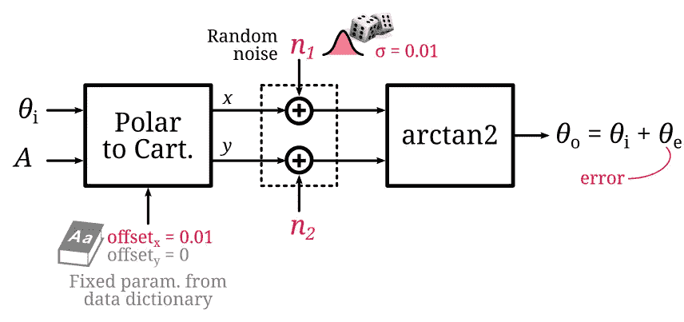
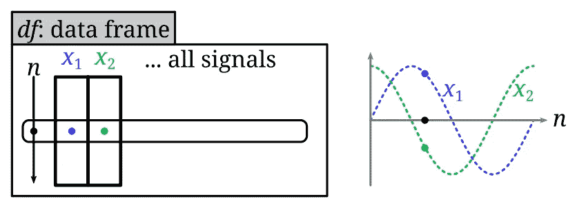
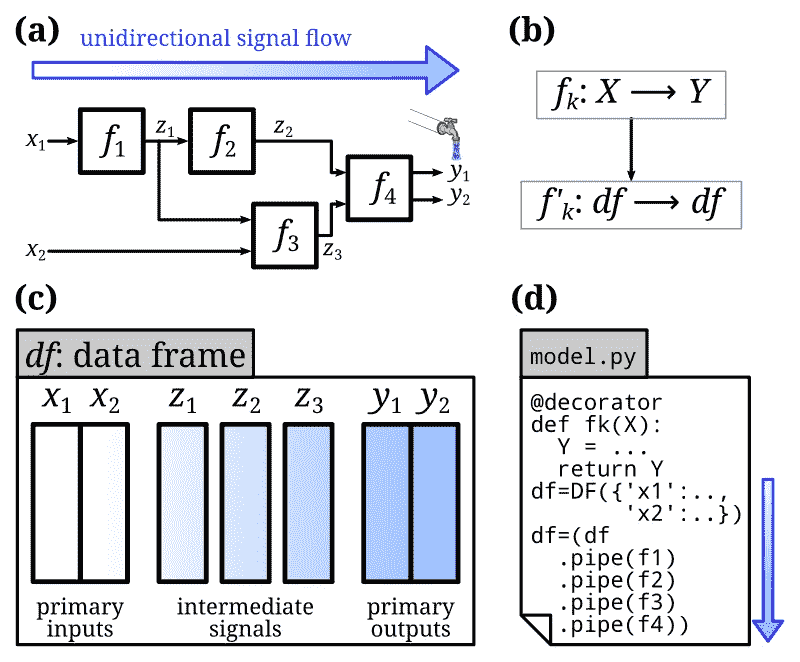
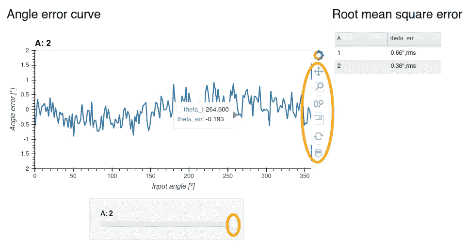

# Python 中的功能建模和定量系统分析

> 原文：<https://towardsdatascience.com/functional-modeling-and-quantitative-system-analysis-in-python-22b90bf0b9b5?source=collection_archive---------25----------------------->

## [实践教程](https://towardsdatascience.com/tagged/hands-on-tutorials)

## **使系统框图可执行的编码模式**

> 本文介绍了一种实用的编码模式来对系统进行建模和分析。这由一个**的现实例子**来说明。该示例是完整开发的，包括**完整代码**清单。这旨在成为**系统架构师和工程师**的**快速入门**指南。

# 介绍

功能建模是一种建立工程系统模型的技术。模型化的系统被视为一组相互关联的功能。
每个功能都将输入转换为输出，其行为可能取决于参数。在图形上，这通常由功能框图来描述。

为了定量分析这种功能框图，需要一种可执行的数学表示。Python 非常适合这项任务。不仅仅是编码和执行数学模型，而是实际执行分析，绘制结果，并通过可复制的计算环境共享工作。本文介绍了 Python 中的一种编码模式，以简明地对功能框图建模，作为定量系统分析的一部分。编码模式应用于简单的工程分析环境中:信号转换链中的误差源分析。

# 功能链的示例

我们仅限于没有反馈回路的单向功能链的情况。反馈循环引入了需要扩展模式的动态效果——这将在后续文章中讨论。考虑下面说明性的功能框图。



说明性功能框图(图片由作者提供)。

它显示了从极坐标( *θi，A* )到笛卡尔坐标 *(u，v)* 以及反过来的变换链。需要注意的是，这个链中有一些错误源，用红色突出显示。为了举例，假设分析旨在量化由各种误差源产生的最终角度误差。这个例子的灵感来自于作者作为磁传感器架构师的职业经历[1]。基本原则是通用的。

假设极坐标到笛卡尔坐标的变换存在偏移。这些是一次分析运行的固定参数。进一步假设笛卡尔坐标被噪声污染，随机样本从具有给定标准偏差(另一个固定参数)的正态分布中抽取。最后一个功能块简单地用 2 参数反正切值重新计算输出角度(Numpy 中的 *np.atan2* )。直观上，如果偏移和噪声相对于振幅 *A* 相对较小，则角度误差 *θe* 应该较小。

# Python 中的函数定义

对于每个功能块，我们定义一个将输出与输入相关联的数学函数: *Y= f(X，P)。*通常，输入或输出可能是多维变量，因此使用大写符号。在功能输入中，我们区分在块之间流动的变量信号 *X* ，以及由设计或环境条件设置的具有固定值的参数 *P* 。对于给定的分析运行，这些参数是恒定的。Python 中有偏移误差的极坐标到笛卡尔坐标变换的直接对应函数定义如下:

```
def f(A, theta_i, offset_u, offset_v):
  return (A * np.array([np.cos(theta_i), np.sin(thetat_i)]) 
           + np.array([offset_u, offset_v])) 
```

注意，上面的定义没有区分可变输入和固定参数。它还返回匿名输出:这两个输出被简单地分组在一个数组中，没有标记。这种编码方案是一个很好的起点，但缺乏模块化。

为了模块化，我们希望能够链接功能块，而不管它们的功能签名。为了获得统一的函数签名并允许链接，我们引入以下编码模式。

*   首先，我们将所有固定参数分组到一个公共数据字典[1] *dd* 中。这使得确定用于分析运行的确切参数集变得更加容易。为了方便起见，我们将这个数据字典打包成一个 [Pandas](https://pandas.pydata.org/) 系列，以允许使用更短的点符号快速访问底层元素: *dd.parameter_1* (与 Python 中更冗长的 *dd['parameter_1']* 相比)。
*   其次，我们还将变量输入分组到另一个系列 *X* 。
*   最后，输出也用命名标签分组。

按照这种约定，函数签名的形式总是:*Y = f(X，dd)。*这与输入和输出的数量无关。以下是 *polar2cart* 的改编定义:

```
dd=pd.Series({
  'offset_u' : 0.01, 
  'offset_v' : 0.0,
  'noise_std': 0.01,
})def polar2cart(X, dd):
  return ({
    'u': X.A * np.cos(X.theta_i) + dd.offset_u,
    'v': X.A * np.sin(X.theta_i) + dd.offset_v,
  })
```

可以按如下方式调用:

```
polar2cart(pd.Series({'A': 1, 'theta_i': 0}), dd=dd)
```

在现阶段，人们可能想知道上述公约有什么好处。好像挺啰嗦的。

所提出的模式的主要优点是易于扩展到表格数据集，在 Pandas 中称为数据框架。数据帧是用离散时间变化信号进行的完整模拟运行的简明表示，其中一行表示在给定时刻所有信号值的一个快照。



编码信号波形的数据帧(图片由作者提供)。

让我们从主要输入(模拟的刺激)开始:输入角度 *θi* 和振幅 *A* 。让我们针对两个幅度 *A* =1 和 *A* =2，生成对应于完整角度扫描(从 0 到 2π)的数据帧。

```
import itertools
itertools.product([1,2], [3])
df = pd.DataFrame(itertools.product(
    np.arange(0,2*np.pi,np.pi/100),
    [1,2]),
    columns=['theta_i', 'A'])
display(df)
```

我们现在可以包装我们之前的函数(在 Python 中这被称为“修饰”函数),这样它就可以处理数据框输入和输出。
这可以通过将函数应用于每一行，并连接输出和输入数据帧来实现。使用这种编码模式，在输入变量的表格数据集上执行任何函数 *f* 只需调用: *df=f(df，dd)* 。

下面是 *polar2cart* 函数的定义，这次它被包装成数据帧友好的，并调用它。

```
def apply_func_df(func):
  def wrapper(df, dd):
    Y = df.apply(func, dd=dd, axis=1, result_type='expand')
    return df.drop(columns=Y.columns, errors='ignore').join(Y)
  wrapper.__wrapped__ = func
  return wrapper[@apply_func_df](http://twitter.com/apply_func_df)
def polar2cart(X, dd):
  return {
    'u': X.A * np.cos(X.theta_i) + dd.offset_u,
    'v': X.A * np.sin(X.theta_i) + dd.offset_v,
  }df=polar2cart(df, dd)
display(df)
```

# 对数据帧的操作

由于所有变量都在一个数据框中，我们可以利用 Pandas 库的广泛功能进行快速内联操作。例如，可以很容易地应用移动平均:

```
df[['u_avg', 'v_avg']]=df[['u', 'v']].rolling(2, center=True).mean()
```

像这样的简单操作可以直接在完整的数据帧上执行，而不需要调用我们的装饰器。这是因为 Pandas 内置的广播机制，默认情况下，它将算术运算扩展到整列。例如，要添加噪声，我们可以定义下面的函数，绕过我们的装饰器:

```
def add_noise(df, dd):
 df[['u', 'v']] += np.random.randn(len(df),2)*dd.noise_std
 return df

df=add_noise(df, dd)
```

对于复杂的操作(例如，控制逻辑，或者不同的输出)，我们提出的编码模式仍然有效:定义一个初等函数并用我们的装饰器包装它。

# 对链条的其余部分进行建模

回到功能链，我们仍然需要对角度计算块进行建模。我们还可以计算考虑相位缠绕的角度误差(-π = +π，以角度表示)。使用我们的编码模式，我们将两个额外的函数 *calc_angle* 和 *calc_angle_err* 定义如下:

```
[@apply_func_df](http://twitter.com/apply_func_df)
def calc_angle(X, dd):
 return {
 'theta_o': np.arctan2(X.v, X.u)
 }[@apply_func_df](http://twitter.com/apply_func_df)
def calc_angle_err(X, dd):
 e = X.theta_o — X.theta_i

 # account for phase wrapping
 if e > np.pi:
 e-=2*np.pi
 elif e < -np.pi:
 e+=2*np.pi

 return {
 'theta_err': e
 }
```
```

最后的修饰操作可能是将弧度转换为角度，以便更容易地解释绘图。因为这是单个 Numpy 操作，所以我们可以直接对数据框列进行操作。我们在名称包含 *theta_* 的所有列上就地操作。

```
def convert_to_deg(df, dd):
  df[df.filter(like='theta_').columns]=np.degrees(
    df[df.filter(like='theta_').columns])
  return df
```

# 完整管道

所有功能块的功能都已定义，并在需要时进行包装，以使它们都与数据帧兼容。我们现在可以使用 pipe [3]操作符将所有操作链接起来，如下所示:

```
df=(df
 .pipe(f1, dd)
 .pipe(f2, dd))
```

完整的工作流程如下图所示。

*   (a)我们从单向信号流的功能模型开始。
*   (b)我们用 python 函数 *Y=f(X，dd)* 对每个功能块建模。如果需要的话，我们包装了这个函数，这样包装的函数就可以直接在数据帧上操作。
*   (c)我们用主要输出填充数据框。
*   (d)我们按照与信号流相同的顺序依次调用管道中的每个函数。这将逐步扩展数据帧。



Python 中函数建模的工作流(图片由作者提供)。

汇总统计也很容易计算，因为我们在单个数据帧中有所有信号值。下面我们展示了如何通过提取两个不同振幅的均方根(RMS)误差，在数据透视表中轻松总结结果。我们最后通过调用 *df.plot(…)* 或 *df.hvplot* 来绘制关键曲线，这是一个带有 Holoviews 的交互版本【4】。



总结分析的交互式绘图和表格(图片由作者提供)。

附录中提供了生成上述图的完整代码清单。

# 结论

我们提出了一个通用的编码模式，适合于用 Python 实现一个单向框图的可执行模型。该模式基于初等函数，这些初等函数直接作用于表格数据集，如 Pandas 数据框。然后简单地通过从刺激开始链接这些操作来调用端到端模拟。我们在定量系统分析中演示了这种编码模式，以说明其优势。主要优势是:

1.  我们利用 Pandas 内置的大量数据框操作(切片、过滤、查询、数据透视表、绘图……)。
2.  我们获得了可直接追溯到框图的模块化可执行模型。

# 参考

[1] N. Dupré、Y. Bidaux、O. Dubrulle 和 G. Close，“具有 1%精度的杂散磁场免疫磁位移传感器”，IEEE Sens. J，2020 年 5 月。可用:[https://doi.org/10.1109/JSEN.2020.2998289](https://doi.org/10.1109/JSEN.2020.2998289)

[2] Mathworks，“什么是数据字典？”。Mathworks 帮助中心。可用:[https://ch . mathworks . com/help/Simulink/ug/what-is-a-data-dictionary . html](https://ch.mathworks.com/help/simulink/ug/what-is-a-data-dictionary.html)。访问日期:2021 年 1 月 24 日。

[3] B. Chen，“使用 Pandas 方法链接提高代码可读性”，走向数据科学，2020 年 8 月。可用:[https://towards data science . com/using-pandas-method-chaining-to-improve-code-readability-d 8517 c 5626 AC](/using-pandas-method-chaining-to-improve-code-readability-d8517c5626ac)

[4] A. Rilley，“使用全息视图在 Python 中实现高级数据可视化”，走向数据科学，2020 年 6 月。可用:[https://towards data science . com/advanced-data-visualization-with-holo views-e 7263 ad 202 e](/advanced-data-visualization-with-holoviews-e7263ad202e)

# 附录:完整的代码清单

完整的代码笔记本可以在[那里](https://gist.github.com/gael-close/3dd0ef09a22def02ec97246543d9d4ae)找到，还有一个可执行版本的链接。