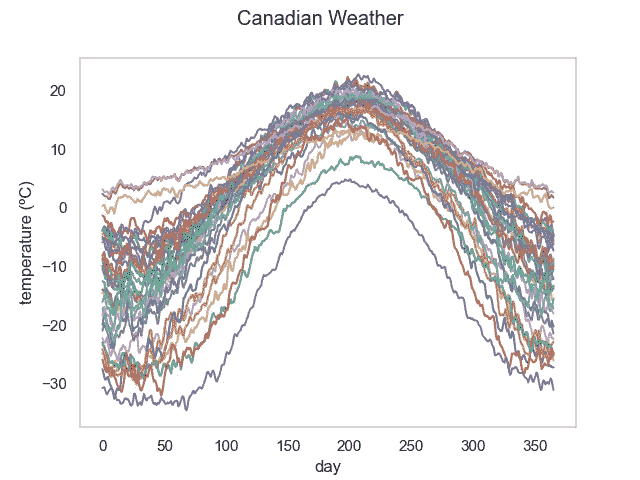
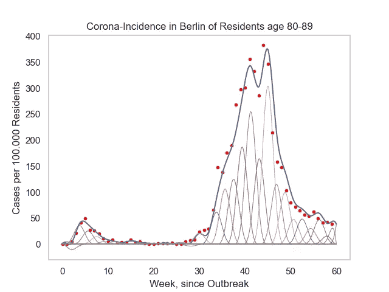
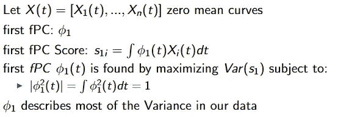
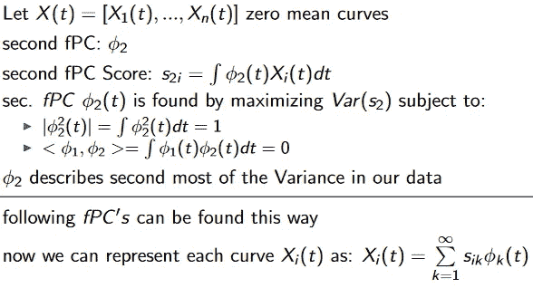
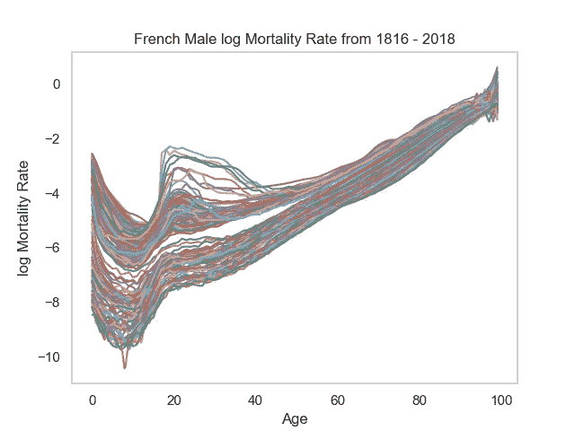
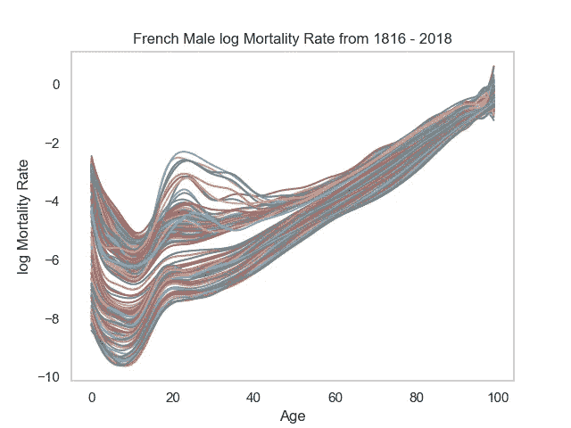
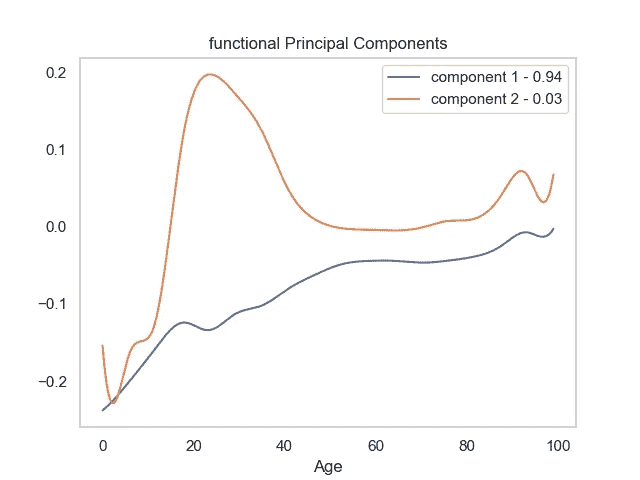
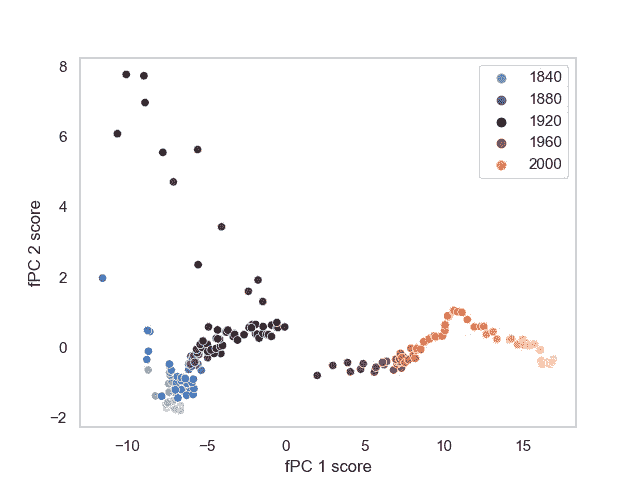

# 函数主成分分析和函数数据

> 原文：<https://towardsdatascience.com/functional-principal-component-analysis-and-functional-data-91d21261ab7f?source=collection_archive---------7----------------------->

## [实践教程](https://towardsdatascience.com/tagged/hands-on-tutorials)

## 简要介绍函数数据，尤其是函数主成分分析。

功能数据的典型示例(图片由作者提供)

# 功能数据

功能数据到底是什么？

假设您连续多年每天都在测量家乡的温度。如果你接着查看累积的数据，你可能会得出结论，温度在一年内的表现有些相似。嗯，这很明显，我们毕竟是按照这种模式生活的。天气受时间控制。事实上，有人可以说，有一个潜在的时间函数，导致了你的测量。现在在函数数据分析中，我们不把我们的测量数据解释为一个观察序列，而是一个单一的函数或曲线。这比传统的时间序列视图有多方面的优势。

1.  一个函数通常可以在任何时间点进行求值。
2.  我们可以分析函数的导数。
3.  功能可以很容易地注册到一个共同的时间表。
4.  函数可以为我们的数据提供更加自然和直观的视图。
5.  不必在相同的时间点进行测量才能进行比较。

第五点其实是一个普遍的问题。经常发生的情况是，您想要比较时间序列，但是它们的测量值不是同时进行的，或者一个测量值比另一个测量值多。比较这些会有问题。如果我们把数据看作函数，比较就容易多了。

# 我们是不是忘了什么？

函数是连续的，测量是不连续的。

是的，事实上测量是不连续的。但是我们可以估计数据的基本函数。通过这种方式，我们还能够进行平滑处理，这对于降低噪声来说是理想的。你可能会问，如何做到这一点？一种常见的方法是使用基展开。这里，我们将通过基函数的线性组合来表示我们的测量值。

(图片由作者提供)

常见的基函数是 B 样条、小波或傅立叶基。我们使用的基函数越多，我们得到的平滑就越多。这可能是为了减少噪音。在上面的图中，我使用了 20 个 B 样条来估计我的数据的基本函数。

现在你知道了什么是函数数据，以及我们如何从我们的离散测量中估计出潜在的函数。你现在是某种专家了。

# 功能主成分分析

主成分分析的老大哥。

有大量的技术来分析功能数据。其中许多都有一个非功能性的对应物，您可能已经使用过了。FPCA 是基于主成分分析，一种著名的降维技术。为了理解 FPCA，我们至少应该简要地谈谈 PCA。

## 主成分分析

函数主成分分析的小兄弟。

PCA 解决了数据分析中的一个常见问题。很多时候，我们必须降低大型数据集的维度。这是很有问题的，因为每个维度都存储着信息，如果我们忽视它们，我们就会丢失这些信息。也就是说，我们需要在降低维度的同时测量信息。在 PCA 的情况下，这个度量是我们的数据内的变化。哪里有变异，哪里就有信息。

PCA 找到所谓的主成分(向量)，其沿着它们的方向最大化数据的方差。每个主成分解释了数据中总方差的一部分。他们建立了一个标准正交基，这意味着每个数据点是我们的主成分的线性组合。现在，我们可以通过使用 PC 的子集来表示数据点，从而降低数据的维数。例如，我们将选择最小数量的 PC，它们的总方差超过 95%。这样，我们减少了数据集的维度，但仍然保留了大部分信息。

如果您不熟悉 PCA，我鼓励您阅读这篇文章，以便更好地了解这项技术。

 [## 主成分分析的一站式商店

### 在我用于研究生统计理论课的教科书的开始，作者(乔治·卡塞拉和罗杰…

towardsdatascience.com](/a-one-stop-shop-for-principal-component-analysis-5582fb7e0a9c) 

## 真正的交易

FPCA 本质上与 PCA 做完全相同的事情，但是有一些小的不同。在 PCA 中，我们处理向量，而在 FPCA 中，我们处理函数。这意味着我们的主要组成部分也是函数，或曲线。在下文中，我们称它们为功能主成分(fPC)。现在我们如何找到这些 fPC？

给定 n 条曲线，通过最大化第一个 fPC 分数的方差来找到第一个 fPC。我们将第一个 fPC 限制为一个，因为我们可以通过增加第一个 fPC 来无限地最大化。这样我们可以找到最大化的明确答案。第一个 fPC 是我们数据变化的主要来源。

现在，与第一个 fPC 相同的过程适用于第二个 fPC(以及以下所有 fPC)。只是这次我们有了一个额外的约束。也就是说，第二 fPC 与第一 fPC 正交。事实上，所有 fPC 都必须相互垂直。现在，每条曲线都可以表示为 fPC 的线性组合。fPC 分数告诉我们一条曲线在多大程度上由它各自的函数主成分组成。

现在你也知道了功能主成分背后的理论，但是如何应用这种技术呢？

# 一个典型的用例

也是一个相当温和的人。

可以探索性地使用 FPCA 来更深入地了解您的数据。现在我想给你们举个例子。我们想要分析的数据是过去 200 年来法国男性的对数死亡率。

(图片由作者提供)

首先，我们估计数据的基本函数。如前所述，我们使用 B 样条基展开来实现这一点。这额外导致平滑，这是伟大的，因为我们减少噪音。

(图片由作者提供)

现在我们运行功能主成分分析，看看前两个功能主成分。这两个解释了我们数据中大约 97%的变化。

(图片由作者提供)

这些功能性主成分的解释可能相当困难，因为在数据中可能没有明显的对应物。在我们的例子中，这种解释幸运地非常直观。

第一个 fPC 似乎是我们数据的均值函数的变化。这种变化会随着时间的推移而减少。也可以说，我们越老，我们的死亡就越确定。这个 fPC 解释了我们数据中 94%的变化。

第二个 fPC 似乎与 20-40 岁的人有关。这暗示了在我们的数据中，这个年龄组的死亡率与其他年龄组有很大的不同。我立即想到的是两次大战，它们造成了如此多年轻人不必要的死亡。

还记得我们说过如何找到函数的主成分吗？当时，我们了解到数据中的每条曲线都可以表示为 fPC 的线性组合，其中每个 fPC 分数决定了曲线在多大程度上由哪个成分解释。我们现在可以做的是将每条曲线缩减为一个二维点，由前两个 fPC 分数组成。

(图片由作者提供)

这很有趣。通过颜色编码，我们可以看到战争年代的曲线在很大程度上是由第二 fPC 解释的。这是一个好消息，因为我们的解释是正确的。我们也可以很清楚地看到，死亡率在 1950 年左右有一个很大的转变。这在原始数据中并不清楚。我们不仅深入了解了数据，还在不丢失太多信息的情况下降低了数据的(高维)维度。我们现在能够进一步使用这种表示并应用传统的聚类算法。

最后我想提一下，我从[2]中获得了这个分析的灵感。如果你对 FPCA 更深入的解释和示范性的使用感兴趣，我鼓励你去看看。

在[3]中还可以找到 scikit-fda python 包的文档。它为多功能分析工具提供了许多易于理解的例子。

[1] *人类死亡率数据库*。加州大学伯克利分校(美国)和马克斯·普朗克人口研究所(德国)。可在 www.mortality.org 的[或](http://www.mortality.org) [www.humanmortality.de](http://www.humanmortality.de) 获得(数据于【01.06.2021】下载)。

[2]尚，H.."功能主成分分析综述."AStA 统计分析进展 98(2014):121–142。

[[3]https://FDA . readthe docs . io/en/latest/auto _ examples/index . html](https://fda.readthedocs.io/en/latest/auto_examples/index.html)