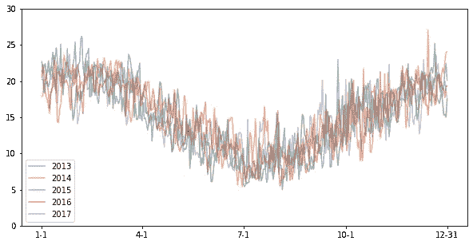

# 功能时间序列

> 原文：<https://towardsdatascience.com/functional-time-series-83b717cca12?source=collection_archive---------12----------------------->

## [实践教程](https://towardsdatascience.com/tagged/hands-on-tutorials)

## 当我们更频繁地测量数据时，我们如何才能最好地分析它？功能数据分析(FDA)可以大大简化分析。


由[罗斯蒂斯拉夫·萨维钦](https://unsplash.com/@ross_savchyn?utm_source=medium&utm_medium=referral)在 [Unsplash](https://unsplash.com?utm_source=medium&utm_medium=referral) 上拍摄的照片

随着内存空间的增长，存储数据变得越来越便宜，这反过来意味着存储越来越多的数据。在时间序列的情况下，这意味着更频繁地收集数据。

然而，还不清楚如何对以(非常)高的频率记录的时间序列建模，尤其是当涉及(多个)季节性时。

我们应该把数据看作一元时间序列还是高维的多元时间序列？在许多情况下，最好将观察值视为时间的函数，并分析这一函数时间序列本身。例如，我们可以将股票的日内价格划分为每日观察值，我们观察每天的价格随时间的变化。(听起来很专业，但是我们后面会看到一个例子！)

当函数数据是连续的时，后一种方法特别有用，因为它意味着比高维向量更多的结构(对于连续函数，如果 *x* 接近 *y* ， *f(x)* 接近*f(y)*； *x(i)* 对于一个向量 *(x(1)，…，x(d))* ，不需要靠近 *x(i+1)* 。

功能数据在不同的环境中自然出现，如医学(脑电图数据)、金融(股票价格)或气象学(温度)。

在这篇博文中，我们将通过例子来尝试对函数时间序列有一个直观的理解。此外，假设检验的独立性和平稳性的假设函数时间序列介绍。

注:自始至终，我们都假定你熟悉时间序列分析的基本概念。如果想刷新一下知识或者入门题目，可以查看我的 [*以前的博文*](/time-series-analysis-part-i-3be41995d9ad) *。*

# 介绍

先说个例子。假设我们在一段时间内测量了特定位置的温度，并且每天收集一个观测值，那么对于年份 *t* 和日期 *i* 我们有观测值 *X(t，i)* ，其中 *i ∈ {1，…，d}，t ∈ {1，…，n}* 和 *d = 365* (每年的天数)，如图 1 所示。


图 1:2013-2017 年悉尼每日气温；x 轴:时间，y 轴:摄氏温度；作者图片

现在我们有不同的选择来处理数据。首先，我们可以将其视为一个单变量时间序列，并简单地按时间顺序连接数据，因此在技术上 *Y(t) = X(j，i)* 其中 *t = (j-1) d + i* 。在这种情况下，我们有季节性，这使得分析更加困难。

我们还可以将时间序列建模为一个多变量时间序列，其维数与每年的观测值一样多，这样时间序列的每个观测值都对应于全年收集的数据: *Y(t) = ( X(t，1)，…，X(t，d) )* 。现在不用考虑季节性，但是维度很高(准确的说是 365 维)。当然，我们可以通过降低观测频率来降低维数。然而，在这种情况下，我们丢失了信息，并且不清楚如何选择频率(每周还是每月？).

最后一种方法是将数据视为函数时间序列 *Y(t，x)* ，其中我们有一个函数 *Y(。，x)* 为每年 *t* 用 *Y(t，i/d) = X(t，i)* 。在这种情况下，年温度被视为时间的函数，每个观测值对应于一个描述年温度的函数。在图 2 中，来自图 1 的数据被视为函数时间序列。



图 2:悉尼不同年份的气温；x 轴:时间，y 轴:摄氏温度；作者图片

数据的功能视角具有重要的优势。在这个例子中，全年的平均温度显然不是常数。然而，夏季的平均温度高于冬季的平均温度。因此，当建模为函数时间序列时，非平稳单变量时间序列可能是平稳的，因为我们比较的数据是合理的(例如，将 2016 年 1 月的温度与 2017 年 1 月而不是 2016 年 7 月的温度进行比较)。

此外，将数据建模为函数时间序列通常比使用高维时间序列更自然，因为它增加了额外的结构。例如，如果我们观察连续函数，如温度或股票价格，两个相近时刻的值是相似的，而这种结构对于任意多元时间序列是不存在的。

这在精神上类似于卷积神经网络。由于其特定的体系结构，CNN 的使用更多地局限于一组特定的问题，然而对于这组问题，它们工作得非常好。

功能数据分析(FDA)是一个活跃的研究领域，可用于各种应用。在下文中，我们将重点关注一种特定类型的函数数据，即函数时间序列。然而，请注意，许多来自统计的经典结果被推广到功能数据，例如比较不同组的期望值的 t 检验。

# 功能时间序列—基础知识

好的，我提到了函数时间序列，我们看到了一个例子，但是数学上什么是函数时间序列呢？它与单变量时间序列有什么不同？

数学上，只有很小的差别。单变量实时序列是由时间索引的真实数据的集合(见[此处](/time-series-analysis-part-i-3be41995d9ad))。所以对于时刻 *1，2，…，n* ，我们观察实值数据 *Y(1)，Y(2)，…，Y(n)* ，比如特定地点的温度或者某个股票的价格。一个*泛函时间序列*基本相同，只是我们观察的是函数而不是实值数据。在这种情况下， *Y(1)，Y(2)，…，Y(n)* 是函数，可以写成 *x* 中的函数，即 *Y(1)(x)，Y(2)(x)，…，Y(n)(x)* 。为了简单起见，我们经常假设函数定义在区间*【0，1】*上，必要时重新调整区间(如果 *f(x)* 定义在区间*【0，T】*， *g(x)=f(xT)* 定义在区间*【0，1】*)。

*技术说明:我们在一个函数空间而不是实数空间中工作，不清楚如何为函数数据定义诸如期望值或协方差之类的量。幸运的是，在大多数情况下，均值和协方差可以逐点定义，因此等式 E[Y(i)](x) = E[Y(i)(x)]和 Cov(Y(i)(x)，Y(j)(z)) = Cov(Y(i)，Y(j))(x，z)成立。
根据观察值的连续性或 L-可积性等假设，我们可能有额外的结构(连续函数的空间是 Banach 空间，L-空间是 Hilbert 空间)，在这些情况下，逐点定义是合理的。*

# 平稳性和独立性测试

至于单变量时间序列，平稳性和独立性的概念大大简化了任何进一步的分析，所以我们想知道它们是否是合理的假设。在概念层面上，想法与单变量的情况相同:如果概率因子分解，两个函数观察是独立的；如果时间序列的分布在一段时间内保持不变，则时间序列是稳定的(参见[这篇博客文章](/time-series-analysis-part-i-3be41995d9ad)的严格定义)。

在[这篇博文](/time-series-analysis-part-ii-ii-bece7ecc9647)中，我们已经看到了如何验证单变量时间序列的两个假设。对于函数数据，我们可以做完全相同的事情，即使用累积和统计量来确定时间序列是否是(弱)平稳的，并使用组合测试来验证(或拒绝)独立性的零假设。

## 弱平稳性测试

当处理时间序列时，我们想知道它们是否是平稳的，因为在这种情况下，我们不需要考虑时间的变化。然而，平稳性是难以衡量的，我们经常使用时间序列的时刻作为代理。直观上，如果矩不随时间变化，我们可以忽略潜在分布的时间变化。因此，我们想测试给定时间序列的均值和(自)协方差是否是时不变的，而不是测试平稳性。对于一个函数时间序列 *Y(1)(x)，Y(2)(x)，…，Y(n)(x)* ，这转化为假设


对于某些 *i ∈ { 2，…，n }* 和


对于某些 *i ∈ { 2，…，n-h}* 。

如果零假设对任意正整数 *h* 有效，则时间序列 *Y(i)* 是弱平稳的。注意 *Y(i)* 的一阶和二阶矩本身就是函数。所以两个函数相等依赖于函数空间。在连续函数空间中，比如两个函数 *f* 和 *g* 在任意一点 *x* 相等，那么如果 *f(x)=g(x)* 。相反，在平方可积函数空间 *L* 中，两个函数相等，如果它们几乎在每个点都重合(w.r.t .勒贝格测度)。

我们通常将注意力限制在第一个 *H* 滞后上(对于所有 *1 ≤ h ≤ H* 的 *h* )，而不是对所有滞后 *h* 测试后面的假设，因为它们从根本上决定了分布的行为。在下文中，我们将只测试 *H₀* ，因为我们可以类似地测试关于二阶矩的零假设。此外，我们假设数据是平方可积的，因此它属于范数由 *||表示的空间 *L ([0，1])* 。||* 。在这种情况下,( 1)中的测试问题等价于


在单变量方案中，我们可以使用累积和统计量，它基本上将第一个观测值的平均值与其余观测值的平均值进行比较。(函数)累积和统计量定义为


在零假设(和弱假设)下， *√n C(u，x)* 弱收敛于空间中协方差函数未知的一个中心高斯过程 *B(u，x)**L([0，1])**| |。||₂* 。反之， *√n C(u，x)* 在选择下偏向 *+∞* 或 *-∞* 。所以如果 *√n C(u，x)* 偏离其极限 *B(u，x)* 太多，我们可以拒绝 *H₀* 。

不幸的是，我们不知道 *B(u，x)* 的分布，因为我们不知道协方差，需要估计它。有不同的方法可以做到这一点，时间序列分析中的一种常见方法是使用块乘数自举近似，这基本上是一种考虑时间相关性的重采样方案。

如果 *q(α)* 表示 *||B||₂* 的 *α* 分位数(例如，通过 bootstrap 过程或协方差的直接估计获得)，我们可以拒绝 *H₀* 每当 **√n ||C||₂ > q(1-α)** 。这为 *H₀* 定义了一个渐近一致水平α测试。

## 组合式测验

与平稳性类似，随机独立性很难测量，我们使用时间序列(自)协方差结构作为代理来评估其依赖程度。为简单起见，我们假设时间序列是平稳的和居中的，即 *E[Y(i)]=0* (这个假设可以用类似于给出的过程来检验)。同样，我们主要对小滞后的自协方差感兴趣。根据经典的组合测试，我们考虑假设


像以前一样，函数时间序列的二阶矩本身就是函数，所以我们根据它们的范数来制定假设。

为了避免多重测试问题，我们同时比较所有的矩，而不是通过考虑它们的最大值来单独测试它们。

作为检验统计量，我们可以使用(最大的)经验矩


估计器 *Mₙ(h)* 以概率收敛于*e[y(1)y(1+h)】*，滞后时的自协方差 *h* 。因此，我们可以拒绝零假设，如果 *Mₙ(h)* 明显偏离其极限。

在零假设下，对于某个居中的高斯变量 *B(h)* ，认为 *√n ||Mₙ(h)||₂* 弱收敛于 *||B(h)||₂* ，而在选择下发散到无穷。

同样， *B(h)* 的协方差结构是未知的，它的分布可以用 bootstrap 程序来近似，就像在平稳性测试的情况下一样。

如果 *q(α)* 表示*最大{||B(h)||₂: 1 ≤ h ≤ H}* 的(近似) *α* 分位数，我们可以随时拒绝 *H₀*


其为 h₀*定义了渐近一致水平α测试。*

# 用 Python 实现

对于实施，我们使用来自澳大利亚的气候数据。更具体的说是澳大利亚政府气象局[提供的悉尼(站号 066062)1859-2017 年的日最低气温。](http://www.bom.gov.au/climate/data/)

首先，我们需要加载所需的包并准备数据:

## 均值平稳性的检验

为了测试均值的平稳性，我们定义了三个辅助函数来计算累积和统计量、 *L -* 范数和 bootstrap 复制来逼近分位数。

```
Test Statistic: 2.11
Approximated quantile: 1.84
The null hypothesis can be rejected
```

输出表明，我们可以拒绝常数均值函数的零假设。因此，从 1859 年到 2017 年，悉尼的温度不太可能是稳定的，这表明气候发生了变化。

## 非相关性测试

对于前面介绍的组合体类型测试，我们定义了两个辅助函数。第一个函数计算(函数)观测值的乘积，这些乘积稍后将用于更有效地计算经验矩。第二个函数生成 bootstrap 复制来逼近分位数。

*请注意，计算可能需要一些时间，因为分位数近似值的计算开销很大。*

*还要注意的是，为了简单起见，我们假设时间序列是居中的和平稳的。在给定的例子中，这两个假设显然都不满足。通过减去估计的(局部)平均值，我们可以将该方法推广到非中心时间序列，但它将是不稳定的，如前面的测试所示。无论如何，我们可以用这些数据来说明这种方法。*

```
Test Statistic: 2587.612
Approximated quantile: 67.463
The null hypothesis can be rejected
```

结果表明，不相关的零假设可以被拒绝。如前所述，这一结果是不可解释的，因为它既不合理假设时间序列的中心性也不平稳。

# 结论

函数数据分析比单变量数据分析更具技术性，但具有一些重要的优势，可用于许多应用。在概念层面上，这两种方法是相似的，我们可以使用(几乎)相同的思想和技术。

除了功能时间序列，FDA 还有许多其他重要的应用——它甚至可以用于维度缩减，这乍一看似乎违反直觉——这是我们作为数据科学家应该知道的一个话题。

*如果你对时间序列分析监控机器学习模型的应用感兴趣，这篇文章可能适合你:*

</monitoring-ml-models-in-production-768b6a74ee51>  

*如果你对单变量时间序列感兴趣，可以看看这两篇入门帖子:*

</time-series-analysis-part-i-3be41995d9ad>  </time-series-analysis-part-ii-ii-bece7ecc9647> 