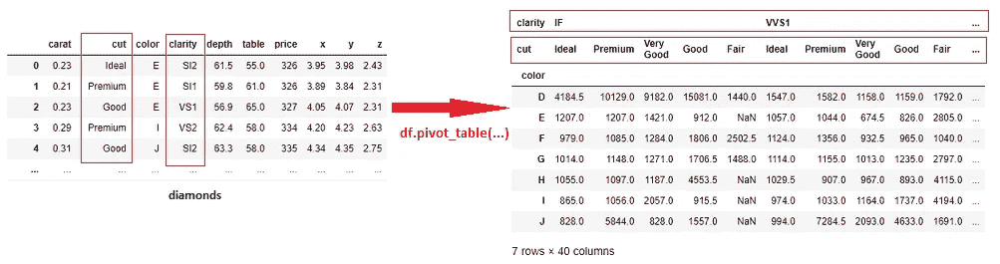
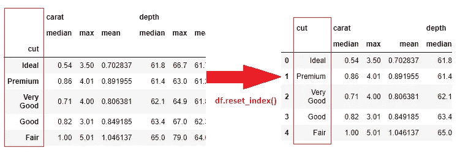
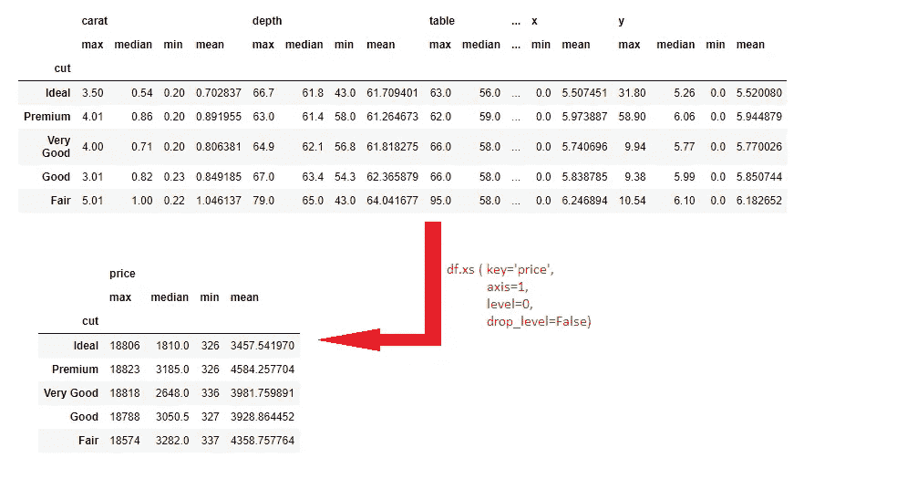

# 在 Pandas 中生成多重索引的函数以及如何删除级别

> 原文：<https://towardsdatascience.com/functions-that-generate-a-multiindex-in-pandas-and-how-to-remove-the-levels-7aa15ac7ca95?source=collection_archive---------6----------------------->

## groupby 和 unstack 操作如何创建多重索引，以及如何在不损害数据完整性的情况下删除多重索引


由[凯利·西克玛](https://unsplash.com/@kellysikkema?utm_source=medium&utm_medium=referral)在 [Unsplash](https://unsplash.com?utm_source=medium&utm_medium=referral) 上拍摄的照片

**简介**

在本文中，我们将了解什么是多重索引，何时何地使用它，生成多重索引的函数，以及如何将它折叠成一个单一的索引。

但是首先，让我们弄清楚一些基本的定义。

**索引**是数据帧中“唯一”标识每行的一列。可以把它想象成行标签。


作者图片

**多指标**是指有一个以上的指标。其他名称有*多重指标*和*分级指标*。


作者图片

Multiindex 也可以指**多个标题级别**，或者当你有一个列名的层次结构时。


作者图片

**多指标的优势**

*   用于保存包含层次结构或级别的高维数据。
*   以表格形式直观显示层次结构级别，非常有用。
*   它允许使用诸如 [df.xs()](https://pandas.pydata.org/docs/reference/api/pandas.DataFrame.xs.html) 和 [df.unstack()](https://pandas.pydata.org/docs/user_guide/reshaping.html#reshaping-by-stacking-and-unstacking) 之类的函数有效地选择和操作层次数据。

**多指标的缺点**

*   这种格式不允许直接绘制图表。
*   使用 multiindex 没有性能优势。

我们将使用来自 [seaborn](https://seaborn.pydata.org/) 的 [diamonds 数据集](https://github.com/mwaskom/seaborn-data/blob/master/diamonds.csv)来演示导致多索引情况的各种场景，以及如何将多索引折叠回单个索引数据框架。

```
import pandas as pd
import seaborn as snsdiamonds = sns.load_dataset('diamonds')
```

那么，我们如何得到多个指数呢？

## 第一部分:生成多重指数

## A.行的多索引

**A1。使用** `**df.set_index(col_list)**`

下面的代码手动将索引设置为两列(`cut`和`clarity`)。

```
sorted_df = diamonds.sort_values([ 'cut’, ’clarity’])multiind_df = sorted_df.set_index([ 'cut','clarity'])multiind_df
```


按作者分类的多索引数据框架

需要注意的事项:

*   层次结构按预期显示。如果没有，记得对这些列的数据帧进行排序。
*   得到的数据帧的行数不变，而是重新排列数据帧，使得层次结构可见。

```
diamonds.shape###Results
(53940, 10)multiind_df.shape###Results
(53940, 8)
```

*   结果列的数量现在少了两个，因为索引丢失了一些列(参见上面的`df.shape`的结果)。
*   该索引现在是多索引。运行`df.index`显示一个多索引列表，其中每个元素都是一个[元组](/ultimate-guide-to-lists-tuples-arrays-and-dictionaries-for-beginners-8d1497f9777c)。

```
multiind_df.index
```


作者图片

*   默认情况下，先前的索引已被删除。当我们将索引设置为新数据帧中的另一列时，请看下面发生的情况。

```
multiind_df.set_index('carat')
```


作者图片

如果您想保留以前的索引，首先使用`df.reset_index()`使索引成为现有列的一部分，然后使用`df.set_index(col_list)`。

**A2。由多列**的 `**groupby**` **产生的多索引**

`[df.groupby](https://pandas.pydata.org/pandas-docs/stable/user_guide/groupby.html)`根据所选列的类别汇总列(特征)。

例如，我们可以通过`cut` 和`color`对菱形进行分组，以查看其他特性在这些类别中的分布情况。我们使用`max()`作为[聚合函数](https://cmdlinetips.com/2019/10/pandas-groupby-13-functions-to-aggregate/)。

```
grouped_df = diamonds.groupby([’cut’, 'color’]).max()grouped_df
```


按作者分组图片

需要注意的事项:

*   行数将大大减少。这是因为只显示唯一的索引(这里是唯一的`cut`和`color` 组合)。指定的聚合函数(`max`)将这些组中的其他值组合成一个值。

```
diamonds.shape###Results
(53940, 10)grouped_df.shape###Results
(35, 7)
```

*   列数也减少到 7 列，因为现在有两列作为索引，而`clarity`被删除，因为聚合函数`max` 不能处理非数字特性。

## B.列的多索引(多个标题级别)

现在让我们来演示一下我们是如何得到多个标题级别的。

**B1。** `**Groupby**` **超过两列则** `**unstack**`

我们将继续使用上一节的代码。我们用`cut`和`color.`进行分组

现在让我们将它分解，这样`‘cut’`类别就显示为列标题。这是通过将它们从行索引翻转到列标题来实现的。

```
grouped_df = diamonds.groupby(['cut','color']).max()unstacked_df = grouped_df.unstack('cut')unstacked_df
```


作者未堆叠 df 的图像

我们现在在原来的标题下面有了一个新的标题级别— `carat`、`depth`、`price,`等等。

B2。 `**Groupby**` **使用几个聚合函数**

在我们之前的分组中，我们只使用了 `max()`作为[聚合函数](https://cmdlinetips.com/2019/10/pandas-groupby-13-functions-to-aggregate/)。但是，我们可以包含几个聚合函数，它们的名称将保持在一个新的级别。

下面的代码将数据按一列分组— `cut` —但是使用了 3 个聚合函数— `median`、`max`和`mean`。

```
diamonds.groupby( 'cut').agg( ['median','max','mean'] )
```


作者图片

B3。使用 `**pivot_table**` **将行转换成列**

一个`pivot_table`提供了一种方便的方法来将列的值重新整形为列标题，就像我们上面使用的 unstack 方法一样。在这里，我们将关注我们的原始钻石数据集。

```
diamonds.pivot_table(
    values = 'price',
    index = 'color',
    columns = ['clarity','cut'],
    aggfunc='median')
```



作者数据透视表 _ 表格

**B4。熊猫交叉标签**

`pandas.crosstab`功能允许我们创建数据频率表。在下面的代码中，我们希望找到每个`color`的`clarity`和`cut`的分布。我们使用`normalize=’columns’`来显示每列的百分比分布。

```
pd.crosstab(
    index = diamonds[’color’],
    columns = [diamonds[’clarity’],
            diamonds[’cut’]],
    normalize = 'columns’)
```


作者的交叉表插图

## 第二部分:删除多重索引

## **C .删除多行索引(每行多个索引)**

**C1。使用** `**df.reset_index()**`

`df.reset_index()`通过将现有索引转换为普通列来重置索引。生成一个[范围索引](https://pandas.pydata.org/docs/reference/api/pandas.RangeIndex.html)作为新的索引。

```
grouped_df.reset_index()
```


作者图片

在多索引的情况下，我们可以通过包含`level=n`来选择要重置的索引的名称(或位置)。

```
grouped_df.reset_index(
    level='cut')
```


作者图片

我们还可以重置索引，并仍然保持多个标题级别。

```
df = diamonds.groupby(
    'cut’).agg(
    [’median’,’max’,’mean’])df.reset_index()
```



作者图片

**C2。使用** `**df.droplevel(level = level_to_drop, axis=0)**`删除多索引

当您想要完全删除一个索引时，可以使用这种方法。

使用前面生成的`grouped_df`，让我们删除`color`索引。注意，我们既可以用`level=index_name`也可以用`level=position`(从 0 开始计数为最外层)。该方法返回修改后的数据帧。

```
grouped_df.droplevel(
    level = 1,
    axis=0)
```


作者图片

**C3。使用** `**df.index.droplevel(level = level_to_drop)**`删除多索引

该函数从索引中删除指定的级别，并返回剩余的索引列表。下一步是将这个列表指定为数据帧的索引。

```
grouped_df.index = grouped_df.index.droplevel('color')
```

打印数据帧，显示与上一节中的图像相同的结果。

## D.删除列标题中的多索引

**D1。合并每列的级别名称**

合并标题级别是一种常见的解决方案，因为两个级别都可能有用，并且在这里不可能重置索引。


多个标题级别


按作者列出的列名元组列表

***方法 1:使用*** `***map***` ***和*** `***join***` ***功能***

函数使用给定的函数修改列表中的每个元素。这里，我们为每个列名准备了一个元组列表。地图用途[。连接](https://www.jquery-az.com/3-ways-convert-python-list-string-join-map-str/)将元组合并成一个用下划线分隔的名称。

```
df.columns.map('_'.join)
```


上面的代码返回一个索引对象。我们需要将它分配给列名，然后打印出数据帧。

```
df.columns = df.columns.map('_'.join)
```


按作者合并标题级别

***方法二:利用列表理解***

一个[列表理解](https://realpython.com/list-comprehension-python/#using-list-comprehensions)也接受一个列表，通过一些操作修改每个元素，并返回一个新的列表。我们使用。join 使用不同的连接符号(|)将每个元组合并为一个名称。

```
df.columns = ['|'.join(s) for s in df.columns]
```


作者图片

另一个列表理解示例使用了 [f 字符串格式](https://zetcode.com/python/fstring/)。这有助于在合并后更改名称的顺序。在下面的代码中，低级别的名称排在最前面。

```
df.columns = [f'{j}#{i}' for i,j in df.columns]
```


按作者合并后反转名称

**D2。使用** `**df.droplevel(level, axis=1)**`删除每列的多索引

如果标题级别对标识列没有用，您可以选择删除它。我们使用`axis=1`(或`axis= ’columns’`)来表示列标题级别。

让我们来演示一下。首先，我们通过`cut`对数据集进行*分组，并使用**四个**聚合函数。然后我们使用`df.xs()`只选择`price`列。*

```
df = diamonds.groupby(
    'cut').agg(
    ['max', 'median', 'min','mean'])df.xs(
    key='price', 
    axis=1, 
    level=0, 
    drop_level=False)
```



作者图片

现在我们可以放弃顶层`‘price’`，因为我们已经知道所有的值都代表价格。

```
df_price.droplevel(
    level=0, 
    axis=1)
```


作者图片

**D3。** `**df.columns.droplevel(level_to_drop)**`

我们还可以删除一个标题级别，并以列表形式返回所需的级别。(这与前面的`df.index.droplevel`类似，但用*列*代替*索引*)。然后，我们将这个列表分配给列名。

```
df.columns = df.columns.droplevel(0)display(df)
```

打印数据帧，显示与上一节中的图像相同的结果。

D4。 `**df.columns.get_level_values(level_to_return)**`

该函数返回所需的级别并删除其余的级别。下面的代码产生的结果与上一节中的图像相同。

```
df.columns = df.columns.get_level_values(1)df
```

## 结论

在本文中，我们探讨了生成多索引的各种函数，以及如何将它折叠回只有一个索引的基本数据框架。

从头开始创建多索引数据框架还有其他方式和几种复杂的方式[访问和选择数据](https://stackoverflow.com/questions/18835077/selecting-from-multi-index-pandas)。我鼓励您使用包含许多显著分类特征的多维数据进行实验和实践，并尝试使用多索引。

在这里找到这篇博文[中使用的代码](https://github.com/suemnjeri/medium-articles/blob/main/multiindex/Multiindex%20notebook.ipynb)。

如果你喜欢这个内容，并希望得到更多类似的通知，请在这里订阅。如果你还不是一个中等会员，在这里加入。感谢您的阅读。

## 参考

1.[熊猫多指数教程](http://zaxrosenberg.com/pandas-multiindex-tutorial/)作者 [Zax Rosenberg，CFA](https://zaxrosenberg.com/)

2.[访问熊猫多索引数据框架](/accessing-data-in-a-multiindex-dataframe-in-pandas-569e8767201d)中的数据 [B. Chen](https://medium.com/u/563d09da62a?source=post_page-----7aa15ac7ca95--------------------------------)

3.[层次索引](https://jakevdp.github.io/PythonDataScienceHandbook/03.05-hierarchical-indexing.html#The-Better-Way:-Pandas-MultiIndex)摘自杰克·范德普拉斯的 [Python 数据科学手册](http://shop.oreilly.com/product/0636920034919.do)