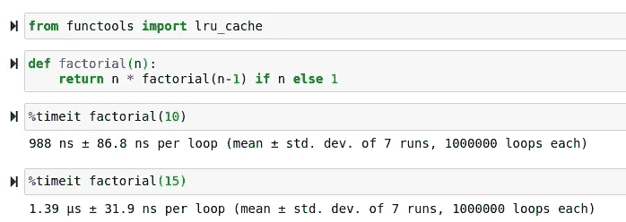
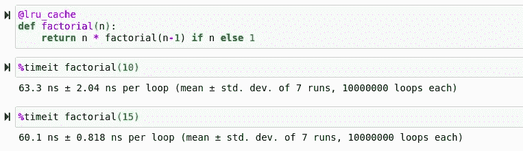

# FuncTools:一个被低估的 Python 包

> 原文：<https://towardsdatascience.com/functools-an-underrated-python-package-405bbef2dd46?source=collection_archive---------4----------------------->

## 使用 functools 将您的 Python 函数提升到一个新的水平


([https://unsplash.com/photos/gnyA8vd3Otc](https://unsplash.com/photos/gnyA8vd3Otc)

# 介绍

上个月，我写了一篇关于 Python 标准库中一些模块的文章，我发现这些模块在我的编程和数据科学生涯中非常有用。这篇文章获得了高质量的反馈，因此我决定再写一篇文章，讨论相同的主题，使用大家都应该熟悉的更多标准库工具。事实证明，Python 编程语言的基础实际上是相当包容的，包括了许多应对各种编程挑战的优秀工具。如果你想读这些文章中的任何一篇，你可以在这里查阅:

[](/10-surprisingly-useful-base-python-functions-822d86972a23) [## 10 个非常有用的基本 Python 函数

### 用这个令人兴奋的列表来复习你的标准模块库吧！

towardsdatascience.com](/10-surprisingly-useful-base-python-functions-822d86972a23) [](/15-more-surprisingly-useful-python-base-modules-6ff1ee89b018) [## 15 个非常有用的 Python 基础模块

### 忘记依赖性，使用标准库！

towardsdatascience.com](/15-more-surprisingly-useful-python-base-modules-6ff1ee89b018) 

当浏览这些工具时，似乎有些工具应该有一整篇文章专门介绍它们，而不仅仅是对它所提供的大多数其他模块的概述。我认为最能体现我这种想法的工具是 functools 模块。这是一个非常强大的模块，通过使用简单和经典的方法，可以用来改进 Python 中的几乎任何功能，例如利用处理器速度上的堆栈。虽然在某些情况下，我可以看到这是一个很大的负面影响，但当然也有例外。

> [笔记本](https://github.com/emmettgb/Emmetts-DS-NoteBooks/blob/master/Python3/Functools%20examples.ipynb)

# 隐藏物

functools 模块提供的最酷的东西可能是能够在内存中缓存某些计算，而不是为了以后重新计算而丢弃它们。这是节省处理时间的一个很好的方法，特别是如果您发现自己处于 Python3 超时的情况下，您的代码无法被解释。虽然这伴随着使用更多内存的代价，但是在许多不同的情况下使用它肯定是有意义的。Python 编程语言本身是相当声明性的，通常解释器为我们处理所有的内存管理。虽然这是一种效率较低的编程方法，但它也消除了许多分配内存和类似事情的麻烦。使用 functools，我们可以通过决定什么在堆栈中，什么将被重新计算来改变这一点。

functools 提供的缓存的好处在于，它既易于使用，又允许用户更好地控制代码下的解释器。利用这一令人敬畏的特性就像在函数上方调用它一样简单。这里有一个关于阶乘计算的例子，我真的认为它很好地利用了这一点:

```
def factorial(n):
    return n * factorial(n-1) if n else 1
```

为了在这个函数中使用缓存，我们将从 functools 中导入 lru_cache，并在我们的函数之前调用它:

```
[@lru_cache](http://twitter.com/lru_cache)
def factorial(n):
    return n * factorial(n-1) if n else 1
```

现在，让我们评估一下，仅仅通过做这个简单的加法，我们可能已经获得的性能优势。让我们看看没有它阶乘函数计算阶乘有多快:



现在，我将运行重新启动内核，以确保没有奇怪的内存问题发生，并运行我们使用 lru_cache 的新函数。



从这个例子中，我们可以看到使用这种缓存技术的巨大好处。众所周知，阶乘很难用计算机计算。在大多数情况下，这是因为阶乘是递归的自然数学示例。结果，二项分布的累积分布函数(CDF)让我做噩梦。这种计算非常密集，以至于编程语言的基本阶乘函数通常会使用查找表，而不是计算数字。

也就是说，如果你打算像这样使用递归，开始熟悉 functools 可能是个好主意。这个标准的库工具可以大大加快 Python 通常很难解决的问题的解决速度。在某种程度上，它真的把我带回了 Numba Python 编译器，在那里一个简单的调用就能让你的代码变得更快。如果你想看我不久前写的一篇文章，你可以在这里看看:

[](/numba-jit-compilation-but-for-python-373fc2f848d6) [## Numba: JIT 编译，但是用于 Python

### 快速浏览一下 2020 年让 Python 变得更好的神奇工具。

towardsdatascience.com](/numba-jit-compilation-but-for-python-373fc2f848d6) 

# 关键功能

有没有这样的时候，你真的想使用一些非常旧的 Python 代码中的函数，但是这个函数被编译成了一个比较函数？在现代 Python 3 中，这些类型的函数不再得到很好的支持，甚至不再被使用，并且将一种函数类型转换成另一种函数类型可能非常困难。也就是说，functools 可以通过另一个简单的方法调用轻松解决这个问题:

```
newfn = cmp_to_key(myfunction)
```

# 部分的

partial 函数将返回一个新的 partial 对象，稍后可以使用完全相同的参数调用该对象，并且它的行为将与我们之前的 func 完全一样。代码中的函数最终看起来有点像这样:

```
**def** partial(func, /, *args, **keywords):
    **def** newfunc(*fargs, **fkeywords):
        newkeywords = {**keywords, **fkeywords}
        **return** func(*args, *fargs, **newkeywords)
    newfunc.func = func
    newfunc.args = args
    newfunc.keywords = keywords
    **return** newfunc
```

我们可以在之前使用阶乘函数创建一个分部:

```
from functools import partial
fact = partial(factorial)
fact(10)
```

partial()用于部分函数应用程序，它“冻结”函数参数和/或关键字的某个部分，从而产生具有简化签名的新对象。这样做的结果是，通过创建一个包装在全新对象中的函数的简化版本，可以轻松地节省内存和提高速度。

# 减少

reduce 函数将通过累积迭代应用两个参数的函数。记住这一点，我们需要我们的论点是可重复的。在这个例子中，我将使用一个生成器，range。这将使我们非常容易地构造出我们想要的任意长度的列表数据类型。

```
from functools import reduce
reduce(lambda x, y: x+y, [1, 2, 3, 4, 5])
```

这有什么用？这将把可迭代式简化成它的最简形式。reduce 的名字来自于它的数学等价物。这可以方便地节省运行时性能，并且像这个列表中的许多其他调用一样，没有一个好的借口不使用！

# 派遣

> 好吧——这真的真的很酷。

我博客的读者可能会注意到我是 Julia 编程语言的超级粉丝。这不仅是因为 Julia 是一种令人敬畏的高性能科学编程语言，还因为我对多重调度有着特殊的吸引力。当这个概念不在的时候，我真的很怀念它，它让编程感觉更自然。在某种程度上，让函数更加基于类型，而不是仅仅通过不同的调用来处理不同的情况，这很好。

Python 的 functools 模块实际上提供了一种方法，可以有效地将 Python 变成一种具有多重调度的编程语言。最重要的是，它像以前一样简单，只需添加一个装饰器。为了做到这一点，我们将首先用 singledispatch 修饰器来修饰一个函数，它不需要任何参数的特定类型:

```
[@singledispatch](http://twitter.com/singledispatch)
def fun(arg, verbose=False):
        if verbose:
            print("Let me just say,", end=" ")
        print(arg)
```

现在我们将使用我们的 function.register 来注册新类型的调度:

```
[@fun](http://twitter.com/fun).register
def _(arg: int, verbose=False):
    if verbose:
        print("Strength in numbers, eh?", end=" ")
    print(arg)
[@fun](http://twitter.com/fun).register
def _(arg: list, verbose=False):
    if verbose:
        print("Enumerate this:")
    for i, elem in enumerate(arg):
        print(i, elem)
```

# 结论

Functools 是一个非常棒的软件包！此外，我认为这个包对于任何 Python 程序员来说都非常方便。这个包允许你用最少的努力来简化你的代码和数学。此外，更深入地了解语言及其缓存也相对容易，这对于提高某些方面的性能非常方便。几乎任何你想做的有趣的函数都可以用这个模块来完成，这太棒了！