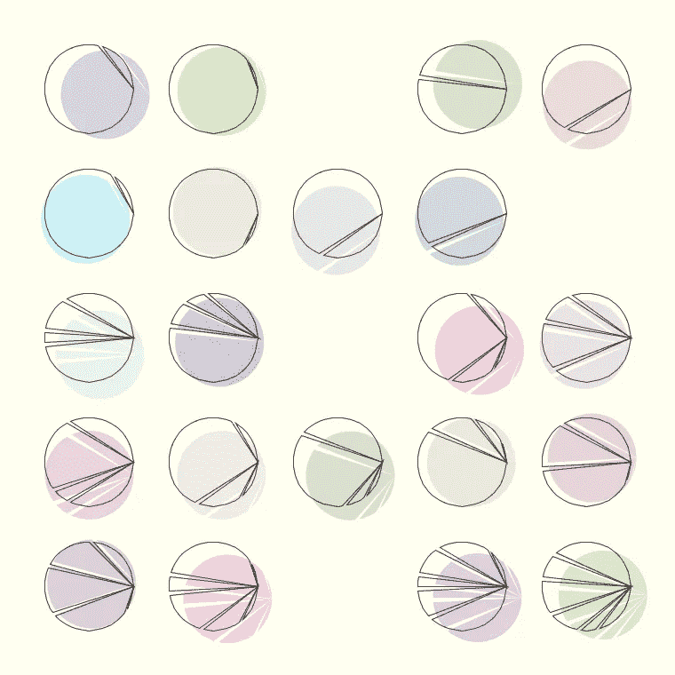
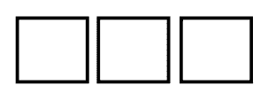
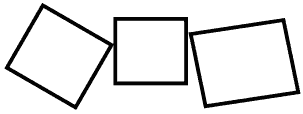
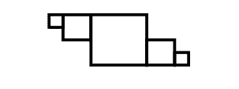
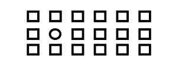
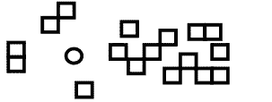

# 生成艺术的基本要素

> 原文：<https://towardsdatascience.com/fundamental-elements-of-generative-art-11175f4741e5?source=collection_archive---------42----------------------->

## [入门](https://towardsdatascience.com/tagged/getting-started)

## 计算机生成视觉艺术的基本构成方法探索。

*作者图片*

[生成型](https://www.invaluable.com/blog/generative-art/)艺术家倾向于有条不紊，并意识到他们作品的抽象结构，这仅仅是因为用代码定义一件艺术品需要这种高水平的想象力。

他们使用的一些结构和构图方法是如此的基础(也是编程媒介特别鼓励的)，以至于当你在你看到的艺术品中遇到它们时，能够认出它们，并能够自己使用它们是很有帮助的。

它不仅会使你自己的受孕过程变得清晰，还会帮助你识别哪些世代过程已经结束，哪些还相对新颖。

下面我将描述我遇到的一些基本方法。当然，这不是一份详尽的清单。既然我们在谈论艺术，就没有穷尽。这只是我在欣赏和自己对生成艺术的尝试中认识到的一些工具。

我将把重点放在经典的 2D 抽象生成艺术上。同样的原则适用于 3D，但如果我们着眼于基于 [AI](http://www.aiartonline.com/) - [的](https://aiartists.org/ai-generated-art-tools)艺术或自然图像处理，可能就不适用了。

所以让我们来看看基本面…

重复

***重复*** 是计算机擅长的，而人类要么不擅长，要么很慢，所以这种创作工具被生成艺术家用来将自己与更传统的艺术区分开来是很自然的。

重复本身可以给人一种平静和可预测的感觉。它可以用来设置你的图像的大规模组成或给你的图像一个细粒度的纹理。

你经常会看到生殖艺术作品一遍又一遍地重复相同的形状或主题。大量的重复已经给艺术品带来了一些质感和复杂性，并将你的作品推向了传统艺术未曾涉足的领域。

随机性

***随机性*** 是计算机擅长的另一个领域。我相信这真的是很多生成性艺术的生命线。随机性给艺术带来独特性，可以应用于你艺术的任何方面:颜色、旋转、大小、几何、运动等等

没有随机性的重复往往看起来平淡无味。但是将重复与随机性结合起来已经可以成为一件有趣艺术品的基础。

随机性也可以用来模仿自然纹理——如果你把它看做一片草地，它基本上是一遍又一遍重复的相同对象，在大小、方向、缺陷等方面有随机变化

随机性当然是一个广泛的概念，为了真正理解图像中发生的事情，我们至少应该考虑 3 种不同的概率分布作为随机性的基础:

*   [均匀分布](https://en.wikipedia.org/wiki/Continuous_uniform_distribution):每个值都有相同的概率。这种分布可能有点无聊，但确实会导致“统一”的结果，但如果使用得当，它可能是生成型艺术家的主要分布。
*   [高斯分布](https://en.wikipedia.org/wiki/Normal_distribution):也许是所有概率分布中最受欢迎的。它倾向于均值附近的值，概率向两边对称下降。也许多亏了中心极限定理，高斯分布在自然界中很常见，能给你的随机性一种自然的感觉。有时采用截断的版本是有用的。
*   [泊松分布](https://en.wikipedia.org/wiki/Poisson_distribution):稀有事件的分布。最常用于使大部分值变小，但少数值突出。

选择正确的发行版可以成就或毁灭艺术品。[这里的](https://tylerxhobbs.com/essays/2015/creating-soft-textures-generatively)是一个使用概率分布的设计过程的例子。

分解

***分解*** 是您可能经常看到的工具之一，因为它是一种简单的技术，可以通过编程轻松实现，例如通过递归，但可以给出有趣的结果。

基本上，你把一个大的形状细分成更小的区域。

最常见的是，一个几何形状(如三角形，圆形，…)被[细分成三角形](https://www.reddit.com/r/generative/comments/kkapuo/which_is_your_favourite/)，再细分成三角形，再细分成三角形，…同样，[随机性可以帮助](https://tylerxhobbs.com/essays/2017/aesthetically-pleasing-triangle-subdivision)使结果在视觉上更加赏心悦目。

当然，分解并不局限于三角形，实验例如弯曲的细分可能是富有成效的。我怀疑选择三角形是因为它们是可以细分任何基于顶点的几何图形的最简单的形状。

建筑

如果分解是自上而下的方法，那么 ***构造*** 就是自下而上的。通常你定义一些迭代规则，每次应用时[通过每次迭代中的新元素增长你的形状](https://inconvergent.net/generative/hyphae/)。同样，递归可以用来给你的作品增加深度。

也许最基本的例子是像 Mandelbrot 集合和 L 系统这样的分形。即使非常简单的规则也可能导致复杂的结构。

模式打破

例如通过任何前述技术建立的模式仍然会感觉太完美或死气沉沉。 ***打破模式*** ，通过添加瑕疵、省略部分等。可以使艺术品生动起来，整体上更有趣。

互动

***交互*** 一个是也许不那么显而易见的一个方法。其思想是，在生成过程中，一些对象(线条、形状等)及其(可能随机影响的)属性会对周围的其他对象产生影响，例如，在空间上，通过相互吸引或排斥。

这种交互可以是顺序的:每个对象都是根据以前的对象生成的。或者它可以是迭代的:生成对象，经过多次迭代，所有对象影响所有其他对象。

inconvergent 的 Linetrace 是这种方法的一个非常简单但视觉上令人愉悦的例子。

# 结束语

还有更多的东西需要考虑，比如调色板、纹理、运动等等。但是上面的类别是一些(我相信)基本的技术，如果你特别关注生成视觉艺术的话，你会遇到的。我希望这篇文章对如何分析以编程方式生成的图像的生成过程有所启发，并对您自己的实验有所启发。

希望你学到了有用的东西！