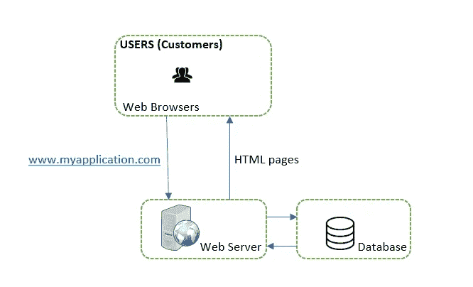
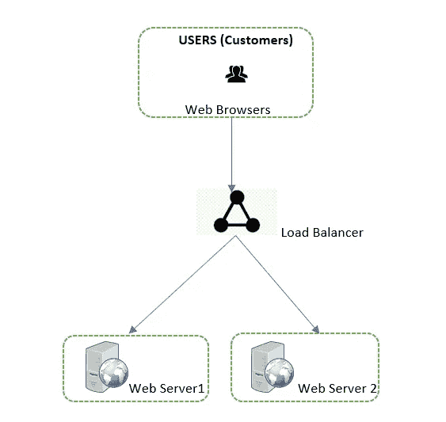
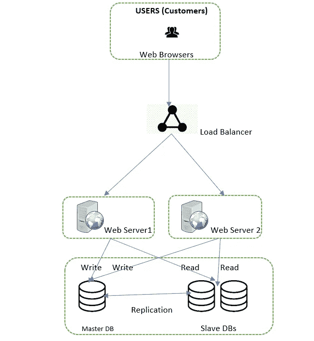

# 软件系统可伸缩性的基础

> 原文：<https://towardsdatascience.com/fundamentals-aboutscalability-of-software-systems-752ddbf889c4?source=collection_archive---------36----------------------->

## 为可扩展系统设计建立直觉的指南

萨姆·穆卡达姆在 [Unsplash](https://unsplash.com?utm_source=medium&utm_medium=referral) 上拍摄的照片

T4:我猜想你是一家杂货店的老板。您有一个计费柜台。顾客来到你的商店，挑选商品，然后在收银台排队付款。你有一个叫约翰的员工，在柜台后面接待顾客。约翰是一个无忧无虑的人，他微笑着欢迎每一位顾客，并在结账时与他们进行简短的交谈。当商店里的顾客人数较少时，约翰就从容不迫了。排队时不太匆忙，也没有人抱怨。然而，在高峰时段，约翰会缩短谈话时间，加快脚步，努力管理顾客。

很快，你的杂货店就在镇上出名了，你会看到大批顾客涌入商店。这对企业非常有利。然而，现在你面临一个问题。您只有一名员工 John 和一个计费柜台。约翰正在尽最大努力处理客户负载，但他所能付出的努力是有体力限制的。毕竟他也是人。还有另一个问题。约翰有时身体不舒服，或者不得不休假。在这种情况下，你不得不关闭商店，因为你大部分时间都在外地工作。在这样的日子里，商店是不营业的。

> 你必须“扩展”来解决这些问题

你决定雇用另一名员工 Sam，并开设第二个结算柜台。这减轻了约翰身上的*【负载】*。有两个队列。一些顾客去找萨姆，而另一些去找约翰。你开心，约翰开心，你的顾客也开心。这也解决了第二个问题(在一定程度上)。当你的一个员工不在的时候，另一个可以试着接待顾客。当然，他的负担会更多，但至少你不需要在那天关门。它仍将是“可用的”。

最终，客户数量不断增加，你决定开设第三个结算柜台并雇佣第三名员工。你知道，这个策略很有效。你的商店总是爆满，顾客现在排成 3 队。然而，有时会出现这样的情况，一个计费柜台上的线路比其他柜台上的线路长。顾客随机决定站在任何一个柜台前，结果可能是一个员工非常忙，而另外两个相对空闲。为了克服这种情况，你雇佣了第四名员工。他的工作是站在所有 3 个柜台的中心，通过查看哪个柜台是免费的等等来指引顾客去哪里。他在某种程度上“平衡”了工作负荷，使其或多或少地平均分配给你的员工。

=====================================

这与软件应用程序有什么关系？几乎每一点都是。

在很高的层次上，软件 web 应用程序将由一个托管应用程序的 web 服务器和一个维护数据的数据库服务器组成。在上面的故事中-

> 用“软件应用程序”替换“杂货店”
> 
> 用维护该应用程序的 web 服务器/数据库服务器代替 John。
> 
> 用应用程序的“用户”替换客户。

该设置的架构如下所示。

作者图片

用户(或客户)通过 URL (www.myapplication.com)访问您的应用程序。HTTP 请求被发送到 web 服务器。web 服务器返回 HTML 页面。想象一个 web 服务器/数据库服务器，就好像 John 正在处理来自客户的请求。随着客户数量的增加，您的系统(例如 John)的负载也会增加。由于您的 webserver/DB 服务器繁忙，客户将开始体验到较慢的响应，或者他们中的一些人可能得不到响应。你是做什么的？你得**【秤】**

## **垂直缩放**

垂直扩展，也称为“纵向扩展”，意味着您可以为您的服务器增加更多功能。例如，添加更多的 CPU 或 RAM，以便它能够处理更多的负载。这相当于说约翰开始使用更多的精力，减少闲聊，行动迅速。我知道这是一个非常糟糕的类比，但你会明白的。

垂直缩放有一个限制。你不能只给一台服务器增加无限的内存或无限的 CPU。这就像说约翰只能以他的身体极限行动。没有更多的。同样，在这种情况下，如果服务器停机(John 休假)，您的应用程序也会停机。它将“不可用”。

## 水平缩放

水平扩展或“向外扩展”意味着向您的设置中添加更多的服务器。这就像你在商店里雇佣额外的员工和开设更多的收银台。这种方法更适合有大量用户和大量数据处理需求的大型应用程序。实际上，您可以将多少台服务器添加到您的系统中是没有限制的。因此您的应用程序可以处理尽可能多的负载。当您的设置有很多服务器时，您可以使用一个 ***【负载均衡器】*** 将传入的流量平均分配到您的服务器上(记住，在我们的杂货店故事中，我们雇佣了第四名员工，他的工作是将顾客引导到不同的计费柜台)

作者图片

这也解决了问题——当一台服务器停机时，另一台服务器仍然可以继续运行，您的应用程序不会变得“不可用”。这个概念也被称为*【高可用性】*。

## 数据库复制

在上面的系统设计中(是的…你可以称之为系统设计或者软件架构)，我们已经搞定了 web 服务器。数据库服务器呢？我们还可以横向扩展数据库服务器。这被称为数据库复制。这个想法很简单。您有一个主数据库和这个主数据库的几个副本(称为从数据库)。所有插入/更新/删除都将在主数据库上完成，而从数据库将用作只读数据存储。这也确保了数据库的高可用性。

作者图片

> 简单地说，如果您考虑可伸缩性，或者当您说您的软件应用程序或系统设计或软件架构是可伸缩的时，这仅仅意味着您的系统可以在可接受的响应时间限制内处理负载或请求。

web 服务器和数据库服务器的水平扩展是实现这一目标的一个很好的方式。但是，我们还能做些什么来改善加载/响应时间呢？

## 贮藏

当您的应用程序被使用时，本质上存在对数据库的请求，这些请求被处理并提供给用户。一些这样的请求可能是相同的和重复的。如果我们将对应于这些请求的数据存储在比数据库更快的临时存储中，这将是有意义的。“缓存”就是这样一种存储。您可以将缓存添加到应用程序架构中。收到请求后，web 服务器将首先检查数据是否在缓存中。如果是，它将从缓存中获取数据并发送给客户端。否则，它将查询数据库，将数据存储在缓存中，并将其发送给客户端。

我希望这篇文章为您提供了一种考虑可伸缩性的方法。还有许多其他的补充技术来设计和构建可伸缩的系统。我将尝试在后续文章中介绍它们。