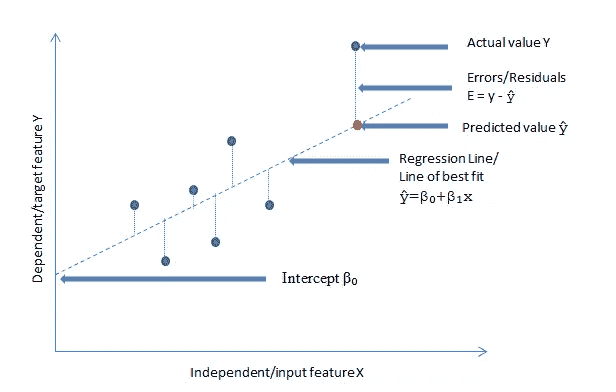
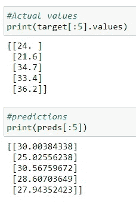

# 机器学习的线性回归基础

> 原文：<https://towardsdatascience.com/fundamentals-of-linear-regression-for-machine-learning-87d684007dee?source=collection_archive---------34----------------------->

## 探索最古老和最常见的统计和机器学习模型


图片由[彼得 H](https://pixabay.com/users/tama66-1032521/?utm_source=link-attribution&utm_medium=referral&utm_campaign=image&utm_content=2439189) 来自[皮克斯拜](https://pixabay.com/?utm_source=link-attribution&utm_medium=referral&utm_campaign=image&utm_content=2439189)

回归是预测连续变量的技术，连续变量是在任意两个值之间具有无限个值的数值变量。线性回归是最重要和最广泛使用的回归模型之一，主要是因为它的简单性和易于解释。其他流行的回归模型包括多项式、岭、套索、弹性网、主成分回归、支持向量回归、泊松和许多其他模型。

线性回归是一种统计模型，它假设输入/独立(x)要素和目标/预测(y)要素之间存在线性关系，并根据 x 和 y 之间的关系通过数据拟合直线。在有许多输入要素的情况下，x = (x₁，x₂,… xₙ)，其中 *n* 是预测要素的数量。这被称为**多元线性回归。**简单线性回归是指只有一个输入(x)特征。线性回归通常只需要一个要预测/估计的目标特征 y。

`ŷ=β₀+β₁x`是简单的线性回归模型公式。

*ŷ* 是对于给定的 *x 的 *y* 的预测值*这是我们试图估计或预测的特征。所有的 *ŷ* 值都落在线性回归线上。β₀和β₁是回归系数。

*   β₀称之为**拦截**。这是直线*与 y 轴*相交的地方，相当于 *x* =0 时 *y* 的预测值
*   β₁是输入特征 *x* 的**系数**，是直线的斜率。它表示 x 对 y 的影响。因此，线性回归模型假设如果 x 增加 1，y 增加β₁(这仅在 x 和 y 具有完美的线性关系时成立，这种情况很少发生)
*   β₀和β₁都是模型从数据集中学习到的*。*

*因此，当您*拟合*一个线性回归模型时，该模型的工作是根据您的数据集估计β₀和β₁的最佳值。*

*`ŷ=β₀+β₁x₁+β₂x₂+…+βₙxₙ`是有多个输入特征时的公式。 *ŷ* 是给定 *x 的 *y* 的预测值。* β₀、β₁、β₂和βₙ是回归系数，其中 *n* 是输入特征的个数。*

*一个线性回归模型(一个 *x* 和一个 *y* 特征)产生一个**二维线图**，易于显示。一个多元回归模型(几个 x 特征和一个 y 特征)产生一个更高维的线，称为 [**超平面**](https://datacadamia.com/data_mining/multiple_regression#equation_function) 。*

*线性回归模型也包括误差，称为残差。这些是 y 的真实值和 y 的预测值之间的*差*，或`y-ŷ.`*

**

*作者图片*

*线性回归模型通过找到“最佳拟合线”或这些误差最小的线来最小化这些误差。想一条最接近所有点的线。这涉及到最小化**误差平方和(SSE)** ，也称为**残差平方和(RSS)** ，一种称为[**普通最小二乘法**](https://en.wikipedia.org/wiki/Ordinary_least_squares) **的技术。**这项技术旨在最小化 RSS，这意味着当我们有一条穿过数据的线性回归线时，计算每个数据点到该线的距离，对其求平方，并将所有平方误差加在一起。最佳拟合线的 RSS 最小。*

*另一种在机器学习中常见的计算“最佳拟合线”的技术是 [**梯度下降**](https://www.geeksforgeeks.org/gradient-descent-in-linear-regression/) 。这包括通过从系数的随机值开始优化系数，然后在使误差平方和最小化的方向上逐渐更新它们。*

## *使用 scikit-learn 在 Python 中实现线性回归*

*现在让我们来看看使用 [scikit-learn 数据集](https://scikit-learn.org/stable/datasets/toy_dataset.html#toy-datasets)的多元线性回归模型。你可以从[这个](https://github.com/suemnjeri/medium-articles/blob/main/Linear%20regression%20fundamentals/Linear%20Regression%20using%20boston%20dataset.ipynb) Github 链接下载代码并跟随。*

*Scikit-learn 附带了一些小的标准数据集，不需要您从一些外部网站下载任何文件。使用[波士顿房价数据集](https://scikit-learn.org/stable/datasets/toy_dataset.html#boston-house-prices-dataset)，我们将实现一个多元线性回归模型，并通过计算 r 得分和均方误差来测量其性能，同时显示输入要素的截距(β₀)和β系数。您可以通过运行`print(df[‘DESCR’])`来查看波士顿住房数据集的描述。*

*如果您的机器上没有安装 python，请按照[这些](https://docs.anaconda.com/anaconda/install/)步骤下载并安装 **anaconda，**这是一个 python 环境平台。安装完成后，使用[这些](https://jupyter-notebook-beginner-guide.readthedocs.io/en/latest/execute.html)步骤打开一个新的 Jupyter 笔记本，我们将从这里运行我们的代码。*

*首先是导入您需要的库。其中包括常用的`pandas`、`numpy`、`matplotlib,`、`seaborn`。另外，从我们将要加载数据集的地方导入`linear regression`类和`datasets`类。*

```
*import pandas as pd
import numpy as np
import matplotlib.pyplot as plt
import seaborn as sns
sns.set_style('darkgrid')from sklearn.linear_model import LinearRegression
from sklearn import datasets*
```

*下一步是加载数据集。*

```
*data = datasets.load_boston()*
```

*预设特征名称将是我们的预测值，我们将把它存储在一个名为`features`的数据帧中，预测(目标)特征将是预设目标‘MEDV’，我们将把它存储在一个名为`target`的数据帧中。*

```
*features = pd.DataFrame(data.data, columns=data.feature_names)
target = pd.DataFrame(data.target, columns=["MEDV"])features.shape
### Results
(506, 13)target.shape
### Results
(506, 1)*
```

*下一步是*初始化*线性回归模型的实例，然后*使用`model.fit(features,target)`使*模型实例符合数据，也称为训练模型。这是得出β₀和β₁最佳估计值的一步。最后，我们将使用`model.predict(features).`进行预测:注意:我使用了所有 13 个特征来拟合模型并进行预测，但是如果您执行探索性数据分析(EDA)并总结出几个有用的特征，您可以使用更少的特征。请阅读我关于[基本 EDA 代码块](/11-simple-code-blocks-for-complete-exploratory-data-analysis-eda-67c2817f56cd?gi=4dd3ddfc57ae&source=collection_category---4------2-----------------------)的文章以获得指导。*

```
*model = LinearRegression()
model.fit(features, target)
preds = model.predict(features)*
```

*观察目标列“MEDV”的前 5 个值和前 5 个预测。*

**

*Sklearn 具有内置的函数，可以返回分数(r 分数)、系数(β₁，..,βₙ)，和拦截(β₀).*

*`model.score(features,target)`返回模型的 R 分数，即模型预测的解释方差的百分比。它将当前模型与恒定基线进行比较，该基线是通过取数据的平均值并在平均值处画一条水平线来选择的。r 分数总是小于或等于 1，并且优选更高的值。高 R 也可能是由于过拟合，在这种情况下，可以计算出[调整后的 R](https://www.statisticshowto.com/adjusted-r2/) 。更多关于衍生的 R 分数[在这里。](https://scikit-learn.org/stable/modules/generated/sklearn.linear_model.LinearRegression.html#sklearn.linear_model.LinearRegression.score)*

```
*model.score(features, target)###Results
0.7406426641094095*
```

*我们还将计算均方差(MSE)，它是实际目标值( *y* )和预测值( *ŷ)* 或`1/n(y-*ŷ)*²`)之间的*平方差*的*平均值*。这是一个很好的性能指标，因为对差异求平方会导致对较大误差的更大强调，从而表明模型的好坏。较小的 MSE 是优选的。为了计算 MSE，我们使用从`sklearn.metrics.`导入的`mean_squared_error`类*

```
*from sklearn.metrics import mean_squared_error
print('MSE', mean_squared_error(target, preds))### Results
MSE 21.894831181729202*
```

*我们可以使用`model.intercept_.`显示 y 截距(β₀),我们模型的 y 截距是 36.45948839，这是 x=0 时 y 的值。*

```
*print(model.intercept_)### Results
[36.45948839]*
```

*`model.coef_`显示各种输入特征的模型估计系数。它们是由模型在训练期间导出的。*

```
*print(model.coef_)### Results
[[-1.08011358e-01  4.64204584e-02  2.05586264e-02  2.68673382e+00
  -1.77666112e+01  3.80986521e+00  6.92224640e-04 -1.47556685e+00
   3.06049479e-01 -1.23345939e-02 -9.52747232e-01  9.31168327e-03
  -5.24758378e-01]]*
```

***线性回归假设***

*线性回归在数据中做出假设，如果不符合假设，可能会导致模型不准确，预测不准确。这些是一些假设。*

*   *独立/预测变量是无误差的，不是随机变量。我们在上面讨论过，误差来自预测值 *ŷ* ，我们称之为残差。`e = y-ŷ.`然而，线性回归假设我们不期望单个输入/预测特征有任何误差。*
*   *线性。假设 x 和 y 特征具有线性关系，意味着当 x 增加(或减少)时，y 增加(或减少)。*
*   *特征呈正态分布。假设要素具有正态分布，高度倾斜的要素或具有显著异常值的要素会扭曲关系并导致模型不准确。*
*   *线性回归假设误差的大小与其他误差无关。*
*   *该模型假设不存在多重共线性，并且没有任何要素与其他要素存在冗余。*

## *结论*

*在本文中，我们介绍了线性回归，这是使用输入特征 x₁,…,xₙ.预测响应特征 y 的常用回归模型之一我们研究了线性回归的基础知识，并使用 sklearn 的玩具数据集之一实现了一个多元线性回归模型。[这里的](https://github.com/suemnjeri/medium-articles/blob/main/Linear%20regression%20fundamentals/Linear%20Regression%20using%20boston%20dataset.ipynb)是 Github 上的完整代码。在实践中，重要的是将数据集分成训练集和测试集，并标准化/规范化特征以防止过度拟合。这是对 EDA、清理数据集、特征工程等其他数据准备最佳实践的补充。*

***参考文献***

*机器学习掌握—[https://machineellingmastery . com/linear-regression-for-machine-learning/](https://machinelearningmastery.com/linear-regression-for-machine-learning/)*

*Youtube: GeostatsGuy 讲座—[https://www.youtube.com/watch?v=0fzbyhWiP84](https://www.youtube.com/watch?v=0fzbyhWiP84)*