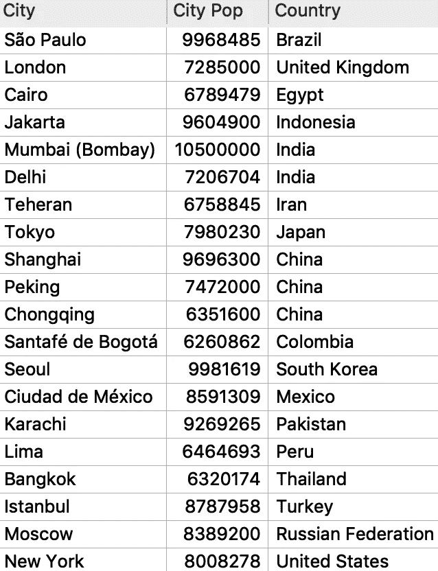
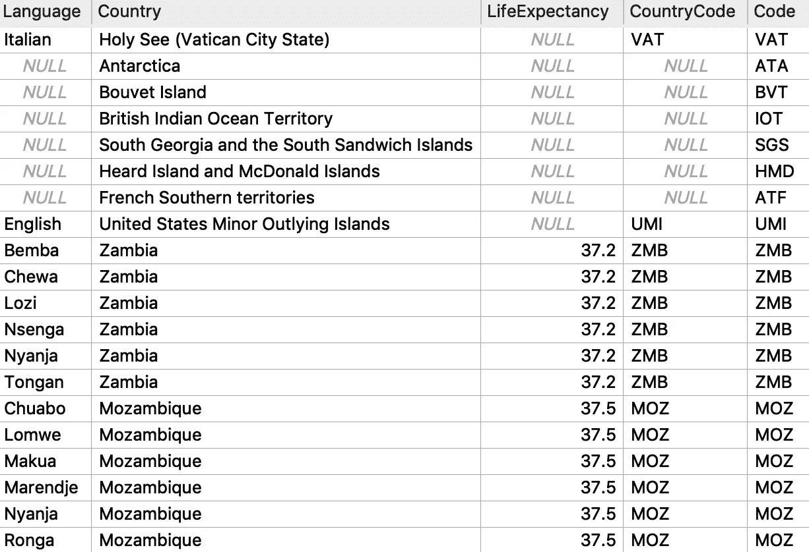
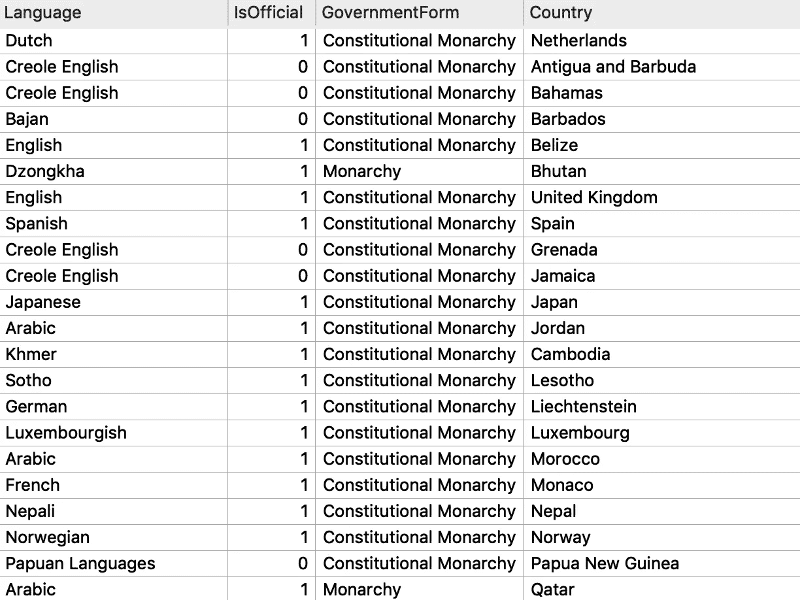
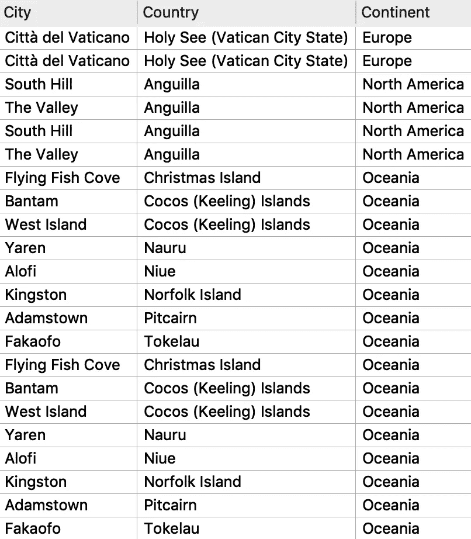

# SQLite 中关系和连接的基础

> 原文：<https://towardsdatascience.com/fundamentals-of-relationships-and-joins-in-sqlite-82ab47806d00?source=collection_archive---------32----------------------->

## 使用 World 数据库的内、左、右和全外连接示例

在 [Unsplash](https://unsplash.com/s/photos/swans?utm_source=unsplash&utm_medium=referral&utm_content=creditCopyText) 上由 [Belinda Fewings](https://unsplash.com/@bel2000a?utm_source=unsplash&utm_medium=referral&utm_content=creditCopyText) 拍摄的照片

## 介绍

结构化查询语言(SQL)是与关系数据库通信的标准编程语言，关系数据库以表格的形式组织相关数据。理解关系和连接的基础知识对于使用任何关系数据库管理系统都是必要的。

本文使用[世界数据库](https://dev.mysql.com/doc/index-other.html)和 [SQLiteStudio](https://sqlitestudio.pl/) ，介绍 SQLite 中不同类型的关系和连接 SQLite 支持标准 SQL 的许多特性，但内存需求较低。世界数据库包含 3 个表:“城市”、“国家”和“国家语言”这些表都通过一个共享的国家代码变量相互关联，这允许跨三个表的数据被连接。让我们看看它是怎么做的！

## 内部联接

内部联接只返回查询中两个表都满足指定条件的数据。以下查询连接了 world 数据库中城市和国家表的数据。从城市表(别名为“ci”)中，我们选择名称列(重命名为“City”)和人口列(重命名为“City Pop”)。从 Country 表(别名为“co”)中，我们选择 Name 列(重命名为“Country”)。如果不重命名第一行中的列，我们将在返回的表中得到两个“Name”列和一个不明确的“Population”列，这可能会在涉及更多列的情况下造成混乱。为 SQL 查询中的每个不同列指定不同的名称是一个好习惯。

“ON”子句指定两个表应该在哪些列上联接。在这种情况下，城市表中的“国家代码”值对应于国家表中的“代码”值。返回两列中具有匹配值的行。这是一个**多对一关系**的例子，它描述了一个表中的多行与另一个表中的一行匹配的情况。有多个城市与每个国家/地区相关联:例如，在下表中，孟买和德里这两个城市都与国家/地区表中的印度相关联。

查询最后一行中的“WHERE”子句将行进一步限制为只包括人口值超过 600 万的城市。在返回的行中，我们有前 20 个人口最稠密的城市、它们的人口值和它们的国家:

按作者分类的表格

## 左连接

左连接返回左表中的所有行和右表中具有匹配值的行。为了可读性，查询通常被分成一系列的行，所以左边的表可能并不总是出现在右边的表的左边。例如，在下面的查询中，左边的表是 County，右边的表是 CountryLanguage。我们知道 Country 是左边的表，因为如果这个查询被安排在一行中，Country 将被放置在“JOIN”的左边。

默认情况下,' ORDER BY '子句按预期寿命以升序对行进行排序。将“DESC”添加到第五行的末尾将会首先显示预期寿命最高的行。

这里使用“LIMIT”关键字将结果限制为仅 20 行，使用“OFFSET”关键字删除原本会出现在结果中的前 15 行。如果所选列中的行数允许，这些关键字后面可以跟任何其他数字。以下是上述查询的结果:

按作者分类的表格

我在查询中包含了 Code 和 CountryCode 列，以说明左连接的效果。请注意一些 CountryCode 值是'*NULL '；*这表示该列没有值。在内部联接中，CountryCode 和 Code 列没有匹配值的行将被排除。“LEFT”关键字确保返回左表(国家)中的所有值，即使右表(国家语言)中没有匹配的值。这是一个**一对一关系**的例子:Country 表中的每一行只与 CountryLanguage 表中的另一行相关联。

## 右连接

右连接返回右表中的所有行和左表中具有匹配值的所有行。SQLite 不支持' RIGHT JOIN '子句，但是通过更改查询中表的顺序，可以将任何右连接更改为左连接。例如，考虑下面的右连接:

在 SQLite 中，使用左连接可以实现该查询中所需的相同效果:

请注意，join 语句“左侧”的表已经更改为 CountryLanguage，而 Country 表现在出现在它的后面。切换表顺序是将右连接转换为左连接的全部步骤。

最后一行使用' LIKE '关键字和一个通配符(' % ')来选择任何以字符串'君主制'结尾的值。在下面的输出行片段中，我们可以看到君主制和立宪君主制都被选中了:

按作者分类的表格

## 完全外部连接

完全外部联接是左联接和右联接的组合。它包括从左表和右表中选择的所有行，并在没有匹配值的行中返回“NULL”值。SQLite 也不支持完全联接，但是可以使用“LEFT JOIN”和“UNION ALL”来重现它们的行为，如以下查询所示:

该查询将第一个和第二个“SELECT”语句的结果与“UNION ALL”组合在一起假设外部连接是左连接和右连接的组合，并且 SQLite 不支持右连接，我们只需在第二个选择中颠倒表的顺序。该查询只选择人口值小于 1000 的小城市，并按洲按字母升序排列行。结果如下:

按作者分类的表格

## 结论

本文介绍了 SQLite 中一些基本连接和关系类型的例子，但是还有更多！查看 [SQLite 文档](https://www.sqlite.org/keyword_index.html)获取更多信息和资源。