# 数据科学家和分析师的统计学基础

> 原文：<https://towardsdatascience.com/fundamentals-of-statistics-for-data-scientists-and-data-analysts-69d93a05aae7?source=collection_archive---------0----------------------->

## 数据科学或数据分析之旅的关键统计概念


图片来源:[佩克斯/安娜·涅克拉舍维奇](https://www.pexels.com/photo/marketing-businessman-person-hands-6801647/)

正如英国数学家卡尔·皮尔逊曾经说过的那样，**统计学**是科学的语法，尤其适用于计算机和信息科学、物理科学和生物科学。当你开始你的**数据科学**或**数据分析**之旅时，拥有统计知识将帮助你更好地利用数据洞察力。

> "统计学是科学的语法。"**卡尔·皮尔逊**

统计学在数据科学和数据分析中的重要性不可低估。统计学提供了工具和方法来发现结构并给出更深层次的数据见解。统计学和数学都热爱事实，讨厌猜测。了解这两个重要主题的基础知识将允许您进行批判性思考，并在使用数据解决业务问题和做出数据驱动的决策时具有创造性。在本文中，我将介绍数据科学和数据分析的以下统计主题:

```
**- Random variables
- Probability distribution functions (PDFs)
- Mean, Variance, Standard Deviation
- Covariance and Correlation 
- Bayes Theorem
- Linear Regression and Ordinary Least Squares (OLS)
- Gauss-Markov Theorem
- Parameter properties (Bias, Consistency, Efficiency)
- Confidence intervals
- Hypothesis testing
- Statistical significance 
- Type I & Type II Errors
- Statistical tests (Student's t-test, F-test)
- p-value and its limitations
- Inferential Statistics 
- Central Limit Theorem & Law of Large Numbers
- Dimensionality reduction techniques (PCA, FA)**
```

如果你以前没有统计学知识，你想从头开始识别和学习基本的统计学概念，为你的工作面试做准备，那么这篇文章就是为你准备的。这篇文章也是任何想更新他/她的统计知识的人的好读物。

# 随机变量

随机变量的概念构成了许多统计概念的基石。可能很难理解其正式的数学定义，但简单地说，**随机变量**是一种将随机过程的结果映射到数字的方法，例如抛硬币或掷骰子。例如，我们可以用随机变量 X 来定义抛硬币的随机过程，如果结果是*正面*则取值 1，如果结果是*反面则取值 0。*


在这个例子中，我们有一个抛硬币的随机过程，这个实验可以产生 ***两个*** ***可能的结果*** : {0，1}。这组所有可能的结果称为实验的 ***样本空间*** 。每次重复随机过程时，称为一个 ***事件。*** 在这个例子中，抛硬币得到一条尾巴作为结果是一个事件。这一事件以特定结果发生的几率或可能性称为该事件的 ***概率*** 。事件的概率是随机变量取 x 的特定值的可能性，可以用 P(x)来描述。在抛硬币的例子中，获得正面或反面的可能性是相同的，即 0.5%或 50%。因此，我们有以下设置:


在本例中，事件的概率只能取[0，1]范围内的值。

> 统计学在数据科学和数据分析中的重要性不可低估。统计学提供了工具和方法来发现结构并给出更深层次的数据见解。

# 均值、方差、标准差

为了理解均值、方差和许多其他统计主题的概念，学习 ***人口*** 和 ***样本*的概念是很重要的。*****总体*** 是所有观察值(个体、对象、事件或程序)的集合，通常非常大且多样，而 ***样本*** 是总体中观察值的子集，理想情况下是总体的真实代表。

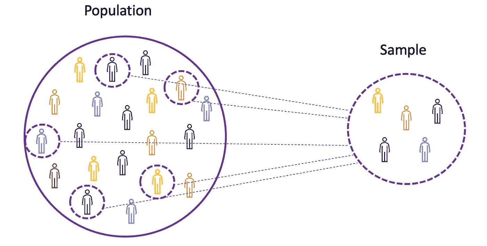

图片来源:作者

鉴于对整个人群进行实验要么是不可能的，要么就是太昂贵，研究人员或分析师在他们的实验或试验中使用样本而不是整个人群。为了确保实验结果可靠并适用于整个群体，样本需要真实地代表总体。也就是说，样本需要是无偏的。为此，可以使用统计抽样技术，如[随机抽样、系统抽样、整群抽样、加权抽样和分层抽样。](https://github.com/TatevKaren/mathematics-statistics-for-data-science/tree/main/Sampling%20Techniques)

## 平均

均值，也称为平均值，是一组有限数字的中心值。让我们假设数据中的随机变量 X 具有以下值:


其中 N 是样本集中观察值或数据点的数量，或简称为数据频率。那么 ***样本均值*** 由 **μ** 定义，这非常常用于近似 ***总体均值*** *，*可表示如下:


平均值也称为 ***期望*** ，通常由 **E** ()或顶部带横杠的随机变量定义。例如，随机变量 X 和 Y 的期望，即分别为 **E** (X)和 **E** (Y)，可以表示如下:


```
import numpy as np
import mathx = np.array([1,3,5,6])
mean_x = np.mean(x)# in case the data contains Nan values
x_nan = np.array([1,3,5,6, math.nan])
mean_x_nan = np.nanmean(x_nan)
```

## 差异

方差测量数据点与平均值*、*相差多远，等于数据值与平均值(平均值)之差的平方和。再者， ***人口方差****可以表示如下:*

**

```
*x = np.array([1,3,5,6])
variance_x = np.var(x) # here you need to specify the degrees of freedom (df) max number of logically independent data points that have freedom to varyx_nan = np.array([1,3,5,6, math.nan])
mean_x_nan = np.nanvar(x_nan, ddof = 1)*
```

*要获得不同流行概率分布函数的期望和方差，[查看 Github repo](https://github.com/TatevKaren/mathematics-statistics-for-data-science/tree/main/Deriving%20Expectation%20and%20Variances%20of%20Densities) 。*

## *标准偏差*

*标准差就是方差的平方根，衡量数据偏离均值的程度。***∑****定义的标准偏差可以表示如下:**

****

**标准差通常优于方差，因为它与数据点具有相同的单位，这意味着您可以更容易地解释它。**

```
**x = np.array([1,3,5,6])
variance_x = np.std(x)

x_nan = np.array([1,3,5,6, math.nan])
mean_x_nan = np.nanstd(x_nan, ddof = 1)**
```

## **协方差**

**协方差是两个随机变量的联合可变性的度量，描述了这两个变量之间的关系。它被定义为两个随机变量与其均值的偏差乘积的期望值。两个随机变量 X 和 Z 之间的协方差可以用下面的表达式来描述，其中 **E** (X)和 **E** (Z)分别代表 X 和 Z 的均值。**

****

**协方差可以取负值或正值，也可以取值 0。协方差的正值表示两个随机变量趋向于同向变化，而负值表示这些变量反向变化。最后，值 0 意味着它们不一起变化。**

```
**x = np.array([1,3,5,6])
y = np.array([-2,-4,-5,-6])#this will return the covariance matrix of x,y containing x_variance, y_variance on diagonal elements and covariance of x,y
cov_xy = np.cov(x,y)**
```

## **相互关系**

**相关性也是对关系的度量，它度量两个变量之间线性关系的强度和方向。如果检测到相关性，则意味着在两个目标变量的值之间存在关系或模式。两个随机变量 X 和 Z 之间的相关性等于这两个变量之间的协方差除以这些变量的标准偏差的乘积，这可以由下面的表达式来描述。**

****

**相关系数的值介于-1 和 1 之间。请记住，变量与其自身的相关性始终为 1，即 **Cor(X，X) = 1** 。在解释相关性时要记住的另一件事是不要将其与 ***因果关系*** 混淆，因为相关性不是因果关系。即使两个变量之间存在相关性，你也不能断定一个变量会引起另一个变量的变化。这种关系可能是巧合，或者第三个因素可能导致这两个变量发生变化。**

```
**x = np.array([1,3,5,6])
y = np.array([-2,-4,-5,-6])corr = np.corrcoef(x,y)**
```

# ****概率分布函数****

**描述所有可能值、样本空间和随机变量在给定范围内可能取的相应概率的函数，介于最小和最大可能值之间，称为 ***概率分布函数(pdf)*** 或概率密度。每个 pdf 都需要满足以下两个标准:**

****

**其中第一个标准规定所有的概率应该是在[0，1]范围内的数字，第二个标准规定所有可能的概率之和应该等于 1。**

**概率函数通常分为两类: ***离散*** 和 ***连续*** 。离散分布函数用 ***可数*** 样本空间描述随机过程，就像在抛硬币的例子中，只有两种可能的结果。连续分布函数描述了随机过程与*连续的样本空间。离散分布函数的例子有[伯努利](https://en.wikipedia.org/wiki/Bernoulli_distribution)、[二项式](https://en.wikipedia.org/wiki/Binomial_distribution)、[泊松](https://en.wikipedia.org/wiki/Poisson_distribution)、[离散均匀](https://en.wikipedia.org/wiki/Discrete_uniform_distribution)。连续分布函数的例子有[正态](https://en.wikipedia.org/wiki/Normal_distribution)、[连续均匀](https://en.wikipedia.org/wiki/Continuous_uniform_distribution)、[柯西](https://en.wikipedia.org/wiki/Cauchy_distribution)。***

## ***二项分布***

***[二项分布](https://brilliant.org/wiki/binomial-distribution/)是一系列 **n 个**独立实验中成功次数的离散概率分布，每个实验的结果为布尔值:*(概率为 **p** )或 ***失败*** (概率为**q**= 1p)。假设随机变量 X 遵循二项分布，那么在 n 次独立试验中观察到***k*** 成功的概率可以由下面的概率密度函数表示:****

****

**当分析重复独立实验的结果时，二项式分布是有用的，特别是如果人们对在给定特定错误率的情况下满足特定阈值的概率感兴趣。**

****二项分布均值&方差****

****

**下图显示了一个二项式分布的例子，其中独立试验的数量等于 8，每次试验的成功概率等于 16%。**

**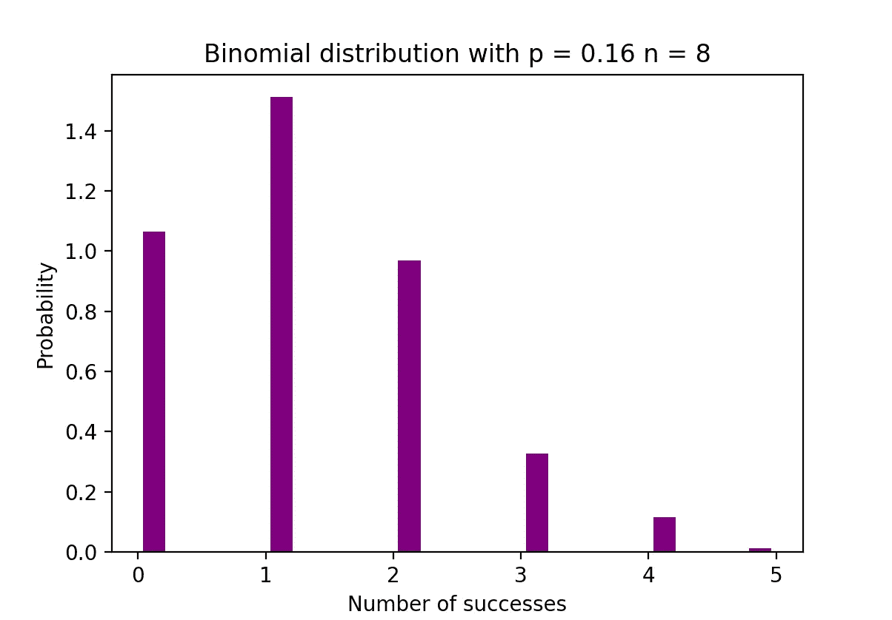**

**图片来源:作者**

```
**# Random Generation of 1000 independent Binomial samples
import numpy as np
n = 8
p = 0.16
N = 1000
X = np.random.binomial(n,p,N)# Histogram of Binomial distribution
import matplotlib.pyplot as plt
counts, bins, ignored = plt.hist(X, 20, density = True, rwidth = 0.7, color = 'purple')
plt.title("Binomial distribution with p = 0.16 n = 8")
plt.xlabel("Number of successes")
plt.ylabel("Probability")
plt.show()**
```

## **泊松分布**

**[泊松分布](https://brilliant.org/wiki/poisson-distribution/)是特定时间段内发生的事件数量的离散概率分布，给定该时间段内事件发生的平均次数。假设随机变量 X 服从泊松分布，那么在一段时间内观察到***k*** 事件的概率可以用下面的概率函数表示:**

****

**其中 ***e*** 为 [***欧拉数***](https://brilliant.org/wiki/eulers-number/) 和***λ***λ， ***到达率参数*** 为*x 的期望值。泊松分布函数因其在对给定时间间隔内发生的可数事件建模中的用途而非常流行。***

*****泊松分布均值&方差*****

******

***例如，泊松分布可用于模拟晚上 7 点到 10 点之间到达商店的顾客数量，或者晚上 11 点到 12 点之间到达急诊室的患者数量。下图显示了泊松分布的一个示例，其中我们计算了到达网站的 Web 访问者的数量，到达率λ假定等于 7 分钟。***

***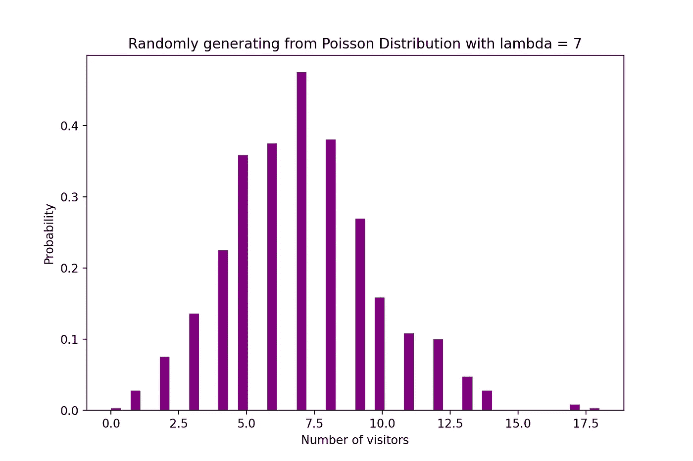***

***图片来源:作者***

```
***# Random Generation of 1000 independent Poisson samples
import numpy as np
lambda_ = 7
N = 1000
X = np.random.poisson(lambda_,N)

# Histogram of Poisson distribution
import matplotlib.pyplot as plt
counts, bins, ignored = plt.hist(X, 50, density = True, color = 'purple')
plt.title("Randomly generating from Poisson Distribution with lambda = 7")
plt.xlabel("Number of visitors")
plt.ylabel("Probability")
plt.show()***
```

## ***正态分布***

***[正态概率分布](https://brilliant.org/wiki/normal-distribution/)是实值随机变量的连续概率分布。正态分布，也称为 ***高斯分布*** 可以说是社会科学和自然科学中最常用的分布函数之一，用于建模，例如，它用于对人的身高或考试成绩进行建模。假设随机变量 X 服从正态分布，那么它的概率密度函数可以表示如下。***

****

**其中参数**μ**(μ)**是分布的平均值，也称为 ***位置参数*** ，参数 **σ** (sigma) 是分布的标准偏差，也称为*比例参数*。数字 [**π**](https://www.mathsisfun.com/numbers/pi.html) (pi)是一个数学常数，大约等于 3.14。****

******正态分布均值&方差******

********

****下图显示了一个均值为 0 ( **μ = 0** )标准差为 1 ( **σ = 1** )的正态分布示例，这被称为 ***标准正态*** 分布，它是*对称的。*****

****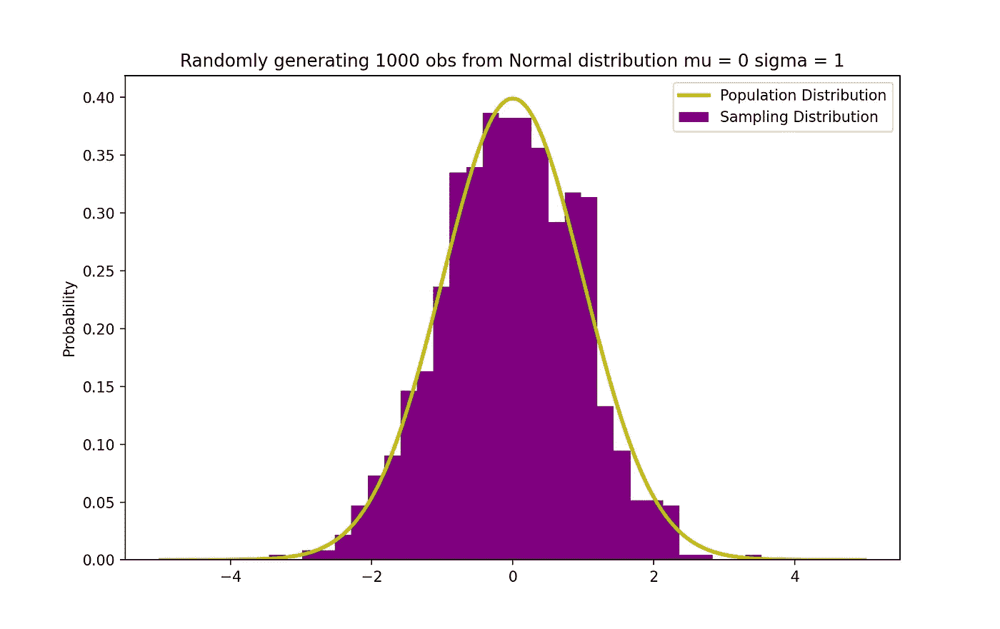****

****图片来源:作者****

```
****# Random Generation of 1000 independent Normal samples
import numpy as np
mu = 0
sigma = 1
N = 1000
X = np.random.normal(mu,sigma,N)

# Population distribution
from scipy.stats import norm
x_values = np.arange(-5,5,0.01)
y_values = norm.pdf(x_values)#Sample histogram with Population distribution
import matplotlib.pyplot as plt
counts, bins, ignored = plt.hist(X, 30, density = True,color = 'purple',label = 'Sampling Distribution')
plt.plot(x_values,y_values, color = 'y',linewidth = 2.5,label = 'Population Distribution')
plt.title("Randomly generating 1000 obs from Normal distribution mu = 0 sigma = 1")
plt.ylabel("Probability")
plt.legend()
plt.show()****
```

# ******贝叶斯定理******

****贝叶斯定理或通常称为 ***贝叶斯定律*** 可以说是概率统计中最强大的规则，以著名的英国统计学家和哲学家托马斯·贝叶斯的名字命名。****

****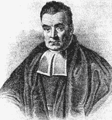****

****图片来源:[维基百科](https://en.wikipedia.org/wiki/Thomas_Bayes)****

****贝叶斯定理是一个强大的概率定律，它将 ***主观性*** 的概念带入了一切都与事实有关的统计和数学世界。它描述了一个事件发生的概率，基于可能与该事件相关的 ***条件*** 的先验信息。例如，如果已知患冠状病毒或新冠肺炎的风险会随着年龄的增长而增加，那么贝叶斯定理允许通过将年龄作为条件来更准确地确定已知年龄的个体的风险，而不是简单地假设该个体是整个人口中的常见个体。****

*******条件概率*，**的概念在贝叶斯理论中起着核心作用，它是一个事件发生的概率的度量，假设另一个事件已经发生。贝叶斯定理可以由下面的表达式描述，其中 X 和 Y 分别代表事件 X 和 Y:****

********

*   ****Pr (X|Y):给定事件或条件 Y 已经发生或为真，事件 X 发生的概率****
*   ****Pr (Y|X):给定事件或条件 X 已经发生或为真，事件 Y 发生的概率****
*   *****Pr*(X)&*Pr*(Y):分别为观察事件 X 和 Y 的概率****

****在前面的例子中，以在某个年龄为条件的获得冠状病毒(事件 X)的概率是 *Pr* (X|Y)，它等于给定一个人在某个年龄获得冠状病毒的概率， *Pr* (Y|X)，乘以获得冠状病毒的概率， *Pr* (X)，除以在某个年龄的概率。， *Pr* (Y)。****

# ****线性回归****

****早些时候，变量之间的因果关系的概念被引入，这发生在一个变量对另一个变量有直接影响的时候。当两个变量之间的关系是线性时，那么线性回归是一种统计方法，可以帮助建模一个变量中单位变化的影响，****自变量*** ， ***因变量*** 。*****

****因变量常被称为 ***反应变量*** 或 ***解释变量****而自变量常被称为 ***回归变量*** 或 ***解释变量*** 。当线性回归模型基于单个自变量时，则该模型称为 ***简单线性回归*** ，当模型基于多个自变量时，则称为 ***多元线性回归*。**简单的线性回归可以用下面的表达式来描述:*****

********

****其中 **Y** 为因变量， **X** 为自变量，为数据的一部分， **β0** 为未知常数的截距， **β1** 为斜率或未知常数的变量 X 对应的参数。最后， **u** 是模型在估计 Y 值时产生的误差项。线性回归背后的主要思想是通过一组成对的(X，Y)数据找到最拟合的直线， ***回归线，*** 。线性回归应用的一个例子是模拟*鳍状肢长度*对企鹅*体重*的影响，如下图所示。****

****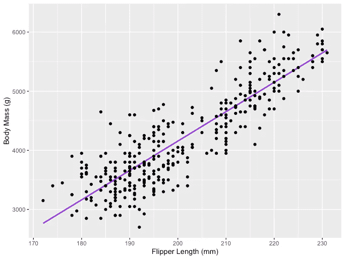****

****图片来源:作者****

```
**# R code for the graph
install.packages("ggplot2")
install.packages("palmerpenguins")
library(palmerpenguins)
library(ggplot2)View(data(penguins))ggplot(data = penguins, aes(x = flipper_length_mm,y = body_mass_g))+
  geom_smooth(method = "lm", se = FALSE, color = 'purple')+
  geom_point()+
  labs(x="Flipper Length (mm)",y="Body Mass (g)")**
```

****具有三个独立变量的多元线性回归可由以下表达式描述:****

********

## ****普通最小二乘法****

****普通最小二乘法(OLS)是一种估计线性回归模型中β0 和β1 等未知参数的方法。该模型基于 ***最小二乘*** 的原理，即使观察到的因变量与其由自变量的线性函数预测的值之差的平方和最小化，通常称为 ***【拟合值】*** 。因变量 Y 的实际值和预测值之间的差异被称为 ***残差*** ，OLS 所做的是最小化残差平方和。这个优化问题导致未知参数β0 和β1 的以下 OLS 估计，也称为 ***系数估计*** 。****

********

****一旦简单线性回归模型的这些参数被估计，响应变量的 ***拟合值*** 可以计算如下:****

********

## ****标准误差****

*******残差*** 或估计误差项可确定如下:****

********

****记住误差项和残差之间的区别很重要。误差项永远不会被观察到，而残差是从数据中计算出来的。OLS 估计每个观测值的误差项，但不是实际的误差项。因此，真正的误差方差仍然未知。此外，这些估计受抽样不确定性的影响。这意味着我们将永远无法从经验应用的样本数据中确定这些参数的准确估计值和真实值。但是我们可以通过计算 ***样本*** ***残差方差*** 来估计，使用的残差如下。****

********

****样本残差方差的这种估计有助于估计估计参数的方差，估计参数的方差通常表示如下:****

********

****这个方差项的平方根被称为**估计值的标准误差**，这是评估参数估计值准确性的关键部分。它用于计算测试统计和置信区间。标准误差可以表示如下:****

********

> ****记住误差项和残差之间的区别很重要。误差项永远不会被观察到，而残差是从数据中计算出来的。****

## ****OLS 假设****

****OLS 估计法作出如下假设，需要满足这些假设才能得到可靠的预测结果:****

******A1:线性**假设模型的参数是线性的。****

******A2:** **随机** **样本**假设样本中的所有观测值都是随机选取的。****

******A3:外生性**假设独立变量与误差项不相关。****

******A4:同方差**假设所有误差项的方差为常数。****

******A5:没有完美的多重共线性**假设没有一个自变量是恒定的，自变量之间没有精确的线性关系。****

```
**def runOLS(Y,X):

   # OLS esyimation Y = Xb + e --> beta_hat = (X'X)^-1(X'Y)
   beta_hat = np.dot(np.linalg.inv(np.dot(np.transpose(X), X)), np.dot(np.transpose(X), Y))

   # OLS prediction
   Y_hat = np.dot(X,beta_hat)
   residuals = Y-Y_hat
   RSS = np.sum(np.square(residuals))
   sigma_squared_hat = RSS/(N-2)
   TSS = np.sum(np.square(Y-np.repeat(Y.mean(),len(Y))))
   MSE = sigma_squared_hat
   RMSE = np.sqrt(MSE)
   R_squared = (TSS-RSS)/TSS

   # Standard error of estimates:square root of estimate's variance
   var_beta_hat = np.linalg.inv(np.dot(np.transpose(X),X))*sigma_squared_hat

   SE = []
   t_stats = []
   p_values = []
   CI_s = []

   for i in range(len(beta)):
       #standard errors
       SE_i = np.sqrt(var_beta_hat[i,i])
       SE.append(np.round(SE_i,3))

        #t-statistics
        t_stat = np.round(beta_hat[i,0]/SE_i,3)
        t_stats.append(t_stat)

        #p-value of t-stat p[|t_stat| >= t-treshhold two sided] 
        p_value = t.sf(np.abs(t_stat),N-2) * 2
        p_values.append(np.round(p_value,3))

        #Confidence intervals = beta_hat -+ margin_of_error
        t_critical = t.ppf(q =1-0.05/2, df = N-2)
        margin_of_error = t_critical*SE_i
        CI = [np.round(beta_hat[i,0]-margin_of_error,3), np.round(beta_hat[i,0]+margin_of_error,3)]
        CI_s.append(CI) return(beta_hat, SE, t_stats, p_values,CI_s, 
               MSE, RMSE, R_squared)**
```

# ****参数属性****

> ****在满足 OLS 准则 A1 — A5 的假设下，系数β0 和β1 的 OLS 估计量为**蓝色**和**一致**。****
> 
> ******高斯-马尔可夫定理******

****这个定理突出了 OLS 估计的性质，其中术语*代表 ***最佳线性无偏估计量*** 。*****

## ******偏差******

****估计量的**偏差**是其期望值和被估计参数的真实值之间的差值，可以表示如下:****

********

****当我们声明估计量是 ***无偏的*** 时，我们的意思是偏倚等于零，这就暗示了估计量的期望值等于真实参数值，即:****

********

****无偏性不能保证任何特定样本的估计值等于或接近β。这意味着，如果一个 ***重复*** 从总体中抽取随机样本，然后每次都计算估计值，那么这些估计值的平均值将等于或非常接近β。****

## ****效率****

****高斯-马尔可夫定理中的术语*与估计量的方差有关，称为 ***效率*** *。*一个参数可以有多个估计值，但是方差最小的那个被称为有效的**。*******

## ****一致性****

****术语一致性与术语 ***样本量*** 和 ***收敛*** 密切相关。如果当样本量变得很大时，估计量收敛于真实参数，则称该估计量是一致的，即:****

********

> ****在满足 OLS 准则 A1 — A5 的假设下，系数β0 和β1 的 OLS 估计量是**蓝色**和**一致**。****
> 
> ******高斯-马尔科夫定理******

****所有这些性质都适用于 OLS 估计，正如高斯-马尔可夫定理所总结的那样。换句话说，OLS 估计具有最小的方差，它们是无偏的，参数是线性的，并且是一致的。这些性质可以通过使用先前的 OLS 假设在数学上得到证明。****

# ****置信区间****

****置信区间是包含具有某个预先指定的概率的真实总体参数的范围，称为实验的**，它是利用样本结果和 ***误差*** 得到的。******

## ******误差幅度******

****误差幅度是样本结果之间的差异，基于如果使用整个人口的结果。****

## ****可信度****

****置信水平描述了实验结果的确定性水平。例如，95%的置信水平意味着，如果一个人重复进行 100 次相同的实验，那么这 100 次实验中的 95 次会产生相似的结果。请注意，置信水平是在实验开始之前定义的，因为它会影响实验结束时的误差幅度。****

## ****OLS 估计的置信区间****

****如前所述，简单线性回归的 OLS 估计值、截距β0 和斜率β1 的估计值会受到采样不确定性的影响。但是，我们可以为这些参数构建 CI 的，它将包含所有样本中 95%的这些参数的真实值。也就是说，β的 95%置信区间可以解释如下:****

*   ****置信区间是假设检验不能被拒绝到 5%水平的一组值。****
*   ****置信区间有 95%的机会包含β的真值。****

****OLS 估计值的 95%置信区间可构建如下:****

********

****其基于参数估计、该估计的标准误差以及表示对应于 5%拒绝规则的误差容限的值 1.96。该值使用[正态分布表](https://www.google.com/url?sa=i&url=https%3A%2F%2Ffreakonometrics.hypotheses.org%2F9404&psig=AOvVaw2IcJrhGrWbt9504WTCWBwW&ust=1618940099743000&source=images&cd=vfe&ved=0CAIQjRxqFwoTCOjR4v7rivACFQAAAAAdAAAAABAI)确定，这将在本文后面讨论。同时，下图说明了 95% CI 的概念:****

****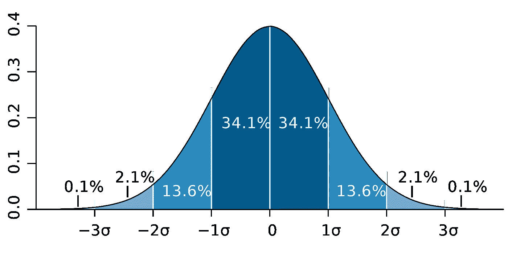****

****图片来源:[维基百科](https://en.wikipedia.org/wiki/Standard_deviation#/media/File:Standard_deviation_diagram.svg)****

****请注意，置信区间也取决于样本大小，因为它是使用基于样本大小的标准误差计算的。****

> ****置信水平是在实验开始之前定义的，因为它会影响实验结束时的误差幅度有多大。****

# ****统计假设检验****

****检验统计学中的假设是检验实验或调查结果的一种方法，以确定这些结果有多大意义。基本上，一个是通过计算结果偶然发生的几率来测试获得的结果是否有效。如果是信，那么结果不可靠，实验也不可靠。假设检验是 ***统计推断*** 的一部分。****

## ****无效假设和替代假设****

****首先，你需要确定你想要测试的论题，然后你需要制定 ***零假设*** 和 ***替代假设*。**测试可能有两种结果，根据统计结果，您可以拒绝或接受所述假设。根据经验，统计学家倾向于将假设的版本或表述放在需要拒绝的无效假设**下，而可接受的和期望的版本则放在替代假设*下。*******

## ****统计显著性****

****让我们看看前面提到的例子，线性回归模型被用来调查企鹅的*鳍长*(自变量)是否对*(因变量*的体重有影响。我们可以用下面的统计表达式来建立这个模型:****

********

****然后，一旦估计了系数的 OLS 估计，我们可以制定以下无效和替代假设来测试鳍状肢长度是否对身体质量具有 ***统计显著性*** 影响:****

****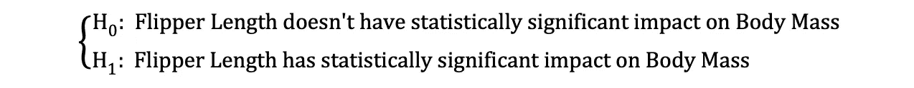****

****其中 H0 和 H1 分别代表零假设和备择假设。拒绝零假设意味着*鳍状肢长度*增加一个单位会对*体重*产生直接影响。假设β1 的参数估计值描述了自变量*脚蹼长度*对因变量*身体质量的影响。*这个假设可以重新表述如下:****

********

****其中 H0 陈述β1 的参数估计等于 0，即*鳍长*对*体质量*的影响 ***统计上不显著*** 而H0 陈述β1 的参数估计不等于 0，暗示*鳍长*对*体质量*的影响 ***统计上显著*** *。*****

## ****第一类和第二类错误****

****在进行统计假设检验时，需要考虑两种概念上的错误:第一类错误和第二类错误。当零假设被错误地拒绝时，出现类型 I 错误，而当零假设没有被错误地拒绝时，出现类型 II 错误。混淆矩阵有助于清楚地显示这两种错误的严重程度。****

> ****根据经验，统计学家倾向于将假设版本放在需要拒绝的***无效假设下，而可接受的和期望的版本放在*备选假设下。********

# *****统计测试*****

*****一旦陈述了无效假设和替代假设，并定义了测试假设，下一步就是确定哪个统计测试是合适的，并计算***测试统计量*** 。通过将测试统计量与 ***临界值*进行比较，可以确定是否拒绝空值。**该比较显示观察到的测试统计值是否比定义的临界值更极端，它可能有两种结果:*****

*   *****检验统计量比临界值更极端→可以拒绝零假设*****
*   *****检验统计量不像临界值那样极端→不能拒绝零假设*****

*****临界值基于预先指定的 ***显著性水平* α** (通常选择等于 5%)和检验统计遵循的概率分布类型。临界值将该概率分布曲线下的面积分为 ***拒绝区域*** 和 ***非拒绝区域*** 。有许多统计测试用来测试各种假设。统计检验的例子有[学生 t 检验](https://en.wikipedia.org/wiki/Student%27s_t-test)、 [F 检验](https://en.wikipedia.org/wiki/F-test)、[卡方检验](https://en.wikipedia.org/wiki/Chi-squared_test)、[德宾-豪斯曼-吴内生性检验](https://www.stata.com/support/faqs/statistics/durbin-wu-hausman-test/)、W [海特异方差检验](https://en.wikipedia.org/wiki/White_test#:~:text=In%20statistics%2C%20the%20White%20test,by%20Halbert%20White%20in%201980.)。在本文中，我们将研究其中的两个统计测试。*****

> *****当零假设被错误地拒绝时，出现类型 I 错误，而当零假设没有被错误地拒绝时，出现类型 II 错误。*****

## *****“学生”t 检验*****

*****最简单也是最受欢迎的统计测试之一是学生的 t 检验。其可用于测试各种假设，尤其是在处理主要关注领域是寻找单变量**的统计显著效果的证据的假设时。*t 检验的检验统计量遵循 [***学生的 t 分布***](https://en.wikipedia.org/wiki/Student%27s_t-distribution) ，可以确定如下:******

**********

*****其中，指定器中的 h0 是参数估计值的测试值。因此，t 检验统计量等于参数估计值减去假设值除以系数估计值的标准误差。在早先陈述的假设中，我们想测试鳍状肢的长度是否对体重有统计学上的显著影响。该测试可以使用 t-test 来执行，并且在这种情况下，h0 等于 0，因为斜率估计是针对值 0 来测试的。*****

*****t 检验有两个版本:一个 ***双边 t 检验*** 和一个 ***单边 t 检验*** 。你是需要前一个版本的测试还是后一个版本的测试，完全取决于你想要测试的假设。*****

*****双边或*双尾 t 检验* 可用于假设检验无效和替代假设下*等于*与*不等于*的关系，类似于下例:*****

**********

*****双边 t 检验有两个拒绝区域*，如下图所示:******

******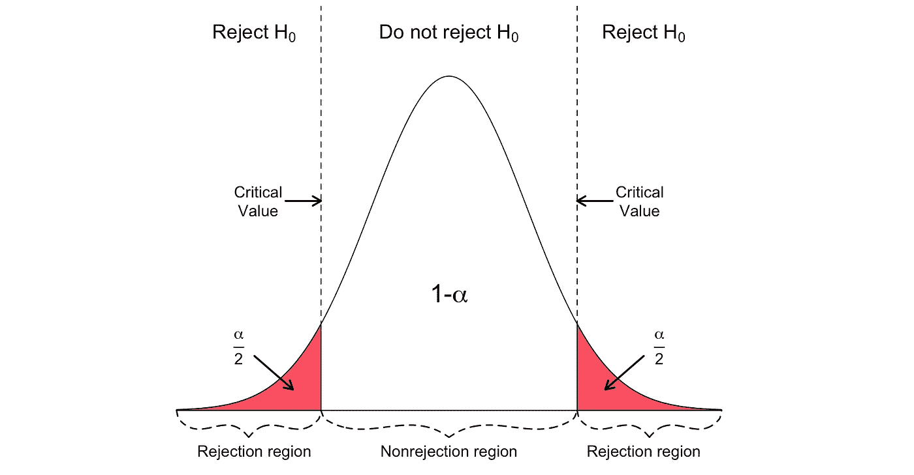******

******图片来源: [*Hartmann，k .，Krois，j .，Waske，b .(2018):SOGA 电子学习项目:统计和地理空间数据分析。柏林自由大学地球科学系*](https://www.geo.fu-berlin.de/en/v/soga/Basics-of-statistics/Hypothesis-Tests/Introduction-to-Hypothesis-Testing/Critical-Value-and-the-p-Value-Approach/index.html)******

*****在这个版本的 t-检验中，如果计算的 t-统计量太小或太大，则拒绝空值。*****

**********

*****这里，根据样本大小和选定的显著性水平，将测试统计数据与临界值进行比较。为了确定分界点的精确值，可以使用双边 t 分布表。*****

*****当假设在检验零假设和备选假设下的*正/负*对*负/正*关系时，可以使用单侧或 ***单尾 t 检验*** ，类似于下面的例子:*****

*****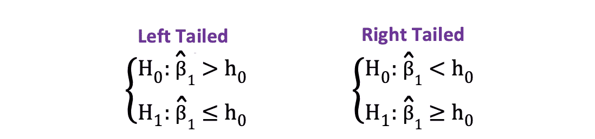*****

*****单侧 t 检验有一个 ***单个*** ***拒绝区域*** 和依赖在假设侧，拒绝区域要么在左侧，要么在右侧，如下图所示:*****

*****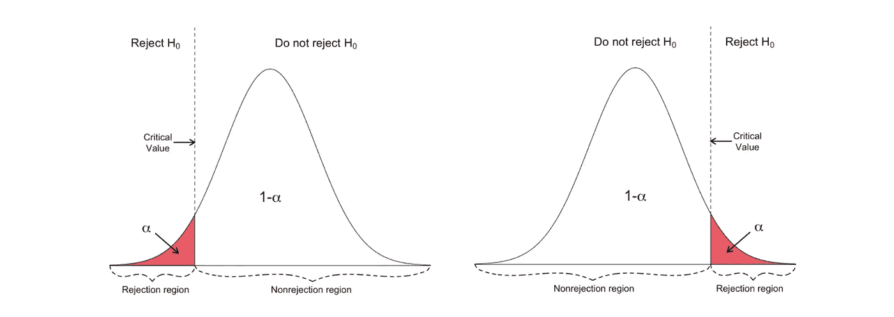*****

*****图片来源: [*Hartmann，k .，Krois，j .，Waske，b .(2018):SOGA 电子学习项目:统计和地理空间数据分析。柏林自由大学地球科学系*](https://www.geo.fu-berlin.de/en/v/soga/Basics-of-statistics/Hypothesis-Tests/Introduction-to-Hypothesis-Testing/Critical-Value-and-the-p-Value-Approach/index.html)*****

*****在这个版本的 t 检验中，如果计算出的 t 统计值小于/大于临界值，则拒绝空值。*****

**********

## *****f 检验*****

*****f 检验是另一种非常流行的统计检验，常用于检验假设检验****多个变量的联合统计显著性*** *。*当您想要测试多个自变量是否对因变量有显著的统计影响时，就是这种情况。下面是一个可以使用 f 检验进行检验的统计假设示例:******

**********

*****其中零表示对应于这些系数的三个变量在统计上联合不显著，而备选项表示这三个变量在统计上联合显著。f 检验的检验统计量遵循 [F 分布](https://en.wikipedia.org/wiki/F-distribution)，可确定如下:*****

**********

*****其中，SSRunrestricted 为*******受限* *模型*** 的残差平方和，该模型与从数据中排除了在空值*下声明为无关紧要的目标变量的模型相同，SSRunrestricted 为****模型**** *的残差平方和 q 代表在空值下联合检验显著性的变量数量，N 是样本大小，k 是无限制模型中的变量总数。 运行 OLS 回归后，在参数估计值旁边提供 SSR 值，这同样适用于 F 统计。以下是 MLR 模型输出的示例，其中标记了 SSR 和 F 统计值。***********

****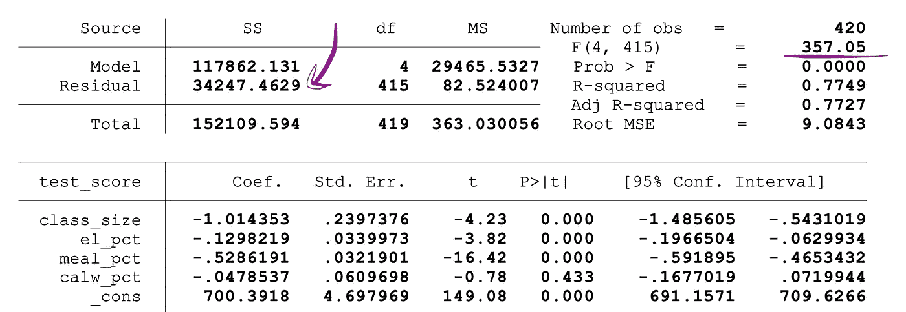****

****图片来源:[股票和 Whatson](https://www.uio.no/studier/emner/sv/oekonomi/ECON4150/v18/lecture7_ols_multiple_regressors_hypothesis_tests.pdf)****

****f 检验有**一个单一剔除区域**，如下图所示:****

****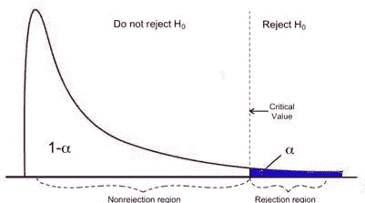****

****图片来源: [*密歇根大学*](https://www.statisticshowto.com/probability-and-statistics/f-statistic-value-test/)****

****如果计算出的 F-统计量大于临界值，则可以剔除空值，这表明独立变量共同具有统计显著性。拒绝规则可以表示如下:****

********

# ****p 值****

****另一种快速确定是拒绝还是支持零假设的方法是使用 ***p 值*** 。p 值是零发生条件下的概率。换句话说，假设零假设为真，p 值是观察到至少与检验统计量一样极端的结果的概率。p 值越小，反对零假设的证据越强，表明它可以被拒绝。****

****对 *p* 值的解释取决于所选的显著性水平。通常，1%、5%或 10%的显著性水平用于解释 p 值。因此，这些检验统计的 p 值可以用来检验相同的假设，而不是使用 t-检验和 F-检验。****

****下图显示了具有两个独立变量的 OLS 回归的输出示例。在此表中，t 检验的 p 值(测试 *class_size* 变量参数估计的统计显著性)和 F 检验的 p 值(测试 *class_size、*和 *el_pct* 变量参数估计的联合统计显著性)带有下划线。****

****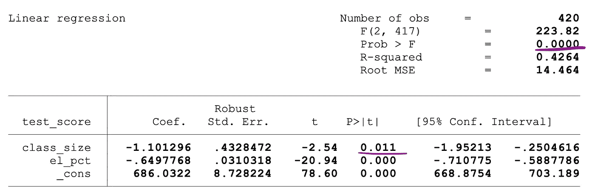****

****图片来源:[股票和 Whatson](https://www.uio.no/studier/emner/sv/oekonomi/ECON4150/v18/lecture7_ols_multiple_regressors_hypothesis_tests.pdf)****

****对应于 *class_size* 变量的 p 值为 0.011，当将该值与 1%或 0.01、5%或 0.05、10%或 0.1 的显著性水平进行比较时，可以得出以下结论:****

*   ****0.011 > 0.01 →在 1%的显著性水平上不能拒绝 t 检验的空值****
*   ****0.011 < 0.05 → Null of the t-test can be rejected at 5% significance level****
*   ****0.011 < 0.10 →Null of the t-test can be rejected at 10% significance level****

****So, this p-value suggests that the coefficient of the *class_size* 变量在 5%和 10%的显著性水平上具有统计显著性。对应于 f 检验的 p 值为 0.0000，因为 0 小于所有三个截止值；0.01，0.05，0.10，我们可以得出结论，在所有三种情况下都可以拒绝 f 检验的零。这表明 *class_size* 和 *el_pct* 变量的系数在 1%、5%和 10%的显著性水平上共同具有统计显著性。****

## ****p 值的限制****

****虽然使用 p 值有很多好处，但它也有局限性**。**也就是说，p 值取决于关联的大小和样本量。如果影响的幅度很小并且在统计上不显著，p 值可能仍然显示出 ***显著影响*** ，因为大样本量很大。也可能出现相反的情况，影响可能很大，但如果样本量很小，则无法满足 p < 0.01、0.05 或 0.10 的标准。****

# ****推断统计学****

****推断统计学使用样本数据对样本数据来源的总体做出合理的判断。它用于调查样本中变量之间的关系，并预测这些变量将如何与更大的总体相关。****

*******大数定律(LLN)*** 和 ***中心极限定理(CLM)*** 在推断统计学中都有重要作用，因为它们表明，当数据足够大时，无论原始人口分布是什么形状，实验结果都成立。收集的数据越多，统计推断就变得越准确，因此，产生的参数估计就越准确。****

## ******大数定律(LLN)******

****假设 **X1，X2，。。。，Xn** 都是具有相同基础分布的独立随机变量，也称为独立同分布或 i.i.d .，其中所有 X 都具有相同的均值 **μ** 和标准差 **σ** 。随着样本量的增加，所有 X 的平均值等于均值μ的概率等于 1。大数定律可以总结如下:****

********

## ****中心极限定理(CLM)****

****假设 **X1，X2，。。。，Xn** 都是具有相同基础分布的独立随机变量，也称为独立同分布或 i.i.d .，其中所有 X 都具有相同的均值 **μ** 和标准差 **σ** 。随着样本量的增长，X ***的概率分布收敛于均值 **μ** 和方差 **σ-** 平方的正态分布*** 。中心极限定理可以概括如下:****

********

****换句话说，当您有一个具有均值μ和标准差σ的总体，并且您从该总体中选取足够大的随机样本进行替换时，样本均值的分布将近似为正态分布。****

# ******降维技术******

****降维是将数据从一个 ***高维空间*** 转换到一个 ***低维空间*** ，使得数据的这种低维表示仍然尽可能地包含原始数据的有意义的属性。****

****随着大数据越来越受欢迎，对这些降维技术(减少不必要的数据和特征的数量)的需求也在增加。流行的降维技术的例子有[主成分分析](https://builtin.com/data-science/step-step-explanation-principal-component-analysis)、[因子分析](https://en.wikipedia.org/wiki/Factor_analysis)、[典型相关](https://en.wikipedia.org/wiki/Canonical_correlation)、[随机森林](/understanding-random-forest-58381e0602d2)。****

## ******主成分分析******

****主成分分析(PCA)是一种降维技术，通常用于降低大型数据集的维数，方法是将一组大型变量转换为一个较小的集合，该集合仍然包含原始大型数据集中的大部分信息或变化。****

****假设我们有一个有 p 个变量的数据 X；X1，X2，…、Xp 带 ***特征向量*** e1、…、ep、 ***特征值*** λ1、…、λp 特征值表示总方差中某一特定数据字段所解释的方差 PCA 背后的思想是创建新的(独立的)变量，称为主成分，是现有变量的线性组合。第 i *个*主分量可以表示如下:****

********

****然后使用**肘规则**或[或**凯泽规则**或](https://docs.displayr.com/wiki/Kaiser_Rule)就可以确定最优概括数据的主成分个数而不会丢失太多信息。还要看***【PRTV】***每一个主成分所解释的总变异的比例来决定是包含还是排除它是有益的。第 i *个*主分量的 PRTV 可以使用特征值计算如下:****

********

## ****肘尺****

****肘规则或肘方法是一种启发式方法，用于从 PCA 结果中确定最佳主成分的数量。这种方法背后的思想是将所解释的变化绘制为组件数量的函数*，并选择曲线的拐点作为最佳主组件的数量。以下是此类散点图的示例，其中 PRTV (Y 轴)绘制在主成分数(X 轴)上。肘对应于 X 轴值 2，这表明最佳主成分的数量是 2。*****

****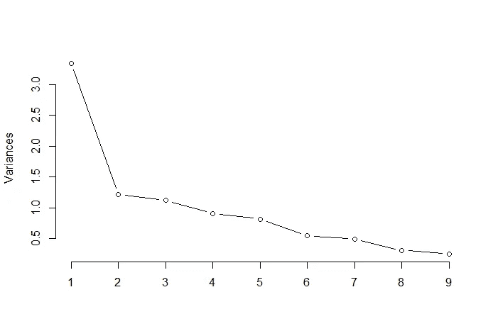****

****图片来源:[多元统计 Github](https://raw.githubusercontent.com/TatevKaren/Multivariate-Statistics/main/Elbow_rule_%25varc_explained.png)****

## ******因子分析******

****因子分析是另一种降维的统计方法。这是最常用的相互依赖技术之一，当相关变量集显示系统的相互依赖时使用，目标是找出产生共性的潜在因素。假设我们有一个有 p 个变量的数据 X；X1，X2，…，Xp。FA 模型可以表示如下:****

********

****其中 X 是 p 个变量和 N 个观察值的[p x N]矩阵，是[p x N]总体均值矩阵，A 是[p x k]公共 ***因子加载矩阵*** ，F [k x N]是公共因子矩阵，u [pxN]是特定因子矩阵。因此，换句话说，因子模型是一系列的多元回归，从不可观察的公共因子 fi 的值预测每个变量 Xi:****

****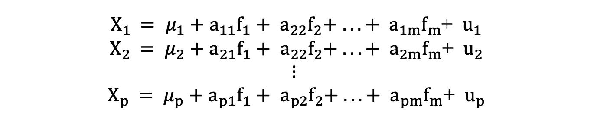****

****每个变量都有 k 个自己的公因子，这些公因子通过因子加载矩阵与单个观察值相关联，如下:在因子分析中，计算 ***因子*** 以使 ***最大化* *组间方差*** 而 ***最小化组内方差*** *e* 。它们之所以是因素，是因为它们将潜在的变量组合在一起。与 PCA 不同，FA 中的数据需要归一化，因为 FA 假设数据集遵循正态分布。****

# ****额外资源****

****[](https://github.com/TatevKaren) [## TatevKaren —概述

### 我是 Tatev Karen Aslanyan，数据科学家和定量分析师，在数学、统计…

github.com](https://github.com/TatevKaren) 

**Github 仓库进行 A/B 测试:** [此处](https://github.com/TatevKaren/data-science-popular-algorithms/tree/main/AB_Testing)**** 

# ****如果你喜欢这篇文章，这里有一些你可能喜欢的其他文章:****

****[](https://tatev-aslanyan.medium.com/bias-variance-trade-off-in-machine-learning-7f885355e847) [## 机器学习中的偏差-方差权衡

### 机器学习和统计模型中偏差-方差权衡的介绍

tatev-aslanyan.medium.com](https://tatev-aslanyan.medium.com/bias-variance-trade-off-in-machine-learning-7f885355e847) [](https://tatev-aslanyan.medium.com/data-sampling-methods-in-python-a4400628ea1b) [## Python 中的数据采样方法

### 使用不同的数据采样技术创建 Python 中的随机样本的现成代码

tatev-aslanyan.medium.com](https://tatev-aslanyan.medium.com/data-sampling-methods-in-python-a4400628ea1b) [](/simple-and-complet-guide-to-a-b-testing-c34154d0ce5a) [## 简单完整的 A/B 测试指南

### 为您的数据科学实验进行端到端 A/B 测试，面向非技术和技术专家，提供示例和…

towardsdatascience.com](/simple-and-complet-guide-to-a-b-testing-c34154d0ce5a) [](/monte-carlo-simulation-and-variants-with-python-43e3e7c59e1f) [## 蒙特卡罗模拟和 Python 变种

### 蒙特卡洛模拟指南，必须了解 Python 实现的统计抽样技术

towardsdatascience.com](/monte-carlo-simulation-and-variants-with-python-43e3e7c59e1f) [](https://medium.com/analytics-vidhya/pyspark-cheat-sheet-big-data-analytics-161a8e1f6185) [## PySpark 备忘单:大数据分析

### 这里是基本 PySpark 命令和函数的备忘单。在 PySpark 中开始您的大数据分析。

medium.com](https://medium.com/analytics-vidhya/pyspark-cheat-sheet-big-data-analytics-161a8e1f6185) [](https://medium.com/mlearning-ai/using-customer-and-product-features-in-recommender-systems-2734258873cf) [## 在推荐系统中使用客户和产品特征

### 提出了一种基于矩阵分解的向推荐系统添加额外用户和项目特征的方法

medium.com](https://medium.com/mlearning-ai/using-customer-and-product-features-in-recommender-systems-2734258873cf) 

# 调查:完美的数据科学课程对你来说是什么样的？

*你是否也注意到，作为数据科学家，我们很难浏览多个博客和课程，即使在这种情况下，也没有一个地方涵盖所有主题。所以，我愿意为您打造这个* ***【一站式数据科学店】*** *课程。*

*为了为您定制本课程，我很想了解您的意见，以了解“完美的数据科学课程对您来说是什么样的？”。*

*因此，我想请您回答几个问题来完成这个* [***简短调查***](https://docs.google.com/forms/d/e/1FAIpQLSeRxugd3ACiD1wsC8H3y8Y29L4sk2fdysw1lxzGNedL5sPqUw/viewform)**，一旦课程开始，您将是第一个收到通知的人。也请* [***与你认为会对此课程感兴趣的人分享***](https://docs.google.com/forms/d/e/1FAIpQLSeRxugd3ACiD1wsC8H3y8Y29L4sk2fdysw1lxzGNedL5sPqUw/viewform) *？**

*预先感谢您，非常感谢您的参与！*

****为调查链接:*** [***点击此处***](https://docs.google.com/forms/d/e/1FAIpQLSeRxugd3ACiD1wsC8H3y8Y29L4sk2fdysw1lxzGNedL5sPqUw/viewform)*

****感谢阅读****

**我鼓励你* [***加入 Medium today***](https://tatev-aslanyan.medium.com/membership) *以拥有* *完整访问所有跨媒体发布的伟大锁定内容，并在我的 feed 上发布关于各种数据科学、机器学习和深度学习主题的内容。**

**关注我* [***中***](https://medium.com/@tatev-aslanyan)**阅读更多关于各种数据科学和数据分析主题的文章。更多机器学习的动手应用，数学和统计概念查看我的*[***Github***](https://github.com/TatevKaren)**账号。
我欢迎反馈，可以联系*[***LinkedIn***](https://www.linkedin.com/in/tatev-karen-aslanyan/)*。****

*****快乐学习！*********