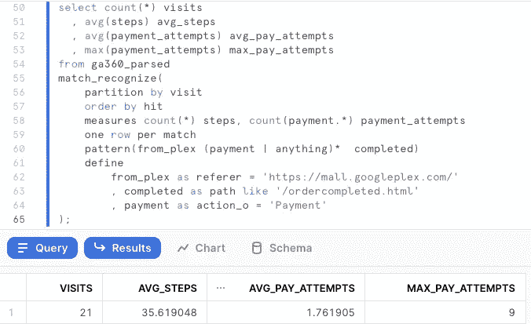
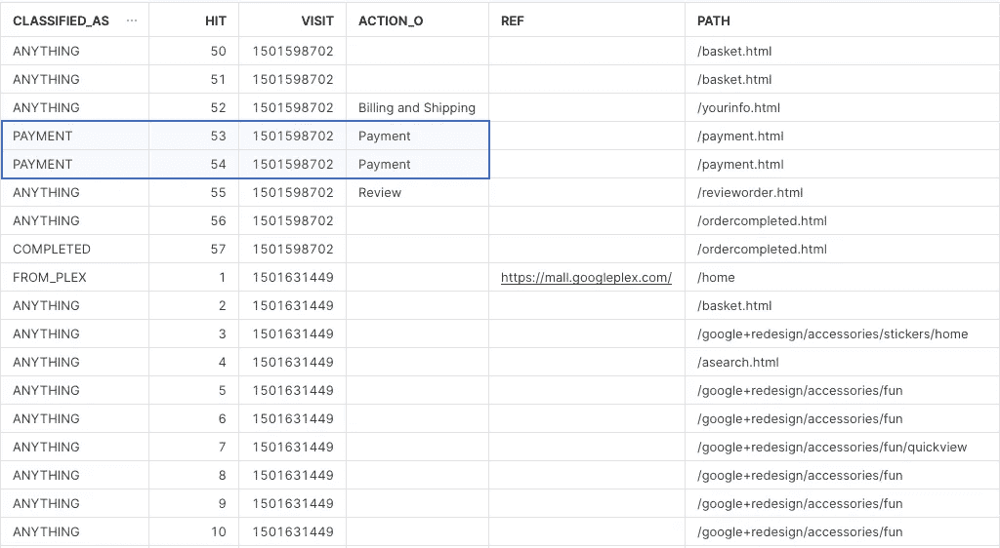

# 使用 SQL: MATCH_RECOGNIZE()对雪花进行漏斗分析

> 原文：<https://towardsdatascience.com/funnel-analytics-with-sql-match-recognize-on-snowflake-8bd576d9b7b1?source=collection_archive---------4----------------------->

## SQL 是一个很棒的工具，但是它不能做所有的事情。例如，找出一种用 SQL 分析漏斗和会话的方法确实很困难——直到现在。让我们通过用雪花分析一个 Google Analytics 电子商务漏斗来发现 MATCH_RECOGNIZE()的强大之处。


图片: [Pixabay](https://pixabay.com/photos/architecture-buildings-cars-city-1837176/)

当 TJ 墨菲发现雪花现在支持`MATCH_RECOGNIZE`时，看看他的反应:

# 样本用例:带有雪花的谷歌分析电子商务漏斗

## **你会如何用 SQL:** 回答这个漏斗问题

> “我们有一个电子商务商店。我们需要识别从任意推荐人(Instagram、脸书等)进入网站并最终购买了某些东西的会话。这些用户买东西经历了多少步，尝试了多少次支付才成功？”

用普通的 SQL 回答这个问题并不容易。但是`MATCH_RECOGNIZE`最终给了我们一种优雅的方式来寻找像这样问题的答案。

使用`MATCH_RECOGNIZE`,我们可以简单地定义我们想要在一系列事件中找到的步骤，然后我们可以为这些步骤定义任何模式——然后`MATCH_RECOGNIZE`完成剩下的工作。

在这个例子中，我们将使用来自电子商务商店的 Google Analytics 360 数据集。没有什么比真实数据更能证明我们工具的威力了。

## 步骤 1:将谷歌分析数据加载到雪花中

将数据从 BigQuery 取出放入 Snowflake 很容易。您可能需要工具来构建可靠的管道，但基本步骤很简单:

*   从 BigQuery 导出到 GCS:您可以使用自己的 GA 数据，或者一个包含来自 Google 商品商店的数据的[样本数据集](https://support.google.com/analytics/answer/7586738?hl=en)。
*   [将 GA 数据加载到雪花中](https://stackoverflow.com/a/64168195/132438):这很简单。雪花会很乐意从 GCS 摄取文件，即使你的雪花账户住在 AWS。加载 JSON 也像变魔术一样。您可能希望设置身份验证和权限以获得最大的安全性，而对于示例数据，我只使用了一个 public bucket。

```
create or replace table ga_demo2(src variant);copy into ga_demo2
from 'gcs://fhoffa/ga360/ga_sessions000000000000'
file_format=(type='JSON');
```

*   雪花中的查询:注意上面我们将 JSON 行加载到了一个`variant`类型中。雪花使处理半结构化数据成为一种乐趣；你可以很容易地浏览谷歌分析模式。我们还可以在基本查询之外创建一个视图，以便更容易地执行以下所有步骤:

```
create or replace view ga360_parsed
as
select src:visitStartTime::timestamp ts
    , hit.value:hitNumber::int hit
    , src:visitId::string visit
    , hit.value:eCommerceAction.action_type::int action_t
    , hit.value:eCommerceAction.step::int action_s
    , hit.value:eCommerceAction.option::string action_o
    , hit.value:page.pagePath::string path
    , hit.value:referer::string referer
    , src:fullVisitorId::string visitor
    , src:totals.transactions::int total_transactions
from ga_demo2, lateral flatten(input => src:hits) hit
```

## 第二步:查询漏斗很有趣

这个“简单明了”的查询回答了我们想要回答的问题:

```
select count(*) visits
  , avg(steps) avg_steps
  , avg(payment_attempts) avg_pay_attempts
  , max(payment_attempts) max_pay_attempts
from ga360_parsed
match_recognize(
    partition by visit
    order by hit
    measures count(*) steps, count(payment.*) payment_attempts
    one row per match
    pattern(from_plex (payment | anything)*  completed)
    define
        from_plex as referer = '[https://mall.googleplex.com/'](https://mall.googleplex.com/')
        , completed as path like '/ordercompleted.html'
        , payment as action_o = 'Payment'
);
```

结果有 21 次访问是从那个特定的推荐人登陆到我们的网站，并最终购买了一些东西。平均来说，他们要走 35.6 步，尝试支付 1.7 次——至少有一个会话在成功前尝试支付 9 次。



漏斗问题的结果

# 了解匹配识别

你可以跟随[官方文档](https://docs.snowflake.com/en/user-guide/match-recognize-introduction.html)去发现`MATCH_RECOGNIZE`的所有能力——这里我们将看看上面查询的基础。

## 规定

让我们从`define`部分开始，它用于定义用户漏斗中的步骤:

```
define
        from_plex as referer = '[https://mall.googleplex.com/'](https://mall.googleplex.com/')
        , completed as path like '/ordercompleted.html'
        , payment as action_o = 'Payment
```

你可以看到我们给每一步取了一个任意的名字，条件可以是你想要的任何条件。我们的一个步骤查看`referer`，另一个步骤查看用户登陆特定的`path`，支付步骤由 Google Analytics 存储的`action`变量标识。

## 模式

`pattern`部分基本上是漏斗步骤的正则表达式:

```
pattern(from_plex (payment | anything)*  completed)
```

这表示"*查找以* `*from_plex*` *步骤开始的会话，随后是任意数量的* `*payment*` *或* `*anything*` *步骤，并以* `*completed*` *状态结束。*

## 匹配 _ 识别

随着`define`和`pattern`的建立，我们可以进行一个基本的`match_recognize`查询:

```
select classified_as, hit, visit, action_o, referer ref, path
from ga360_parsed
match_recognize(
    partition by visit
    order by hit
    measures classifier() as classified_as
    all rows per match
    pattern(from_plex (payment | anything)*  completed)
    define
        from_plex as referer = '[https://mall.googleplex.com/'](https://mall.googleplex.com/')
        , completed as path like '/ordercompleted.html'
        , payment as action_o = 'Payment'
);
```

我们向该查询添加了 3 个构造。首先，如何拆分和排序我们的会话:`partition by visit order by hit`。然后添加一列，显示每行在我们的漏斗中是如何分类的:`measures classifier()`。然后我们希望看到每个漏斗的所有行，而不仅仅是一行摘要:`all rows per match`。这使我们可以看到以下结果，其中突出显示了分类为“付款”的步骤:



显示每个匹配的所有行

## 回答漏斗问题

确定每个漏斗步骤后，我们就可以回答开头的问题了。我们可以不选择所有的行，而是要求每个漏斗有一个摘要:`one row per match`。我们添加我们感兴趣的度量:`measures count(*) steps, count(payment.*) payment_attempts`。`MATCH_RECOGNIZE`完成剩下的工作，我们可以回到我们通常的 SQL 方式来获得计数、平均值和其他指标。

# 后续步骤

漏斗分析只是一个例子。想想工具箱里有`MATCH_RECOGNIZE`的所有可能性:威胁检测、在天气和股票价格趋势线中寻找趋势，等等。

让我们在未来的帖子中探讨这些话题，并分享您的最佳想法和结果。

# 阅读更多

*   官方雪花`MATCH_RECOGNIZE()`文档。

# 想要更多吗？

我是 Felipe Hoffa，雪花的数据云倡导者。谢谢你和我一起冒险。你可以[在 Twitter](https://twitter.com/felipehoffa) 上关注我，并查看[reddit.com/r/snowflake](https://www.reddit.com/r/snowflake/)最有趣的雪花新闻。

[](https://github.com/Snowflake-Labs/awesome-snowflake) [## 雪花实验室/棒极了雪花

### 关于雪花社区和内容的主要链接的令人敬畏的资源的策划列表，记得订阅:活动…

github.com](https://github.com/Snowflake-Labs/awesome-snowflake)