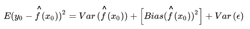

# 面向未来的数据分区

> 原文：<https://towardsdatascience.com/future-proof-your-data-partitions-d2047de9ead2?source=collection_archive---------32----------------------->


照片由 [Unsplash](https://unsplash.com/?utm_source=unsplash&utm_medium=referral&utm_content=creditCopyText) 上的 [Ijaz Rafi](https://unsplash.com/@ijazrafi?utm_source=unsplash&utm_medium=referral&utm_content=creditCopyText) 拍摄

## ***数据分区和机器中的幽灵***

将数据分成训练分区和测试分区是改进我们预测的重要一步。对一些数据进行建模，并通过对剩余样本的预测来测试该模型，这就是我们如何理解和补偿偏差和方差，这是机器学习的一个中心困境。

使用 Python 拆分数据非常容易，scikit-learn 中有 train_test_split 函数。除了指定训练样本(或测试样本)的大小，如果这是一个分类问题，是否对响应变量进行分层是您最需要的。剩下的工作就是设置 random_state 值，该值以随机的方式决定哪些行进行训练，哪些行进行测试。

过去，对于随机种子值，我使用:

1.  42(向道格拉斯·亚当斯致敬)
2.  451(雷·布雷德伯里)
3.  2001 年、2010 年和 2061 年(亚瑟·C·克拉克)
4.  314159(仅在圆周率日)
5.  我最常见的随机种子= 1

这个想法是，无论随机种子输入如何，分割数据都会导致训练和测试之间的值的类似分布，但我已经错误地这样做了相当长一段时间。

我们的机器(学习)里有个鬼，叫方差。

***偏差&方差***

但在我们带上捉鬼敢死队的质子包来对付这个幽灵之前，让我们先来看看偏差和方差的数学基础，找出前进的道路。对于随机变量 X 的给定值，测试数据的预期残值(通常表示为均方误差)可以分解为三个要素:1)方差，2)偏差的平方，以及 3)残差的方差(James，Witten，Hastie，& Tibshirani，2013)。更多细节见图 1。



图 1:均方误差分解

方差本身是一个随机函数，无论学习算法如何，它都会给每个预测模型增加一定程度的不确定性，我们可以利用这种随机性来构建更稳健的模型。为了实现这一飞跃，让我们考察一个解释方差的不同方程(Abu-Mostafa，Magdon-Ismail，& Lin，2012)。更多详情请参见图 2:


图 2:方差还原

在这种概念化中，学习模型“g”作用于无限数量的数据集上的随机变量 X 的预期残差值需要从所有估计值的平均值中减去估计预测值，这就是我们的解决方案！

如果我们可以根据方差的平均值分割数据集，这既是数据也是特定于模型的，我们就可以提高模型对未来数据必然包含的偏差的稳健性。**类似方差均值的训练和测试分区可以降低方差本身的整体效应**。

但这主要是一个概念工具，因为它意味着通过在无限数量的数据集上重复估计学习函数来收集预期残差，并且对于每个随机 x。**但还有另一种方法来使用这一概念，即通过模拟同一数据集的随机偏差的许多数据集。**通过构建测试准确度/训练准确度比率作为度量，并迭代训练/测试分裂的随机种子值，我们可以可视化学习模型的不稳定性(Abu-Mostafa 等人，2012 年)，因为它们与特定数据集相关；这是检验方差的一种局部方法。一个纯理论的概念可以成为业务分析建模模板中重要的新步骤。

***求方差均值***

方差是特定于模型的，包含可减少和不可减少的误差，因此任何可视化这种随机函数的尝试都应该使用预期的建模算法。图 3 展示了 IBM HR Analytics 员工流失和绩效二进制分类数据集 200 次迭代的方差均值和曲线图，该数据集采用了交叉验证的逻辑回归模型，您可以看到均值分割如何减少方差的振幅波动，以及如何缩小不同时间的偏差范围。数据预处理是最少的(丢弃低信息变量和一次性编码分类变量),并且不需要调整，因为我们不寻求准确性，而是所有预测模型中存在的不稳定性，所以使用默认的超参数设置是预期的。


图 3:方差图和平均值计算

代码块 1 和 2 显示了如何使用 f1_score 作为精度度量来实现二进制分类。200 个模型的使用是任意的；选择它是为了在运行时和捕获全范围的方差之间取得平衡，其中最大的峰值出现在这个数据集+模型的 random_state = 125 以上。

```
# Code Block 1from sklearn.linear_model import LogisticRegressionCVmodel = LogisticRegressionCV(random_state=1, max_iter=5000)
size = 0.5
```

```
# Code Block 2import numpy as np
from sklearn.model_selection import train_test_split
from sklearn.metrics import f1_score, balanced_accuracy_score, precision_score, recall_score
import matplotlib.pyplot as pltVar = []for i in range(1, 200):
    train_X, test_X, train_y, test_y = train_test_split(X, y,
test_size = size, stratify=y, random_state = i)
    model.fit(train_X, train_y)
    train_pred = model.predict(train_X)
    test_pred = model.predict(test_X)
    train_error = f1_score(train_y, train_pred)
    test_error = f1_score(test_y, test_pred)
    variance = test_error/train_error
    Var.append(variance)

rs_value = np.average(Var)def find_nearest(array, value):
    array = np.asarray(array)
    idx = (np.abs(array - value)).argmin()
    return array[idx]nearest = find_nearest(Var, rs_value)print('random_state = ', Var.index(nearest))
```


方差均值分割的随机种子值

```
# Code Block 3 for plotting the variance graphplt.figure(figsize=(10,8))plt.plot(range(1, 200), Var, color='royalblue', label="Variance")
plt.plot([0, 200], [rs_value, rs_value], color='darkorange', linewidth=3)
plt.text(0,rs_value, rs_value, fontsize=15, color='black')plt.legend(loc='lower center', shadow=True, fontsize='medium')
plt.show()
```

为回归模型更改此代码是一个简单的转换:从数据分区中删除“分层=y ”,并更改误差度量(例如，均方误差、平均绝对误差等。).代码块 1 设置建模算法和测试大小，而代码块 2 收集方差信息，计算其均值，并找到与方差均值最接近的随机状态值，以对训练/测试分割进行编程。代码块 3 绘制了方差及其均值。

关于这种方法是否会导致信息泄露还有一个问题，但是我们没有使用测试预测的性能来改变模型拟合。相反，我们使用来自多个模型的元数据来发现方差均值，并根据该值调整初始数据分区。尽管如此，这是一个讨论的话题。

最后，尽管需要更多的一次性计算资源，但根据方差的平均值分割数据应该会产生更强大的模型，在新的未来数据到来时，这些模型将保持更好的准确性。

**参考文献**

Abu-Mostafa，Y. S .、Magdon-Ismail，m .、和 Lin，H.-T. (2012 年)。*从数据中学习*(第四卷)。美国纽约 AMLBook:

詹姆斯，g .，威滕，d .，哈斯蒂，t .，，蒂布拉尼，R. (2013)。*统计学习概论*(第 112 卷)。斯普林格。