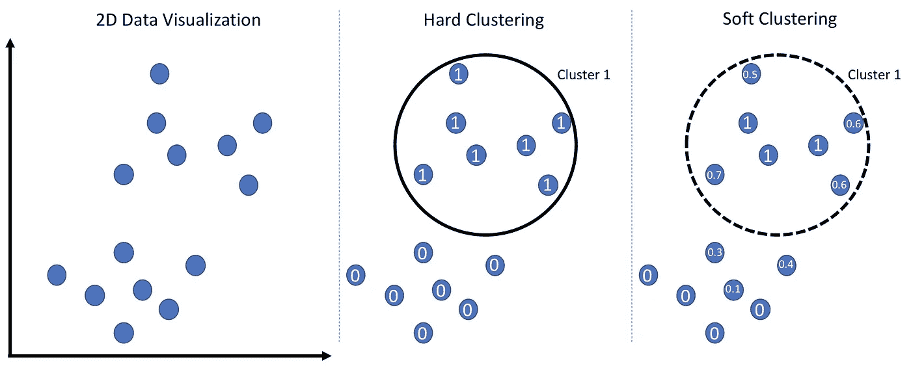
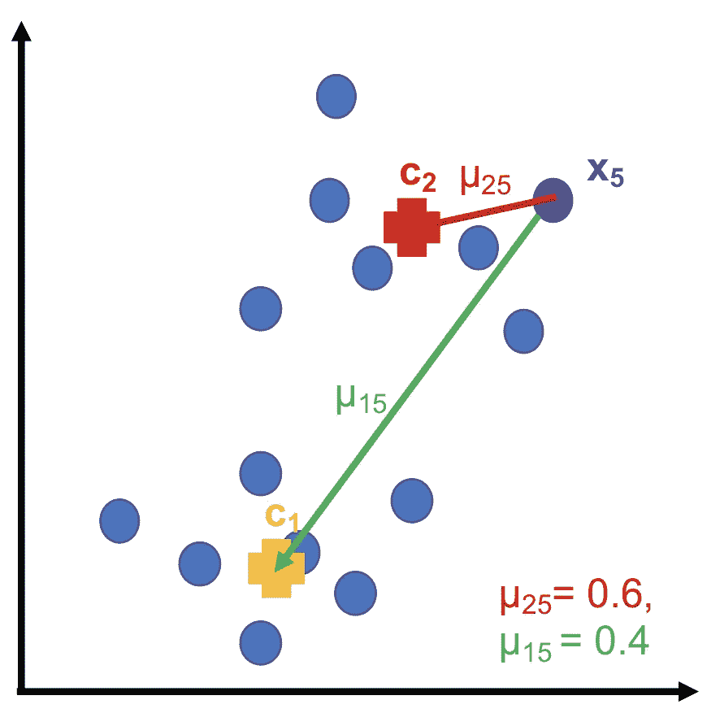
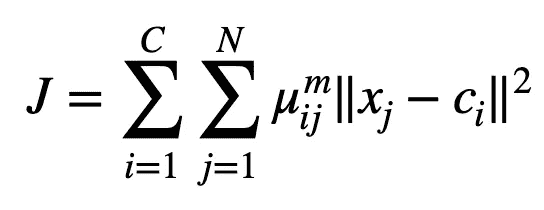
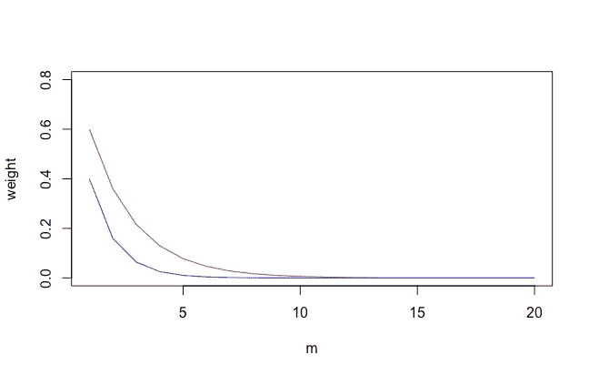
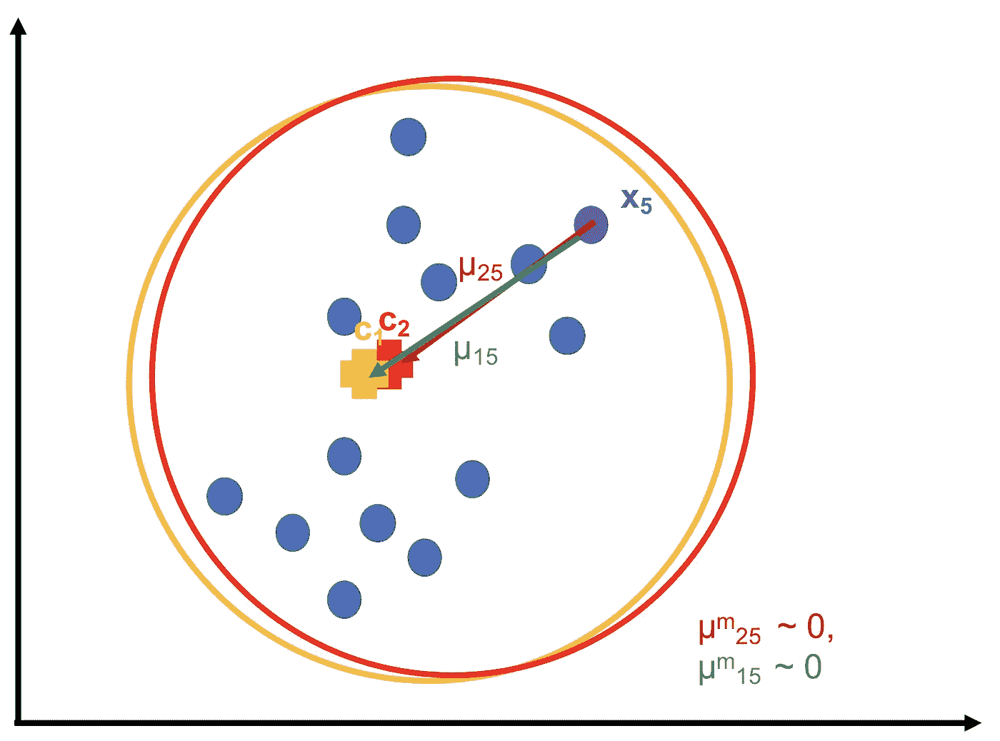
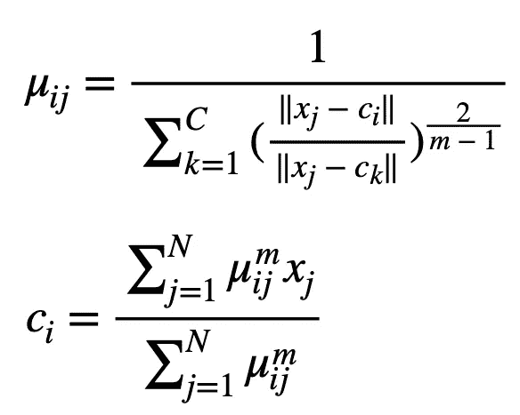
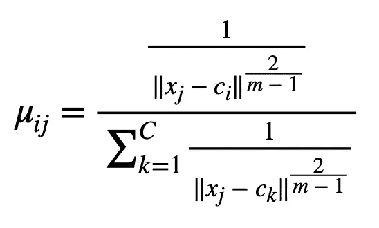
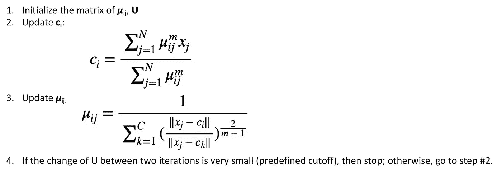

# 用 Python 实现模糊 C 均值聚类

> 原文：<https://towardsdatascience.com/fuzzy-c-means-clustering-with-python-f4908c714081?source=collection_archive---------4----------------------->

## 无监督学习

## 在这篇文章中，我简要介绍了无监督学习方法的概念，模糊 C 均值聚类，以及它在 Python 中的实现。


亚历山大·Cvetanovic 在 [Unsplash](https://unsplash.com?utm_source=medium&utm_medium=referral) 上的照片

F uzzy C-means 聚类算法是一种无监督学习方法。在了解细节之前，我先来解密一下它的花里胡哨的名字。

所以，“模糊”在这里的意思是“不确定”，表示这是一种**软聚类**方法。“C-means”的意思是 C 个聚类中心，只是把“K-means”中的“K”换成了一个“C”，让它看起来不一样。

在一个聚类算法中，如果一个数据点属于一个聚类的概率只能取值 1 或 0，这就是**硬聚类**。硬聚类方法中的聚类的边界可以被可视化为清晰的边界。相反，在软聚类方法中，一个数据点属于一个聚类的概率可以取 0 到 1 之间的任何值，例如 75%，为此，聚类的边界可以被可视化为模糊边界。



硬聚类和软聚类。每个点代表一个数据点，每个点中的数字是它属于类 1 的概率，黑色圆圈代表类 1 的类边界。(图片由作者提供)

好了，在了解了软聚类方法的概念之后，我们可以直观地认识到可能驱动聚类的几个重要参数。首先，当然是集群中心。第二，一个点属于特定聚类的概率。

## 了解参数

在*模糊 c 均值* ( **FCM** )聚类方法中，我们有两个参数， ***μ_ij*** 和 ***c_i*** 和一个超参数， ***m*** 。

***【μ_ ij】****隶属值* ***，*** 是第*个*个数据点属于第*个*聚类的概率，约束为每个数据点 *j* 的 ***μ_ij*** 与 *C* 聚类中心之和为 **1** ***c_i*** 是*与*簇的中心(与 ***X*** 同维)。而 ***m*** 是*模糊化器*，控制聚类边界应该模糊到什么程度。



参数示例。(图片由作者提供)

在上面的示例图中，我们正在查看第 5 个数据点 *X_5* ，并且假设我们知道只有两个聚类，并且当前聚类中心是*C1*和*C2*。 ***μ*** _25 是第 5 个数据点属于第 2 类的概率， ***μ*** _15 是第 5 个数据点属于第 1 类的概率。然后，我们看到第 5 个数据点比 C1 更靠近 C2，所以 ***μ*** _25 (0.6)大于 ***μ*** _15 (0.4)。并且它们满足每个数据点的 ***μ*** 之和为 1 的约束，其中***μ***_ 15+***μ***_ 25 = 1。

上面的例子只是为了说明 FCM 中的参数，但是实际的值并不一定是那样的。

## 目标函数



FCM 的目标函数。(图片由作者提供)

我选择在引入参数后显示目标函数，因为它在这里看起来更清晰。

你可以把目标函数理解为数据点( *X_j* )和聚类中心( *C_i* )之间距离的加权和。“距离”项是上式中的 *L2 范数*，在上面的示例(第 5 个数据点)中，它正好是箭头的长度。

如果 *m = 1* ，那么目标函数就是数据点和聚类中心之间距离的概率加权和。这是什么意思？这意味着靠近聚类中心的数据点被赋予较高的权重。

在上面的例子中，第 5 个数据点和第 2 聚类中心之间的距离比第 5 个数据点和第 1 聚类中心之间的距离对目标函数的贡献更大，因为 ***μ*** _25 = 0.6 和 ***μ*** _15 = 0.4。

记住，我们希望最小化目标函数，因此对于那些长距离(数据点和聚类中心之间)，使用小的 ***μ*** 是很好的。

如果 m =2，3，…会怎么样？然后距离的贡献差越来越小，如下图所示( ***μ*** _15 和 ***μ*** _25)，都接近于 0。



重量衰减曲线。红色曲线为 ***μ*** _25，蓝色曲线为 ***μ*** _15。(图片由作者提供)

因此，对于**一个非常大的 m** ，聚类**中心**倾向于位于与所有数据点的**距离**几乎相等的地方，因为每个点到中心的距离对目标函数的贡献 ***相等*** 。那么，聚类中心在哪里呢？是的，所有数据点的中心。

如果 m 超级大，所有聚类中心都位于所有数据点的质心，那么聚类就会超级“ ***模糊*** ”因为根本不聚类！



FCM 中非常大的 m 的例子。(图片由作者提供)

因此，为了进行有意义的聚类，我们在大多数情况下使用 m = 2。

## 寻找最小化目标函数的参数

受约束的参数优化可以使用拉格朗日函数手动解决，但我们不会在这篇文章中讨论它。相反，我现在列出的是计算 ***c_i*** 和 ***μ_ij 的最终方程。***



更新 FCM 方程(图片由作者提供)

求解 ***c_i*** 的方程相对简单，其中它表示 X 到簇中心 *i* 的加权平均值。为什么一定要除以(***μ_ ij***)*^m*之和？那是因为只有当 ***m=1*** 时，权重之和才等于 1(这种情况下我们可以去掉整个分母)。当 *m > 1* 时，权重之和为聚类中心加权和计算的定标器。

但是 ***μ_ij*** 的方程看起来没那么好理解吧？如果我们把它转换成下面这个，应该就容易解读多了。



u_ij 的另一种看法(图片由作者提供)

假设 *m=2* ，那么分子部分就是第*个第*个数据点到第*个第*个聚类中心的 ***距离*** 的倒数(上图中箭头的长度)。如前所述，较大的距离应对应较小的 ***μ_ij*** ，这也反映在这个等式中。等式的分母是从 *x_j* 到每个聚类中心的距离的倒数之和。

## 该算法

完整的 FCM 算法可以在下图中描述。



FCM(作者图片)算法

该过程实际上与 **EM** 算法相同。如果你有兴趣了解 EM，可以去下面的帖子。

</gaussian-mixture-models-with-python-36dabed6212a>  

## 实施 FCM

模糊 c 均值聚类在 Python 中的实现非常简单。安装程序如下所示，

```
import numpy as np
from fcmeans import FCMmy_model = FCM(n_clusters=2) # we use two cluster as an example
my_model.fit(X) ## X, numpy array. rows:samples columns:features
```

从聚类模型中提取信息，

```
centers = my_model.centers
labels = my_model.predict(X)
```

就是这样！

希望文章有用。

<https://jianan-lin.medium.com/membership> 