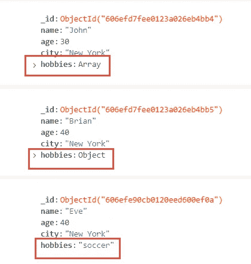
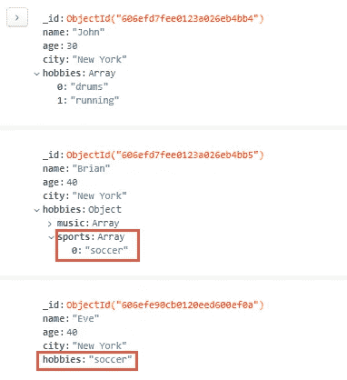
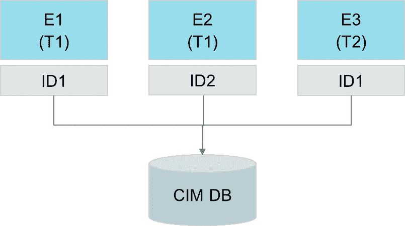
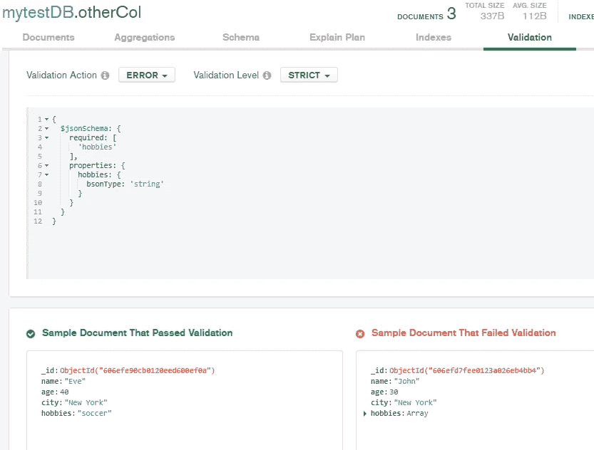

# 模糊数据结构——诅咒还是祝福？

> 原文：<https://towardsdatascience.com/fuzzy-data-structures-curse-or-blessing-5ee34ff39cd7?source=collection_archive---------37----------------------->

## 从工业应用的角度看挑战和解决方案


约书亚·索蒂诺在 [Unsplash](https://unsplash.com?utm_source=medium&utm_medium=referral) 上拍摄的照片

# 介绍

前段时间发现一篇有意思的文章[【1】](#_ftn1)，对比了 SQL 和 NoSQL 通过 Python 进行数据处理，指出了 SQL 的一些弊端。SQL 的一个突出的弱点是在一个简单的属性中缺少存储复杂的对象结构(例如 Python 字典)，这违反了第一范式(1NF)[【2】](#_ftn2)。在这种情况下，作者简要讨论了模糊数据格式的情况，这在 MongoDB 中是技术上可行的。虽然在那篇文章中没有进一步指出这个问题，但是我想知道 MongoDB 的这个特性到底是优点还是缺点，特别是在我专业所在的工业应用程序环境中。因为我找不到一篇文章全面地讨论了这个问题，所以我想分析和讨论这个问题，并分享我的发现！

在这个简短的介绍之后，我们将简要讨论不同数据库技术的特征。然后，我们将基于 MongoDB 中的两个简单集合评估使用模糊数据结构时的挑战。接下来，我们将把简化示例中的发现转移到半导体行业的实际工业应用中。最后，我们将进一步了解克服这些挑战的工具和方法。

# 技术

首先，必须理解 MongoDB 的数据存储原理。MongoDB 通常被归类为 NoSQL 数据库概念[【3】](#_ftn3)。然而，NoSQL 是多种技术的总称，这些技术不仅不同于 RDBMS，而且彼此之间也有很大的不同。众所周知的 NoSQL 数据库技术类型有键值存储(如 Amazon Dynamo)、宽列存储(如 Cassandra)、图形数据库(如 Nio4j)和文档存储，MongoDB 属于这些类型。与 SQL 相比，面向文档的数据库的一大优势在于，数据结构可以以与处理这些数据的软件代码相同的格式持久化和查询。数据格式遵循类似 JSON 的半结构化和层次化格式。据 AWS 称，它符合目录、用户配置文件和内容管理系统的要求，每个文件都可以有一个独特的格式。面向文档的数据库提供了灵活的索引、高性能的特别查询和对集合的分析[【4】](#_ftn4)。MongoDB 和 MySQL 之间的性能比较得出的结果是，MongoDB 的写性能明显更高，尤其是对于较大的数据集，而 SQL 执行更快的查询[【5】](#_ftn5)。因此，这意味着文档存储的应用对于需要频繁插入或更新数据和/或处理较大数据的场景是有用的。这种用例也存在于工业环境中:例如，从生产设备中收集遥测数据需要非常频繁的插入，并且根据机器的复杂性，可能包含涉及特定传感器的多个变量。

# 挑战

为了评估这些挑战，创建了一个示例 MongoDB 数据库。第一个场景使用由三个文档组成的集合，如图 1 所示:



图 1:带有文档的样本集合

文档引用人并存储他们的一些属性，如姓名、年龄、城市和爱好；“_id”属性是文档的默认标识符。乍一看，它看起来像一个简单的数据结构。不过还是把重点放在“爱好”这个属性上吧。如图所示，我们看到每个文档都有这个属性。然而，该属性的数据类型在文档之间明显不同:(1)数组，(2)对象和(3)字符串。这种模糊性实际上是关系数据库的一个不同之处，在关系数据库中，表属性的数据类型是为所有记录严格定义的。

因此，我们看到我们可以创建灵活的——或者更负面地说——不确定的数据结构。让我们直接关注一个相关的主要挑战:MongoDB 不提供像数据结构那样灵活的查询功能。这在实践中意味着什么？让我们仔细看看三个文档的“爱好”属性值。



图 2:兴趣爱好的更详细视图

如果我们希望找到所有将“足球”作为业余爱好的人，我们作为人类可以简单地看到在我们的集合中有两个相关的人。然而，想象我们在社交媒体平台上有数千或数百万这样的文档，我们宁愿应用数据库查询来搜索类似“所有爱好足球的人”的内容。然而，对于这种类型的模糊数据结构，这在技术上是不可能的，因为 MongoDB 需要一个唯一的路径来应用过滤器。虽然通配符搜索是可能的，并且也适用于对象中的嵌套字段，但是这个搜索工具不能处理不同的数据结构[【6】](#_ftn6)。这实际上意味着我们可以在文档层次结构的任何级别上对包含短语“爱好”的字段执行搜索——但是该搜索不考虑我们的嵌套数组或对象，因为内部字段名称不同于“爱好”。

此外，我们可以说这样的搜索在语义上也是没有用的，因为这就像是在大海捞针。因此，我们可以说，当我们想要存储内容相似但结构不同的数据时，MongoDB 提供了广泛的灵活性，但是一旦我们想要查询或分析这些数据，我们就会受到这种模糊数据结构的限制。当然，我们可以将查询逻辑放在外部代码中，例如用 Python，并构建一个函数来连续搜索字符串形式的爱好、数组形式的爱好和对象形式的爱好，然后返回合并的结果。但是这是一个静态的解决方案，只要我们不“关闭”其他结构变体的大门，我们就不能确保查询不会错过相关的结果。

**第二个场景**涉及模糊数据结构，与包含不同属性文档的集合相关。在我们的例子中，有一组由不同信息描述的人。我们现在正在努力解决这样一个问题:亚当是通过他的头发颜色来描述的，而布莱恩和夏娃是通过他们的眼睛颜色来描述的。更糟糕的是，属性“眼睛颜色”在两个文档中使用了不同的拼写。


图 3:具有不同属性的文档集合

虽然我们现在能够始终如一地根据爱好进行筛选，但我们无法直接搜索具有特定头发或眼睛颜色的人。同样，我们的查询可能会忽略语义上符合过滤标准的文档。此外，我们的分析能力有限，因为我们无法确保所有文档都有相同的可用信息。当然，如果表中的字段没有配置为强制的，这个问题也可能存在于 SQL 数据库中，但是至少我们可以依赖一组固定的属性。但是，使用 MongoDB，如果不断插入新文档，同一集合中的文档之间使用的各种属性可能是无穷无尽的。因此，数据分析师甚至无法确定可以使用哪些属性。

# 研究成果转化为工业应用

我们在上一节中基于非常简单的例子讨论了几个挑战。但是这些是理论上的构想还是工业应用中的现实问题？为了回答这个问题，让我们仔细看看前面提到的从机器上收集遥测数据的用例。图 4 显示了从 E1 到 E3 的三台机器，它们属于两种不同的类型 T1 和 T2。此外，我们看到两种类型的接口定义 ID1 和 ID2。通过这些接口，设备遥测数据被传输到中央 CIM 数据库。



图 4:设备数据集成示意图

在半导体行业，我们通常使用一种称为“SECS/GEM”的接口标准。基于这个标准的事件消息有一个类似于 JSON 的类似对象的字符。然而，与 JSON 或 XML 相比，SECS/GEM 的一个好处是减少了数据开销，从而减少了网络流量，加快了数据处理[【7】](#_ftn7)。无论如何，原始事件消息不符合关系表，因为它包含违反 1NF 的非原子信息。因此，将设备事件存储到 SQL 数据库总是需要 ETL 过程。但是，事件消息可以作为文档直接存储到 MongoDB。由于 SECS/GEM 消息体的结构是由该标准定义的，因此场景 1 中讨论的风险在该应用中较低，只要所有设备接口都遵循该标准(例如 E3 和 E1)。而且半导体设备可能会受到最初不支持任何数据集成的遗留设备的影响。升级到 SECS/GEM 可能需要制造商的支持，并且成本更高。然而，也有经济高效的替代方案来实现传统设备的数据集成，如智能传感器、改装套件和边缘网关[【8】](#_ftn8)。由于有不同的接口定义，我们有不同数据结构的潜在风险，只要不遵循 SECS/GEM 消息格式，或者数据在存储前没有被转换。因此，从工业应用的角度来看，场景 1 中提到的挑战在我们描述的用例中理论上是可能的，但如果有经验的工程师预见到它们，是可以避免的。在这个实际用例中，以不同格式存储相同信息的能力并没有被视为一种优势。

让我们转到场景 2:在半导体行业，我们通常使用不同设备制造商提供的不同机器类型(参见 E1 和 E2 与 E3)。这些机器大多有内部软件和内置传感器。最有可能的是，可用的传感器以及类似传感器的内部技术名称在机器和制造商之间有所不同，即使它们指的是相同类型的信息，例如压力或温度。如果设备接口之间没有数据协调，这种情况将导致场景 2 中描述的问题陈述:a)如果单台机器不提供该信息，我们不能一致地过滤或分析机器园区内的传感器值；b)我们必须处理引用相同信息但具有不同拼写的传感器名称。因此，我们可以得出结论，这些风险对于我们的工业用例是有效的。然而，我们也可以暗示 MongoDB 的能力适合于存储不同消息内容和灵活添加新实现的传感器的数据的需求。

# 如何应对这些挑战

幸运的是，有多种技术可以克服前面讨论的挑战。可能有更多的方法，我并不声称下面的列表是完整的，但我想提供一个从反应一致性验证到真正的预防措施的技术带宽的概述。

**1)** **检查字段存在**

作为数据分析人员，您可能希望检查特定字段是否如您所料存在于集合中。这可以防止无效的筛选器或聚合。MongoDB 提供了“$exists”操作符，可以在查询中使用该操作符只返回包含特定字段或缺少特定字段的文档[【9】](#_ftn9)。获得两个过滤器的结果表明，该领域必须小心享受。

**2)** **从集合中检索所有字段**

如果您想要应用系统的或者甚至定期的比较来识别缺失的字段，那么像前面讨论的那样检查字段的存在可能不是正确的方法。您更希望提取存在于您的集合中的字段列表。这可以通过使用“map reduce”方法来实现。下面的 Python 代码展示了一个使用 pymongo API 的示例实现。

```
import pymongo
from bson.code import Code

conn = "mongodb://localhost:27017"
client = pymongo.MongoClient(conn)

db = client.mytestDB

map = Code("function () {"
            "  for (var k in this) { emit(k, null); }"
            "}")

reduce = Code("function(k, s) { return null; }")

result = db.diffAttributes.map_reduce(map, reduce, "r")
for d in result.find():
    for k, v in d.items():
        if k == "_id":
            print(v)
```

通过执行这段代码，我们从被评估的集合中接收到以下打印的唯一字段列表，在本例中称为“diffAttributes”。当然，我们可以将列表转移并持久存储到文档或数据库中，或者直接在 Python 代码中实现进一步的检查。

```
name
_id
eye colour
eye color
hobbies
hair color
```

**3)**检查模式

如果使用 MongoDB Compass 进行数据库管理，可以简单地分析数据库模式，考虑集合中的所有文档。使用图 5 所示的结果，您可以很容易地评估集合中字段的形状。例如，我们看到字段“爱好”使用了三种数据类型。


图 5:使用 MongoDB Compass 进行模式分析的结果

**4)**强制一个模式标准

从本文的讨论中，人们可能会有这样的印象:MongoDB 是建立在无政府状态之上的。情况显然不是这样。尽管有多种方法可以灵活地存储复杂的数据结构，但我们可以降低这种灵活性，使我们的集合内容是可确定的。就像 SQL 数据库一样，您可以定义验证规则，例如，哪些字段是强制性的，必须遵守哪些数据类型，或者允许哪些值[【10】](#_ftn10)。例如，如图 6 所示，我们可以声明我们的“爱好”属性只允许字符串值。通过执行这个验证规则，MongoDB Compass 显示了哪个文档是有效的或无效的。此外，我们可以配置拒绝违反此规则的新插入文档。因此，我们可以从头开始保持我们的集合的一致性。唯一的限制是，如果 MongoDB Compass 连接到一个数据湖，这个特性就不可用。



图 6:验证规则

**5)** **提供用户界面**

如果您希望存储在 MongoDB 中的数据直接来自用户条目，您可以通过构建一个成熟的 UI 来减少数据结构的模糊性。这类似于具有自动生成数据的标准化设备接口的方法。您可以配置下拉框来强制允许的值，使文本框成为强制性的，甚至提供工作流来按一定的顺序收集数据。因此，我们确保只向数据库提交符合允许的数据格式的数据。

6) **应用数据治理(DG)**

这听起来很琐碎:但是要知道您的数据是否一致，首先需要定义规则，并在利益相关者之间针对特定的数据对象保持一致。如果从来没有决定“爱好”应该是一个数组，或者“眼睛颜色”必须遵循哪个拼写，那么从技术上来说，你不能在你的集合中解决这个问题。DG 就位了。通过明确数据的责任和决策流程，您可以获得多种好处，例如加快 IT 项目实施速度、提高数据质量和增加数据价值[【11】](#_ftn11)。如果所有 IT 实施活动都遵循 DG 的决策，我们将通过设计确保数据的一致性。

# 结论

在本文中，我们评估了在文档存储中允许模糊数据结构时可能出现的挑战和风险。我们基于在 MongoDB 中实现的两个简化场景对它们进行了分析和评估，并将结果转移到一个选定的行业用例中。我们暗示了在工业应用程序中，MongoDB 的灵活性可能是有用的，但也可能存在缺点。最后，我们讨论了克服这些挑战的技术，其中我们看到了相当被动的方法(例如现场存在检查)以及预防措施(例如数据治理)。

**参考文献**

[1] M. Sosna，SQL 与 NoSQL 数据库在 Python 中的实践演示-用 SQLAlchemy 和 PyMongo (2021)打动你的朋友，[https://towardsdatascience . com/A-Hands-On-Demo-of-SQL-vs-no SQL-Databases-in-Python-eeb 955 bb a4 aa](/a-hands-on-demo-of-sql-vs-nosql-databases-in-python-eeb955bba4aa)

[2]维基百科，第一范式(n.d .)，https://en.wikipedia.org/wiki/First_normal_form

[3]谢弗，什么是 NoSQL？(未标明)[https://www.mongodb.com/nosql-explained](https://www.mongodb.com/nosql-explained)

[4]亚马逊，它是一家银行吗？(未注明)[https://aws.amazon.com/de/nosql/document/](https://aws.amazon.com/de/nosql/document/)

[5] M. Shah，MongoDB vs MySQL:关于数据库的比较研究(2017)，[https://www . sim form . com/MongoDB-vs-MySQL-Databases/#:~:text = MongoDB % 20 vs % 20 MySQL % 3A % 20 性能% 20% 26% 20 速度，is % 20more %敏感% 20 to % 20 工作负载](https://www.simform.com/mongodb-vs-mysql-databases/#:~:text=MongoDB%20vs%20MySQL%3A%20Performance%20%26%20Speed,is%20more%20sensitive%20to%20workload)

[6] MongoDB，路径构造(n.d .)，[https://docs . atlas . MongoDB . com/reference/atlas-search/Path-Construction/# STD-label-ref-Path](https://docs.atlas.mongodb.com/reference/atlas-search/path-construction/#std-label-ref-path)

[7] B .格雷，SECS/GEM 系列:协议层(2018)，[https://www . cimetrix . com/blog/secs-GEM-series-Protocol-Layer](https://www.cimetrix.com/blog/secs-gem-series-protocol-layer)

[8] I. Lamont，将传统制造设备带入物联网时代的 4 种方法(2019)，[https://www . hpe . com/us/en/insights/articles/4-ways-to-bring-legacy-manufacturing-equipment-into-the-IoT-age-1903 . html](https://www.hpe.com/us/en/insights/articles/4-ways-to-bring-legacy-manufacturing-equipment-into-the-iot-age-1903.html)

[9] MongoDB，查询空字段或缺失字段(n.d .)，[https://docs . MongoDB . com/manual/tutorial/Query-for-Null-Fields/](https://docs.mongodb.com/manual/tutorial/query-for-null-fields/)

[10]MongoDB，为你的模式设置验证规则(n.d .)，【https://docs.mongodb.com/compass/current/validation/ 

[11]数据治理(n.d .)，https://www.cc-cdq.ch/data-governance