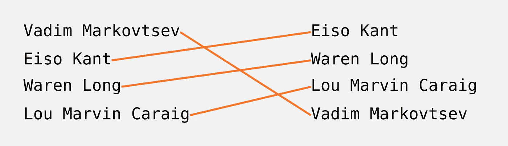
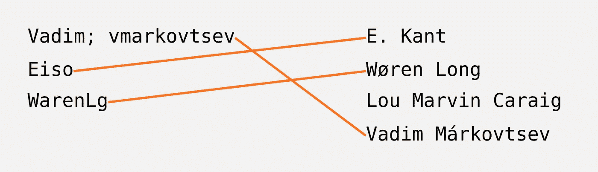
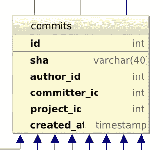
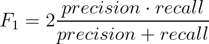
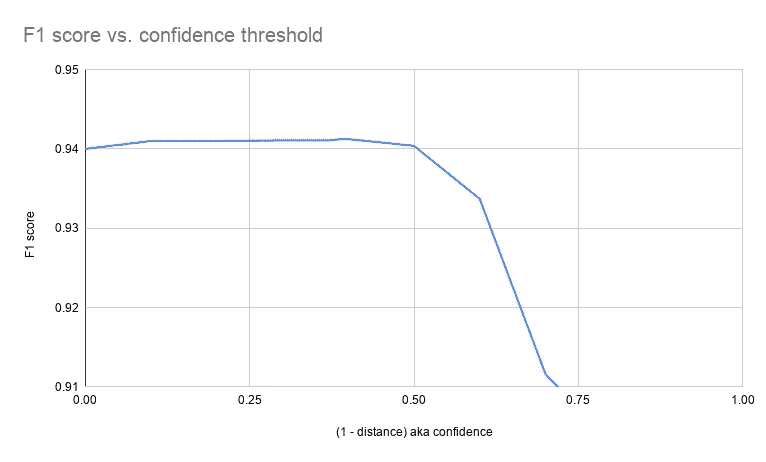

# 模糊匹配人名

> 原文：<https://towardsdatascience.com/fuzzy-matching-people-names-6e738d6b8fe?source=collection_archive---------7----------------------->

## [实践教程](https://towardsdatascience.com/tagged/hands-on-tutorials)

## 使用 Python 和线性编程对十亿 Git 提交签名等进行数据驱动算法设计。

我最近不得不解决一个有趣的问题:给定两个含有真实姓名的无序列表，匹配它们之间的身份。



两个姓名匹配的列表。图片作者。

看起来很简单，对吧？对两个列表进行排序，就大功告成了。唉，我的问题是关于两个独立的名单，名单上的人来自不同的独立信息来源——准确地说，是来自同一个组织的 GitHub 和 JIRA 用户。我必须处理以下复杂情况:

*   不存在完美的匹配。第一个列表中的名字属于第二个列表中不存在的人，反之亦然。
*   列表有不同的长度。
*   名称的格式是任意的。比如“V. MARKOVTSEV”或者“Vadim”而不是“Vadim MARKOVTSEV”(Vadim 是我的名字)。
*   虽然这些名字是用拉丁字母写的，但是所有可能的 Unicode 怪癖都有不同的规范化、变音符号等等在等着我。
*   列表项可以包含多个名称。这些是相应人员在信息资源上使用的独特签名。例如，GitHub 用户可能在工作和家用电脑上以不同的方式提交。



一些匹配的复杂情况。图片作者。

在花了一些时间进行实验后，我用 Python 想出了一个“足够好”的解算器，并发表在 GitHub 上:[名称匹配器](https://github.com/athenianco/names-matcher)。文章的其余部分是关于实现的模糊匹配算法。

# 资料组

拥有一个好的数据集来评估想法是所有好的解决方案的内在要素。我收集了两个:一个私人的和一个公共的。私人数据集包含大约 10 个雅典客户组织的个人信息:他们在 GitHub 和 JIRA 上的全名([雅典](https://athenian.co)是我工作的公司)。因此，我不能透露数据。公共数据集是一个半人工数据集，每个人都可以按照我的指示或[直接下载档案](https://drive.google.com/file/d/1R8MgffDNuOUcEeGF4c9Hi9McfnaBpIxY)进行复制。

如何构建公共数据集的想法源于我之前在 [source{d}](http://web.archive.org/web/20191225160328/https://sourced.tech/) 的经历:从 GitHub 存储库的公共可用元数据中榨取最大的汁液。我利用了两个来源:[2016 年 Google BigQuery 上的 GitHub 快照](https://cloud.google.com/blog/products/gcp/github-on-bigquery-analyze-all-the-open-source-code)和 [GHTorrent](https://ghtorrent.org/) 。前者在 Git 提交签名中提供真实的人名，而后者提供这些提交的真实身份。

以下 BigQuery SQL 提取相关大小的 GitHub 帐户:

```
SELECT SUBSTR(repo_name, 0, STRPOS(repo_name, '/') - 1), COUNT(*)
FROM `bigquery-public-data.github_repos.languages`
GROUP BY SUBSTR(repo_name, 0, STRPOS(repo_name, '/') - 1)
HAVING COUNT(*) > 50;
```

当然，五年后，拥有超过 50 个存储库的账户会更多；然而，我的目标不是列出一份详尽的清单。该查询产生了 500 多个属于组织和个人用户的帐户名称。我在顶部过滤了大约 20 个条目，排除了太多样化和太单一作者的条目，如`google`、`JuliaPackageMirrors`或`sindresorhus`。然后，我启动一个更重的查询来获取剩余存储库中提交的 Git 签名中的名称:

```
SELECT DISTINCT SUBSTR(repo, 0, STRPOS(repo, '/') - 1),
                commit,
                author.name,
                committer.name
FROM `bigquery-public-data.github_repos.commits`,
     UNNEST(repo_name) AS repo
WHERE SUBSTR(repo, 0, STRPOS(repo, '/') - 1) IN ('openstack', 'octoblu', ...);
```

现在我有了一个提交散列、相应的作者和提交者姓名以及 GitHub 帐户名。其中 13.7 亿人。

不幸的是，BigQuery 没有告诉我们哪些用户与每个记录相关联。我们要挖掘第二个数据源，GHTorrent 的 MySQL dump。


GHTorrent 的 MySQL 数据库的模式。我们需要带有标识的“提交”表。资料来源:GHTorrent.org。

GHTorrent 也过期了——更新在 2019 年停止了，但这没什么，因为我们真正需要的是 BigQuery 数据集发布后的转储。读者可能想知道为什么我们需要 BigQuery。答案是因为 MySQL 模式不包含人名。它们确实存在于 MongoDB 转储中，但是根据我的经验，它们是增量的，并且更难处理。



GHTorrent 的提交表不包含任何个人信息。资料来源:GHTorrent.org。

这就是如何下载转储文件并提取包含提交散列和相应用户 id 的文件，而不存储其余部分:

```
wget -O - [http://ghtorrent-downloads.ewi.tudelft.nl/mysql/mysql-2016-09-05.tar.gz](http://ghtorrent-downloads.ewi.tudelft.nl/mysql/mysql-2016-09-05.tar.gz) | tar -xzvO mysql-2016-09-05/commits.csv | gzip > commits.csv.gz
```

下一步是将 BigQuery 中的每个 Git 提交签名与 GHTorrent 中的一个用户 ID 相关联，前提是提交哈希相同。是时候让 Python 大放异彩了。

这个长脚本生成了两个字典:`people`包含从用户 ID 到他们的名字集的映射，而`acc_membership`包含从帐户 ID 到上述用户 ID 的映射。这还不是我们想要的:我们如何过渡到我们的两个列表？通过随机分裂。在可能的情况下，我们将每个人的名字随机分成大小相等的两组。

我们最终得到 338 对有名字的列表。总对数为 20882 对。对 GitHub 登录有一定程度的偏见，因为许多人在 Git 中输入它们的全名。此外，每对中的列表长度相等。然而，该数据集足以测试不同的模糊姓名匹配方法。示例(我替换了真实名称，保留了独特的属性):

```
["Dynatrace-VadimMarkovtsev"] - ["Vadim Markovtsev"]
["Vadim Markovtsev"] - ["DYNATRACE\\vadim.markovtsev", "VadimM"]
["Vadim M."] - ["vmarkovtsev-dt"]
["Vadim Markovtsev"] - ["Dynatrace-Vadim-Markovtsev"]
["vadimmarkovtsev"] - ["Vadim Markovtsev"]
["Vadim Markovtsev", "Headless", "Vadim"] - ["mrkv-headless", "Markovtsev", "mrkv"]
["Vałim Mórkovtsev"] - ["Valim Morkovtsev"]
```

# 算法

我最初的灵感来自这两篇博文: [Python 教程:模糊姓名匹配算法](/python-tutorial-fuzzy-name-matching-algorithms-7a6f43322cc5)和 [Python 教程:模糊姓名数据集的姓名查找表](/python-tutorial-a-name-lookup-table-for-fuzzy-name-data-sets-2580e4eca6e7)作者 [Felix Kuestahler](https://medium.com/u/15626f27740c?source=post_page-----6e738d6b8fe--------------------------------) 。它们是对这个主题的很好的介绍，也是数据驱动算法开发的一个很好的例子。为了总结他的帖子，Felix 提出了以下模糊姓名匹配计划:

1.  规范化名称:处理 Unicode 异常，转换成小写，删除不相关的符号，折叠空格。用空格分割结果字符串，并将每个字符串转换成一个[双变音](http://aspell.net/metaphone/)。
2.  将名字的指纹定义为所有可能的变音组合。如果两个名字的指纹集有交集，则将它们之间的距离设置为零，否则设置为 1。
3.  贪婪地匹配配对:我们忽略可能的多个匹配。

我将这些步骤概括为:

1.  名称规范化。
2.  距离度量聚合。
3.  距离矩阵上的匹配。

我建议在每个步骤中使用不同的方法和改进，并评估我的公共数据集的最终准确性。每个下一步越强大，它就越能掩盖每个上一步的缺点，所以我们应该独立地对它们进行基准测试。

## 名称规范化

有一个很棒的 Python 库可以规范化 Unicode 字符串，名为 [Unidecode](https://pypi.org/project/Unidecode/) 。我很自然地选择它来删除重音符号、元音变音、罕见字母和非典型的 Unicode 规范化。我们评估下面编码的三个选项。

第一个函数完成了最简单的工作:删除任何不是字母、数字或空格的字符，并将几个空格合并成一个。第二个另外适用`unidecode`。第三个函数用空格分割第二个函数的结果，将每个部分转换成一个变音位，然后将它们连接起来。

一个人有几个名字怎么办？我删除重复的，排序并把剩下的连接在一起。

## 距离度量聚合

同样，还有另一个伟大的 Python 库来计算两个字符串之间的相似性: [FuzzyWuzzy](https://github.com/seatgeek/fuzzywuzzy) 。它提供了几种算法，这些算法的不同之处在于它们的激进程度，即它们的精度与召回权衡值。

*   `ratio`是传统的 [Levenshtein 距离](https://en.wikipedia.org/wiki/Levenshtein_distance)。
*   `token_sort_ratio`按空格分割，对部分排序，再连接起来，然后计算`ratio`。
*   `token_set_ratio`按空白分割，构建两组部分，找到交集和对称差，串联三个导数集合中每个集合的排序元素，将差字符串追加到交集字符串，选择最大值成对`ratio` ( [代码](https://github.com/seatgeek/fuzzywuzzy/blob/2188520502b86375cf2610b5100a56935417671f/fuzzywuzzy/fuzz.py#L135))。

我们评估了五种距离计算方法。以下函数假设`s1`和`s2`源自归一化步骤。

FuzzyWuzzy 返回从 0 到 100 的相似性度量，所以我必须从 100 中减去它，以假装我们计算了一个距离度量。我“假装”是因为距离度量有某些明确定义的标准，而三角形不等式并不总是成立的。幸运的是，这对我们的问题一点也不重要。

`distance_join_ratio`在计算`ratio`之前清除所有空白字符。正如我后面要展示的，这很重要。

`distance_max_ratio`详细阐述了`token_set_ratio`的思想:我取最少两个距离:令牌集比率和`distance_ratio_join`。

## 距离矩阵上的匹配

将第一个列表中的每个名字与第二个列表中的每个名字进行比较后，我们得到了一个距离矩阵。我们必须解决一个经典的[线性分配问题](https://en.wikipedia.org/wiki/Assignment_problem)(圈):

> 问题实例有许多*代理*和许多*任务*。任何代理都可以被分配来执行任何任务，从而产生一些*成本*，这些成本可能因代理任务分配而异。要求执行尽可能多的任务，每个任务最多分配一个代理，每个代理最多分配一个任务，这样分配的*总成本*最小。

几年前我写过一篇关于 LAP 的[博文，甚至在 GitHub](http://web.archive.org/web/20180611012448/https://blog.sourced.tech/post/lapjv//) 上发表了一个[开源 LAP 求解器(核心算法由 Jonker 和 Volgenant 提供)。所以没错，*又有一个很棒的 Python 库可以解决线性赋值问题。*](https://github.com/src-d/lapjv)

我们评估两种距离矩阵匹配解决方案，贪婪选择和 LAP。贪婪求解器不需要明确的距离矩阵。

`names1`和`names2`是规范化步骤的输出:两个列表中的规范化名称。`compare`是距离度量聚合步骤中的函数之一。

重要提示:求解一个精确的圈在矩阵大小上具有立方复杂度。大约 10，000 后，经过的时间变得不切实际。

# 估价

让我们把所有的东西都放在一起。我提出了 3 个不同的归一化函数、5 个距离计算器和 2 个矩阵匹配器。它们总共有 3*5*2=30 种组合，我在第一部分的公共数据集上对这些组合进行了评估。代码如下:

我计算准确度:有多少匹配的身份是正确的。我将进一步在私有数据集上设置一个置信度阈值，以召回换取精度。目前，下面的 3D 图表总结了 30 种组合，并有助于选择最佳组合:`unidecode`归一化、`max_ratio`距离，当然还有精度为 0.78 的`lap`解算器峰值。

模糊名称匹配的准确性取决于规范化、距离和求解器类型。由 [@Miau_DB](https://twitter.com/Miau_DB) 可视化。

令人惊讶的是，变音符号严重降低了准确性。变音排除了元音，结果丢弃了对下游匹配器有价值的信息。`unidecode`与`simple`相比并没有很大优势，但仍然是有益的。`max_ratio`距离胜出，这要归功于无序的部件集合和有序的部件连接序列的聚合，让人想起原始的集合。规格化和解算器相等，`distance_join_ratio`比`distance_set_ratio`更强大。贪婪的解决方案总是比单圈差，不出所料。

我们必须选择第四个元参数——距离阈值。如果两个身份之间的估计距离大于该值，则该算法断定没有匹配，从而降低了召回率但提高了精确度。私人数据集是 10 对不同的人的身份列表，每个身份一个或多个名字。我修复了`unidecode`归一化、`distance_max_ratio`和 LAP solver，执行了匹配，并请我们在雅典的产品负责人 [Waren Long](https://medium.com/u/d535a1493d28?source=post_page-----6e738d6b8fe--------------------------------) 用他丰富的领域知识来评估结果。Waren 仔细检查了每一场比赛，并带回了一份令人信服的平均 F1 图。



F1 表示精确度和召回率之间的折衷。



F1 取决于置信度阈值，由 [Waren Long](https://medium.com/u/d535a1493d28?source=post_page-----6e738d6b8fe--------------------------------) 评估。图片作者。

该图表允许我选择 **0.5** 作为最佳距离阈值。我在整个组织中平均实现了 0.93 的精确度和 0.95 的召回率。

# 名称匹配器

我们来总结一下前面几节。

1.  我定义了两个列表之间模糊人名匹配的问题，并强调了难点。
2.  我收集了两个数据集:一个来自 2016 年 GitHub 数据的公共数据集，一个来自[雅典](https://www.athenian.co/)的客户数据的私有数据集。
3.  我将模糊名称匹配算法定义为三个低级过程的序列:规范化、距离计算和分配问题解决方案。
4.  关于如何执行每一步，我考虑了几种选择。
5.  我在公共数据集上评估准确性，以选择最好的。
6.  我评估了私有数据集上的 F1 分数，以选择距离阈值来换取一些额外的精确度。

我们雅典人在我们的作品中使用所描述的算法。我将开源核心提取到一个名为 [**的 Python 包中——matcher**](https://github.com/athenianco/names-matcher)。**名字匹配者**自诩对这篇博文中的主要观点做了一些额外的调整。也就是说，标准化步骤变得更加复杂；例如，我删除了由其他部分拼接而成的部分。此外，我删除了一些在私有数据集上“训练”的停用词。用户可以选择自己的停用词表。这些调整使我在公共数据集上的准确率进一步提高了+0.5%。

我认为**名称匹配器**还可以进一步改进。请不要犹豫，把你的想法写在[期](https://github.com/athenianco/names-matcher/issues)里！如果你希望得到我下一篇文章的通知，请在 Twitter 上订阅 [@vadimlearning](https://twitter.com/vadimlearning) 。我借此机会感谢整个雅典团队帮助我创作，并感谢 Guillem Duran 的 3D 视觉效果。