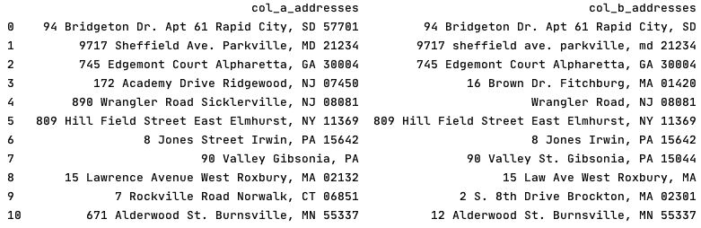
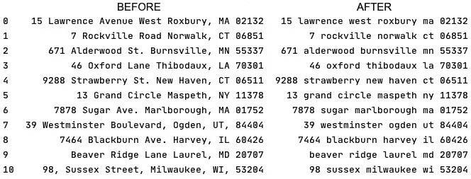
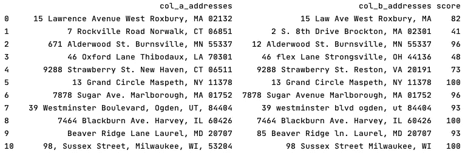
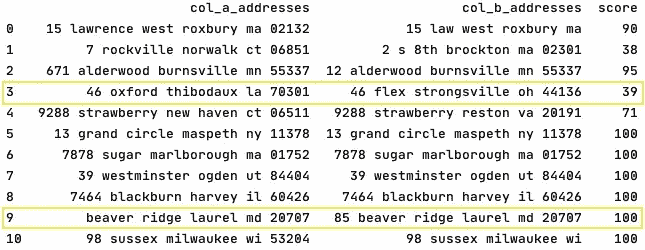

# 模糊不清——之前和之后

> 原文：<https://towardsdatascience.com/fuzzywuzzy-the-before-and-after-c3661ea62ef8?source=collection_archive---------45----------------------->

## 关于数据预处理，选择适当的模糊函数，并处理结果


娜塔莉·格兰杰在 [unsplash](http://www.unsplash.com) 上拍摄的图片

在之前的[文章](https://medium.com/naomikriger/string-comparison-is-easy-with-fuzzywuzzy-library-611cc1888d97)中，我介绍了 FuzzyWuzzy 库，它为一对字符串计算 0-100 的匹配分数。不同的模糊不清的功能使我们能够选择一个最符合我们需要的。

然而，进行一个成功的项目不仅仅是计算分数。我们需要在开始处理数据之前清理数据，选择计算分数的最佳方法，学习如何不仅处理一对字符串，还处理数据表，并最终知道如何使用我们收到的分数来充分利用我们的结果。

所以，事不宜迟，让我们深入了解一些我们应该熟悉的最佳实践。

## 使用包含熊猫的表格来比较多个字符串

如前所述，FuzzyWuzzy 函数计算两个字符串的匹配分数。但是当处理“真实生活”的数据时，我们可能需要比较至少两组字符串。这意味着使用表格，或者用熊猫的术语来说——使用数据框架。

一个好的表格应该是这样的:



上表包含两个比较列，每个列都有一个相关的标题，其中要比较的字符串位于平行的行中。

给定这样一个数据集，我们可以使用相关函数将表读入数据帧。下面的例子直接从 CSV 读取，但是如果您对使用其他格式感兴趣，您可以查看下面的[文档](https://pandas.pydata.org/pandas-docs/stable/reference/io.html)。

```
>>> my_data_frame = pd.read_csv("**my_folder/my_file_name.csv"**)
```

## 数据预处理—在分析前清理数据

在我们选择 FuzzyWuzzy 函数并开始比较字符串之前，我们希望清理数据以确保我们的结果尽可能准确。

清理数据意味着删除不相关的字符串，从而提高函数的性能。

例如，假设我们比较两个地址的字符串，其中一个地址是“Joe Boulevard”，另一个是“Jule Boulevard”。匹配分数会相对较高，但大多是因为两个字符串中都存在“Boulevard”。删除它并重新计算将导致低得多的匹配分数:

```
>>> fuzz.ratio("**Joe Boulevard"**, "**Jule Boulevard"**)
89
>>> fuzz.ratio("**Joe"**, "**Jule"**)
57
```

数据所需的清理类型取决于您的域。我们看到了一个地址清理的例子。类似地，在比较电话号码时，我们可能会想要删除没有附加值的括号和破折号。还建议将所有字符串规范化为小写，因为一些 FuzzyWuzzy 函数将大写字母不同的字母视为不同的字符串。
所以，看看你的数据，决定什么应该被修改，以使其干净并准备好处理。

## 数据预处理——让我们来看看技术

现在，让我们用相关逻辑定义一个函数，并在数据帧中的每个相关列上迭代运行它。

**为了解释清楚，下面的示例已经过简化。为了获得最佳结果，建议使用正则表达式(regex ),这超出了本文的范围。请注意，当前形式的 *strings_to_remove* 可能会导致清理后的结果不完美。

```
>>> strings_to_remove = [" **ave "**, **" ave. "**, "**avenue"**,  " **lane "**, 
" **ln "**, "**blvd"**, "**boulevard"**, " **rd. "**, "**road"**, "**street"**, " **st. "**, 
**" str "**, **" dr. "**,  "**drive"**, **" apt "**, "**apartment"**, "**valley"**, "**city"**, **"."**, **","**]

>>> comparison_table = 
    comparison_table.astype(str).apply(lambda x: x.str.lower())>>> for current_string in strings_to_remove:
        comparison_table = comparison_table.astype(str).apply(
           lambda x: x.str.replace(current_string, **' '**))

>>> comparison_table = comparison_table.astype(str).apply(
      lambda x: x.str.replace(**' +'**, **' '**))
```

然后——瞧！



## 添加分数栏并进行比较

现在剩下的就是向数据帧添加一个名为“score”的空列，使用我们选择的 FuzzyWuzzy 函数
计算匹配的分数，并用这些分数填充数据帧。

这是一个如何做到这一点的例子

```
>>> comparison_table[**"score"**] = **""**>>> comparison_table[**'score'**] = 
comparison_table.apply(lambda row: 
fuzz.token_set_ratio(row[**'col_a_addresses'**], row[**'col_b_addresses'**]),axis=1)
```

让我们将结果与我们在未处理的数据帧上运行 FuzzyWuzzy 函数所得到的结果进行比较:

清洁前-



清洁后-



***那么，清洗完数据后，实际发生了什么？*** 匹配分数变得更加准确——根据清洗情况增加或减少。

*   *让我们看看清洁后得分下降的第 3 行。*
    在这种情况下——清理前两个地址都出现的单词“Lane”错误地增加了匹配分数。但是删除之后，我们发现地址并不相似。
*   *让我们看看第 9 行，清洁后得分增加了。*
    而“巷”和“巷”有相同的意思，它们是大小写不同的不同字符串。
    清除噪声后，我们能够获得更好的分数，更准确地反映这些字符串之间的相似性水平。
*   有趣的是，第 9 行中清理过的字符串并不相同。“85”只出现在 *col_b_addresses* 中，但匹配分数是 100。为什么？因为字符串“足够接近”而被算法确定为完全匹配。如果由人类来做，这个决定可能也是一样的。

## 简而言之，选择一个模糊的函数

选择最佳 FuzzyWuzzy 函数的一种方法是基于不同函数的逻辑/目的，并确定哪个函数似乎与您的目的最相关。

但是，如果您不能决定哪个函数可以检索最准确的结果，您可以进行一个小的研究来确定使用什么。

我推荐使用的方法是对数据集进行采样，并对其运行每个相关的函数。然后，对于每个结果，手动决定每行中的值是真阳性/假阳性/真阴性/假阴性。

完成后，您可以选择 TP/FP 率最令人满意的地方，或者继续计算准确度*和灵敏度*，并使用这些值做出决定。对于每个项目，我们的目标可能不同，我们愿意接受的假阳性/真阴性率也不同。

*准确性和敏感性都用于数据科学，超出了本文的范围。这些公式都可以在网上找到。

## 选择阈值分数—简而言之

我的一对字符串返回了 82 的匹配分数。好吃吗？很糟糕吗？

答案取决于我们的目标，并且有许多相关的问题要问，例如:我们是对彼此非常相似的字符串感兴趣，还是对不同的字符串感兴趣？我们愿意接受的最大假阳性率是多少？我们想要的最小真阳性率是多少？

对于同一组字符串，我们可以得出两个不同的阈值分数——相似字符串的最低分数(例如 85)，不同字符串的最高分数(例如 72)。
这些阈值分数之间可能存在一个完整的范围，这将注定是“不确定的”。

有不同的方法来定义阈值分数，我们不会在本文中深入探讨它们。然而，我要提到的是，选择阈值分数将需要一些手动工作，类似于上面提到的关于如何选择最佳 FuzzyWuzzy 函数的工作——获取一组具有最终分数的样本字符串，确定结果的真阳性和假阳性，并最终决定我们的阈值。

使用 FuzzyWuzzy 进行字符串比较，以及预处理数据，并最终分析结果是一项令人着迷的工作。总是有更多的事情要做，并且有不同的方法来改进这个过程。

在本文中，我们探索了一些让这个过程变得有用和舒适的实践。

我希望本系列对您有所帮助和启发，并且现在您已经为下一个面向数据的项目准备了更好的工具。