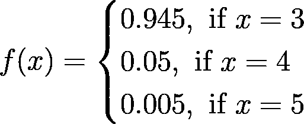
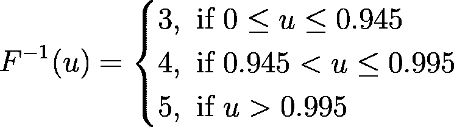
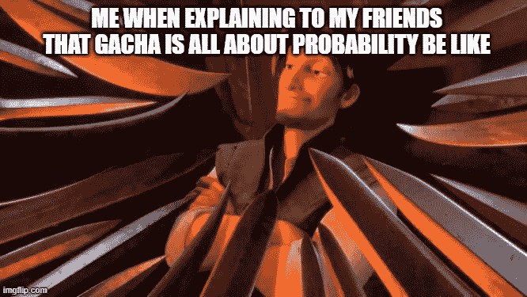

# R 中用蒙特卡罗方法模拟 Gacha

> 原文：<https://towardsdatascience.com/gacha-simulation-using-monte-carlo-method-in-r-3897ce611458?source=collection_archive---------28----------------------->


[C M](https://unsplash.com/@ubahnverleih?utm_source=medium&utm_medium=referral) 在 [Unsplash](https://unsplash.com?utm_source=medium&utm_medium=referral) 上拍照

## 不是运气。概率就是这样的。

## 动机

蒙特卡罗模拟方法是模拟理论中最流行的方法之一，它依靠重复随机抽样来获得期望的数值结果。这种方法有很多应用，如 A/B 检验、从贝叶斯推断的后验分布中模拟随机样本、期权定价、风险分析等等。

另一方面，手机游戏近年来变得越来越受欢迎，其中一个主要功能是向玩家提供兑换某种稀有物品或角色的能力。这个特征通常被称为*嘎查*。

在这篇文章中，我将解释如何应用蒙特卡罗方法来模拟你将使用 r 得到的 gacha。

## 概念:蒙特卡罗模拟法

蒙特卡洛方法的思想是利用随机性来解决通常(原则上)是确定性的问题。具体来说，在进行模拟时，蒙特卡罗方法的过程可以解释如下。

1.  定义可能输入的域和每个输入的频率，
2.  根据输入计算概率密度函数(PDF ),
3.  从 pdf 中计算累积密度函数(CDF)，
4.  生成均匀分布在(0，1)中的随机数，
5.  基于 CDF 将随机数值指定为输入之一，
6.  重复步骤 4 和 5，直到达到所需数量的模拟结果。

为了在实践中更好地理解这种方法，这里我将实现蒙特卡罗方法来模拟您将得到的 gacha。我将在这里使用的编程语言是 r。

## 履行

假设我们想要模拟的 gacha 系统遵循这些规则:

1.  可用物品稀有度为 3、4 和 5 级(通常分别表示为 3 星、4 星和 5 星)。我们将使用它们作为我们可能输入的域。
2.  对于 3 级、4 级和 5 级稀有物品，该物品在一次投掷中获得的概率分别为 0.945、0.05 和 0.005。
3.  如果在连续 9 次掷骰中，玩家还没有获得 4 级稀有物品，那么第 10 次掷骰将保证玩家获得 4 级稀有物品。这个卷通常被称为**怜悯卷**。
4.  如果在连续 89 次掷骰中，玩家还没有获得 5 级稀有物品，那么第 90 次掷骰将保证玩家获得 5 级稀有物品。

根据上面的规则，我们可以如下创建每个卷的 PDF。



其中 x 表示该物品的稀有程度。从上面的 PDF 中，我们可以创建逆 CDF 来将均匀分布在(0，1)中的随机数分配给每个稀有级别，如下所示。



其中 u 表示均匀分布在(0，1)中的生成的随机数。请记住，上面的逆 CDF 不包括 4 级和 5 级稀有物品的同情骰，因为它只计算一次。

然后，我们用这几行代码编写函数来模拟 gacha 过程。

蒙特卡洛模拟嘎查，代码由作者编写

让我们通过运行 50 次 gacha roll 模拟来尝试上面的代码。结果如下(**注意，每次运行模拟**的结果可能不同)。

```
> x=runif(50)
> rarity=3:5
> PDF=c(0.945,0.05,0.005)
> sim=mc.sim(x,rarity,PDF)
Gacha Simulation Table
  rarity   PDF   CDF
1      3 0.945 0.945
2      4 0.050 0.995
3      5 0.005 1.000The 1 th roll produces : 3 star rarity item. 
The 2 th roll produces : 3 star rarity item. 
The 3 th roll produces : 3 star rarity item. 
The 4 th roll produces : 3 star rarity item. 
The 5 th roll produces : 3 star rarity item.
...
The 46 th roll produces : 3 star rarity item. 
The 47 th roll produces : 3 star rarity item. 
The 48 th roll produces : 3 star rarity item. 
The 49 th roll produces : 4 star rarity item. 
The 50 th roll produces : 3 star rarity item.
> table(sim)
sim
 3  4 
44  6
```

从上面的模拟中我们可以看到，我们获得了 6 个 4 星稀有项目，对于 gacha 游戏的初学者来说还不错！让我们把它增加到 70 次模拟，看看有什么不同。

```
> x=runif(70)
> rarity=3:5
> PDF=c(0.945,0.05,0.005)
> sim=mc.sim(x,rarity,PDF)
Gacha Simulation Table
  rarity   PDF   CDF
1      3 0.945 0.945
2      4 0.050 0.995
3      5 0.005 1.000The 1 th roll produces : 4 star rarity item. 
The 2 th roll produces : 3 star rarity item. 
The 3 th roll produces : 3 star rarity item. 
The 4 th roll produces : 3 star rarity item. 
The 5 th roll produces : 3 star rarity item.
...
The 16 th roll produces : 3 star rarity item. 
The 17 th roll produces : 5 star rarity item. 
The 18 th roll produces : 3 star rarity item.
...
The 66 th roll produces : 3 star rarity item. 
The 67 th roll produces : 3 star rarity item. 
The 68 th roll produces : 3 star rarity item. 
The 69 th roll produces : 3 star rarity item. 
The 70 th roll produces : 3 star rarity item.
> table(sim)
sim
 3  4  5 
61  8  1
```

伟大的结果！1 件五星级稀有品和 8 件四星级稀有品，这就是我们所说的好嘎查！

## 结论

我们到了。本文解释了蒙特卡罗方法在模拟理论中的许多实现之一，您可以在其他领域中实现它，如风险度量、期权定价等等。

像往常一样，如果您有任何问题，请随时提问和/或讨论！我的下一篇文章再见！保持安全，保持健康！



可能发生在你读完这篇文章之后(图片来自 [Imgflip](https://imgflip.com/i/59fhrf)

## 作者的联系人

领英:[拉登·奥勒留和希卡·维亚迪努格罗霍](https://www.linkedin.com/in/raden-aurelius-andhika-viadinugroho-b84b19163/)

中:[https://medium.com/@radenaurelius](https://medium.com/@radenaurelius)

## 参考

[1] Enrico，Z. (2013 年)。 [*系统可靠性与风险分析的蒙特卡罗模拟方法*](https://link.springer.com/book/10.1007/978-1-4471-4588-2) 。可靠性工程中的斯普林格级数。伦敦:斯普林格。

[2][https://book down . org/S3 dabeck 1984/book down-demo-master/Monte-Carlo-simulations . html](https://bookdown.org/s3dabeck1984/bookdown-demo-master/monte-carlo-simulations.html)

[3]罗伯特，C. P .和卡塞拉，G. (2010 年)。 [*用 R 介绍蒙特卡罗方法*](https://link.springer.com/book/10.1007/978-1-4419-1576-4) 。用 R！。伦敦:斯普林格。

[4]s . m .罗斯(2013 年)。 [*模拟，第五版*](https://www.sciencedirect.com/book/9780124158252/simulation) 。爱思唯尔。