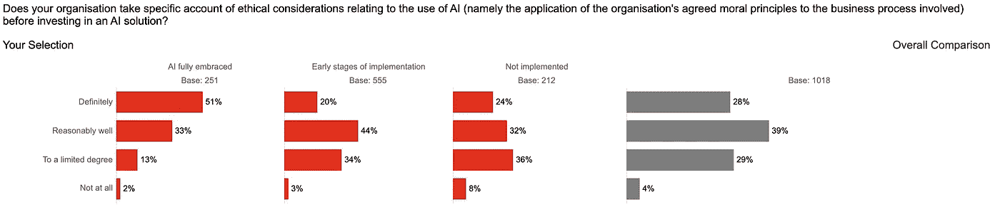
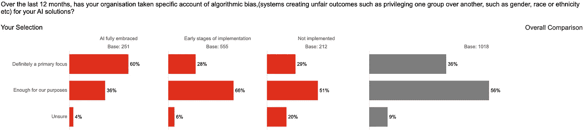
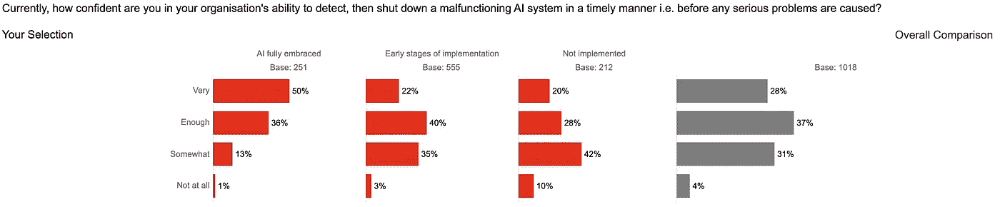
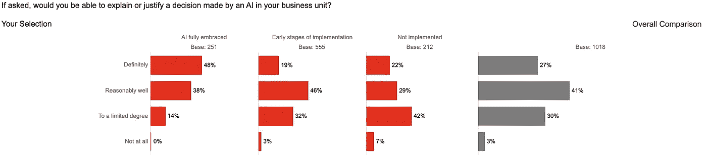
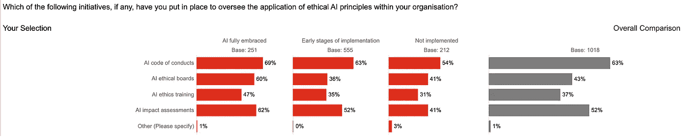
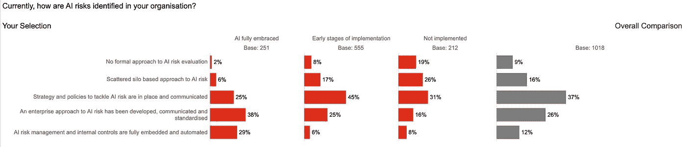
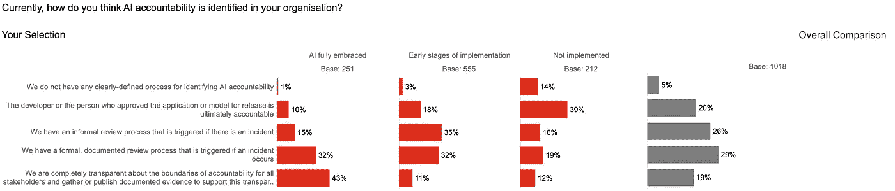

# 通过解决负责任的人工智能差距获得信任

> 原文：<https://towardsdatascience.com/gain-trust-by-addressing-the-responsible-ai-gaps-eeb5ee685bf1?source=collection_archive---------39----------------------->

## 全球负责任人工智能调查的结果

布雷特·乔丹在 [Unsplash](https://unsplash.com/s/photos/mind-the-gap?utm_source=unsplash&utm_medium=referral&utm_content=creditCopyText) 上的照片

在过去的几年里，人工智能的风险和人工智能的伦理考虑正成为人们关注的焦点。随着人工智能在疫情期间越来越多地用于接触追踪、劳动力安全和规划、需求预测和供应链中断，出现了许多围绕人工智能模型的隐私、偏见、安全、鲁棒性和可解释性的风险。

人工智能风险识别、评估和缓解因人工智能成熟度、公司规模、行业部门和居住国而异。普华永道在 2020 年 11 月对 1000 多名首席执行官进行的全球负责任的人工智能调查揭示了许多见解，因为它与人工智能的风险以及公司如何评估、管理和减轻这些风险有关。接受调查的公司来自多个行业，包括金融服务、技术、能源、公用事业和医疗卫生。这些公司的规模各不相同，有年收入不足 5 亿美元的小公司，有年收入在 5 亿至 10 亿美元之间的中型公司，也有年收入超过 10 亿美元的大型公司。近 49%是大公司，29%是中型公司，其余是小公司。我们还根据这些公司的人工智能成熟度(由部署的企业范围人工智能应用程序的数量决定)对它们进行了细分。这导致了三个集群——**人工智能领导者(**或完全拥抱人工智能 **)** (26%)，**人工智能实验者**(或实现的早期阶段)(58%)，以及**人工智能落后者(**或未实现 **)** (16%)。毫不奇怪，大公司(年收入 10 亿美元)占人工智能领导者的近 65%。

# **人工智能伦理仍未在相当多公司的视野中出现**

近 33%的受访者不考虑道德因素(4%)或仅在有限程度上考虑道德因素(29%)。这一比例在人工智能实验者中上升到 37%，在人工智能落后者中上升到 44%。在日本，人工智能实验者的这一比例上升至 58%。小公司(营收 5 亿美元或更低)往往很少或根本不关注道德考虑——46%的人工智能实验者和 52%的人工智能落后者属于这一类别。

图 1:成熟度等级对人工智能伦理的关注度(来源:普华永道责任人工智能调查)

# **人工智能的偏倚、安全性和可解释性仍然排名靠前**

算法偏差仍然是许多组织主要关心的问题。这是 36%的受访者的主要关注点，56%的受访者充分考虑了这一点。随着公司在人工智能采用方面的成熟，他们将算法偏见作为主要关注点——近 60%的人工智能领导者将它作为主要关注点。

图 2:关注成熟度水平的偏差(来源:普华永道责任人工智能调查)

人工智能系统的安全性是 28%的受访者的主要担忧，37%的受访者非常担忧，31%的受访者有点担忧。然而，随着公司的成熟，安全变得更加令人担忧——50%的人工智能领导者将安全视为非常重要的问题。

图 3:按成熟度划分的安全关注度(来源:普华永道责任人工智能调查)

在我们的调查中，27%的公司绝对有能力解释或证明模型所做的决定，41%的公司能够很好地解释，30%的公司能够在一定程度上解释。人工智能领导者在这方面更精通——48%的人肯定有能力解释这些决定。

图 4:关注成熟度级别的可解释性(来源:普华永道责任人工智能调查)

# **公司正在使用各种方法来评估和管理人工智能风险**

在调查受访者中，近 52%的人没有道德的人工智能框架，也没有将道德原则纳入日常运营。对于 AI 落后者，这个数字上升到 68%，对于收入低于 5000 万美元的公司，这个数字上升到 66%。

人工智能行为准则(63%的受访者)、人工智能影响评估(52%)、人工智能道德委员会(43%)和人工智能道德培训(37%)是公司一直用来处理人工智能风险的一些机制。虽然这些百分比在所有国家都相对一致，但英国的人工智能道德委员会(32%)和人工智能道德培训(28%)的数量似乎较少。随着公司在人工智能采用方面的成熟，他们似乎接受了更多的道德培训，也使用了道德委员会。60%的人工智能领导者拥有人工智能道德委员会(整体比例为 43%)，47%的人工智能领导者接受过道德培训(整体比例为 37%)。

图 5:按成熟度管理人工智能风险的方法(来源:普华永道责任人工智能调查)

# **人工智能风险识别和问责尚处于起步阶段**

只有 12%的公司将其人工智能风险管理和内部控制完全嵌入和自动化；26%的公司拥有已经标准化和沟通的企业方法；其余的公司在人工智能风险管理方面采取了孤立的或非标准化的方法。对于人工智能领导者，我们看到近 29%的领导者拥有完全嵌入式和自动化的风险管理和控制，38%的领导者拥有企业范围的标准化方法。

图 6:按成熟度划分的人工智能风险识别(来源:普华永道责任人工智能调查)

当谈到透明度和问责制时，只有 19%的公司有一个正式的和记录在案的过程，并向所有利益相关者报告；29%的公司只有在发生特定事件时才有正式流程；其余的只有一个非正式的过程或者根本没有明确定义的过程。

图 7:按成熟度划分的人工智能责任(来源:普华永道责任人工智能调查)

从上述调查结果可以清楚地看出，在以下方面，人工智能领先者和人工智能落后者之间仍有很大差距

*   他们对偏见、安全性和可解释性等问题的关注；
*   他们使用人工智能行为准则、人工智能伦理委员会、培训和人工智能影响评估来管理人工智能风险的方法；和
*   他们识别人工智能风险并让人们承担责任的能力。

我们称之为 ***负责任的 AI 差距。*** 公司需要弥合这一鸿沟，以获得客户、员工和其他利益相关者的信任。如果做不到这一点，很可能会影响他们的投资回报率(ROI ),并且无法从人工智能计划中获得预期的收益或价值。

# 相关文章

1.  [AI 领导人充分利用新冠肺炎危机来增加 AI 的作用](/ai-leaders-make-the-most-of-the-covid-19-crisis-to-increase-the-role-of-ai-ce885e39dcb9)