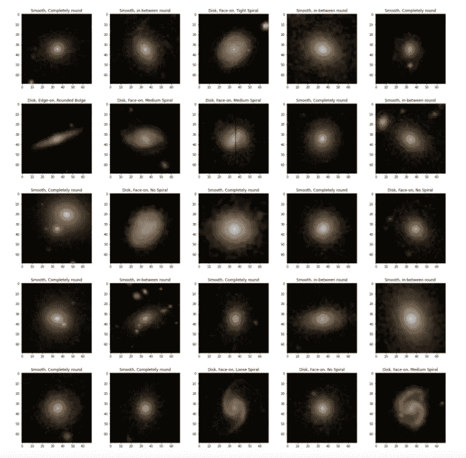
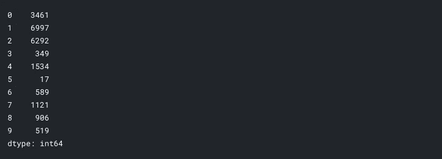
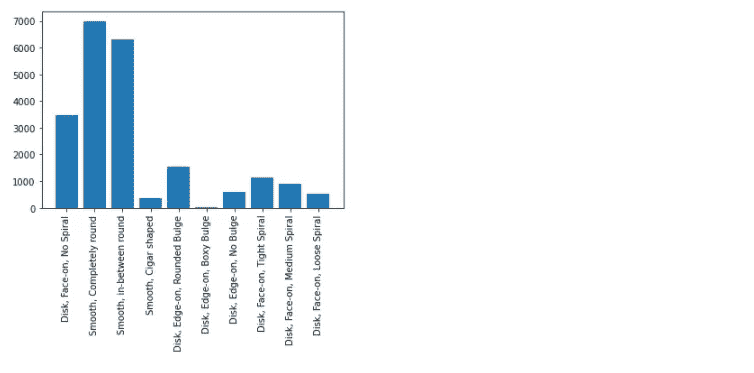
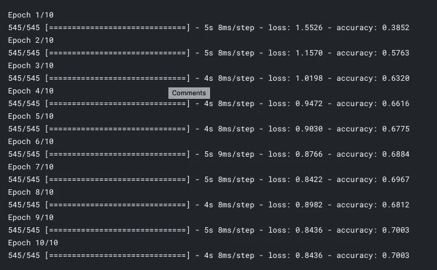
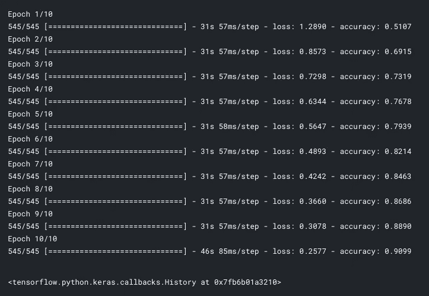
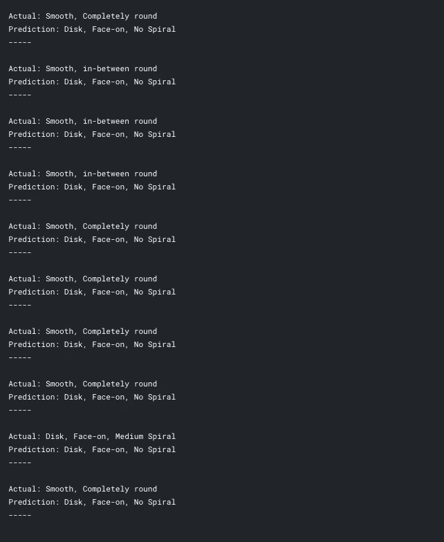
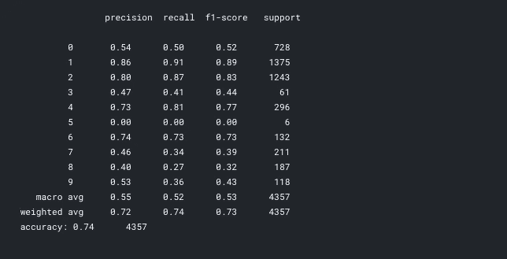
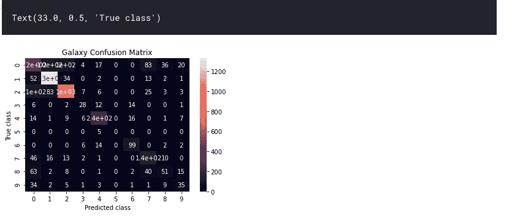

# 基于 LeNet-5 的星系多影像分类

> 原文：<https://towardsdatascience.com/galaxy-multi-image-classification-with-lenet-5-1bc2f66d3cfc?source=collection_archive---------19----------------------->


Guillermo Ferla 在 Unsplash 上拍摄的照片。

## 用梯度下降魔法探索空间

星系的美丽从未停止征服我。思考星系是令人难以置信的基础，它们是重塑视角的有力工具。

不久前，当我在互联网上搜索我的下一次机器学习冒险时，我偶然发现了[这个](https://astronn.readthedocs.io/en/latest/galaxy10.html)机器，我知道我必须试一试。不过，在训练机器对图像进行分类之前，我很好奇， *I* 能把它们分类得多好？

简短的回答是不太好。其中一些非常明显，我可以很容易地把它们挑选出来，归类为一个特定的标签。其他人我会很有信心，但当我发现我错了的时候，我的信心就破灭了。

考虑到这一点，我现在很好奇。一台机器能做得多好？因此，我对这个问题进行了测试，并构建了一个卷积神经网络——到底是哪一个呢？心爱的 LeNet-5！

在本文中，我将从头到尾介绍如何建立一个对星系进行分类的机器学习模型！

只对代码感兴趣？没关系，我不太生气。我将为您省去通读整篇文章的麻烦，因为说实话，当我只需要某个特定部分时，我不太喜欢费力地阅读大量信息。这里是 [Kaggle](https://www.kaggle.com/tenzinmigmar/classifying-iris-flower-types-with-k-means) 笔记本的链接。

## 导入依赖关系

在构建任何机器学习模型时，要做的第一件事是下载我们需要的依赖关系。

```
! pip install astroNN
import tensorflow as tf
import matplotlib.pyplot as plt
import pandas as pd
import seaborn as sns
import numpy as np
from tensorflow import keras

from keras.models import Sequential
from keras.layers import Conv2D, AveragePooling2D, Flatten, Dense, Dropout
from keras.callbacks import ReduceLROnPlateau
from keras.optimizers import Adam

import sklearn
from sklearn.model_selection import train_test_split
from sklearn.metrics import classification_report,confusion_matrix
from tensorflow.keras import utils

from astroNN.datasets import galaxy10
from astroNN.datasets.galaxy10 import galaxy10cls_lookup
```

完成后，我们现在有了开始构建模型所需的工具。

## 关于数据集

如果你读过我的其他机器学习文章，你就会知道我对数据的评价有多高。数据点是我们日常决策的北极星。你知道你的同事总是在上午 10 点霸占着咖啡机吗？你可以把喝咖啡的时间改到 9:30。因为你的老师喜欢用突击测验给你惊喜而不断受挫？你将开始每天学习，为第二天他们可能扔给你的任何东西做好准备。

数据是机器学习的核心。如果人工智能有一个口号，我会说是“只添加数据”。话虽如此，我还是给大家简单介绍一下今天节目的明星:galaxy10！

galaxy10 数据集包含 21785 个 69x69 像素的彩色星系图像，分为 10 个不同的类别。该数据集的图像来自斯隆数字巡天，标签来自银河动物园。

数据集内的每个图像被分类为 10 个类别中的一个，然而，在分配给来自人类志愿者的某些图像的类别中存在差异，所述人类志愿者的任务是标记图像，其作为经验证据，表明在类别之间的图像中存在高水平的相似性。为了缓解这个问题，Galaxy10 数据集不包括没有最终决定的图像。(55%的人类志愿者投票支持一个类别)

您现在已经熟悉了数据集！我们继续吧。

## 数据探索

现在，我们不能探索尚未加载的数据。

```
images, labels = galaxy10.load_data()

x_train, x_test, y_train, y_test = train_test_split(images, labels, test_size=0.2)

features = ['Disk, Face-on, No Spiral', 'Smooth, Completely round', 'Smooth, in-between round', 'Smooth, Cigar shaped', 'Disk, Edge-on, Rounded Bulge', 'Disk, Edge-on, Boxy Bulge', 
            'Disk, Edge-on, No Bulge','Disk, Face-on, Tight Spiral', 'Disk, Face-on, Medium Spiral', 'Disk, Face-on, Loose Spiral']

x_train = x_train / 255.0
x_test = x_test / 255.0
```

那更好。现在，让我们试着更好地理解这些数据。

```
x_train.shape, x_test.shape# This prints ((17428, 69, 69, 3), (4357, 69, 69, 3))
```

现在，我们对数据集有了更多的了解。这里，我们有 17248 个尺寸为 69×69 的彩色训练图像和 4357 个尺寸为 69×69 的彩色测试图像的数据集。让我们来看看数据集中随机选择的图像。

```
fig = plt.figure(figsize=(20,20)) 

for i **in** range(25):
    plt.subplot(5,5,i+1)    
    plt.imshow(x_train[i])
    plt.title(features[y_train[i]])
    fig.tight_layout(pad=3.0)

plt.show()
```



从数据集中选择星系图像。来自 galaxy10 数据集的图像。

令人敬畏不是吗？让我们看看这个数据集还能揭示什么。

```
*# Check class distribution*

df = pd.DataFrame(data=labels)

counts = df.value_counts().sort_index()
print(counts)
```



上面代码的输出。图片由作者提供。

```
def class_distribution(x, y, labels):
    fig, ax = plt.subplots()
    ax.bar(x, y)
    ax.set_xticklabels(labels, rotation=90)
    plt.show()

class_distribution(features, counts, features)
```



上面代码的输出。图片由作者提供。

## 不平衡数据:准确性悖论

这里，我们有一个相当不平衡的数据集。每个类别中的图像数量范围从类别 5 中的 17(最小)到类别 1 中的 6997(最大)。具有偏斜类别分布的数据的问题在于，准确度不再是正确反映机器学习模型对图像进行分类的能力的评估度量。这也被称为**准确性悖论**，即具有较高准确性的模型可能比具有较低准确性的模型具有更少的预测能力。

总结一下:准确性可能并不总是评估你的模型的最佳指标。因此，如果我们使用其他评估指标，如精确度或召回率，这将是一个更公平的分析。

**精度**:精度=真阳性(TP) /真阳性(TP) +假阳性(FP)

**召回**:召回=真阳性(TP) /真阳性(TP) +假阴性(FN)

**补充说明:**精度和召回指标已被移除，因此我们将使用精度作为指标来训练卷积网络，但稍后将使用 Scikit Learn 的分类报告来更好地了解我们模型的精度、召回和 f1 分数。

## 训练基线模型

```
model = Sequential()

*# Baseline model to compare to LeNet-5*
model.add(Flatten(input_shape=(69, 69, 3)))
model.add(Dense(128, activation='relu'))
model.add(Dense(10, activation='softmax'))

model_optimizer = Adam(lr=0.001)

model.compile(optimizer=model_optimizer, loss='sparse_categorical_crossentropy', metrics=["accuracy"])
reduceLR = ReduceLROnPlateau(monitor='accuracy', factor=.001, patience=1, min_delta=0.01, mode="auto")
lol = model.fit(x_train, y_train, epochs=10, callbacks=[reduceLR])
```



上面代码的输出。图片由作者提供。

还不错。最终准确率为 70%。让我们看看 LeNet-5 在比较中表现如何，但在此之前，我先向您介绍一下 LeNet-5 的背景。

## LeNet-5 架构

LeNet-5 是一种古老而经典的卷积神经网络架构，由 Yann Andre LeCun、Leon Bottou、Yoshua Bengio 和 Patrick Haffner 于 1998 年开发。最初开发时，它是为手写 MNIST 数字识别而设计的，后来成为了 AlexNet 和 VGG 等未来架构的基础。

第一个卷积块由两个卷积和平均池层组成，其后是一个平坦层，然后是 3 个密集层。


LeNet-5 架构。图可以在[原文中找到。](http://yann.lecun.com/exdb/publis/pdf/lecun-01a.pdf)

让我们开始构建 LeNet-5 模型吧！

```
model2 = Sequential()

*# LeNet-5 conv-net architecture*
model2.add(Conv2D(filters=6, kernel_size=(5,5), strides=(1,1), activation='tanh', input_shape=(69,69,3)))
model2.add(AveragePooling2D(pool_size=(2,2), strides=(2,2)))
model2.add(Conv2D(filters=16, kernel_size=(5,5), strides=(1,1), activation='tanh'))
model2.add(AveragePooling2D(pool_size=(2,2), strides=(2,2)))

model2.add(Flatten())
model2.add(Dense(units=120, activation='tanh'))
model2.add(Dense(units=84, activation='tanh'))
model2.add(Dense(units=10, activation='softmax'))

model_optimizer = Adam(lr=0.001)

reduceLR = ReduceLROnPlateau(monitor='accuracy', factor=.001, patience=1, min_delta=0.01, mode="auto")

model2.compile(optimizer=model_optimizer, loss='sparse_categorical_crossentropy', metrics=["accuracy"])
model2.fit(x_train, y_train, epochs=10, callbacks=[reduceLR])
```



上面代码的输出。图片由作者提供。

90%的准确率！这不完全是机器学习的圣杯，但也是一个相当不错的分数。现在，让我们看看 LeNet-5 模型的预测。

```
predict = model2.predict(x_test).argmax(axis=1)

for i **in** range(10):
    print("Actual:", features[y_test[i]])
    print("Prediction:", features[np.argmax(predict[i])])
    print("-----")
    print()
```



上面代码的输出。图片由作者提供。

看起来一些星系等级被其他的混淆了。即使是人类也很难正确地对每一类图像进行分类。为了更好地理解所犯的错误，使用混淆矩阵是有帮助的。我们还会在这里看一下分类报告。

```
classification_report(y_test, predict)
```



上面代码的输出。图片由作者提供。

从这个报告中，我们可以看出，我们的模型对于分类 0、1、2、4(特别是 1 和 2)具有很高的精度和召回率。请注意，类 1 和类 2 也有最多的训练和测试样本。另一方面，对于只有 6 个测试样本的类别 5，该模型具有非常低的精度和召回率(0)。绘制混淆矩阵将进一步明确这 6 个测试样本的预测结果。

```
matrix = confusion_matrix(y_test, predict)
sns.heatmap(matrix, annot=True)
plt.title('Galaxy Confusion Matrix')
plt.xlabel('Predicted class')
plt.ylabel('True class')
```



该模型很好地预测了 1 类和 2 类图像！这并不奇怪，因为它们是样本最多的类。0 和 4 也做得不算太差。我们的模型一贯混淆类别 0 和类别 7 (76 个样本)，类别 1 和类别 2 也经常被预测为类别 0。此外，该模型在分类第 8 类时存在问题，经常将其误认为第 0 类和第 7 类。让我们调查一下。8 类是盘面，正面，中螺旋，0 类是盘面，正面，无螺旋，7 类是盘面，正面，紧螺旋。看看上面的图像，很容易看出为什么这些图像看起来非常相似。

## 结论

这是一个有趣的数据集！当我找到它并检查图像时，作为一个人，我很难辨别不同星系类别之间的差异，因为它们具有高度相似的特征，所以我很想看看机器学习模型与人类相比表现如何。我做的一些最初的假设是正确的:我相信这个模型在螺旋上有最大的困难，其他的有点偏离。我曾认为该模型会更频繁地混淆类别 1 和类别 2(平滑、完全圆形和平滑、圆形之间),因为这些类别在一些图像中看起来也非常相似。经过训练后，我认为模型能够很好地区分两个类别，是因为每个类别都有大量的图像可供训练。

其他要注意的事情:准确性并不总是评估你的模型的最佳指标，也是 LeNet-5 的一个旁注；LeNet-5 虽然它的体系结构可能相对较老，但它在这个数据集上的表现并不太差。