# 伽辽金变压器:NeurIPS 2021 上的一次性实验

> 原文：<https://towardsdatascience.com/galerkin-transformer-a-one-shot-experiment-at-neurips-2021-96efcbaefd3e?source=collection_archive---------28----------------------->

## [思想和理论](https://towardsdatascience.com/tagged/thoughts-and-theory)

## 一个业余计算数学家关于注意力机制的数学理论和应用的旅程。

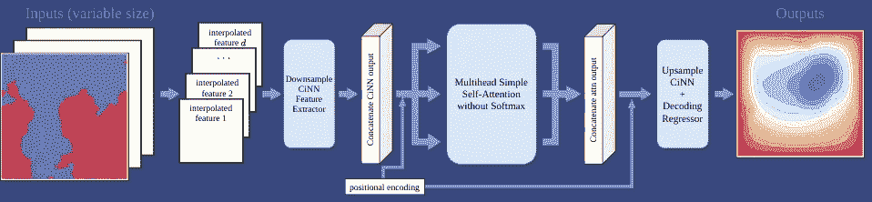

一个基于注意力的算子学习器直接从参数中推断出解。图片作者。

# 警罗罗格

最近，我写了我的第一篇关于机器学习的论文，这是一个有趣但具有挑战性的兼职项目，同时还有一个包含代码的开源库:【https://github.com/scaomath/fourier-transformer。

作为一个完全的新手和这个领域的独立研究者，我疯狂而愚蠢地向 NeurIPS 2021 提交了这篇论文……感谢[我的导师](https://github.com/lyc102/ifem)的鼓励。

我认为这个标题很吸引人，因为搜索“伽辽金变形金刚”会在顶部找到这篇论文的 arXiv 链接。作为一名业余数学家，这个标题表明这更像是一篇“享受乐趣，而不是为了发表”类型的论文。然后，我看到了一些其他“明显的”NeurIPS 使用 LaTeX 模板提交的内容，标题类似于[“反 Koopmanism”](https://arxiv.org/abs/2106.00106)，[“Max-Margin 已死，Max-Margin 万岁！”](https://arxiv.org/abs/2105.15069)、[“你永远不会独自群集”](https://arxiv.org/abs/2106.01908)。毫无疑问，这些 CS 人对此是认真的。

论文本身是半理论半实验的。我觉得即使每个人都在使用变形金刚，因为 ***注意力是你所需要的全部*** ，即使对于 CV 任务，说“注意力机制背后的数学不是很好理解”甚至有点轻描淡写。几乎没有任何严格的理论基础来解释为什么注意力会以如此神奇的方式在数学上起作用。

因此，在这篇博文的剩余部分，我将以一种随意的方式，带着一些半严肃的数学知识，介绍我们用一些我熟悉的严肃数学知识重新思考变形金刚的小小尝试:

> **首次尝试从希尔伯特空间的逼近理论出发，用伽辽金方法解释注意机制的逼近能力。**

[1]:曹，S. (2021)。选择一个变换器:傅立叶或伽辽金。在 [*arXiv 预印本 arXiv:2105.14995*](https://arxiv.org/abs/2105.14995) 。

[2]:瓦斯瓦尼，a .，沙泽尔，n .，帕尔马，n .，乌兹科雷特，j .，琼斯，l .，戈麦斯，A.N .，凯泽，l .，波洛苏欣，I .，2017。你需要的只是关注。 [*arXiv 预印本 arXiv:1706.03762*](https://arxiv.org/abs/1706.03762) 。

# 背景

自我关注算子的数学定义如下:𝐲 ∈ ℝⁿ × ℝᵈ是输入潜在表示，查询 *Q* ，键 *K* ，值 *V* ，以及投影矩阵 *W^Q、W^K、W^V*

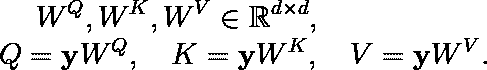

使用[编码](http://www.codecogs.com/)创建的方程式。

缩放后的点积关注度为:

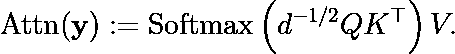

使用[编码](http://www.codecogs.com/)创建的方程式。

全部注意力是:对于 g(⋅)一个逐点通用逼近器(在这种情况下是前馈神经网络)

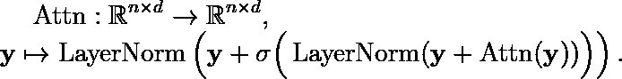

**(A)** :标准的注意机制。使用[编码](http://www.codecogs.com/)创建的方程式。

在许多关于*中自我注意机制的解释的论文中，注意是你所需要的全部*，包括最近的一些尝试，用“内核解释”进行类比，或者说将 Softmax *(QKᵀ)V* 链接为可学习的内核图是一种常见的做法。Softmax( *QKᵀ* )被描述为每个位置的特征向量(标记的学习嵌入)与每个其他位置的特征向量的相似性度量。softmax 归一化变压器的一些值得注意的线性化利用了这种解释。

我想，如果没有 softmax，生活会变得简单得多，我们将解释从行方式的**改为列方式的**。所以让我们做吧！

# 改进基于数学直觉的注意机制的尝试

现在假设 *Q，k，V* 的第 *j* 列为在物理位置 xᵢ ∈ ℝᵐ采样的(单独的)函数 qⱼ(⋅)，i=1，…，n ，连同 zⱼ(⋅)表示缩放的点积的输出。然后， *(QKᵀ)V* 加上一些关于跳过连接的警告，没有 softmax 的注意力变成了第二类弗雷德霍姆方程[:](https://mathworld.wolfram.com/FredholmIntegralEquationoftheSecondKind.html)

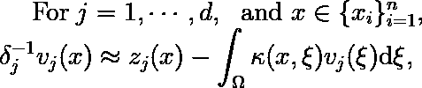

使用[代码生成的方程式](http://www.codecogs.com/)。

与κ(x,ξ):=ζ_q(x)⋅ϕₖ(ξ)对于特征地图:

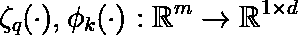

使用[代码生成的方程式](http://www.codecogs.com/)。

将注意力机制解释为积分并不新鲜，例如在 LieTransformer 中已经开发了对[组](https://en.wikipedia.org/wiki/Group_(mathematics))的积分。

尽管如此，将**积分**引入到图片中会为没有 softmax 的线性变量带来更有趣的解释: *Q(KᵀV)* 可以被视为彼得罗夫-伽辽金投影(如果我们将 *Q，k，V* 的列视为独立函数):

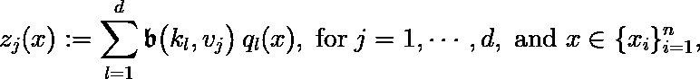

**(P-G)** :重写没有 softmax 的线性注意。使用[编码](http://www.codecogs.com/)创建的方程式。

其中𝔟(⋅,⋅)是在 ***无限维希尔伯特空间*** 上定义的双线性形式，但在行动中被评估为离散近似。为了帮助我们理解，我们可以参考下面的两个数字，看看没有 softmax，生活是如何变得容易得多的。

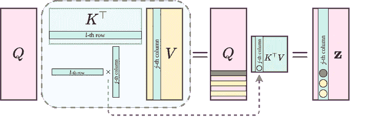

没有 softmax 的线性注意力的图示。图片作者。

现在，为了将上面关于没有 softmax 的线性注意力的表达式与我们熟悉的东西联系起来，我们可以进一步考虑 *QR* 因式分解，或者甚至是在一组 *d* 正交基函数{ *qⱼ(⋅)* }ⱼ₌₁ᵈ:中的投影

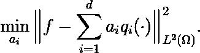

使用[编码](http://www.codecogs.com/)创建的方程式。

毫不奇怪，解决方案是一个类似于线性回归解的显式表达式的投影:如果我们假设{ *qⱼ(⋅)* }ⱼ₌₁ᵈ通过其内积诱导范数进一步规范化(想想具有进一步 *1/√n* 权重的实例规范化)。

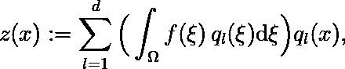

**(F)** :正交基的潜在扩展。使用[代码生成的方程式](http://www.codecogs.com/)。

来看一个具体的例子:设*ω*=【*0，2π* 】和 *qⱼ(x)* = sin( *jx* )和 cos( *jx* )，那么上面的等式只是 [**傅里叶级数部分和逼近***【x】*和**中的一个特例(p-p)**](https://encyclopediaofmath.org/wiki/Partial_Fourier_sum)

受这种解释的启发，提出了下面的伽辽金型简单注意算子:

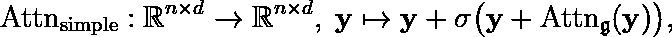

**(G)** :伽辽金注意力，一种尺度保持的注意力算子。使用[代码生成的方程式](http://www.codecogs.com/)。

一点也没有。在进行点积之前，对潜在表示进行层归一化，就像傅立叶基可以被视为具有预内积归一化一样，

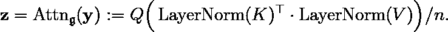

使用[代码编码](http://www.codecogs.com/)创建的方程式。

[3]:哈钦森，m .，兰，C. L .，扎伊迪，s .，杜邦，e .，德，Y. W .，，金，H. (2020)。LieTransformer:李群的等变自注意。 *arXiv 预印本 arXiv:2012.10885* 。

# 操作员学习

现在一种新的注意力被构想出来了，问题是:

> 我们在哪里为这位新的注意力操作员搭建舞台？

即使一些初始原型表明使用`fairseq`(例如，更快的训练)在 IWSLT14 (En-De)上的 BLEU 评估基准上有希望的结果，对我自己来说，与[偏微分方程](https://en.wikipedia.org/wiki/Partial_differential_equation)相关的操作员学习问题将是自然的选择。如果选择一个大而艰巨的自然语言处理(NLP)问题，作为一个独立的研究人员，原型-调试-改进的周期对我来说太长了。

去年，我的导师给我发了一篇[博客文章](https://www.jiqizhixin.com/articles/2020-10-23-7)关于加州理工学院 ML 小组使用所谓的傅立叶神经算子(FNO)⁴学习偏微分方程解算子)实现了一个最先进的性能。在仔细阅读、剖析代码并自己重新实现之后，我完全[屈服于这种令人敬畏的方法的脚下](https://en.wikipedia.org/wiki/Pran%C4%81ma),因为它在数量级上击败了以前的方法。此外，这个实现让我确信，注意力中的一般`Q/K/V`方法变成了`FFT->conv->iFFT`。这种变化是注意力机制的一种特殊而有效的线性变化，投影矩阵是不可训练的。因为快速傅立叶变换(FFT)或其逆变换都可以被视为通过乘以范德蒙矩阵的不可训练的基变换。在实际的注意机制中，基底的(非线性)变化的权重都是可训练的。

最重要的是，FNO 的实践表明了一件事

> 对待潜在表示的**列**而不是**行**(位置的特征向量)施加操作，是一种有前途的方法。

直到最近(截至 2021 年 5 月)，ML 社区开始重视这一方向，例如在[5]和[6]。

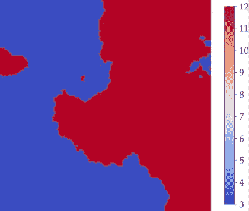

随机界面的扩散系数。图片作者。

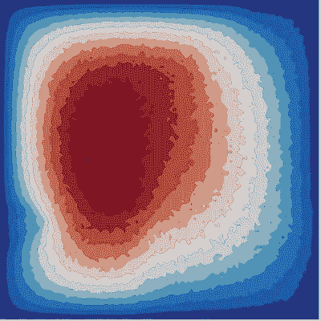

含 10%噪声的偏微分方程解。图片作者。

来自溶液的噪声测量的重构系数。图片作者。

那么，结果是什么呢？注意力和 FNO 的结合非常好，基于伽辽金注意力的转换器也可以解决困难的反系数识别问题(见上图)。在相同的参数配额下，在伯格斯方程基准中，4 个伽辽金注意层+2 个 FNO 层的模型在相同的实验室条件下(相同学习速率的`[1cycle](https://arxiv.org/abs/1708.07120)` [调度器](https://arxiv.org/abs/1708.07120)，100 个历元)优于 4 个 FNO 层的模型 4 倍，优于原始的具有`Batchnorm`的模型 10 倍。在 *L* -norm 中平均评价相对误差的常用范围为`1e-3`，最大值为`1.7e-3`。达西流中的基准，连同其逆版本，在评估准确性方面也已经废黜了国王(FNO)。伽辽金变换器的训练比 FNO 慢，尽管理论上具有相同的复杂度。

除了加州理工学院集团提出的神经算子结构化网络，下一个接近的竞争对手 [DeepONets](https://arxiv.org/pdf/2103.10974.pdf) 要差得多……(参见[第 14 页](https://arxiv.org/pdf/2103.10974.pdf)，图 10 中有`3e-2`相对误差的单个实例)。由于 DeepONets 中的网络类似于[神经图灵机(NMT)](https://arxiv.org/abs/1410.5401) 中的附加注意力，可以预见的是，尽管 DeepOnets 具有启发式地符合数学的结构，但由于多个“困难的”非线性(如双曲正切和 Sigmoids)的组合，deep onets 更难训练。

[4]:李，z .，科瓦奇基，n .，阿齐扎德内谢利，k .，刘，b .，巴塔查里亚，k .，斯图尔特，a .，&阿南德库马尔，A. (2020)。参数偏微分方程的傅立叶神经算子。 *arXiv 预印本 arXiv:2010.08895* 。

[5]:托尔斯泰欣、霍尔斯比、科列斯尼科夫、拜尔、李、翟、安特辛纳、杨、凯泽斯、乌兹科雷特、卢契奇和多索维茨基，2021 年。Mlp 混合器:用于视觉的全 mlp 架构。 *arXiv 预印本 arXiv:2105.01601* 。

[6]:李-索普，j .，安斯利，j .，埃克斯坦，I .，&翁塔农，S. (2021)。FNet:用傅立叶变换混合记号。 *arXiv 预印本 arXiv:2105.03824* 。

## 注意:下面的最后一部分有一些半严肃的数学。

# 我们能证明什么？彼得罗夫-伽辽金投影

注意算子或其线性变体，就其输入和可训练参数而言，是一个 ***非线性*** 算子。我们如何把它连接到像伽辽金或者彼得罗夫-伽辽金投影这样的线性投影上呢？答案很简单:

> 我们尝试在希尔伯特框架下，在以下意义下证明 ***近似容量*** 。

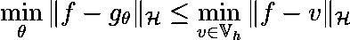

**(M)** :线性投影度量的非线性映射的逼近能力。使用[编码](http://www.codecogs.com/)创建的方程式。

这转化为:g_θ，建立在伽辽金注意力上的近似器，其近似能力等同于到近似子空间 *𝕍ₕ* ⊂ ℋ的伽辽金投影，其中ℋ是希尔伯特空间，并且我们想要在它的子集上模拟操作者的行为。

这个子空间 *𝕍ₕ* 是基于潜在表示的当前子空间，并且在优化期间，是动态变化的。然而，在固定的潜在表征的静态视图中，注意机制有能力在当前的近似空间中提供最佳近似器，即伽辽金型投影。

## 难点:用线性投影桥接非线性映射

有人可能会问:这不是小事吗？嗯，有几分像 **(F)** 正是*𝕍ₕ*:= span {*vⱼ(⋅)*}的情况。然而，仔细观察后，用数学方法把这个结果清晰地表达出来可能并不那么容易。困难如下:

*   与伽辽金投影中的空间设置不同，`Q/K/V`所代表的近似子空间是不同的。
*   如何将 *Q* 的列线性组合得到 **(P-G)** 中输出 **z** 的每一列取决于乘积 *KᵀV* 的每一列。然而，并不完全清楚的是， *KᵀV* 的某一列是否足以给出系数，以产生任意函数*f*∈ℋ.**的伽辽金或彼得罗夫-伽辽金投影原因是因为既不能保证`Q/K/V`满秩，也不能保证非线性内积的满射性。**

## 一个简单的例子来说明困难

在注意力的任何线性变化的上下文中:

> q 代表值，K 代表查询，V 代表键。

让我们考虑一个简单的例子，其中*ω*=(*-1，1* )，由*−1=x₁<x₂<⋯<xₙ=1*离散化。*q****列的近似空间*** 由前两个[切比雪夫多项式](https://en.wikipedia.org/wiki/Chebyshev_polynomials) { *1，x* }构成， *K* 和 *V* 的列的近似空间分别为{ *a，bx* 和{ *c，dx* }对于 *a，b，b 实际的列是由这些函数在 *xᵢ* 的评估产生的，对于一个样本，网格点数 *n* 是固定的。我们注意到序列长度 *n* 可以在操作者学习管道中改变。*

现在，对于一个 *f* ∈ ℋ，*l*-*f*到 *ℚₕ* := span{ *1，x* }的投影为:

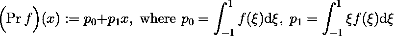

**(L)** :线性多项式空间中对 f 的最佳逼近。使用[代码生成的方程式](http://www.codecogs.com/)。

当将 *K/V* 的列解释为网格采样的函数时， *KᵀV/n* **的点积成为积分**的近似值，并且易于验证:

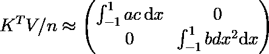

使用[代码生成的方程式](http://www.codecogs.com/)。

在这种情况下，通过进一步的简单检查，我们可以看到 *KᵀV/n* 能够复制 **(L)** 中投影的系数，只需乘以矢量 *(f₁，f₂)ᵀ* )。

但是，如果把 *K* 和 *V* 的列改成网格点处的{ *a，bx* }和{ *cx，dx* }的求值呢？

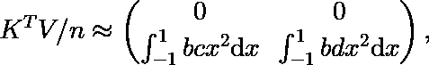

使用[代码生成的方程式](http://www.codecogs.com/)。

突然，**复制(L)中系数的能力没有了！**因为这个矩阵乘以 *Q* 后: *Q(KᵀV)* 的列所代表的子空间在里面没有常数函数！欢迎感兴趣的读者验证一下。

当然，这是一种过度简化，因为:

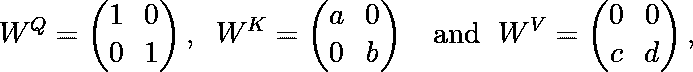

使用[代码生成的方程式](http://www.codecogs.com/)。

但是你明白了。

## 证明:希尔伯特空间中的一个鞍点问题

通过我自己的专业技术(混合有限元)，我们可以证明 *Q(KᵀV)* 具有**能力**来实现彼得罗夫-伽辽金投影所能近似的结果，前提是以下条件成立:

> **存在从关键空间(线性注意中的 V)到值空间(线性注意中的 Q)的满射映射。**

在泛函分析中，这也可以被视为在逼近算子方程的情况下的[近距离定理](https://en.wikipedia.org/wiki/Closed_range_theorem)或[Ladyzhenskaya–Babu ka–Brezzi 条件](https://en.wikipedia.org/wiki/Ladyzhenskaya%E2%80%93Babu%C5%A1ka%E2%80%93Brezzi_condition)的条件。如果我们的一些读者对细节感兴趣，请参考论文中的[附录 D。](https://arxiv.org/abs/2105.14995)

用通俗易懂的语言来翻译这个线性注意证明的数学意义，它是:

> **对于值空间中的最佳逼近器(Petrov-Galerkin 投影),至少存在一个键来匹配传入的查询以传递该最佳逼近器。**

写成一个不等式的形式:

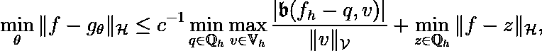

变压器的序列长度独立逼近。使用[编码](http://www.codecogs.com/)创建的方程式。

其中 *c* 是离散近似空间上 Ladyzhenskaya-Babu ka-br ezzi 条件中的常数。如果 *c* 可以被证明是序列长度无关的，那么伽辽金变换器的近似功率，或者变换器的任何线性变量的近似功率，是 ***独立于序列长度*** ，数学证明。

相反，近似能力取决于`d_model`，即我们愿意支付多少基函数来近似一个子集上的操作者的响应。算子理论和(线性)注意力机制之间的完美桥梁，没有 softmax。

由于我自己已经完成了这个小项目，并在不久的将来返回到我自己的领域(可能会在多级转换器上再做一个工作，利用注意力机制中残差的子空间校正性质)，如果 ML 社区发现这个证明的重要性，利用 ***键到值映射*** 的满射性，这并不奇怪，在 1 或 2 年内，将会出现像“Sobolev 注意力”、“微分注意力”、“Chebyshev 注意力”、使用其他积分变换的注意力之类的东西。

## 连续中的连续，离散中的稳定

对于不熟悉希尔伯特背景下算子方程近似的人来说，按照本文的思路，最大的困惑可能是:

> 使用双线性形式定义键到值的映射。这种双线性形式定义在两个**无限维希尔伯特空间**上，但为什么论文只给出了它在**有限维** **离散近似空间**上的下界？

答案很长。在写这篇论文之前，我读了关于第一篇论文[的评论](https://arxiv.org/abs/2106.01506) ⁷试图使用 [Mercer 核](https://en.wikipedia.org/wiki/Mercer%27s_theorem)以数学严谨的方式解释近似容量。他们的证明主要是将早期开创性工作中的一个移植到巴拿赫·spaces⁸.的背景中从他们提交 arXiv 的时间来看，可以有把握地假设他们也向 NeurIPS 2021 提交了他们的工作(尽管没有使用 LaTeX 模板)。

在他们提交的 ICLR 2021 年申请的公开审查页面中，审查者 1 提出了这个关键的有见地的问题:

> 论点中的另一个弱点是，核随着随机梯度下降的每一步而变化。也就是说，参数 W^Q 和 W^K 被更新，这改变了核函数。结果，变压器的训练不在单个再生核 Banach 空间中操作。

这是 Mercer kernel 论文的作者没有用明确的论据直接回答的主要问题之一。事实上，在操作员学习的背景下，答案很简单:

> 即使 Transformer 提供了序列长度不变的性能，例如，在 n=512 上训练的模型可以在 n=512 或 n=2048 上提供相同的评估误差；对于单个样本，提供的近似是通过具有 n 个网格点的离散空间。因此，该理论可以用**动态变化的有限维近似空间** **来表述，但只有一个无限维的潜在希尔伯特(或巴拿赫)空间**。

例如，在ω的 *n* 个网格点采样的连续分段线性函数的空间，无论那个 *n* 有多大，都是*L(ω)*的子空间。每个单个样本的近似是在离散水平上完成的。近似空间通过优化动态更新，但底层无限维希尔伯特空间( *L* 、 *H* 等，甚至像 *Lᵖ* 这样的巴拿赫空间)没有变化！

我觉得对于 Mercer kernel 论文来说，这是一个错失的机会，因为近似理论是建立在无限维的背景上的。Transformer 架构的近似能力仍然受限于有限维子空间，受限于`d_model`,这是在我们的“面向列”解释中支付的基函数的数量。

[7]:赖特，硕士，冈萨雷斯，J. E. (2021)。变形金刚是深度无限维的非 Mercer 二进制内核机器。arXiv 预印本 arXiv:2106.01506 。

[8]:奥野，a .，哈达，t .，&下代拉，H. (2018，7 月)。基于神经网络的多视角特征学习概率框架。在*机器学习国际会议*(第 3888–3897 页)。PMLR。

# 收场白

NeurIPS 2021 委员会决定将[清单](https://neuripsconf.medium.com/introducing-the-neurips-2021-paper-checklist-3220d6df500b)放在提交模板的末尾:

> NeurIPS 论文清单旨在鼓励负责任的机器学习研究的最佳实践，解决可重复性、透明度、研究道德和社会影响等问题。

我个人非常喜欢这个清单。它指导我，一个在这个领域完全是新手的人，通过准备论文，并教会我在 ML 研究中的以下良好实践:

*   承认别人的资产(代码、数据集)；
*   用可再生/可复制的代码和指令展示 ML 研究；
*   报告关于不同种子的误差条/带。

受到这份清单以及 LieTransformer 论文中致谢的启发，我[感谢在这个小项目过程中启发我的每个人](https://github.com/scaomath/fourier-transformer#acknowledgement)，即使这只是在一次偶然的随意交谈中的一句俏皮话。

*原载于 2021 年 6 月 6 日*[*https://scao math . github . io*](https://scaomath.github.io/blog/galerkin-transformer-neurips)*。*