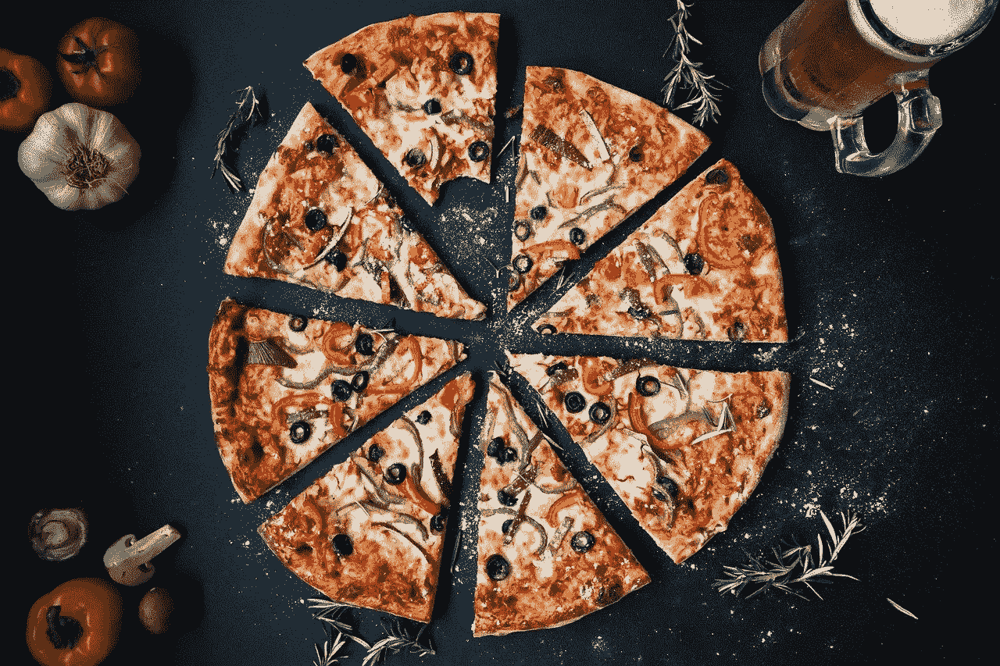
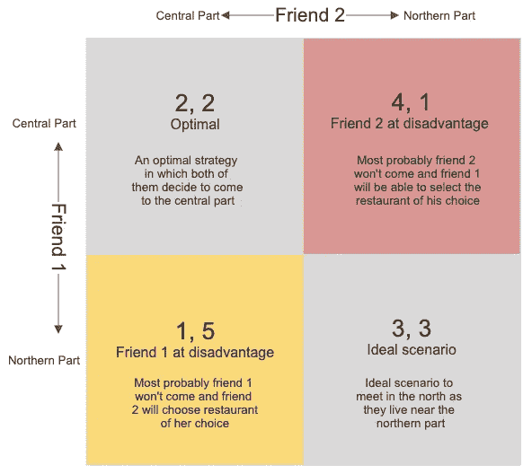
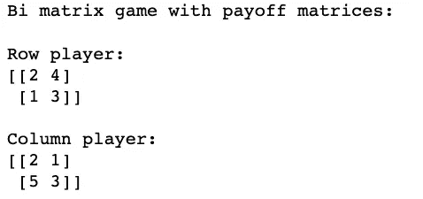
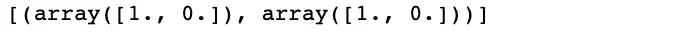

# 博弈论、Python 和晚餐

> 原文：<https://towardsdatascience.com/game-theory-python-and-dinners-4732ff59bdbb?source=collection_archive---------43----------------------->

## 博弈论和纳什均衡的直观介绍

2020 年的大部分时间我们都在房子里，但一旦封锁放松，我和我的朋友们就会大约一个月见一次面，一起吃顿饭或喝喝咖啡。在哪里见面一直是一个众所周知的问题。其他两个朋友都在重要部门工作，所以他们不得不去他们的办公室，而我是被“授予”计划部分的人(我不太喜欢)。

考虑到他们对美食的偏好以及他们在城市中最喜欢去的地方，我通常会以一种我必须去的地方最少的方式提出选择(邪恶的笑声😈)

他们都住在城市的北部，所以在北部见面对他们来说是最合适的。我在中部的某个地方，更喜欢那里。此外，鉴于我们生活在一个大城市，在这个城市的任何地方都不缺乏好吃的地方，但供应他们最喜欢的菜肴的餐馆位于这个城市的不同地方。



食物大战(来源: [Pixabay](https://pixabay.com/photos/pizza-food-italian-baked-cheese-3007395/)

> 要问的问题:给定某一天的地点和美食的倾向，我的朋友们会选择什么地方作为不联系对方而一致见面吃饭的地方？

# 一点背景

简而言之，博弈论是对描述理性决策者( ***我这里的朋友*** )之间互动( ***选择在哪里见面*** )的数学模型的研究。很公平！

游戏的结果——预测游戏结果的一种方法是确定每个玩家的优势策略。优势策略是对给定玩家来说最好的策略，而不管其他玩家的选择如何( ***【无论哪里适合我的朋友***)——所以不管朋友#2 做什么，朋友#1 的优势策略就是朋友#1 的最优策略。

玩家(*)选择的一组占优策略( ***地点见*** )称为**纳什均衡。这被称为均衡，因为任何一方都不会因为改变他/她的选择而获得额外的利益。***

> *简单来说，纳什均衡是一条法律，即使没有警察，也没有人想打破这条法律。违法对个人没有任何好处，他们不会获得任何额外的东西。人们观察交通信号并根据灯的颜色停车/前行就是这样一种现象。*

# *让我们调查一下*

*我们将首先为我的朋友们关于见面地点的各种选择创建一个**收益/困惑矩阵**。*

**

*选择去城市哪个部分的收益矩阵(图片由作者提供)*

*阅读上面的矩阵相当简单；如果朋友 1 选择“北部”,朋友 2 选择“中部”,那么回报将是 1，5(第 2 行，第 1 列),这将使朋友 2 与朋友 1 相比处于有利位置。*

*我们想找到每个朋友的优势策略。在这种情况下，我们可以观察到，对于这两个朋友，优势策略是到达中心部分(第一行，第一列)。如果朋友 1 的策略从中部变为北部，那么他的收益会从 2 变为 1，这是不可取的，如果朋友 2 从中部变为北部，那么她的收益也会从 2 变为 1。*

*所以，两个朋友都选择来到城市的中心。去北部是一个 ***理想*** 结局，但*理想*不一定是 ***最优*** 。*

# *Python 实现*

*让我们看看能否用 python 得出上面的结论(选择(2，2)即两者都选择中心部分)。要使用的库是 Nashpy，使用 pip 非常容易安装*

```
 *pip install nashpy*
```

*根据上面描述的支付矩阵为每个朋友创建一个单独的支付矩阵。*

*Nashpy 很容易地将矩阵转换成游戏。我会把这个游戏叫做“*location _ war _ inter _ friends*”。*

*它产生了一个双矩阵博弈，收益矩阵如下*

**

*这些收益矩阵将用于计算纳什均衡，这在本库中非常简单。*

*纳什均衡很重要，因为它让我们对复杂系统中的突现行为有了初步的了解。在这种情况下，平衡达到于:*

**

*它由两个向量组成，表示每个朋友的动作:friend_1 [1，0 ]和 friend_2 [1，0]。第一个位置的 1 表示他们都将选择' ***【中央*** '，并举例说明和具体化我们上面的假设。*

*你可以在这里查阅 [GitHub repo 中相当简单的代码。](https://github.com/Prashantmdgl9/Game_Theory_Food_War/blob/main/Nashpy.ipynb)*

# ***结论***

****我们看到，尽管北方是最佳地点，但根据强大的博弈论，他们最终选择了中央，而我必须走的路最少*** 😀*

*这仅仅是我们在日常生活中玩的游戏的一个例子，却没有意识到。在现实世界中，由于社会条件和外部因素，我们总是最终做出妥协，最终选择不是最优的选项。这是一个有趣的观察结果，因为我们看到了我们周围的世界，例如，我们知道减少碳足迹对所有国家都是必要的，但大多数国家最终选择了次优路线。*

# ***参考文献**:*

1.  *[https://nashpy . readthedocs . io/en/latest/tutorial/index . html # creating-a-game](https://nashpy.readthedocs.io/en/latest/tutorial/index.html#creating-a-game)*
2.  *[https://simplicable.com/new/game-theory](https://simplicable.com/new/game-theory)*
3.  *[https://www . science direct . com/topics/neuroscience/game-theory](https://www.sciencedirect.com/topics/neuroscience/game-theory)*

## *进一步阅读*

*我翻阅了威廉·斯巴涅尔的《博弈论 101》，发现这是一本令人愉快的书。它是根据他的 YouTube 系列[改编的。](https://www.youtube.com/playlist?list=PLKI1h_nAkaQoDzI4xDIXzx6U2ergFmedo)*